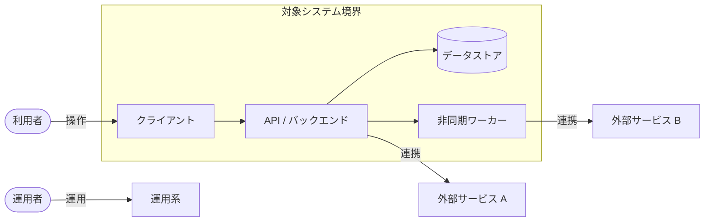
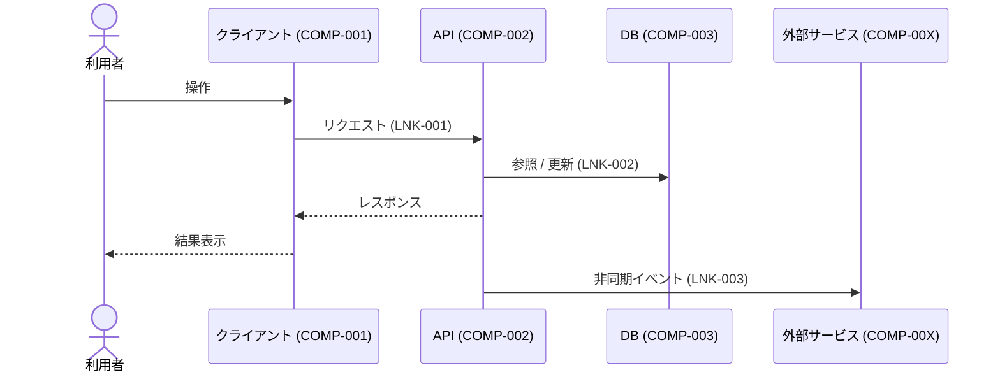

# アーキテクチャ設計書

本ドキュメントはアーキテクチャ設計のテンプレートである。`docs/design/architecture/architecture.md` として配置し、各章を埋める。章の順序は固定（全体像 → 個別要素 → 関係性 → 採用理由 → 却下理由 → 懸念点）。

- 対象システム名: {{SYSTEM_NAME}}
- 対応する要件定義書: [`docs/requirements/functional.md`](../../requirements/functional.md) / `docs/requirements/usecase/` / [`docs/requirements/non-functional.md`](../../requirements/non-functional.md)
- 作成日 / 最終更新日: YYYY-MM-DD / YYYY-MM-DD
- 版: 0.1（ドラフト）

---

## 1. 構成概要

### 1.1 システム全体の要約
{{利用者 → クライアント → バックエンド → データストア → 外部サービスの典型動線を数文で記述する。キーとなる設計方針 2〜3 点を箇条書きで列挙する。}}

### 1.2 コンポーネント配置図（論理）

論理的な責務配置のみを示す。インフラ境界（リージョン / AZ / VPC / サブネット / ネットワークゾーン・LB / 踏み台）はここでは描かず、インフラ設計工程の成果物で表現する。

### 1.3 スコープと前提
- スコープ内:
  - {{項目}}
- スコープ外 / 非対応:
  - {{項目}}
- 前提（要件・環境・既存資産）:
  - {{項目}}

---

## 2. 構成要素一覧

| COMP-ID | 名称 | 区分 | 主な責務（何をする / 何をしない） | 実行レイヤ | 関連 UC・NFR・SIF |
|---------|------|------|------------------------------------|-------------|---------------------|
| COMP-001 | {{名称}} | クライアント / API / ワーカー / DB / キャッシュ / メッセージング / 外部サービス | 〜を担う。〜はここでは行わず COMP-00X に委譲する。 | {{利用者端末 / サーバサイド / データストア層 / メッセージング層 / 外部 SaaS / 自社運用システム}} | UC-001, NFR-003 |
| COMP-002 |   |   |   |   |   |

メモ:
- 「区分」は責務単位のコンポーネントの性格を示す。
- 「主な責務」は「何をしないか」まで記載し、境界を明確化する。
- 「実行レイヤ」は**論理レイヤ**を記述する（例: 利用者端末 / サーバサイド / データストア層 / 外部 SaaS）。**具体のクラウドサービス名・インスタンスタイプ・マネージドか自前かの判断は書かない**（インフラ設計で決める）。

---

## 3. 主要な通信・連携

### 3.1 リンク一覧

| LNK-ID | 発側 COMP | 受側 COMP / 外部 | 契機 | プロトコル | 同期/非同期 | 失敗時の扱い | 関連 UC・SIF・CIF |
|--------|-----------|------------------|------|-----------|-------------|---------------|---------------------|
| LNK-001 | COMP-001 | COMP-002 | ユーザ操作 | HTTPS | 同期 | リトライ N 回 / ユーザに再試行を促す | UC-001 |
| LNK-002 | COMP-002 | 外部サービス A | イベント | メッセージング | 非同期 | DLQ 送出、運用通知 | UC-003, SIF-002 |

### 3.2 主要ユースケースのフロー

#### {{UC-001 主要ユースケース名}}

### 3.3 同期 / 非同期境界の方針
- ユーザ応答時間に含める区間: {{定義}}
- 非同期化する区間とその理由: {{定義}}
- 最悪ケースの遅延許容上限: {{数値 or 未確定（根拠/確認先）}}

---

## 4. 採用理由

主要な判断ごとに、紐付く要件 ID と根拠を併記する。

- **{{判断 1 の見出し（例: データストアに PostgreSQL マネージドサービスを採用）}}**
  - 紐付く要件: NFR-00X（可用性）, NFR-00Y（容量満足性）, UC-00Z
  - 根拠: {{どの条件を満たすための選択か。前提となる規模・スケール・社内標準制約など}}

- **{{判断 2 の見出し（例: 認証を外部 IdP に集約）}}**
  - 紐付く要件: NFR-00X（真正性）, NFR-00Y（責任追跡性）
  - 根拠: {{…}}

- **{{判断 3 の見出し（例: 注文確定〜通知を非同期キュー経由に分離）}}**
  - 紐付く要件: NFR-00X（時間効率性）, UC-00Z
  - 根拠: {{…}}

メモ: 「よく使われている」「慣れている」など要件に紐付かない理由は採用理由に書かず、章 5 で代替案として整理するか、必要性の根拠を追記する。

---

## 5. 代替案と採らない理由

| ALT-ID | 対象判断 | 代替案概要 | 採らない理由 | 再検討条件 |
|--------|----------|------------|---------------|-------------|
| ALT-001 | データストア種別 | NoSQL（例: 〜）を採用する | 現要件では関係モデルと整合性制約が主で、NoSQL の利点を活かしきれない | 同時書き込みピークが想定の 10 倍を超える場合 |
| ALT-002 | 同期 / 非同期境界 | すべて同期で実装する | 外部サービス A の遅延が NFR-00X を侵食する可能性が高い | 外部サービス A の SLA が現行より改善された場合 |
| ALT-003 | 認証方式 | 自前の ID / パスワード管理 | セキュリティ運用コストと NFR-00X（責任追跡性）に照らし不利 | IdP 側の料金・可用性が許容外となった場合 |
| ALT-004 | 機能配置の切り分け | 決済処理を自社実装する | 決済は外部 SaaS 利用が要件確定。自社実装は NFR-00X（規制適合）に照らし不利 | 規制要件が緩和された場合 |

メモ:
- 最低でも以下の**論理設計上の判断**については検討の痕跡を残す。該当なしの場合は「検討不要と判断した理由」を 1 行で記す。
  - データストアの種別（関係モデル / ドキュメント / KVS 等）
  - 同期 / 非同期の境界
  - 認証認可方式
  - 機能配置の切り分け（モノリス / サービス分割 / 外部 SaaS 利用）
- インフラ寄りの判断（クラウド / オンプレ、リージョン、具体サービス、インスタンスタイプ、冗長化の実装方式 等）は**インフラ設計工程の代替案検討で扱う**ため、本表には含めない。

---

## 6. リスク・懸念点

| RISK-ID | 内容 | 影響範囲 | 顕在化条件 | 暫定対応 | 詳細設計への申し送り |
|---------|------|----------|-------------|-----------|------------------------|
| RISK-001 | 外部サービス A 停止時にユースケース UC-003 が完遂しない | COMP-002, LNK-003 / UC-003 | 外部サービス A が 5 分以上停止 | キュー滞留させ、復旧後に再送。利用者へは受付済み通知 | リトライ回数・タイムアウト・DLQ 運用手順は詳細設計で決定 |
| RISK-002 | 認可判定がフロント / バックの両方に分散しうる | COMP-001, COMP-002 | 権限種別が追加された場合 | バック側を正本とし、フロントは表示制御のみに限定 | 権限モデルの具体化と判定位置のレビューを詳細設計で実施 |
| RISK-003 | データ整合性（非同期境界） | LNK-002, LNK-003 | 配信失敗 + 再送時の重複 | 冪等キーによる重複排除方針を採用 | 冪等キー設計・監視指標は詳細設計で確定 |
| RISK-004 | 要件未確定のまま進めた前提（例: 同時利用者数） | 全体 | 想定を超えた場合 | 初期リリース時点の上限値を仮置きし、監視で追跡 | 想定値の確定（確認先: {{ステークホルダー名}}） |

リスクの典型カテゴリ:
- 外部サービス障害時のフォールバック
- 認証認可の責務境界
- データ整合性（特に非同期境界をまたぐ場合）
- 運用・監視の死角
- 性能の見立ての不確実性
- 移行時の新旧並行運用
- 法令・規制適合（データ所在地・保存期間）

---

## 7. 後続工程への申し送り事項

本アーキテクチャでは決め切らない論点を、**工程別**に分けて記録する。工程が違えば担当・判断基準が違うため、混在させない。

### 7.1 詳細設計（機能 / 画面単位）への申し送り

| ID | 内容 | 想定選択肢 | 決定責任者 / 相談先 |
|----|------|------------|----------------------|
| HO-D-001 | {{例: テーブル設計（正規化方針・索引戦略）}} | {{選択肢 / 未調査}} | {{担当}} |
| HO-D-002 | {{例: 個別 API の項目定義}} | {{選択肢}} | {{担当}} |
| HO-D-003 | {{例: フロントエンド UI コンポーネント分割}} | {{選択肢}} | {{担当}} |
| HO-D-004 | {{例: リトライ回数 / タイムアウト / DLQ 運用手順}} | {{選択肢}} | {{担当}} |

### 7.2 インフラ設計への申し送り

| ID | 内容 | 想定選択肢 | 決定責任者 / 相談先 |
|----|------|------------|----------------------|
| HO-I-001 | {{例: 稼働環境（クラウド / オンプレ / ハイブリッド）とリージョン選定}} | {{選択肢}} | {{担当}} |
| HO-I-002 | {{例: ネットワーク構成（VPC / サブネット / セキュリティグループ）}} | {{選択肢}} | {{担当}} |
| HO-I-003 | {{例: 冗長化の実装方式（Active-Active / Active-Standby、AZ 分散、フェイルオーバー機構）}} | {{選択肢}} | {{担当}} |
| HO-I-004 | {{例: 具体のクラウドサービス・インスタンスタイプ・スケール設定}} | {{選択肢}} | {{担当}} |
| HO-I-005 | {{例: ログ / 監視 / バックアップの製品選定・エージェント構成}} | {{選択肢}} | {{担当}} |
| HO-I-006 | {{例: CI/CD・IaC 構成}} | {{選択肢}} | {{担当}} |

---

## 8. 参照ドキュメント

- 要件定義書 (機能要件): [`docs/requirements/functional.md`](../../requirements/functional.md)
- 要件定義書 (非機能要件): [`docs/requirements/non-functional.md`](../../requirements/non-functional.md)
- ユースケース詳細: `docs/requirements/usecase/UC-NNN/usecase.md`
- {{その他参照資料（社内標準 / ADR / ベンダー資料 等）}}
