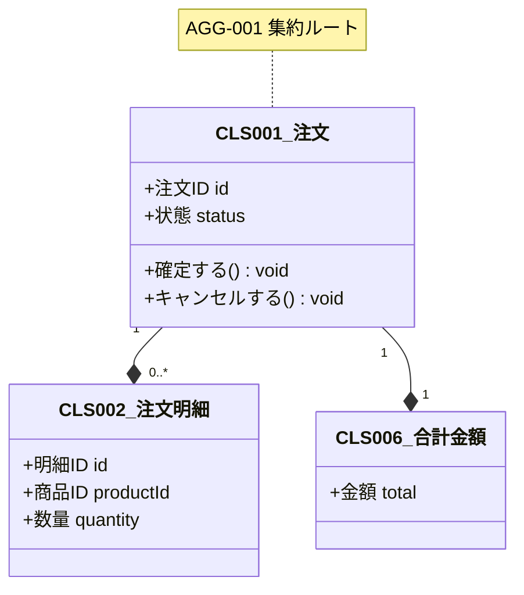
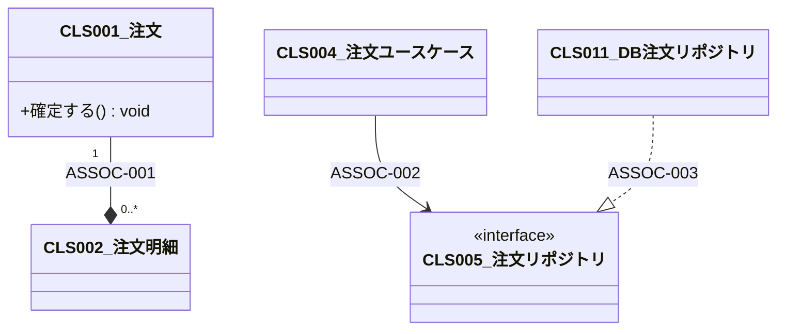
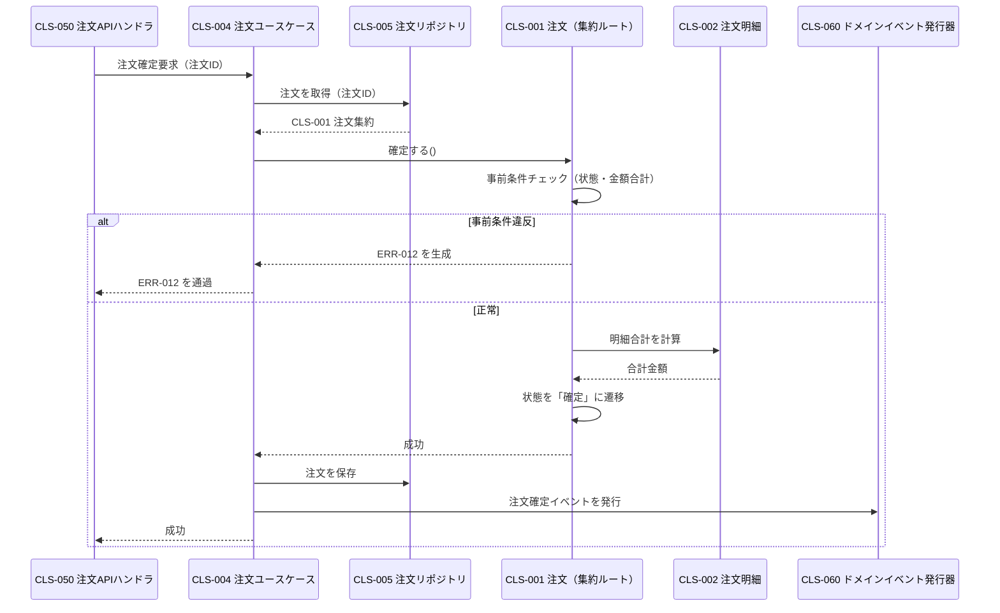

# クラス設計書

本ドキュメントはクラス設計のテンプレートである。`docs/design/class/class-design.md` として配置し、各章を埋める。章の順序は固定（方針 → クラス一覧 → 各クラス詳細 → 集約と関連 → 代表シーケンス → 注意事項）。

- 対象システム名: {{SYSTEM_NAME}}
- 対応する要件定義書: [`docs/requirements/functional.md`](../../requirements/functional.md) / `docs/requirements/usecase/` / [`docs/requirements/non-functional.md`](../../requirements/non-functional.md)
- 対応するアーキテクチャ設計書: [`docs/design/architecture/architecture.md`](../architecture/architecture.md)
- 対応するデータ設計書: [`docs/design/data/data-design.md`](../data/data-design.md)
- 対応するインタフェース設計書: [`docs/design/interface/interface-design.md`](../interface/interface-design.md)
- 対応するコンポーネント設計書: [`docs/design/component/component-design.md`](../component/component-design.md)
- 作成日 / 最終更新日: YYYY-MM-DD / YYYY-MM-DD
- 版: 0.1（ドラフト）

---

## 1. クラス設計方針

本クラス設計全体を貫く方針を箇条書きで示す。論理クラス構造レベルの判断のみを扱い、言語・フレームワーク固有事項には踏み込まない。

- **採用するステレオタイプの語彙**: {{エンティティ / 値オブジェクト / 集約ルート / ドメインサービス / アプリケーションサービス / リポジトリ / ファクトリ / ポリシー（仕様）/ アダプタ / DTO のうち採用するものと、各ステレオタイプの層別配置（LYR-NNN との対応）}}
- **ドメインモデル貧血症の回避**: {{エンティティ・値オブジェクトに業務判断と不変条件維持を持たせる原則。ドメインサービスはどのエンティティにも所属させにくい操作に限定}}
- **値オブジェクトの採用基準**: {{プリミティブ（整数・文字列）から値オブジェクトに昇格する判断基準。「2 箇所以上で使われたら昇格」等の歯止め}}
- **可変性原則**: {{値オブジェクトは不変・エンティティは識別子同一性を保ちつつ内部は可変、等}}
- **同一性の判定**: {{エンティティ = 識別子等価 / 値オブジェクト = 値等価。継承関係での判定ポリシー}}
- **集約境界とトランザクション境界**: {{1 集約 = 1 トランザクション原則、集約ルート経由原則、集約をまたぐ整合性の扱い方針}}
- **属性の公開原則**: {{属性は原則非公開、状態変化は意味のある操作で行う、Setter は原則置かない}}
- **不変条件の維持責任**: {{生成時と操作完了時の両方で守る原則、破れた状態で公開しない}}
- **永続化との分離**: {{ORM 都合・API 都合で属性を増やさない、永続化専用属性は詳細設計に回す}}
- **DTO・変換クラスの扱い**: {{境界でのみ DTO を使う、ドメイン層に持ち込まない、変換責務の配置層}}
- **例外の扱い**: {{業務例外とシステム例外の区別、生成・変換の層配置}}
- **null の扱い**: {{Optional 型で明示、必須属性は null を取らない不変条件として明記、等の方針}}

---

## 2. クラス一覧

| CLS-ID | 名称 | ステレオタイプ | 所属 MOD | 所属 LYR | 対応 ENT | 所属 AGG | 主な責務 | 関連 UC | 可変性 | 再利用性 |
|--------|------|----------------|----------|----------|----------|----------|----------|---------|--------|----------|
| CLS-001 | {{名称}} | エンティティ（集約ルート） | MOD-001 | LYR-003 | ENT-001 | AGG-001 | {{主な責務}} | UC-001, UC-002 | 可変 | プロジェクト固有 |
| CLS-002 | {{名称}} | 値オブジェクト | MOD-001 | LYR-003 | ENT-001 | AGG-001 | {{主な責務}} | UC-001 | 不変 | 製品ライン共通 |
| CLS-003 | {{名称}} | ドメインサービス | MOD-001 | LYR-003 | - | - | {{主な責務}} | UC-005 | 不変 | プロジェクト固有 |
| CLS-004 | {{名称}} | アプリケーションサービス | MOD-002 | LYR-002 | - | - | {{主な責務}} | UC-001 | 不変 | プロジェクト固有 |
| CLS-005 | {{名称}} | リポジトリ | MOD-003 | LYR-004 | - | - | {{主な責務}} | UC-001, UC-002 | 不変 | プロジェクト固有 |

メモ:
- 1 CLS は 1 MOD・1 LYR に所属する。複数にまたがる場合は責務過多または所属の検討漏れの兆候。
- ステレオタイプは 1 章の方針で定義した語彙から選ぶ。複数併記する場合の例: 「エンティティ（集約ルート）」。
- 対応 ENT・所属 AGG は該当しない場合「-」。

---

## 3. 各クラス詳細

すべてのクラスで同じテンプレートに沿って記述する。該当なしの節は「該当なし」と明記して省略しない。

### CLS-001 {{名称}}

**概要**: {{何を表すクラスか、1〜2 文}} ステレオタイプ: {{エンティティ（集約ルート）等}} / 所属 MOD: MOD-001 / 所属 LYR: LYR-003 / 対応 ENT: ENT-001 / 所属 AGG: AGG-001

**責務**: {{〜する。一方、〜はここでは行わず、CLS-YYY（または外部）に委譲する}}

**属性一覧**:

| 属性名（論理） | 論理型 | 可視性 | 可変 | 役割 | 制約 | 概要 |
|-----------------|--------|---------|------|------|------|------|
| {{属性名}} | 文字列 / 整数 / 数値（小数） / 真偽値 / 日付 / 日時 / 列挙 / 参照（CLS-NNN）/ コレクション<CLS-NNN> / Optional<CLS-NNN> | 公開 / 限定公開 / 非公開 | 不変 / 可変 | 識別子 / 値 / 参照 / 派生 / 監査 | {{必須・値域・列挙値・長さ等}} | {{意味・用途}} |

**操作一覧**:

| 操作名 | 引数 | 戻り値 | 可視性 | 事前条件 | 事後条件 | 例外（ERR-NNN） | 実装する UC / BRU |
|--------|------|--------|---------|-----------|-----------|------------------|-------------------|
| {{操作名（動詞句）}} | {{name: 論理型, ...}} | {{論理型 or void}} | 公開 / 限定公開 / 非公開 | {{呼出前に満たすべき条件}} | {{呼出後に成り立つ条件}} | 生成: ERR-00X / 変換: ERR-00Y / 通過: ERR-00Z | UC-001, BRU-003 |

**クラス不変条件**:
- {{生成時と任意の操作完了時に常に成り立つ条件（例: 合計金額は常に明細の合計と一致する）}}
- {{昇格すべきものは 4.3 の INV-NNN として採番する}}

**参照する他クラス（協調・依存）**:
- CLS-002（集約内参照） / CLS-003（ドメインサービス呼び出し） / CLS-010（ID 参照のみ、集約外）

**生成・破棄**:
- 生成: {{コンストラクタ / 専用ファクトリ（CLS-0XX）/ DI で注入 / リポジトリから復元}}
- 引数: {{name: 論理型, ...}}
- 破棄: {{リクエスト終了 / セッション終了 / GC 任せ}}

**可変性**: {{不変 / 可変}}（可変の場合、状態を変える操作を列挙）

**等価性**: {{識別子等価（ID 属性で比較） / 値等価（全属性で比較） / 参照等価}}

**対応エンティティ（ENT-NNN）との対応**:
- ENT-001 のうち担当する属性: {{属性名リスト。データ設計と齟齬なし}}
- データ設計にない属性: {{派生・一時状態の根拠を明記、または「なし」}}

**対応するバリデーション（VR-NNN）**:
- VR-00X: {{どの操作 / 不変条件で受け止めるか}}
- 「UI 側と API 側で二重検証」の VR: {{API 側は本クラスのどの機序で担うか}}

**対応するエラー（ERR-NNN）**:
- 生成: ERR-00X（{{どの操作で、どの条件で生成するか}}）
- 変換: ERR-00Y → ERR-00Z（{{下層の技術エラーを業務エラーに置き換える経路}}）
- 通過: ERR-00W（{{上位に委ねる}}）

**実装する業務ルール（BRU-NNN / RULE-NNN）**:
- BRU-003: {{主たる実装担当として「〜を判定する」操作で実装}}
- RULE-005: {{本クラス内不変条件（または INV-00X）として受け止める}}

**備考**: {{論理モデルレベルの補足のみ。具体型・アノテーション・ORM マッピングは詳細設計に回す}}

### CLS-002 {{名称}}

（同形式で繰り返し）

---

## 4. 集約と関連

### 4.1 集約（AGG-NNN）

| AGG-ID | 名称 | 集約ルート | 集約に含まれるクラス | 対応 ENT | トランザクション境界の意味 | 主な状態遷移の担い手 | 関連 UC |
|--------|------|-------------|----------------------|----------|----------------------------|----------------------|---------|
| AGG-001 | {{集約名}} | CLS-001 | CLS-001, CLS-002, CLS-006 | ENT-001, ENT-002 | {{1 注文単位で整合性を保つ最小単位。注文と注文明細を 1 トランザクションで同時に更新}} | CLS-001 の `確定する` / `キャンセルする` 操作 | UC-001, UC-003 |
| AGG-002 | {{集約名}} | CLS-020 | CLS-020, CLS-021 | ENT-005 | {{〜}} | {{〜}} | UC-010 |

メモ:
- 集約ルートを経由しない内部参照・更新は禁止。集約外部へは ID または値オブジェクト／DTO で返す。
- 1 トランザクション = 1 集約を基本とする。複数集約の整合はイベント駆動・結果整合・ドメインサービス・補償のいずれかで扱い、方針を 4.3 および 6.2 で明示する。
- 集約に属さないクラス（ドメインサービス・ファクトリ・リポジトリ・アプリケーションサービス・DTO）は本表には載せない。

集約図（任意）:

### 4.2 クラス間関連（ASSOC-NNN）

| ASSOC-ID | 関連元 CLS | 関連先 CLS | 関連種別 | 方向 | 多重度 | ライフサイクル依存 | 対応 REL-NNN（データ側） | 対応 DEP-NNN（コンポ側） | 概要 |
|----------|-------------|-------------|-----------|------|--------|--------------------|--------------------------|----------------------------|------|
| ASSOC-001 | CLS-001 | CLS-002 | 合成 | 単方向 | 1 : 0..* | 強（親消滅で子も消滅） | REL-003 | - | 注文が注文明細を保有する |
| ASSOC-002 | CLS-004 | CLS-005 | 依存 | 単方向 | - | 独立 | - | DEP-007 | アプリケーションサービスがリポジトリを呼び出す |
| ASSOC-003 | CLS-010 | CLS-011 | 実現 | 単方向 | - | - | - | DEP-012 | インフラ側リポジトリがドメイン側リポジトリインタフェースを実現する（依存性逆転） |
| ASSOC-004 | CLS-020 | CLS-021 | 継承 | 単方向 | - | - | - | - | 具体通知が抽象通知を継承する（is-a） |

クラス図:

メモ:
- 関連種別: 関連 / 集約（UML）/ 合成 / 継承 / 実現 / 依存。DDD 的集約（AGG-NNN）と UML 的集約は別概念。
- 双方向関連は原則避ける。必要な場合、整合性維持責任がどちらか一方に明示されていること。
- 循環依存は原則禁止。残る場合は 6.1 リスクに記録し、6.2 で解消代替案を示す。
- REL-NNN（データ側）または DEP-NNN（コンポ側）に紐付かない ASSOC は、上流設計との整合確認が必要な兆候として 6.1 に記録する。

### 4.3 不変条件（INV-NNN）

| INV-ID | 内容 | 成立範囲 | 維持責任者 | 検査タイミング | 違反時の扱い | 由来 |
|--------|------|----------|-------------|-----------------|---------------|------|
| INV-001 | 注文明細の合計金額は注文の合計金額と一致する | AGG-001 内 | CLS-001（集約ルート） | 明細追加・削除・変更操作の完了時 | 自動再計算 | RULE-003 |
| INV-002 | 確定済の注文は金額を変更できない | CLS-001 | CLS-001 | `金額を変更する` 操作の事前条件 | 操作拒否（ERR-012 を生成） | BRU-007, RULE-006 |
| INV-003 | 顧客の累計注文金額は、顧客の注文集約の確定済総額と一致する | 集約横断（AGG-001 × AGG-005） | CLS-030（顧客累計集計ドメインサービス） / イベント駆動 | 注文確定イベント受信時（結果整合） | イベント再処理で補正 | BRU-015 |
| INV-004 | メールアドレスは RFC 形式を満たす | CLS-040（値オブジェクト） | CLS-040 自身 | 生成時 | 生成拒否（ERR-003） | VR-005 |

メモ:
- クラス内に閉じた不変条件は原則として 3 章の「クラス不変条件」にインラインで書き、重要度が高い・他クラスから参照される・横断性があるものだけ INV-NNN として採番する。
- 集約内: 集約ルートが操作完了時点で守る。
- 集約横断: 結果整合性（イベント）・ドメインサービス・補償のいずれかで扱う。維持手段を明示。
- すべての RULE-NNN は、本表または 3 章の「クラス不変条件」で受け止められていること。受け止め先不明な RULE は 6.1 リスクに記録。

---

## 5. 代表シーケンス（任意）

代表的な `UC-NNN` を 1〜3 本選んでシーケンス図を描く。該当なしの場合は「該当なし」と明記して本節を残す。

### 5.1 UC-001 {{注文確定}}

シーケンスの読み取りどころ:
- 集約ルート CLS-001 がすべての不変条件（INV-001 / INV-002）を守っている。
- 呼出元（App）は集約内部の CLS-002 に直接触れない（集約ルート経由原則）。
- 集約横断の INV-003 は、注文確定イベントを介した結果整合で別途守られる。

### 5.2 {{他のユースケース}}

（同形式で繰り返し、または「該当なし」）

---

## 6. 注意事項

### 6.1 リスク・懸念点

| RISK-ID | 内容 | 影響範囲 | 顕在化条件 | 暫定対応 | 詳細設計・テスト設計への申し送り |
|---------|------|----------|-------------|-----------|-----------------------------------|
| RISK-001 | エンティティに業務判断が集まりきらず、アプリケーションサービスにロジックが漏れている懸念 | CLS-001, CLS-004 | 新たな業務判断追加時にサービス側を触る頻度が増える | 現段階はサービス側にロジックを置きつつ、2 箇所目の利用が出たタイミングでエンティティに移動 | 具体の移動判断は詳細設計で |
| RISK-002 | 集約 AGG-001 の粒度が大きく、同時編集時の競合が懸念 | AGG-001, UC-003 | 同一注文を複数オペレータが同時編集するケース | 現段階は楽観ロックで対応する想定（論理ロック方針）。競合時は ERR-0XX で拒否 | 具体ロック実装・バージョン列は詳細設計で |
| RISK-003 | RULE-010 の受け止め先 INV が特定できていない | RULE-010 | 該当業務が実行された場合 | データ設計者と要件側に確認予定 | 確認結果を詳細設計開始前に反映 |
| RISK-004 | 継承ツリー（CLS-020 → CLS-021 → CLS-022）が 3 段を超える懸念 | CLS-020 系 | 新種の通知追加時 | 段階的な委譲への置き換えを検討 | 委譲化のリファクタ判断は詳細設計で |
| RISK-005 | 要件未確定のまま進めた前提（{{〜}}） | 全体 | 想定と異なる要件が出た場合 | 仮置きで進行 | 確認先: {{ステークホルダー名}} |

リスクの典型カテゴリ（記載時の観点）:
- ドメインモデル貧血症（エンティティがデータ保持のみになっていないか）
- 神クラス（操作・属性・関連が突出していないか）
- 集約境界の曖昧さ（集約ルートを経由しない内部参照が残っていないか）
- 不変条件の抜け（RULE / BRU を受け止める INV が特定できるか）
- 不変条件の重複実装（同じ条件が複数クラスで独立実装されていないか）
- 継承の誤用（is-a でない継承、深すぎる継承ツリー）
- 値オブジェクトとエンティティの混同
- 可変オブジェクトの意図せぬ共有
- 循環依存の潜在
- 永続化都合・API 都合の混入
- トランザクション境界が集約を越える
- DTO のドメイン層侵入
- 要件未確定のまま進めた前提

### 6.2 代替案と採らない理由

| ALT-ID | 対象判断 | 代替案概要 | 採らない理由 | 再検討条件 |
|--------|----------|------------|---------------|-------------|
| ALT-001 | 集約の粒度 | 注文と注文明細を別集約にする（小さめ集約） | 明細追加時に合計金額（注文側）との整合がアプリケーション層に出てしまい、INV-001 の維持が不安定になる | 明細が 1 万件を超えるような超大型注文が業務上発生する場合 |
| ALT-002 | 値オブジェクト化 | 金額を整数のまま扱う（プリミティブ） | 通貨・丸め規則・演算を複数箇所で再実装することになり、BRU-004（丸め規則）が散逸する | 金額を扱う箇所がシステム内で 1 箇所に限定される場合 |
| ALT-003 | 操作の置き場 | 注文確定判断をドメインサービス（CLS-003）に置く | 確定は注文自身の状態遷移であり、エンティティ自身が持つべき。サービス化するとエンティティが貧血化する | 複数集約をまたぐ判断が必要になった場合 |
| ALT-004 | 継承 vs 委譲 | 通知種別を継承ツリーで表現 | 種別追加時にツリーが深くなり、変更影響が広がる。委譲＋ポリシーで表現するほうが拡張しやすい | 種別が固定で 3 種以下であることが業務ルール上確定した場合 |
| ALT-005 | 集約横断整合 | 注文確定時に顧客集約を同期更新（同一トランザクション内） | 複数集約の同一トランザクション更新を許容すると、整合性境界の原則が崩れ、ロック競合も広がる。結果整合（イベント）で扱う | 顧客累計の即時整合が業務上必須となった場合 |

メモ:
- 最低でも以下の論理構造判断については検討の痕跡を残す。該当なしなら「検討不要と判断した理由」を 1 行記す。
  - 集約の粒度（大きめ vs 小さめ）
  - 値オブジェクト化（プリミティブのまま vs 昇格）
  - エンティティの分解（単一クラス集約 vs エンティティ + 値オブジェクト群）
  - 操作の置き場（エンティティ自身 vs ドメインサービス vs アプリケーションサービス）
  - 継承 vs 委譲
  - 不変 vs 可変
  - ファクトリの分離
  - 集約横断整合の手段（同期 vs 結果整合）
  - リポジトリの粒度（集約単位 vs 統合）
- 詳細設計寄りの判断（言語型・アノテーション・DI・ORM）は本表に含めず、詳細設計の代替案検討で扱う。

### 6.3 後続工程への申し送り事項

#### 詳細設計・実装への申し送り

| HO-D-ID | 内容 | 想定選択肢 | 決定責任者 / 相談先 |
|---------|------|------------|----------------------|
| HO-D-001 | 言語固有の型指定（金額・識別子・日時の具体型） | {{候補}} | {{担当}} |
| HO-D-002 | フレームワーク固有機構の適用（アノテーション・デコレータ） | {{候補}} | {{担当}} |
| HO-D-003 | DI コンテナ構成・スコープ・ライフサイクル管理 | {{候補}} | {{担当}} |
| HO-D-004 | ORM マッピング・リポジトリ実装・トランザクション管理 | {{候補}} | {{担当}} |
| HO-D-005 | 例外階層の具体クラス名・継承関係 | {{候補}} | {{担当}} |
| HO-D-006 | Getter / Setter 生成方針（言語機能・ライブラリ利用） | {{候補}} | {{担当}} |
| HO-D-007 | ディレクトリ・パッケージ命名規則の具体 | {{候補}} | {{担当}} |
| HO-D-008 | ログ・バリデーションメッセージの文面 | {{候補}} | {{担当}} |

#### テスト設計への申し送り

| HO-T-ID | 内容 | 想定選択肢 | 決定責任者 / 相談先 |
|---------|------|------------|----------------------|
| HO-T-001 | 単体テスト粒度（クラス単位 / 集約単位） | {{候補}} | {{担当}} |
| HO-T-002 | 値オブジェクトの等価性・不変性テスト方針 | {{候補}} | {{担当}} |
| HO-T-003 | 集約ルート経由の不変条件（INV-NNN）テスト方針 | {{候補}} | {{担当}} |
| HO-T-004 | モック戦略（リポジトリ・ドメインサービス） | {{候補}} | {{担当}} |
| HO-T-005 | フィクスチャ・テストデータビルダの設計 | {{候補}} | {{担当}} |
| HO-T-006 | 状態遷移テストの網羅方針 | {{候補}} | {{担当}} |

---

## 7. 参照ドキュメント

- 要件定義書（機能要件）: [`docs/requirements/functional.md`](../../requirements/functional.md)
- 要件定義書（非機能要件）: [`docs/requirements/non-functional.md`](../../requirements/non-functional.md)
- ユースケース詳細: `docs/requirements/usecase/UC-NNN/usecase.md`
- アーキテクチャ設計書: [`docs/design/architecture/architecture.md`](../architecture/architecture.md)
- データ設計書: [`docs/design/data/data-design.md`](../data/data-design.md)
- インタフェース設計書: [`docs/design/interface/interface-design.md`](../interface/interface-design.md)
- コンポーネント設計書: [`docs/design/component/component-design.md`](../component/component-design.md)
- {{その他参照資料（社内標準・ADR・既存スキーマ 等）}}
