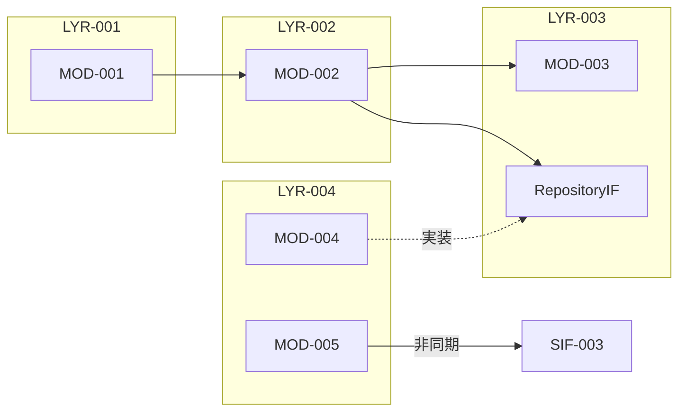
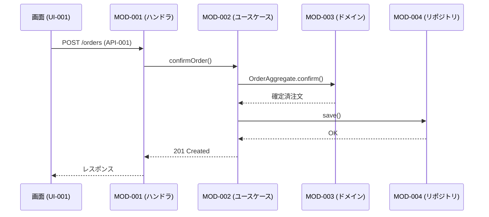

# コンポーネント設計書

本ドキュメントはコンポーネント設計のテンプレートである。`docs/design/component/component-design.md` として配置し、各章を埋める。章の順序は固定（方針 → レイヤ → モジュール俯瞰 → 各モジュール詳細 → 依存関係 → 注意事項）。

- 対象システム名: {{SYSTEM_NAME}}
- 対応する要件定義書: [`docs/requirements/functional.md`](../../requirements/functional.md) / `docs/requirements/usecase/` / [`docs/requirements/non-functional.md`](../../requirements/non-functional.md)
- 対応するアーキテクチャ設計書: [`docs/design/architecture/architecture.md`](../architecture/architecture.md)
- 対応するデータ設計書: [`docs/design/data/data-design.md`](../data/data-design.md)
- 対応するインタフェース設計書: [`docs/design/interface/interface-design.md`](../interface/interface-design.md)
- 作成日 / 最終更新日: YYYY-MM-DD / YYYY-MM-DD
- 版: 0.1（ドラフト）

---

## 1. コンポーネント設計方針

本コンポーネント設計全体を貫く方針を箇条書きで示す。論理モジュール構造レベルの判断のみを扱い、クラス分解・DI 具体構成・フレームワーク具体機構・ディレクトリ命名には踏み込まない。

- **レイヤリング方式**: {{伝統的レイヤード / Clean Architecture / Hexagonal（ポート・アダプタ）/ オニオン 等を選定し、変形があれば逸脱点と理由。紐付く NFR-NNN を明記}}
- **依存方向の原則**: {{外側 → 内側の一方向 / 逆向きは依存性逆転で解決 / 循環依存は原則禁止の方針}}
- **配置方針の段階的詳細化**: (a) レイヤ配置 → (b) 実行境界 の順で決める。ディレクトリ・パッケージ構成 (c) は詳細設計に回す。
- **モジュール分割の基準**: {{業務関心単位 / 技術関心単位 / 機能（ユースケース）単位 のいずれを基本とし、混在時の判定基準}}
- **業務ロジックの置き場**: {{ドメイン層に業務ルール BRU-NNN を集約。アプリケーション層は調整・トランザクション境界に徹する、等}}
- **横断関心事の実装戦略**: ロギング / 認可 / トランザクション境界 / 入力バリデーション / エラー変換 / 監査記録 / リトライ / レート制限 について、**どの層で**・**どの方式**（明示呼び出し / ミドルウェア的挟み込み / フレームワーク機構）で実装するか。
- **状態の置き場**: {{原則ステートレス / ステートフル許容範囲（セッション / 短命キャッシュ / 長期状態）}}
- **再利用性の扱い**: {{プロジェクト固有基本 / 複数箇所で使われるまで昇格しない 等の歯止め}}

---

## 2. レイヤ構成

### 2.1 レイヤ定義

| LYR-ID | レイヤ名 | 主な責務 | 参照してよい LYR | 参照してはいけない LYR | 典型的に置かれるモジュール種別 |
|--------|----------|----------|--------------------|-------------------------|----------------------------------|
| LYR-001 | プレゼンテーション | 外部入出力の入口・出口（画面コントローラ / API ハンドラ / CLI エントリ / 外部 SIF 受信口 等）。外部形式と内部コマンド／クエリの相互変換 | LYR-002（アプリケーション）, LYR-005（共有・横断） | LYR-003（ドメイン） / LYR-004（インフラ） | API ハンドラ / 画面コントローラ / CLI エントリ / SIF 受信アダプタ |
| LYR-002 | アプリケーション | ユースケースの調整・トランザクション境界・ドメインの組み立て。業務ルールそのものは持たない | LYR-003（ドメイン）, LYR-005 | LYR-001（プレゼンテーション）/ LYR-004（インフラの具体実装） | ユースケースサービス / トランザクションスクリプト |
| LYR-003 | ドメイン | 業務ルール（BRU-NNN）・エンティティ・ドメインサービス・状態遷移制御。外部技術に依存しない | LYR-005（共有・横断のうち業務中立なもの） | LYR-001 / LYR-002 / LYR-004 | エンティティ（ENT に対応）/ ドメインサービス / 値オブジェクト / リポジトリインタフェース |
| LYR-004 | インフラ | 永続化 / 外部 API クライアント / メッセージング / ファイル I/O / ログ出力実装 / 時計・乱数。ドメイン層のインタフェースを実装する側 | LYR-003（ドメイン側インタフェース実装として）, LYR-005 | LYR-001（プレゼンテーション）/ LYR-002（アプリケーション） | リポジトリ実装 / 外部 API クライアント / メッセージ送受信 |
| LYR-005 | 共有・横断（必要時のみ） | ログ構造 / 認可ポリシー / エラー型 / 共通バリデータ 等、複数レイヤから参照される不変の型・値オブジェクト | 他 LYR を参照しない（依存先になるのみ） | 全 LYR | 共有型 / 共通例外 / 共通ユーティリティ |

メモ:
- レイヤ数を増やしすぎない。3〜5 層に抑え、どうしても分離が必要な関心事だけを層として追加する。
- レイヤ構成は一度決めたら固定する。変更する場合は全 MOD の所属を見直す必要があるため、6.2 代替案で別案を記録してから採る。

### 2.2 レイヤ構成図

```mermaid
flowchart TB
  subgraph LYR-001 [プレゼンテーション層]
    P1[API ハンドラ]
    P2[画面コントローラ]
    P3[SIF 受信アダプタ]
  end
  subgraph LYR-002 [アプリケーション層]
    A1[ユースケースサービス]
  end
  subgraph LYR-003 [ドメイン層]
    D1[エンティティ / ドメインサービス]
  end
  subgraph LYR-004 [インフラ層]
    I1[リポジトリ実装]
    I2[外部 API クライアント]
  end
  subgraph LYR-005 [共有・横断]
    S1[共通型 / 共通例外]
  end
  LYR-001 --> LYR-002
  LYR-002 --> LYR-003
  LYR-004 -.実装.-> LYR-003
  LYR-001 --> LYR-005
  LYR-002 --> LYR-005
  LYR-003 --> LYR-005
  LYR-004 --> LYR-005
```

---

## 3. モジュール一覧

| MOD-ID | 名称 | 所属 COMP | 所属 LYR | 実行境界種別 | 主な責務 | 主に保有する ENT | 主に提供する API | 主に扱う UI・SIF | 関連 UC | 再利用性 |
|--------|------|------------|----------|----------------|----------|------------------|--------------------|--------------------|-----------|-----------|
| MOD-001 | {{名称}} | COMP-001 | LYR-001 | プロセス内サービス | API リクエストを受け、アプリケーション層に委譲する | − | API-001, API-002 | − | UC-001 | プロジェクト固有 |
| MOD-002 | {{名称}} | COMP-001 | LYR-002 | プロセス内サービス | 注文確定ユースケースを調整する | − | − | − | UC-001 | プロジェクト固有 |
| MOD-003 | {{名称}} | COMP-001 | LYR-003 | プロセス内ライブラリ | 注文エンティティの業務ルール・状態遷移 | ENT-007 | − | − | UC-001, UC-007 | プロジェクト固有 |
| MOD-004 | {{名称}} | COMP-001 | LYR-004 | プロセス内サービス | 注文の永続化 | ENT-007（実装側） | − | − | UC-001 | プロジェクト固有 |
| MOD-005 | {{名称}} | COMP-002 | LYR-004 | 非同期ワーカー | 外部 SIF への通知送信 | − | − | SIF-003 | UC-010 | プロジェクト固有 |
| MOD-006 |   |   |   |   |   |   |   |   |   |   |

メモ:
- `MOD-NNN` は本ドキュメントで新規採番（MOD-001 から）。
- **1 MOD = 1 COMP = 1 LYR** が原則。両方に複数所属したくなる場合は分割候補として 6.1 に記録する。
- 実行境界種別: プロセス内ライブラリ / プロセス内サービス / 別プロセス・同ホスト / 別プロセス・別ホスト / 非同期ワーカー / スケジュールバッチ / クライアント常駐 / フレームワーク・ランタイム提供 / 外部 SaaS・サードパーティ
- 再利用性: プロジェクト固有 / 製品ライン共通 / 汎用ライブラリ化

---

## 4. 各モジュール詳細

すべてのモジュールで同じテンプレートに沿って記述する。該当なしの節は「該当なし」と明記して省略しない。

### MOD-001 {{名称}}

**概要**: {{何をするモジュールか、1〜2 文。関連 UC-NNN / COMP-NNN / LYR-NNN を明記}}

**責務**:
- {{引き受けること}}
- 一方、{{引き受けないこと}}は MOD-YYY に委譲する。

**入力契約**:
- {{上位 MOD からの呼び出し / API-NNN のリクエストハンドラ / UI-NNN の画面イベント / キュー受信 / スケジュール起動 / SIF-NNN 受信 等}}

**出力契約**:
- {{下位 MOD への呼び出し / API-NNN のレスポンス生成 / SIF-NNN 送信 / イベント発行 / ログ・監査記録 / ERR-NNN 伝播 等}}

**保有するデータ（ENT-NNN）**: {{CRUD 責務を持つ ENT-NNN を列挙。該当なしなら「該当なし」}}

**参照するデータ（ENT-NNN）**: {{読み取り専用参照。参照方法（共有ストレージ直読 / 所有 MOD への問い合わせ / キャッシュ経由）を添える。該当なしなら「該当なし」}}

**関連するインタフェース**:
- API: {{API-NNN と関わり方（提供側ハンドラ / 消費側）}}
- UI: {{UI-NNN と関わり方（イベント処理 / 出力整形）}}
- SIF / HIF / CIF: {{送信 / 受信 / 該当なし}}

**対応する横断関心事**:
- ロギング: {{実装する / 上位・下位に委ねる}}
- 認可: {{実装する / 上位・下位に委ねる}}
- トランザクション境界: {{このモジュールで開始・確定 / 他モジュールに委ねる}}
- 入力バリデーション: {{VR-NNN のうちここで実装する範囲}}
- エラー変換: {{下層エラーを業務エラーに変換する範囲}}
- 監査記録: {{取得する操作内容と紐付く NFR-NNN}}
- リトライ制御・レート制限: {{該当すれば方針、なければ「該当なし」}}

**対応するエラー（ERR-NNN）**:
- 生成する: {{ERR-NNN のリスト}}
- 変換・ラップする: {{ERR-NNN のリスト}}
- 通過させる: {{ERR-NNN のリスト}}

**実装するバリデーション（VR-NNN）**: {{このモジュールで実装する VR-NNN のリスト。IF 側で決めた UI 側 / API 側の責務分離と整合させる}}

**状態**: {{ステートレス / ステートフル。ステートフルなら状態の粒度（リクエスト / セッション / 長期）と保管位置}}

**実行境界の理由**: {{3 章で割り当てた実行境界種別を選んだ理由を NFR-NNN と紐付けて一文}}

**再利用性の想定**: {{プロジェクト固有 / 製品ライン共通 / 汎用ライブラリ化 と、その根拠}}

**変更影響範囲の想定**: {{このモジュールの内部実装変更で影響が及ぶ他 MOD の想定。広い場合は RISK-NNN に連動}}

**備考**: {{論理モジュール構造レベルの補足のみ。クラス分解・メソッドシグネチャ・DI 具体構成は詳細設計に回す}}

### MOD-002 {{名称}}

（同形式で繰り返し）

---

## 5. 依存関係

### 5.1 依存一覧

| DEP-ID | 依存元 MOD | 依存先（MOD / 外部 COMP / 外部 SIF） | 依存種別 | 依存の強さ | 置換可能性 | 関連 LNK |
|--------|------------|----------------------------------------|----------|-------------|------------|-----------|
| DEP-001 | MOD-001 | MOD-002 | 同期呼出 | 契約依存 | 高 | − |
| DEP-002 | MOD-002 | MOD-003 | 同期呼出 | 契約依存 | 高 | − |
| DEP-003 | MOD-002 | MOD-004 | 同期呼出（依存性逆転） | 契約依存（ドメイン側インタフェースに依存） | 高 | − |
| DEP-004 | MOD-005 | 外部 SIF-003 | 非同期呼出 | 契約依存 | 中 | LNK-007 |
| DEP-005 |   |   |   |   |   |   |

メモ:
- 依存種別: 同期呼出 / 非同期呼出 / イベント購読 / 共有ストレージ経由 / 設定注入 / 型・契約参照のみ
- 依存の強さ: 契約依存（公開インタフェースにのみ依存） / 実装依存（内部実装・副作用に依存）
- 置換可能性: 高（依存性逆転・ポートアダプタ済み） / 中 / 低（差し替えコスト大）
- COMP 境界越え（依存先が外部 COMP / SIF）は、アーキ側 `LNK-NNN` と対応させる。対応が取れない場合はアーキ側に戻って調整。

### 5.2 モジュール依存図

メモ:
- 矢印は「依存方向」（A → B は A が B に依存）。
- 層間を越える矢印が、2.1 の「参照してよい LYR」に反していないかを確認する。
- 循環依存が見つかった場合は、分割 / 依存性逆転 / イベント駆動化で解消し、やむを得ず残す場合は 6.2 で合理化する。

### 5.3 代表ユースケースのシーケンス

---

## 6. 注意事項

### 6.1 リスク・懸念点

| RISK-ID | 内容 | 影響範囲 | 顕在化条件 | 暫定対応 | 詳細設計・インフラ設計への申し送り |
|---------|------|----------|-------------|-----------|--------------------------------------|
| RISK-001 | 業務ルール `BRU-005` が MOD-002 と MOD-003 の両方に実装されている兆候 | MOD-002, MOD-003 / UC-007 | 業務ルールが片側のみ改訂された場合に挙動が乖離 | MOD-003（ドメイン層）に一本化する方針。移管は詳細設計で | MOD-002 側はドメイン呼出に差し替え |
| RISK-002 | MOD-006 が他 MOD の保有する ENT を共有ストレージ経由で直読 | MOD-006 / ENT-008 | 所有 MOD の内部構造変更が MOD-006 に波及 | 所有 MOD への問い合わせ API に切り替えることを検討 | API 化時の負荷影響を性能試験で確認 |
| RISK-003 | 非同期ワーカー MOD-005 の失敗時復旧責務が曖昧 | MOD-005 / SIF-003 / UC-010 | 連携失敗が続いた場合に再実行者が未定 | 運用者への通知フローを暫定設定 | DLQ・再実行ジョブの具体実装は詳細設計 |
| RISK-004 | 横断関心（認可）の実装位置が MOD 間で不統一（一部は MOD-001、一部は MOD-002） | プレゼンテーション層・アプリケーション層 | 認可判定漏れの事故 | MOD-001 の入口で粗粒度、MOD-002 で細粒度に統一する方針 | フレームワーク機構の適用方式は詳細設計 |
| RISK-005 | 要件未確定のまま進めた前提（再利用範囲の見立て） | MOD-003, MOD-007 | 再利用箇所が増えないまま汎化コストだけが残る可能性 | 2 箇所で使われるまで汎化昇格しない方針 | 確認先: {{ステークホルダー名}} |

リスクの典型カテゴリ:
- 業務ルールの散逸
- ドメイン層へのインフラ依存混入
- 「神モジュール」化
- レイヤ境界の侵食
- 他 MOD 保有データの直読
- 循環依存の潜在
- 横断関心事の実装位置不統一
- 状態を持つ MOD の境界不明確
- 再利用期待と実態の乖離
- 変更影響範囲の見立ての楽観
- 実行境界と非機能要件の不整合
- 要件未確定のまま進めた前提

### 6.2 代替案と採らない理由

| ALT-ID | 対象判断 | 代替案概要 | 採らない理由 | 再検討条件 |
|--------|----------|------------|---------------|-------------|
| ALT-001 | レイヤリング方式 | 伝統的レイヤード（上から下への一方向のみ） | ドメインがインフラ型に依存しやすく、インフラ差し替えコストが NFR-00X（保守性）を侵食する懸念 | 差し替え要件が消えた場合 |
| ALT-002 | モジュール分割の軸 | 技術関心単位（HTTP 層 / DB 層 / 業務計算 の横串分割） | 業務変更が全層に波及しやすく、機能追加のリードタイムが悪化 | 業務ドメイン数が小さくなり横串の方が見通しが良くなった場合 |
| ALT-003 | 実行境界（通知連携） | 同期呼出で通知まで完結 | 通知先外部 SaaS の SLA が不安定で、応答性能要件 NFR-00X を侵食する | 通知先 SaaS の SLA が大幅に改善した場合 |
| ALT-004 | 横断関心（認可）の実装 | 各 MOD で独自に認可判定 | 判定漏れ事故と実装ばらつきのリスクが高い | 認可要件が MOD 単位で大きく異なり、統一実装が逆にコストになる場合 |
| ALT-005 | 状態の置き場 | MOD 内メモリで長期状態保持 | 水平スケール時のリクエスト毎の整合性確保が難しく、可用性 NFR-00X を侵食 | 単一ノード運用で十分な要件に変わった場合 |
| ALT-006 | ENT の境界 | 1 ENT を複数 MOD で協調保有 | 分散トランザクションが誘発され、整合性ルール RULE-NNN の担保が困難 | ENT の性質が本質的に分散で、協調保有が避けられないと判明した場合 |

メモ:
- 最低でも以下の論点については検討の痕跡を残す。該当なしの場合は「検討不要と判断した理由」を 1 行で記す。
  - レイヤリング方式（伝統的 / Clean / Hexagonal / オニオン）
  - モジュール分割の軸（業務 / 技術 / 機能）
  - 実行境界の選択（同期 / 非同期 / バッチ）
  - 横断関心の実装方式（明示呼び出し / ミドルウェア的挟み込み / フレームワーク機構）
  - 状態の置き場（MOD 内 / 外部ストア / セッション）
  - 再利用粒度（プロジェクト固有 vs 共通ライブラリ化の歯止め）
  - 循環依存の解消手段（分割 / 依存性逆転 / イベント駆動化）
  - ENT の境界（1 ENT = 1 MOD 専有 vs 協調）
- 詳細設計寄りの判断（クラス分解・DI 具体構成・命名規則）は本表に含めず、詳細設計の代替案検討で扱う。
- インフラ寄りの判断（プロセス集約・デプロイ単位）は本表に含めず、インフラ設計の代替案検討で扱う。

### 6.3 後続工程への申し送り事項

#### 詳細設計（機能・画面単位 / クラス分解 / フレームワーク適用）への申し送り

| HO-D-ID | 内容 | 想定選択肢 | 決定責任者 / 相談先 |
|---------|------|------------|----------------------|
| HO-D-001 | クラス / インタフェース定義・メソッドシグネチャ | {{候補}} | {{担当}} |
| HO-D-002 | DI コンテナ構成・スコープ・初期化順序 | {{候補}} | {{担当}} |
| HO-D-003 | ディレクトリ・パッケージ命名規則（具体名） | {{候補}} | {{担当}} |
| HO-D-004 | フレームワーク固有機構（アノテーション・デコレータ・フック）の適用 | {{候補}} | {{担当}} |
| HO-D-005 | ORM マッピング・リポジトリ実装・トランザクションマネージャ | {{候補}} | {{担当}} |
| HO-D-006 | ログフォーマット実装詳細・バリデーションメッセージ最終文面 | {{候補}} | {{担当}} |
| HO-D-007 | テストのモック戦略（単体 / 結合） | {{候補}} | {{担当}} |
| HO-D-008 | ビルド構成（ソース構成の成果物へのまとめ方） | {{候補}} | {{担当}} |

#### インフラ設計への申し送り

| HO-I-ID | 内容 | 想定選択肢 | 決定責任者 / 相談先 |
|---------|------|------------|----------------------|
| HO-I-001 | デプロイ単位（どの MOD 群を 1 プロセス / コンテナにまとめるか） | {{候補}} | {{担当}} |
| HO-I-002 | プロセス・ワーカーのスケール設定・台数 | {{候補}} | {{担当}} |
| HO-I-003 | 共有ライブラリの配布方式 | {{候補}} | {{担当}} |
| HO-I-004 | ランタイム・言語・フレームワークの具体選定とバージョン | {{候補}} | {{担当}} |
| HO-I-005 | プロセス監視・ヘルスチェックの具体設定 | {{候補}} | {{担当}} |

---

## 7. 参照ドキュメント

- 要件定義書（機能要件）: [`docs/requirements/functional.md`](../../requirements/functional.md)
- 要件定義書（非機能要件）: [`docs/requirements/non-functional.md`](../../requirements/non-functional.md)
- ユースケース詳細: `docs/requirements/usecase/UC-NNN/usecase.md`
- アーキテクチャ設計書: [`docs/design/architecture/architecture.md`](../architecture/architecture.md)
- データ設計書: [`docs/design/data/data-design.md`](../data/data-design.md)
- インタフェース設計書: [`docs/design/interface/interface-design.md`](../interface/interface-design.md)
- {{その他参照資料（社内標準・ADR・既存コードベース 等）}}
