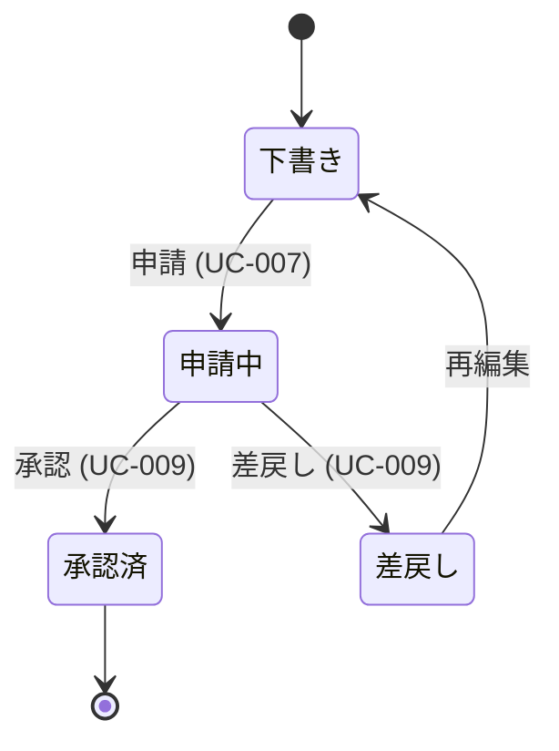
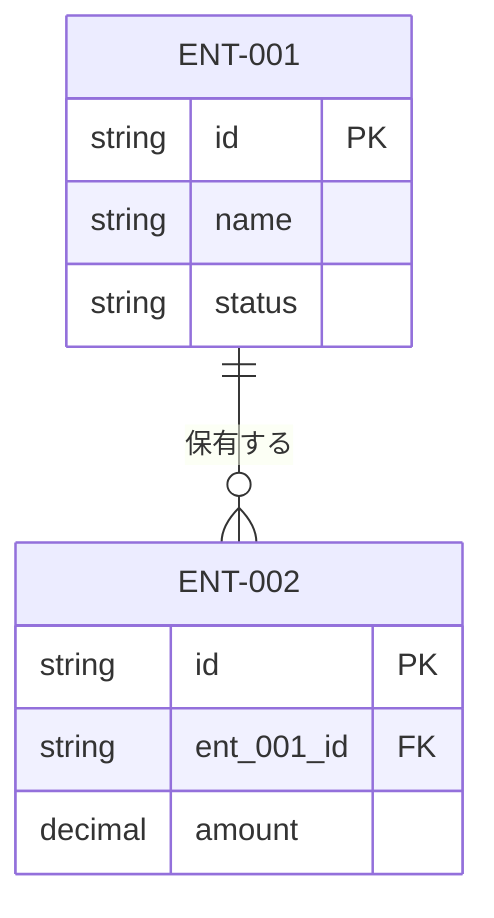

# データ設計書

本ドキュメントはデータ設計のテンプレートである。`docs/design/data/data-design.md` として配置し、各章を埋める。章の順序は固定（方針 → エンティティ俯瞰 → 各エンティティ詳細 → 関連 → 整合性 → 注意事項）。

- 対象システム名: {{SYSTEM_NAME}}
- 対応する要件定義書: [`docs/requirements/functional.md`](../../requirements/functional.md) / `docs/requirements/usecase/` / [`docs/requirements/non-functional.md`](../../requirements/non-functional.md)
- 対応するアーキテクチャ設計書: [`docs/design/architecture/architecture.md`](../architecture/architecture.md)
- 作成日 / 最終更新日: YYYY-MM-DD / YYYY-MM-DD
- 版: 0.1（ドラフト）

---

## 1. データ設計方針

本データ設計全体を貫く方針を箇条書きで示す。論理モデルレベルの判断のみを扱い、物理設計・DBMS 固有事項には踏み込まない。

- **データモデル種別**: {{関係モデル / ドキュメント / KVS 等（アーキ側の決定を前提として再掲）}}
- **キー方針**: {{サロゲート基本 / 自然キー基本 / 併用（併用時は判定基準）}}
- **識別粒度・マルチテナント**: {{テナント単位 / 利用者単位 / 組織単位、およびマルチテナント有無と適用範囲}}
- **削除方針**: {{論理削除基本 / 物理削除基本、および例外の判定基準}}
- **履歴・監査方針**: {{監査 4 項目の採用範囲、履歴テーブルを持つ条件}}
- **状態管理の表現**: {{状態列の命名規則、値集合の方針、状態履歴の持ち方}}
- **参照整合性の方針**: {{論理モデル上で FK 関係を宣言するかどうか、物理 FK を詳細設計でどう扱うか}}

---

## 2. エンティティ一覧

| ENT-ID | 名称 | 区分 | 概要 | ライフサイクル概要 | 保持責務 COMP | 由来 ENT（要件側） | 関連 UC・NFR |
|--------|------|------|------|----------------------|------------------|--------------------|----------------|
| ENT-001 | {{名称}} | マスタ / トランザクション / 集計 / ルックアップ / ログ・監査 | 〜を表すエンティティ | 長期保持 / 有効期限あり / 世代管理あり 等 | COMP-00X | ENT-001（要件側） | UC-001, NFR-003 |
| ENT-002 |   |   |   |   |   |   |   |

メモ:
- `ENT-NNN` は要件定義書の ID と同一 ID 空間。要件側の ID を引き継ぐ。設計で分割した場合は新規採番し「由来 ENT」列で元 ID を参照する。
- 「保持責務 COMP」はアーキテクチャ設計書の `COMP-NNN`（区分「DB」等）を記入。副次的なコピー（キャッシュ・検索インデックス）は「6.1 リスク・懸念点」に記載する。

---

## 3. 各エンティティ詳細

すべてのエンティティで同じテンプレートに沿って記述する。該当なしの節は「該当なし」と明記して省略しない。

### ENT-001 {{名称}}

**概要**: {{何を表すエンティティか、1〜2 文}}

**属性一覧**:

| 属性名（論理） | 論理型 | 必須 | 役割 | 値の範囲・列挙値 | 概要 |
|-----------------|--------|------|------|--------------------|------|
| {{属性名}} | 文字列 / 整数 / 数値（小数） / 真偽値 / 日付 / 日時 / 列挙 / 参照（ENT-NNN） / バイナリ | ○ / △（条件付き） / − | PK / UK / FK / 値 / 監査 / 派生 | {{範囲 / 列挙値 / 参照先 等}} | {{意味・用途}} |

**キーの考え方**:
- PK: {{サロゲート（ID）/ 自然キー（{{属性名}}）}}
- UK: {{業務上一意となる属性の組み合わせ（削除済みを除くか含むか）}}
- 自然キーを PK にする場合は、その不変性・重複しないことの保証を記述する。

**ライフサイクル**:
- 生成契機: {{誰が・どの UC・どの LNK 経由}}
- 更新契機: {{どの属性がどの UC で更新されうるか}}
- 削除方針: {{論理削除 / 物理削除 / アーカイブ / 削除不可}}（削除不可の場合は保存期間と紐付く NFR-NNN を明記）

**状態遷移**（状態を持つエンティティのみ）:

状態列: `status`（列挙: 下書き / 申請中 / 承認済 / 差戻し）

**監査・履歴**:
- 監査 4 項目（作成者 / 作成日時 / 更新者 / 更新日時）: {{採用 / 不採用、不採用時は理由}}
- 履歴テーブル: {{不要 / 必要（保持粒度と参照元 UC）}}

**備考**: {{論理モデルレベルの補足のみ。索引候補・性能懸念・非正規化可否などは「6. 注意事項」に集約する}}

### ENT-002 {{名称}}

（同形式で繰り返し）

---

## 4. 関連図

### 4.1 エンティティ関連図

メモ:
- 要件定義書の `erDiagram` との差分: {{分割したエンティティ・新規追加・廃止 等の概要}}
- 属性は主要なものに絞る（PK / 主要 FK / 業務的に重要な UK / 状態列）。網羅は「3. 各エンティティ詳細」の属性一覧で担保する。

### 4.2 関連一覧

| REL-ID | 親 ENT | 子 ENT | 多重度 | 参照の向き | 依存の強さ（親が消えると子も消えるか） | 関連の意味 | 関連 UC |
|--------|--------|--------|--------|-------------|------------------------------------------|-------------|-----------|
| REL-001 | ENT-001 | ENT-002 | 1 : 0..N | 子 → 親 | 強（識別関連：親が消えたら子も消える） | 〜が〜を保有する | UC-001 |
| REL-002 |   |   |   |   |   |   |   |

メモ:
- 循環参照・自己参照（ツリー構造など）がある場合は、本表に明示し、終端条件を記述する。
- 多対多は中間エンティティを挟んで解消し、中間エンティティも `ENT-NNN` として 2 章・3 章に登場させる。

---

## 5. 整合性ルール

| RULE-ID | 内容 | 対象 ENT | カテゴリ | 違反時の扱い | 関連 UC・BRU・NFR |
|---------|------|----------|----------|---------------|--------------------|
| RULE-001 | {{条件付き必須の説明}} | ENT-001 | 必須性 | 登録拒否（アプリケーション層で検証） | UC-003, BRU-005 |
| RULE-002 | {{複数列の一意性制約（削除済み除く等）}} | ENT-001, ENT-002 | 一意性 | 登録拒否（データ層で検証） | UC-007 |
| RULE-003 | {{参照整合性・削除時連鎖挙動}} | ENT-001 → ENT-002 | 参照整合性 | 削除禁止 / 連鎖削除 / NULL 化 | UC-010 |
| RULE-004 | {{状態遷移の許容パターン}} | ENT-003 | 値域・状態遷移 | 遷移拒否（アプリケーション層で検証） | UC-009 |
| RULE-005 | {{業務ルール由来の制約}} | ENT-002 | 業務ルール | 警告表示のみ / ログ記録 / 登録拒否 | BRU-012 |

メモ:
- カテゴリ: 必須性 / 一意性 / 参照整合性 / 値域・状態遷移 / 業務ルール
- 違反時の扱い: 登録拒否 / 警告表示 / 自動補正 / ログ記録のみ
- 拒否を採る場合は、どのレイヤで拒否するか（データ層 / アプリケーション層 / 画面入力段階）の方針を明示する。実装位置の最終確定は詳細設計だが、方針は本章で決める。
- 要件側の `BRU-NNN` に由来する制約は参照 ID を併記する。新規発見の業務ルールは要件側へのフィードバック要否を「6.1 リスク・懸念点」に記載する。

---

## 6. 注意事項

### 6.1 リスク・懸念点

| RISK-ID | 内容 | 影響範囲 | 顕在化条件 | 暫定対応 | 詳細設計への申し送り |
|---------|------|----------|-------------|-----------|------------------------|
| RISK-001 | マスタ変更時に過去のトランザクション表示で「当時の値」「現在の値」のどちらを出すか未決 | ENT-001, ENT-007 / UC-013 | マスタの属性が更新されるたびに顕在化 | 当面は現在の値を表示。履歴参照要求が出たら設計見直し | 履歴テーブルの保持粒度は詳細設計で確定 |
| RISK-002 | 論理削除下での UK の扱い（削除済みを含めた一意か、除いた一意か） | ENT-001 | 同一キーでの再登録ケース | 削除済みを除いた一意とする方針。実装位置は要検討 | 部分一意制約 or アプリ層検証の選択は詳細設計で |
| RISK-003 | 外部システムから取り込むデータの権威性（自システムが正本か、外部が正本か） | ENT-008, SIF-003 | 両側で更新が起きた場合の競合 | 外部を正本とし、自システムは参照のみ。更新は外部へ委譲 | 差分取り込み時の衝突検知方針は詳細設計で |
| RISK-004 | 要件未確定のまま進めた前提（保存期間など） | 全体 | 想定と異なる期間要求が出た場合 | 仮置きの保存期間で進行。確認結果により再調整 | 確認先: {{ステークホルダー名}} |

リスクの典型カテゴリ:
- 非正規化の誘惑
- 履歴の取り方と要件の整合
- 論理削除と参照・一意性制約の扱い
- 外部データの権威性・衝突
- マスタ変更のトランザクション波及
- 多通貨・多言語・タイムゾーンの保持粒度
- 監査項目の保存期間と法令・規制の整合
- 要件未確定のまま進めた前提

### 6.2 代替案と採らない理由

| ALT-ID | 対象判断 | 代替案概要 | 採らない理由 | 再検討条件 |
|--------|----------|------------|---------------|-------------|
| ALT-001 | キー方針 | 自然キー（メールアドレス）を PK とする | 改姓・改アドレスで PK 変更が必要になるケースがあり、業務変更耐性が低い | メールアドレスの不変性が業務ルールとして確定した場合 |
| ALT-002 | 削除方針 | 全エンティティで物理削除 | 監査要件（A-6 責任追跡性）との整合が取りにくく、誤削除時の復旧もできない | 監査要件が緩和された場合 |
| ALT-003 | 履歴の持ち方 | 全エンティティに履歴テーブルを用意 | 現要件で過去参照が必要なエンティティは限定的、全対応はストレージ・実装コストに見合わない | 過去参照要件が横断的に拡大した場合 |
| ALT-004 | エンティティ分割 | 住所を利用者エンティティに埋め込む | 複数住所（請求先・配送先）を持つユースケースがあり、別エンティティ化が必要 | 住所が単一であることが業務ルール上確定した場合 |
| ALT-005 | 派生項目の扱い | 合計金額を保持せず都度算出 | 集計頻度が高く、毎回の再計算コストが性能要件（NFR-00X）を侵食する可能性が高い | 計算対象の規模が大幅に減った場合 |

メモ:
- 最低でも以下の論理モデル判断については検討の痕跡を残す。該当なしの場合は「検討不要と判断した理由」を 1 行で記す。
  - キー方針（サロゲート vs 自然キー）
  - 削除方針（論理 vs 物理 vs アーカイブ）
  - 履歴の持ち方（履歴テーブル vs 変更ログ vs 持たない）
  - エンティティ分割（集約 vs 分割）
  - 派生項目の扱い（保持 vs 都度算出）
- 物理設計寄りの判断（索引・正規化崩し・パーティション等）は本表に含めず、詳細設計の代替案検討で扱う。

### 6.3 後続工程への申し送り事項

#### 詳細設計（機能・画面単位 / 物理テーブル設計）への申し送り

| HO-D-ID | 内容 | 想定選択肢 | 決定責任者 / 相談先 |
|---------|------|------------|----------------------|
| HO-D-001 | 索引戦略（どの列・複合順序・部分索引） | {{候補}} | {{担当}} |
| HO-D-002 | DBMS 固有の型指定（文字列長・数値精度） | {{候補}} | {{担当}} |
| HO-D-003 | 物理的な正規化崩し（非正規化・マテリアライズドビュー） | {{候補}} | {{担当}} |
| HO-D-004 | パーティショニング・シャーディング | {{候補}} | {{担当}} |
| HO-D-005 | ORM マッピング・プロシージャ・トリガ・ビュー実装 | {{候補}} | {{担当}} |

#### インフラ設計への申し送り

| HO-I-ID | 内容 | 想定選択肢 | 決定責任者 / 相談先 |
|---------|------|------------|----------------------|
| HO-I-001 | DBMS 製品・バージョン選定 | {{候補}} | {{担当}} |
| HO-I-002 | ストレージ容量・IOPS 見積り | {{候補}} | {{担当}} |
| HO-I-003 | バックアップ方式・レプリケーション構成 | {{候補}} | {{担当}} |

---

## 7. 参照ドキュメント

- 要件定義書（機能要件）: [`docs/requirements/functional.md`](../../requirements/functional.md)
- 要件定義書（非機能要件）: [`docs/requirements/non-functional.md`](../../requirements/non-functional.md)
- ユースケース詳細: `docs/requirements/usecase/UC-NNN/usecase.md`
- アーキテクチャ設計書: [`docs/design/architecture/architecture.md`](../architecture/architecture.md)
- {{その他参照資料（社内標準・ADR・既存スキーマ 等）}}
