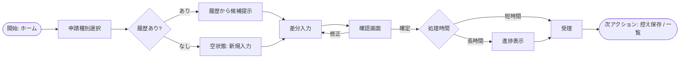
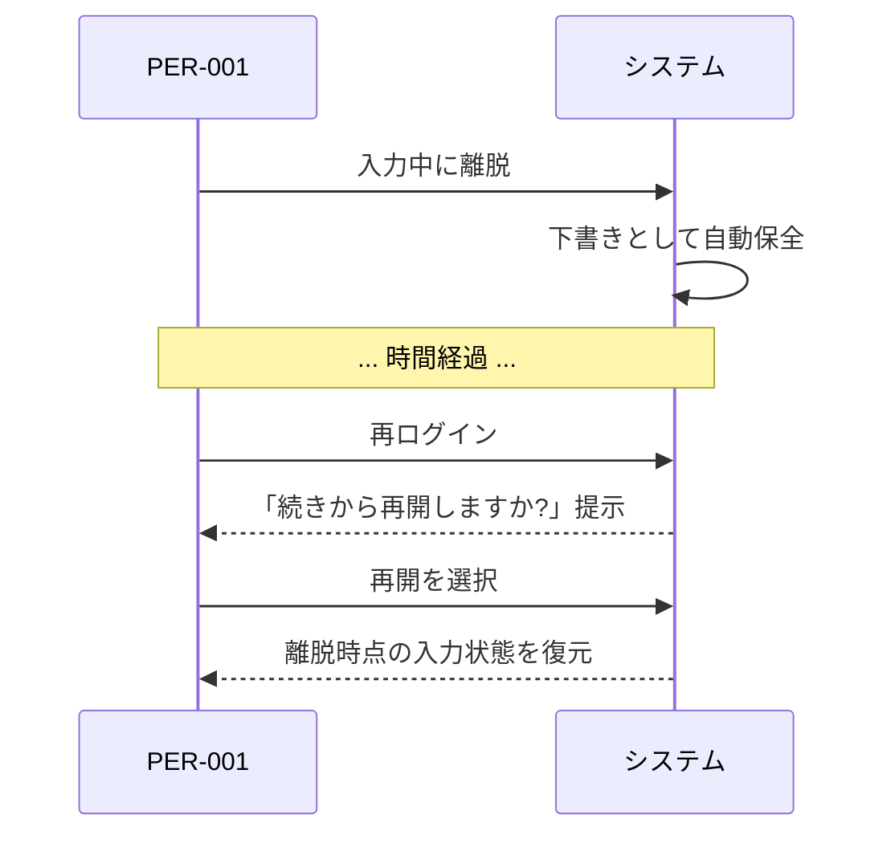

# HCD / UI・UX 設計書

本ドキュメントは HCD（人間中心設計）／ UI・UX 設計のテンプレートである。`docs/design/uiux/uiux-design.md` として配置し、各章を埋める。章の順序は固定（方針 → ペルソナ → シナリオ → 主タスク → フロー → 課題 → フィードバック → アクセシビリティ → 注意事項）。

- 対象システム名: {{SYSTEM_NAME}}
- 対応する要件定義書: [`docs/requirements/functional.md`](../../requirements/functional.md) / `docs/requirements/usecase/` / [`docs/requirements/non-functional.md`](../../requirements/non-functional.md)
- 対応するインタフェース設計書（下流）: [`docs/design/interface/interface-design.md`](../interface/interface-design.md)
- 作成日 / 最終更新日: YYYY-MM-DD / YYYY-MM-DD
- 版: 0.1（ドラフト）

---

## 1. UX 設計方針

本 UX 設計全体を貫く方針を箇条書きで示す。体験設計レベルの判断のみを扱い、UI コンポーネント・配色・文言の最終表現・フレームワーク機構には踏み込まない。

- **対象ユーザーの幅**: {{初見ユーザー優先 / 習熟ユーザー優先 / 両立（例: 初見は安全側既定 → 習熟者はショートカット）。紐付く NFR-NNN（学習容易性 / 操作効率）を明記}}
- **操作効率の基準**: {{主要タスクの最小操作回数の目安・主要経路の画面遷移数の目安。根拠となる NFR-NNN / 競合比較 / 業務観察}}
- **エラー耐性の方針**: {{ミスが起きない設計（入力補助・制約 UI・確認）vs ミスしても被害が小さい設計（取消・やり直し）のバランス。金銭・法務・安全に関わる操作は後者必須}}
- **フィードバック原則**: {{応答時間区分（瞬時 / 短時間 / 長時間 / 非同期）ごとの扱い方針、視覚 / 聴覚 / 触覚モダリティの使い分け}}
- **アクセシビリティ水準**: {{WCAG 相当で A / AA / AAA 相当のうちどこを論理的に担保するか。具体値は詳細設計に回す}}
- **マルチチャネルの扱い**: {{画面 / CLI / 音声 / チャット / 帳票 / 通知のうち採用するチャネル、主チャネルと補助チャネルの位置付け}}
- **体験の一貫性**: {{タスク間で操作語彙・遷移原則・フィードバック様式を揃える原則（例: 破壊的操作は必ず確認を挟む）}}
- **認知負荷の上限**: {{1 画面 / 1 ステップで扱う情報量・選択肢数の上限目安、超える場合の分割・段階化方針}}

---

## 2. ペルソナ定義

### 2.1 ペルソナ一覧

| PER-ID | 呼称 | 役割・属性 | 目的 | 文脈 | 利用頻度 | 前提知識・習熟度 | 利用環境 | 身体的・認知的特性 | 心理的特性・動機 | 主な関連 UC | 主な関連 NFR | 区分 |
|--------|------|------------|------|------|----------|--------------------|-----------|-----------------------|---------------------|----------------|----------------|------|
| PER-001 | {{呼称}} | {{役割}} | {{目的}} | {{業務・生活の文脈}} | {{日次 / 週次 / 月次 / 不定期}} | {{初心者 / 中級 / 熟練}} | {{PC / モバイル、場所、時間帯、ネットワーク}} | {{視覚・聴覚・運動・認知の特性。該当なしも明記}} | {{主な動機・不安・期待}} | UC-001, UC-003 | NFR-00X | プライマリ |
| PER-002 | {{呼称}} |   |   |   |   |   |   |   |   |   |   | セカンダリ |
| PER-003 | {{呼称}} |   |   |   |   |   |   |   |   |   |   | ネガティブ（対象外） |

メモ:
- プライマリ（主たる設計対象）は 1〜2 人に絞る。多すぎると意思決定の軸がぼける。
- ネガティブペルソナは「対象外と明示する層」。対象外とした根拠を `UC-NNN` / `NFR-NNN` に紐付ける。
- 架空の細部（氏名・趣味）は設計判断に影響する情報のみ最小限で書く。

### 2.2 ペルソナ採用の根拠

各ペルソナについて「なぜこの像を採用したか」を 1〜2 文で補足する。要件側のアクター定義と重なる場合は出典を示す。観察・リサーチ・仮説の別を明記する。

- **PER-001**: {{要件側アクター「{{アクター名}}」に対応。加えて {{インタビュー / 観察 / 仮説}} から {{特性}} を付与}}
- **PER-002**: {{...}}
- **PER-003**: {{要件上は対象に含まないが、実利用では混在するため注意喚起として掲載}}

---

## 3. 利用シナリオ

### 3.1 シナリオ一覧

| SCN-ID | 名称 | 関連 PER | トリガ | 前後の業務・生活 | 環境制約 | 感情状態 | 関連 UC | 頻度 | 重要度 |
|--------|------|----------|--------|---------------------|-----------|----------|-----------|------|--------|
| SCN-001 | 通常業務中の {{タスク}} | PER-001 | {{何が起きて使い始めるか}} | {{前後の業務の流れ}} | {{PC 前 / 片手 / 対面中 等}} | {{平常 / 焦り / 疲労}} | UC-001 | 日次 | 高 |
| SCN-002 | 締切直前の駆け込み | PER-001 | 期限 30 分前の気付き | 他業務で手が離せなかった後 | 焦燥感・時間制約・並行作業 | 強い焦り | UC-001 | 月次 | 高 |
| SCN-003 | 初見ユーザーの初回利用 | PER-002 | 上司からの依頼 | {{初めて触る状況}} | 不明な用語・操作への戸惑い | 不安・用心深さ | UC-003 | 単発 | 中 |
| SCN-004 | 高齢利用者の片手操作 | PER-003 | {{状況}} | 通勤中・移動中 | 片手・小画面・明るい屋外 | 集中困難 | UC-005 | 週次 | 中 |
| SCN-005 |   |   |   |   |   |   |   |   |   |

メモ:
- ハッピーパスだけでなく「辛い状況」（焦り・片手操作・初見・高齢・騒音環境 等）を 1〜2 本必ず含める。辛い状況で UX 課題が先回りで見つかる。
- 各シナリオは 1 つ以上の `PER-NNN` と `UC-NNN` に紐付ける。紐付かないものは 9.1 リスクに記録。

### 3.2 シナリオナラティブ（代表 1〜3 件）

設計判断に影響する細部のみを含む短い段落で記述する。小説化しない。

**SCN-002 締切直前の駆け込み**
> PER-001（{{呼称}}）は、他業務に追われて {{当該タスク}} の期限が 30 分後に迫っていることに気付く。過去の入力履歴を参照しながら、最小の入力で申請を完了したい。途中で上長から電話が入り、5 分中断する。再開時は続きから入力できる必要がある。もし形式エラーで弾かれると再入力する時間的余裕がない。

**SCN-003 初見ユーザーの初回利用**
> PER-002（{{呼称}}）は業務引継ぎで初めて本システムを開く。どの画面に何があるかわからず、最初の一歩で「自分は何を・どの画面で・何の情報を登録すれば良いのか」を見つけたい。専門用語の意味が分からず、用語の脇に補足を得たい。誤操作で既存データを消すのは避けたい。

---

## 4. 主タスク（Jobs-to-be-Done）

| JOB-ID | タスク名 | 関連 PER | 関連 SCN | 関連 UC | 目的（達成したいこと） | 成功条件 | 失敗の顕在化 | 頻度 | 優先度 | 時間制約 |
|--------|----------|----------|----------|-----------|---------------------------|-----------|----------------|------|--------|----------|
| JOB-001 | {{申請を素早く確定する}} | PER-001 | SCN-001, SCN-002 | UC-001 | 業務を止めずに申請を完了すること | 申請が受理され、業務動線に戻れる | 期限超過・業務停滞・再入力 | 日次 | 最高 | 3 分以内 |
| JOB-002 | {{初見で機能を探し当てる}} | PER-002 | SCN-003 | UC-003 | 目的に合う機能と入口を見つける | 自力で 10 分以内に到達 | サポート依頼・利用断念 | 単発 | 高 | 10 分以内 |
| JOB-003 | {{履歴から過去の入力を再利用する}} | PER-001 | SCN-002 | UC-001 | 入力工数を減らす | 過去入力から 70% 以上コピー可 | 手入力で時間超過 | 日次 | 高 | − |
| JOB-004 | {{片手で短時間に状況確認する}} | PER-003 | SCN-004 | UC-005 | 移動中でも状態を把握する | 3 タップ以内で状態到達 | 誤タップ・離脱 | 週次 | 中 | 30 秒以内 |
| JOB-005 |   |   |   |   |   |   |   |   |   |   |

メモ:
- タスク粒度は「1 回の利用セッションで達成したいまとまり」。細かい操作単位（クリック・入力）はフロー側で扱う。
- 優先度は NFR-NNN の要求強度 × 頻度 × 重要度で決める。最高優先度の JOB は後続のフロー・課題検討で重点的に磨き込む。
- 1 JOB = 1 UC とは限らない。対応関係を明示し、紐付かないものは 9.1 リスクへ。

---

## 5. タスクフロー

### 5.1 フロー一覧

| FLW-ID | 名称 | 対応 JOB | 関連 UC | 起点 | 終点 | 中断再開 | 想定操作回数 | 想定所要時間 | 区分 |
|--------|------|----------|-----------|------|------|-----------|------------------|------------------|------|
| FLW-001 | {{申請の主フロー}} | JOB-001 | UC-001 | ホームの「申請」 | 受理画面到達 | 可（下書き保存） | 5 操作 | 2 分 | 主フロー |
| FLW-002 | {{履歴再利用フロー}} | JOB-003 | UC-001 | 履歴一覧 | 受理画面到達 | 可 | 3 操作 | 1 分 | 代替 |
| FLW-003 | {{空状態（履歴無し）フロー}} | JOB-001 | UC-001 | 履歴画面（空） | 初回申請完了 | 可 | 6 操作 | 3 分 | 例外 |
| FLW-004 | {{入力途中で中断→再開}} | JOB-001 | UC-001 | 途中離脱後の再ログイン | 受理画面 | − | +1 操作（再開選択） | +10 秒 | 例外 |
| FLW-005 | {{送信失敗からの回復}} | JOB-001 | UC-001 | 送信エラー表示 | 再送信成功 または サポート連絡 | − | 2 操作 | 1 分 | 例外 |

メモ:
- 主フロー（ハッピーパス）と、空状態・中断再開・失敗回復・長時間待機の代替・例外フローを分けて書く。
- 想定操作回数・所要時間は 1 章「操作効率の基準」と整合させる。乖離は 9.1 リスクへ。

### 5.2 各フロー詳細

#### FLW-001 {{申請の主フロー}}

**起点**: {{ホーム画面の「申請」エントリ}}
**終点**: {{受理完了の到達状態}}
**中断再開**: {{可。途中まで入力した内容は下書きとして保全}}
**想定操作回数**: 5 / **想定所要時間**: 2 分

| # | ユーザーの意図 | システムが提供する情報・選択肢 | ユーザーの入力・選択 | システムの応答・フィードバック |
|---|------------------|----------------------------------|-----------------------|-----------------------------------|
| 1 | 申請を始めたい | 申請種別の選択肢 | 種別を選ぶ | 種別に応じた必要項目を提示 |
| 2 | 最小入力で済ませたい | 過去履歴・既定値からの候補 | 候補から選ぶ or 差分のみ入力 | 入力補助（推測・補完） |
| 3 | 間違いを確認したい | 確認画面（要点のみ） | 確認 or 修正 | 差分ハイライトで再確認を促す |
| 4 | 確定したい | 確定ボタン（破壊的でないため軽確認） | 確定 | 処理中の進行表示（長時間の場合） |
| 5 | 結果を知りたい | 受理完了の表示と次アクション（控え保存 / 一覧へ戻る） | 次の業務に戻る | 成功メッセージ（控えめ） |

**フロー図**

#### FLW-003 空状態（履歴無し）フロー

{{同形式で繰り返し。空状態の「次の一手」を明示すること}}

#### FLW-004 入力途中で中断→再開

#### FLW-005 送信失敗からの回復

{{失敗原因（通信・権限・業務制約）別の分岐と、次に何をすべきかの誘導方針}}

---

## 6. UX 課題と改善方針

| UXI-ID | カテゴリ | 内容（現状どう困るか） | 関連 FLW | 関連 JOB | 関連 PER | 影響範囲 | 発生頻度 | 重要度 | 検出根拠 | 改善方針（方向） | 期待効果 | インタフェース設計への申し送り |
|--------|----------|--------------------------|-----------|-----------|-----------|-----------|----------|--------|-----------|---------------------|-----------|--------------------------------------|
| UXI-001 | 認知負荷 | 申請種別選択肢が 20 以上並び、初見では目的の種別を特定できない | FLW-001 | JOB-002 | PER-002 | 初見ユーザー全員 | 初回利用時 | 高 | 仮説（用語調査） | 種別を目的別にグルーピング、または直近利用・よく使うものを上部提示する方向 | 初見到達時間の短縮 | HO-I-001（UI-NNN への分解時にグルーピング設計） |
| UXI-002 | 操作ミス | 確定ボタンと取消ボタンが近接しており誤タップが起きる | FLW-001 | JOB-001 | PER-003 | 片手操作時 | 週次 | 中 | 仮説（片手操作シナリオ） | 破壊的操作と肯定操作の視覚的・空間的分離、取消はアンドゥ可能化の方向 | 誤タップ率の低下 | HO-I-002 |
| UXI-003 | 遷移の分かりにくさ | 履歴画面から申請確定までの戻り方が不明 | FLW-002 | JOB-003 | PER-001 | 履歴利用全般 | 日次 | 高 | 仮説 | 現在地表示と一貫した戻り経路の方向 | 再訪コストの低下 | HO-I-003 |
| UXI-004 | 待ち時間の不安 | 長時間処理中に進捗が見えず、処理中か停止中か判別できない | FLW-001 | JOB-001 | PER-001 | 月末繁忙時 | 月次 | 中 | 仮説 | 進捗の可視化と推定残時間の表示方針 | 離脱・再送の抑制 | HO-I-004 |
| UXI-005 | 初見ユーザーの迷い | 空状態で「次の一手」が示されず、何をすべきか分からない | FLW-003 | JOB-002 | PER-002 | 初回利用 | 単発 | 高 | 仮説 | 空状態に明示的な次アクション誘導を置く方向 | 初回離脱の低減 | HO-I-005 |
| UXI-006 | アクセシビリティ | 色のみで警告／正常を区別しており、色覚特性で判別できない | FLW-001, FLW-005 | JOB-001 | 全 PER | 全利用者の一部 | 継続的 | 高 | 専門家推測 | 色以外の手掛かり（アイコン・テキスト）併用の方向 | 状態判別の確実化 | HO-I-006 |

メモ:
- カテゴリ: 認知負荷 / 操作ミス / 遷移の分かりにくさ / 待ち時間の不安 / 初見ユーザーの迷い / 反復操作の非効率 / 離脱・再訪時のコスト / アクセシビリティの欠落
- 改善方針は**方向**で書く。具体 UI（赤→緑）ではなく「破壊的と肯定を視覚的に区別する」と書き、具体はインタフェース設計・詳細設計へ申し送る。
- 検出根拠: 実ユーザー観察 / ユーザビリティテスト / 専門家推測 / 競合比較 / 仮説。仮説ベースは 9.1 で「検証必要」扱い。

---

## 7. フィードバック設計

| FB-ID | 対象状況 | 応答時間区分 | モダリティ | 粒度 | タイミング | 関連 FLW | 関連 UXI | 方針 |
|-------|----------|----------------|-------------|-------|-------------|-----------|-----------|------|
| FB-001 | ボタン押下の反応 | 瞬時（< 0.1s） | 視覚 | 軽微 | 即時 | 全 FLW | − | 無反応と区別できる最小の視覚反応。省略すると「壊れた」と誤認される |
| FB-002 | 短時間処理中 | 短時間（< 1s） | 視覚 | 軽微（スピナー相当） | 処理後 | FLW-001 | UXI-004 | 明示的な「処理中」表示。粒度は控えめ |
| FB-003 | 長時間処理中 | 長時間（> 1s） | 視覚 | 明示（進捗可視化） | 処理中に定期 | FLW-001 | UXI-004 | 進捗・推定残時間・キャンセル可否を提示 |
| FB-004 | 非同期完了通知 | 非同期 | 視覚＋別経路（通知） | 明示 | 完了時 | FLW-001 | − | 処理完了を別経路（通知センター等）で伝える方針。具体経路はインタフェース設計 |
| FB-005 | 通常操作成功 | − | 視覚 | 軽微（サイレント） | 処理後 | FLW-001 | − | 破壊的でない操作の成功は静かに済ます |
| FB-006 | 破壊的操作成功 | − | 視覚 | 明示 | 処理後 | − | − | 決済・申請・同意など取消コストが高い操作は明示的に成功を祝う |
| FB-007 | 失敗 | − | 視覚 | 明示 | 処理後 | FLW-005 | − | 何が起きたか・次に何をすべきか・問い合わせ先を含む。ユーザーに責任を帰さない書き方の方針 |
| FB-008 | 破壊的操作前の確認 | − | 視覚（必要なら触覚） | ブロッキング | 操作直前 | FLW-001 | UXI-002 | 取消不可・金銭・個人情報・他者影響のある操作は必ず確認。影響度で段階化（軽確認 / 再入力 / 時間差 / 二要素） |
| FB-009 | 入力補助・候補提示 | − | 視覚 | 軽微 | 入力中 | FLW-002 | UXI-001 | 過去入力や既定値からの推測を提示。採用は任意（強制しない） |

メモ:
- 応答時間区分は必ず網羅する（瞬時 / 短時間 / 長時間 / 非同期）。
- 「体験の一貫性」（1 章）に従い、同種の状況には同種のフィードバックを与える。
- 具体の UI コンポーネント（トースト / モーダル / バナー）・文言はインタフェース設計・詳細設計で決める。

---

## 8. アクセシビリティ方針

| A11Y-ID | 対象 | 担保したい操作・理解 | 方針 | 関連 FLW | 関連 UXI | 関連 NFR | 関連 WCAG 原則 |
|---------|------|-------------------------|------|-----------|-----------|-----------|------------------|
| A11Y-001 | 視覚 | すべての主要情報を非視覚的にも知覚可能 | スクリーンリーダー対応（意味のある順序と代替テキストの**方針**）、色のみで意味を伝えない、動き・点滅の制御 | 全 FLW | UXI-006 | NFR-00X | 知覚可能 |
| A11Y-002 | 視覚 | 拡大表示でも主機能が使える | 拡大耐性の担保方針、レイアウト崩れを許容する範囲 | 全 FLW | − | NFR-00X | 知覚可能 |
| A11Y-003 | 聴覚 | 音声情報に代替手段 | 通知音に依存せず視覚手段を併用、動画・音声コンテンツには代替テキストを付ける方針 | FLW-001 | − | NFR-00X | 知覚可能 |
| A11Y-004 | 運動 | キーボードのみで主要操作が完結 | タブ順序・フォーカス可視化の方針、タップ領域の最小サイズ方針（具体値は詳細設計） | 全 FLW | UXI-002 | NFR-00X | 操作可能 |
| A11Y-005 | 運動 | タイムアウトの制御 | セッションタイムアウトの延長・無効化、作業継続の保全方針 | FLW-004 | − | NFR-00X | 操作可能 |
| A11Y-006 | 認知 | 用語の平易化と手順の段階化 | 専門用語の補足提供、ウィザード化、取消・やり直し可能性 | FLW-003 | UXI-001, UXI-005 | NFR-00X | 理解可能 |
| A11Y-007 | 状況的制約 | 片手・屋外・騒音・低速回線での利用 | タップ領域・コントラスト・読み込み戦略の方針（具体値は詳細設計） | FLW-004 | UXI-002 | NFR-00X | 操作可能 / 堅牢 |

メモ:
- WCAG の原則（知覚可能 / 操作可能 / 理解可能 / 堅牢）を参考にするが、本ドキュメントは論理設計のため具体数値は詳細設計に申し送る。
- 対象外とする JOB がある場合、根拠を `UC-NNN` / `NFR-NNN` と紐付けて記録し、9.1 リスクに連動させる。
- 要件側の非機能にアクセシビリティが未記載の場合、9.3 要件定義への逆流候補に記録する。

---

## 9. 注意事項

### 9.1 リスク・懸念点

| RISK-ID | 内容 | 影響範囲 | 顕在化条件 | 暫定対応 | インタフェース設計・詳細設計への申し送り |
|---------|------|----------|-------------|-----------|--------------------------------------------|
| RISK-001 | ペルソナ・シナリオが仮説ベースで未検証 | 全 PER / 全 JOB | リリース後に想定と異なる利用者層が中心となる | 初回リリース後のログ・問い合わせ傾向を観察 | A/B テスト・ユーザビリティテスト計画を詳細設計で |
| RISK-002 | プライマリペルソナが 3 人以上に広がり設計軸がぼけている | 全 JOB / 全 FLW | 個別 UI 判断で優先度が揺れる | プライマリを PER-001 に絞る暫定運用 | − |
| RISK-003 | FLW-001 の想定操作回数が NFR-00X（操作効率）を超過する可能性 | JOB-001 / UC-001 | 履歴再利用が使えないユーザーで顕在化 | 主フローで履歴活用を前提とする明記 | HO-I-001 |
| RISK-004 | 中断再開の保全範囲（どこまで下書きに含めるか）が曖昧 | FLW-004 | 個人情報を含む下書き保全の監査指摘 | 監査担当と確認 | HO-I-00X |
| RISK-005 | UXI-001〜006 の検出根拠がすべて仮説であり、実ユーザー観察が未実施 | 全 UXI | 改善投入後に効果が出ない | テスト計画の策定 | HO-D-00X |
| RISK-006 | アクセシビリティ対象外としている JOB-004 の根拠が弱い | JOB-004 / PER-003 | 実利用で対応求められる | 要件側に逆流確認 | HO-R-001 |
| RISK-007 | 要件側の非機能要件「使用性」が粗く、本ドキュメントで暗黙前提を多く補完している | 全章 | 要件確定時に方針との齟齬 | 要件側への質問リスト化 | HO-R-002 |

リスクの典型カテゴリ:
- ペルソナ・シナリオが仮説ベース
- プライマリペルソナが広すぎる
- JOB の優先順位が要件と乖離
- FLW の操作回数・所要時間と NFR の乖離
- 代替・例外フロー（空状態・中断再開・失敗回復）の検討漏れ
- UX 課題が仮説のみで未検証
- 改善方針が具体 UI に踏み込みすぎ
- フィードバックの粒度不統一
- アクセシビリティ対象外の根拠が弱い
- 要件側の使用性非機能が薄い
- 用語の揺れ（PER / JOB / 画面名）

### 9.2 代替案と採らない理由

| ALT-ID | 対象判断 | 代替案概要 | 採らない理由 | 再検討条件 |
|--------|----------|------------|---------------|-------------|
| ALT-001 | 対象ユーザーの幅 | 習熟ユーザー優先でショートカット中心の設計 | プライマリ PER-001 は毎日使うが、PER-002 の初見到達が業務継続に直結するため初見優先を選択 | 熟練者比率が大幅に上がった場合 |
| ALT-002 | 主タスクの粒度 | JOB をより細かく分解（項目入力単位） | 1 セッションで達成するまとまりを見失い、フロー設計が画面操作レベルに堕する | フロー検証で粗粒度では不十分と判明した場合 |
| ALT-003 | 中断再開の扱い | 完了しなければ破棄（下書き保全なし） | SCN-002 の「途中で電話中断」が業務頻度として高く、破棄すると再入力コストが NFR を侵食 | 中断頻度が極小に変わった場合 |
| ALT-004 | 破壊的操作の確認強度 | 軽確認のみで統一 | 金銭系 UC-00X では取消不可のため、軽確認では誤操作の損失が大きい | 金銭系が UC スコープ外となった場合 |
| ALT-005 | フィードバック様式 | 全操作で明示的な成功表現 | 頻度の高い通常操作で「お祝い疲れ」を招き、本来重要な成功が埋没する | 操作頻度が大きく低下した場合 |
| ALT-006 | アクセシビリティ水準 | AAA 相当を全機能で担保 | 実装コストが NFR 全体のバランスを侵食、プライマリ PER の満足を優先 AA 相当で整理 | 法令要件が AAA 必須となった場合 |
| ALT-007 | マルチチャネル | 画面のみ主体で音声・チャット提供せず | SCN-004 の片手移動中利用で音声補助が機能継続に寄与。部分的に補助チャネル採用 | 移動中利用頻度が低下した場合 |

メモ:
- 最低でも以下の論点については検討の痕跡を残す。該当なしは「検討不要と判断した理由」を 1 行で記す。
  - 対象ユーザーの幅（初見 vs 習熟 vs 両立）
  - 主タスクの粒度
  - フロー分岐戦略（1 経路統一 vs 状況別複数経路）
  - 中断再開の扱い
  - 破壊的操作の確認強度
  - フィードバック様式（サイレント vs 明示）
  - アクセシビリティ水準
  - マルチチャネル
- 具体 UI 判断（色・配置・文言）は本章では取り上げない。インタフェース設計・詳細設計で扱う。

### 9.3 後続工程への申し送り事項

#### インタフェース設計（`UI-NNN` / `VR-NNN` / `ERR-NNN` / `API-NNN` 単位）への申し送り

| HO-I-ID | 内容 | 想定選択肢 | 決定責任者 / 相談先 |
|---------|------|------------|----------------------|
| HO-I-001 | JOB-001 / FLW-001 の画面分解（UI-NNN）。申請種別選択の階層化 | 1 画面単段 / 2 画面ウィザード / モーダル | {{担当}} |
| HO-I-002 | 確定ボタンと取消ボタンの分離（UI-NNN レベル） | 空間分離 / 色分離 / アンドゥ化 | {{担当}} |
| HO-I-003 | 履歴画面からの戻り経路（UI-NNN の遷移） | 常時表示の戻る / パンくず / モーダル化 | {{担当}} |
| HO-I-004 | 長時間処理の進捗情報 API（API-NNN） | ポーリング / ストリーミング / 再接続可能 | {{担当}} |
| HO-I-005 | 空状態 UI-NNN の次アクション誘導 | 定型カード / ウィザード導入 / チュートリアル | {{担当}} |
| HO-I-006 | 警告・正常の視覚表現（色以外の手掛かり） | アイコン併用 / テキスト併用 / パターン併用 | {{担当}} |
| HO-I-007 | 中断再開時の保全範囲の VR-NNN・ERR-NNN 設計 | 個人情報除外 / 暗号化必須 / 時間制限付き | {{担当}} |

#### 詳細設計（画面単位）への申し送り

| HO-D-ID | 内容 | 想定選択肢 | 決定責任者 / 相談先 |
|---------|------|------------|----------------------|
| HO-D-001 | UI レイアウト・配色・余白・フォント・コンポーネント分割 | {{候補}} | {{担当}} |
| HO-D-002 | マイクロコピー（ボタンラベル / プレースホルダ / エラーメッセージ / ツールチップ）の最終表現 | {{候補}} | {{担当}} |
| HO-D-003 | アニメーション・トランジションの曲線・秒数 | {{候補}} | {{担当}} |
| HO-D-004 | コントラスト比・フォントサイズ最小値・フォーカス表示・タップ領域最小サイズ | {{候補}} | {{担当}} |
| HO-D-005 | UI コンポーネントライブラリ選定と命名規則 | {{候補}} | {{担当}} |
| HO-D-006 | ユーザビリティテストの計画と検証対象 UXI | {{候補}} | {{担当}} |

#### 要件定義への逆流候補

| HO-R-ID | 内容 | 逆流理由 | 相談先 |
|---------|------|----------|---------|
| HO-R-001 | 使用性 NFR にアクセシビリティ水準（AA 相当）の追記 | 本 UX 設計で AA 相当を前提としているが要件側に記載なし | {{担当}} |
| HO-R-002 | UC-001 のフロー記述に「中断再開」の代替フローを追加 | 現状 UC 記述では SCN-002 を扱い切れていない | {{担当}} |
| HO-R-003 | ネガティブペルソナ（PER-003 のうち対象外部分）のスコープ記述 | 実利用層の想定を要件側に明示する必要 | {{担当}} |

---

## 10. 参照ドキュメント

- 要件定義書（機能要件）: [`docs/requirements/functional.md`](../../requirements/functional.md)
- 要件定義書（非機能要件）: [`docs/requirements/non-functional.md`](../../requirements/non-functional.md)
- ユースケース詳細: `docs/requirements/usecase/UC-NNN/usecase.md`
- インタフェース設計書（下流）: [`docs/design/interface/interface-design.md`](../interface/interface-design.md)
- {{その他参照資料（ユーザーインタビュー記録・競合観察メモ・社内 UX ガイドライン・ADR 等）}}
