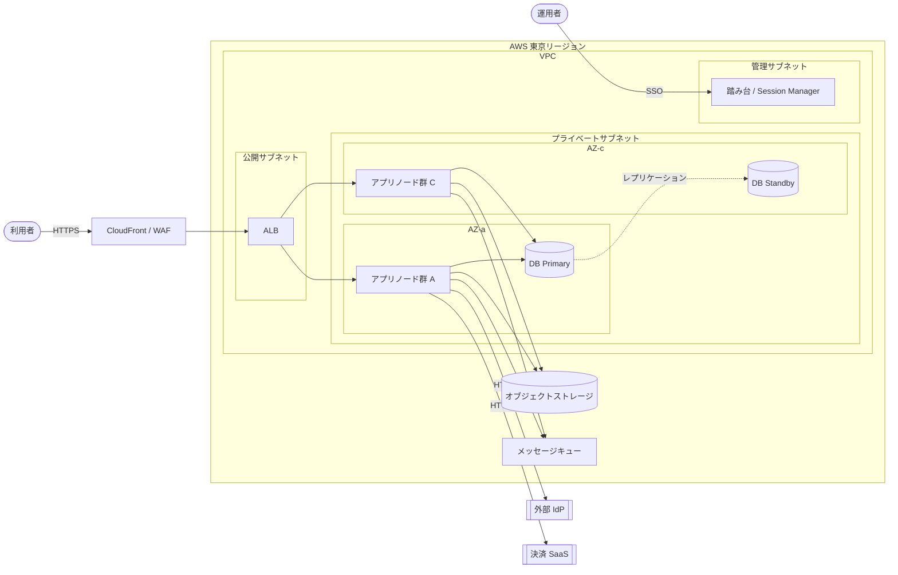
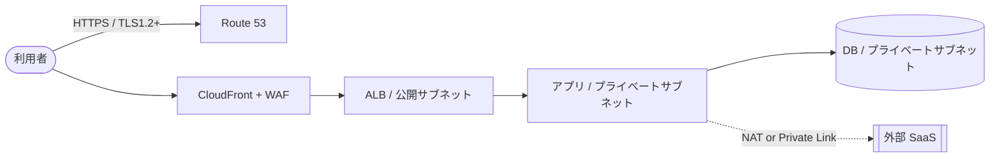
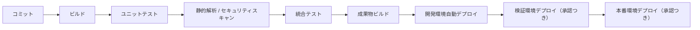

# インフラ設計書

本ドキュメントはインフラ設計のテンプレートである。`docs/design/infrastructure/infrastructure.md` として配置し、各章を埋める。章の順序は固定（全体像 → 配置 → ネットワーク → 可用性 → スケール → セキュリティ → 運用 → BK/DR → デプロイ → 採用理由 → 代替案 → リスク）。

- 対象システム名: {{SYSTEM_NAME}}
- 対応する要件定義書: [`docs/requirements/functional.md`](../../requirements/functional.md) / `docs/requirements/usecase/` / [`docs/requirements/non-functional.md`](../../requirements/non-functional.md)
- 対応するアーキテクチャ設計書: [`docs/design/architecture/architecture.md`](../architecture/architecture.md)
- 作成日 / 最終更新日: YYYY-MM-DD / YYYY-MM-DD
- 版: 0.1（ドラフト）

---

## 1. 構成概要

### 1.1 稼働環境の要約
{{クラウド / オンプレ / ハイブリッドの別、採用クラウドベンダーまたは DC、リージョン、特徴的な設計方針を数文で記述する。例: 「AWS 東京リージョンを主に用いる Multi-AZ 構成。運用負荷を抑えるためマネージドサービスを第一選択とし、自前運用は IdP 連携の特殊要件がある部分に限定する。DR は現時点では対象外。」など。}}

設計方針（抜粋）:
- {{方針 1（例: Multi-AZ 冗長化を標準とし、コスト制約で Single-AZ とする場合のみ個別判断）}}
- {{方針 2（例: 運用は既存社内監視基盤 X を利用し、新規基盤は追加しない）}}
- {{方針 3（例: 開発・検証・本番の 3 環境を本番同等構成 / 縮小構成 / 最小構成で運用）}}

### 1.2 利用サービス / 製品
- 計算資源: {{例: AWS ECS Fargate / EC2 / Lambda}}
- データストア: {{例: Amazon RDS for PostgreSQL（Multi-AZ）, Amazon S3}}
- ネットワーク: {{例: AWS VPC, ALB, CloudFront, Route 53, AWS WAF}}
- メッセージング: {{例: Amazon SQS}}
- 認証基盤: {{例: 既存 IdP（Azure AD）を OIDC で利用}}
- 監視 / ログ: {{例: Amazon CloudWatch, 既存社内 SIEM}}
- CI/CD: {{例: GitHub Actions}}
- その他: {{例: AWS KMS, AWS Secrets Manager}}

### 1.3 スコープと前提
- スコープ内:
  - {{項目}}
- スコープ外 / 非対応:
  - {{項目}}
- 前提（要件・環境・既存資産・契約）:
  - {{項目}}

---

## 2. システム構成図

物理構成を Mermaid で示す。リージョン / AZ / VPC / サブネット / ネットワークゾーンを `subgraph` で明示する。ロードバランサ・NAT・踏み台・ゲートウェイ・外部 SaaS との接続点も描く。

---

## 3. コンポーネント配置

アーキテクチャの `COMP-NNN` を実環境のインフラ資源（`INF-NNN`）に対応付ける。インフラ固有の要素（ロードバランサ・踏み台・WAF・監視エージェント等）もここで列挙する。

| INF-ID | 名称 | 配置先（具体サービス / ホスト） | 種別 | 対応 COMP | 主な役割 | 冗長化方針（概要） | 関連 NFR |
|--------|------|-----------------------------------|------|-----------|----------|---------------------|----------|
| INF-001 | {{API アプリノード}} | {{例: AWS ECS Fargate（2〜10 タスク）}} | コンピュート | COMP-001 | {{役割}} | Multi-AZ / オートスケール | NFR-00X |
| INF-002 | {{DB（業務データ）}} | {{例: Amazon RDS for PostgreSQL Multi-AZ}} | DB | COMP-002 | {{役割}} | Multi-AZ Active-Standby | NFR-00Y（稼働率） |
| INF-003 | {{非同期ワーカー}} | {{例: AWS ECS Fargate}} | コンピュート | COMP-003 | {{役割}} | Multi-AZ / オートスケール | NFR-00X |
| INF-004 | {{キュー}} | {{例: Amazon SQS}} | メッセージング | COMP-004 | {{役割}} | マネージド側で冗長化済み | NFR-00X |
| INF-005 | {{ロードバランサ}} | {{例: AWS ALB}} | ネットワーク機器 | — | {{役割: TLS 終端・経路振り分け}} | マネージド Multi-AZ | NFR-00X |
| INF-006 | {{WAF}} | {{例: AWS WAF}} | セキュリティ | — | {{役割: 不正リクエスト遮断}} | マネージド冗長化 | NFR-00Z（機密性 / 完全性） |
| INF-007 | {{踏み台}} | {{例: AWS Systems Manager Session Manager}} | 管理 | — | {{役割: 運用者アクセス}} | マネージド | NFR-00Z（責任追跡性） |
| INF-008 | {{Secret 管理}} | {{例: AWS Secrets Manager}} | セキュリティ | — | {{役割: DB 接続情報・API キー保管}} | マネージド冗長化 | NFR-00Z（機密性） |

メモ:
- `COMP-NNN` 列が「—（インフラ固有）」の要素は、アーキ側の論理コンポーネントに直接対応しない。`NFR-NNN` への紐付けで「なぜ必要か」を説明する。
- すべての `COMP-NNN` がいずれかの `INF-NNN` に配置されていることを章末で確認する。

---

## 4. ネットワーク構成

### 4.1 ゾーニング方針
- 公開網（インターネット）: 利用者・外部 SaaS との接続点。TLS 必須。
- DMZ（公開サブネット）: LB / NAT のみ配置。アプリ本体は配置しない。
- プライベート: アプリノード・DB を配置。外部への直接通信は不可（NAT または Private Link 経由）。
- 管理用: 踏み台・監視エージェント集約点。運用者 SSO 経由のみ。

### 4.2 ネットワーク要素一覧

| NET-ID | 名称 | 種別 | 範囲 | 配置する INF | 許可する通信（概要） | 関連 LNK |
|--------|------|------|------|--------------|----------------------|----------|
| NET-001 | {{メイン VPC}} | VPC | {{リージョン}} | INF-001〜INF-008 | VPC 内通信 | — |
| NET-002 | {{公開サブネット AZ-a / AZ-c}} | サブネット | 各 AZ | INF-005（ALB）, NAT | インターネット → ALB（HTTPS）/ NAT → インターネット | LNK-001 |
| NET-003 | {{プライベートサブネット AZ-a / AZ-c}} | サブネット | 各 AZ | INF-001, INF-002, INF-003, INF-004 | VPC 内のみ / NAT 経由で外部 API | LNK-002, LNK-003 |
| NET-004 | {{管理サブネット}} | サブネット | 単一 AZ or 両 AZ | INF-007 | SSO → 踏み台 → プライベート | LNK-管理経路 |
| NET-005 | {{SG: ALB}} | セキュリティグループ | — | INF-005 | in: 0.0.0.0/0 443, out: INF-001 向け | LNK-001 |
| NET-006 | {{SG: アプリ}} | セキュリティグループ | — | INF-001, INF-003 | in: ALB SG, out: DB SG / NAT | LNK-002 |
| NET-007 | {{SG: DB}} | セキュリティグループ | — | INF-002 | in: アプリ SG のみ, out: なし | LNK-002 |
| NET-008 | {{Route 53 / DNS}} | DNS | — | — | 利用者向けドメイン解決 | LNK-001 |
| NET-009 | {{CloudFront（CDN）}} | CDN | — | — | インターネット → ALB の前段、静的配信 | LNK-001 |
| NET-010 | {{外部 SaaS 接続（Private Link / FQDN 許可）}} | 外部接続 | — | INF-001, INF-003 | 指定 FQDN のみ | LNK-003 |

### 4.3 代表経路（ユーザ応答経路の具体化）

### 4.4 外部接続一覧
- インターネット: 利用者アクセス、および NAT 経由の外部 API 呼出
- VPN / 専用線: {{あれば記載 / なければ「なし」}}
- 外部 SaaS との専用接続: {{例: 決済 SaaS と Private Link 接続 / IdP との OIDC は通常インターネット経由 HTTPS}}

---

## 5. 可用性設計

### 5.1 冗長化方針一覧

| INF-ID | 冗長化方式 | 障害ドメイン分離 | フェイルオーバー | 目標稼働率 | RTO 目標 | 根拠 NFR |
|--------|-------------|-------------------|-------------------|-------------|----------|----------|
| INF-001 | Multi-AZ Active-Active | 2 AZ | オートスケールによる自動回復 | {{99.95%}} | {{数分}} | NFR-00X |
| INF-002 | Multi-AZ Active-Standby | 2 AZ | マネージドサービスによる自動切替 | {{99.95%}} | {{〜数分}} | NFR-00X |
| INF-003 | Multi-AZ Active-Active | 2 AZ | オートスケール | — | {{分オーダー}} | NFR-00X |
| INF-004 | マネージド（冗長化済み） | リージョン内 | 内蔵 | — | — | NFR-00X |
| INF-005 | マネージド Multi-AZ | 2 AZ | 内蔵 | — | — | NFR-00X |

### 5.2 許容する単一障害点
- {{例: 管理用踏み台（INF-007）は単一系。障害時は AWS マネジメントコンソール直接アクセスで代替可能。}}

### 5.3 DR（災害復旧）
- 対象範囲: {{例: リージョン障害は当面対象外。理由: RTO / RPO 要件と投資コストのバランス。}}
- バックアップのみ別リージョン保管: {{対象 INF・方式 / もしくは「採らない」}}
- 再検討条件: {{例: 事業規模が X を超えた時点で DR 構成を再検討}}

---

## 6. スケーリング設計

| INF-ID | スケール手段 | 発動トリガ（指標） | 最小〜最大 | 制約 | 関連 NFR |
|--------|--------------|---------------------|-------------|------|----------|
| INF-001 | スケールアウト（自動） | {{CPU / リクエスト数}} | {{2〜10 タスク}} | {{DB 接続数上限：N}} | NFR-00X |
| INF-002 | スケールアップ（手動） | — | {{db.t3.medium 〜 db.r6g.xlarge}} | 書き込みは単一ノード | NFR-00X |
| INF-003 | スケールアウト（自動） | {{キュー長}} | {{1〜20 タスク}} | 外部 SaaS のレート制限 | NFR-00X |

メモ:
- 具体の閾値（CPU 80% / キュー長 100 等）は運用・SRE 詳細設計で確定する。本章ではトリガの指標のみ示す。
- スケール不能な要素: {{例: DB 書き込みノード、外部 SaaS レート制限}}。突破時の挙動: {{キュー滞留で吸収 / エラー表示 等}}。

---

## 7. セキュリティ設計

### 7.1 認証
- **利用者認証**: {{例: 外部 IdP（Azure AD）に委譲。OIDC 認可コードフロー。MFA は IdP 側で強制。}}
- **運用者認証**: {{例: AWS SSO、踏み台は Session Manager 経由のみ、SSH 鍵は払出さない}}
- **システム間認証**: {{例: 外部 SaaS との通信は API キー（Secrets Manager 管理）+ mTLS}}

### 7.2 認可
- **基盤レベル IAM**: {{例: 最小権限の原則。アプリノードのロールには DB への接続・S3 の特定バケットのみ許可}}
- **特権操作**: {{例: 本番への変更は承認つき IAM 一時ロールのみ。永続的な管理者ロールは付与しない}}
- **Secret 参照権限**: {{例: Secrets Manager はアプリロール / 運用ロールで分離}}

### 7.3 通信保護
- **インターネット経路**: TLS 1.2 以上。証明書は {{例: AWS Certificate Manager で自動更新}}。
- **内部通信**: VPC 内のみ。必要に応じて TLS 化。
- **WAF**: {{例: AWS マネージドルール + 独自ルール（SQLi / XSS / レート制限）}}。
- **DDoS 対策**: {{例: CloudFront / AWS Shield Standard（有償 Advanced は採らない）}}。

### 7.4 データ保護
- **保存時暗号化**: {{例: RDS / S3 / EBS はいずれも KMS 暗号化を有効化}}
- **鍵管理**: {{例: AWS KMS、キーローテーションは年次}}
- **機微データのログ出力禁止**: {{対象項目と対策方針}}

### 7.5 監査ログ
- **対象操作**: {{例: コンソールログイン・特権 API 呼出・Secret 参照・DB 特権クエリ}}
- **集約先**: {{例: CloudTrail → 社内 SIEM、S3 ログバケットは書換不可モード}}
- **保管期間**: {{例: 1 年（NFR-00X（責任追跡性）に基づく）}}

---

## 8. 運用設計（監視・ログ・アラート）

| OPS-ID | 観点 | 対象 INF | 収集・集約手段 | 保管期間 | 通知先 | 関連 NFR |
|--------|------|----------|-----------------|-----------|---------|----------|
| OPS-001 | リソース監視（CPU / メモリ / ディスク） | INF-001, INF-003 | CloudWatch Metrics | {{30 日}} | 運用チーム Slack | NFR-00X |
| OPS-002 | アプリ監視（エラーレート / レイテンシ） | INF-001 | ALB アクセスログ + CloudWatch | {{90 日}} | オンコール | NFR-00X |
| OPS-003 | 業務監視（重要 UC の成功率） | INF-001, INF-003 | アプリ埋め込み計測 | {{90 日}} | 運用チーム | NFR-00X |
| OPS-004 | 外形監視（主要 URL の到達性） | — | {{外形監視 SaaS or CloudWatch Synthetics}} | {{90 日}} | オンコール | NFR-00X |
| OPS-005 | アプリケーションログ | INF-001, INF-003 | CloudWatch Logs → 社内 SIEM | {{90 日 + アーカイブ 1 年}} | — | NFR-00X |
| OPS-006 | アクセスログ（ALB） | INF-005 | S3 アーカイブ | {{1 年}} | — | NFR-00X |
| OPS-007 | 監査ログ（CloudTrail） | 全体 | S3 + 社内 SIEM | {{1 年}} | セキュリティチーム | NFR-00Z |
| OPS-008 | DB スローログ | INF-002 | CloudWatch Logs | {{30 日}} | 運用チーム（自動通知なし / 手動分析） | NFR-00X |

### 8.1 アラート方針
- 重大度区分（Critical / Warning / Info）で通知経路を分ける。
- Critical: オンコール（電話 / SMS）
- Warning: Slack 通知
- Info: Slack 通知のみ（夜間非通知）
- 具体の閾値・シフト・エスカレーション先は運用・SRE 詳細設計で確定する。

### 8.2 運用時間帯
- 本番監視時間帯: {{24/365 or 営業時間のみ（NFR-00X に基づく）}}
- 定期メンテナンス枠: {{例: 日曜 02:00-04:00（利用者通知済み）}}

---

## 9. バックアップ / リカバリ

| INF-ID | バックアップ対象 | 取得方式 | 頻度 | 保管先・保管期間 | RPO 目標 | RTO 目標 | 復旧手順の概要 | 根拠 NFR |
|--------|-------------------|-----------|------|-------------------|-----------|----------|------------------|----------|
| INF-002 | {{業務 DB}} | スナップショット + 継続バックアップ（PITR） | 自動（継続）| {{同一リージョン別 AZ / 35 日 + 長期 S3 別バケット 1 年}} | {{5 分}} | {{30 分}} | {{1) 旧 DB 隔離 → 2) PITR で新インスタンス復元 → 3) 接続切替}} | NFR-00X, NFR-00W |
| INF-009 | {{オブジェクトストレージ（生成物）}} | バージョニング + クロスリージョン複製 | リアルタイム | S3 / 保管期間：{{1 年}} | {{0}} | {{即時}} | オブジェクト単位で旧バージョン復元 | NFR-00W |
| INF-010 | {{設定（IaC）}} | Git リポジトリ | コミット毎 | Git 永続 | — | — | IaC 再適用 | NFR-00X |

メモ:
- 論理削除・誤操作からの復旧: PITR / バージョニングで対応。
- 物理障害からの復旧: マネージドの自動フェイルオーバー + バックアップ復元。
- 復旧手順の本文（具体コマンド・チェックポイント）は運用・SRE 詳細設計の Runbook で作成する。

---

## 10. デプロイ戦略

### 10.1 環境分離

| 環境 | 用途 | 利用者 | データ区分 | 規模 |
|-------|------|--------|------------|------|
| 本番 | 業務稼働 | エンドユーザ | 本番データ | フル構成（Multi-AZ / Auto Scale） |
| 検証 | リリース前確認 | QA / 業務担当 | 擬似データ | 縮小（Single-AZ / 最小台数） |
| 開発 | 開発者個別検証 | 開発者 | 仮データ | 最小 |

### 10.2 CI/CD パイプライン

- CI/CD 基盤: {{例: GitHub Actions}}
- ゲート: 自動テスト合格必須、セキュリティスキャン Fail で停止、本番適用は承認者 1 名以上
- 具体のワークフロー YAML は運用・SRE 詳細設計で作成する

### 10.3 リリース方式

| INF-ID | リリース方式 | ロールバック方法 | 備考 |
|--------|---------------|-------------------|------|
| INF-001 | ローリングアップデート | 旧コンテナイメージに切替 | Blue-Green は当面採らない（規模的に過剰） |
| INF-002 | スキーマ変更は後方互換を必須とする | スキーマ後方互換の範囲で前段アプリをロールバック | 破壊的変更は複数リリースに分割 |
| INF-003 | ローリングアップデート | 旧コンテナイメージに切替 | — |

### 10.4 承認フロー
- 本番デプロイ承認: {{例: プロダクトオーナーまたは運用責任者 1 名以上の承認}}
- 本番適用可能時間帯: {{例: 平日 10:00-17:00（障害時の復旧体制確保のため）}}
- 個別承認者名・シフトは運用・SRE 詳細設計で確定する。

---

## 11. 採用理由

主要な判断ごとに、紐付く要件 ID・アーキ側申し送り ID・根拠を併記する。

- **{{判断 1（例: クラウドベンダーに AWS を採用）}}**
  - 紐付く要件 / 申し送り: NFR-00X（可用性）, HO-I-001（稼働環境選定）
  - 根拠: {{例: 社内標準 / 既存契約 / 想定規模でのマネージド利用可能性}}

- **{{判断 2（例: Multi-AZ Active-Standby を DB で採用）}}**
  - 紐付く要件 / 申し送り: NFR-00Y（稼働率 99.95%）, HO-I-003（冗長化方式）
  - 根拠: {{例: 要求稼働率を Single-AZ では達成困難、Multi-Region は過剰}}

- **{{判断 3（例: 認証は既存 IdP に委譲）}}**
  - 紐付く要件 / 申し送り: NFR-00Z（真正性・責任追跡性）, COMP 側の認証責務位置
  - 根拠: {{例: 社内 IdP が SSO 標準で展開済み、MFA 強制も可能}}

- **{{判断 4（例: CI/CD に GitHub Actions を採用）}}**
  - 紐付く要件 / 申し送り: HO-I-006（CI/CD 構成）
  - 根拠: {{例: ソースコード管理がすでに GitHub、既存運用ノウハウ、SaaS 型で運用負荷最小}}

メモ: 「慣れているから」「よく使われている」など要件・申し送りに紐付かない理由は書かない。

---

## 12. 代替案と採らない理由

| ALT-ID | 対象判断 | 代替案概要 | 採らない理由 | 再検討条件 |
|--------|----------|-------------|---------------|-------------|
| ALT-001 | 稼働環境 | {{他クラウド / オンプレ / ハイブリッド}} | 社内標準が AWS で、既存ナレッジ・契約を活用できる | 他クラウドのコスト優位が明確化した場合 |
| ALT-002 | 計算資源 | {{EC2 自前運用 / EKS}} | 運用負荷を抑えるため Fargate を採用。EKS は現規模では過剰 | タスク数が {{閾値}} を超えた場合 |
| ALT-003 | 可用性レベル | {{Single-AZ}} | NFR-00Y（稼働率 99.95%）を Single-AZ では達成困難 | 稼働率要件が緩和された場合 |
| ALT-004 | DR 方式 | {{別リージョン Active-Standby}} | 現事業規模での投資対効果が不利 | 事業規模が X を超えた場合、または規制で DR が必須化された場合 |
| ALT-005 | CI/CD 基盤 | {{社内 Jenkins / GitLab CI}} | 運用負荷・既存契約を考慮し GitHub Actions を採用 | GitHub Actions のコストが想定を超えた場合 |

---

## 13. リスク・懸念点

| RISK-ID | 内容 | 影響範囲 | 顕在化条件 | 暫定対応 | 運用・詳細設計への申し送り |
|---------|------|----------|-------------|-----------|----------------------------|
| RISK-001 | 想定ピーク負荷の確度が低い | INF-001, INF-002 / 業務 | 想定を大きく超えた場合 | 初期段階の閾値を保守的に置き、CloudWatch で監視 | 運用開始後に実負荷をもとに閾値調整 |
| RISK-002 | 外部 SaaS（決済）障害時に業務 UC が完遂しない | LNK-003 相当 / UC-00X | 外部 SaaS が 5 分以上停止 | キュー滞留で受付、利用者へは「受付済み」表示 | 停止時利用者通知の具体文言は詳細設計 |
| RISK-003 | 鍵・証明書の更新漏れ | 利用者アクセス経路全体 | 更新時期を逃した場合 | ACM 自動更新に依存。Secrets のみ手動更新リマインダ | 更新 Runbook は運用・SRE 詳細設計で作成 |
| RISK-004 | コスト超過 | 全体 | 想定外のサービス利用・データ転送量増大 | 予算アラート（Billing Alarm）を設定 | 月次コストレビュー手順を運用設計で確定 |
| RISK-005 | 要件未確定: 運用時間帯（24/365 の要否） | OPS 全体 | 24/365 が後から必要となった場合 | 現時点では営業時間監視として設計 | 確認先: {{ステークホルダー}}、確認期限: {{日付}} |

リスクの典型カテゴリ:
- クラウドベンダー障害時のフォールバック
- 性能試算の不確実性
- コスト超過
- 既存ネットワーク・既存監視・既存 IdP との接続の脆さ
- 鍵・証明書・ライセンスの更新漏れ
- 外部サービスのレート制限・障害
- 運用・オンコール体制の未確定
- 法令・規制適合（データ所在地・保存期間・個人情報保護）

---

## 14. アーキテクチャ設計への申し送り回答状況

アーキテクチャ設計書の `HO-I-*`（インフラ設計への申し送り）への対応状況を記録する。

| HO-I-ID | 内容 | 本ドキュメントでの回答章 | ステータス |
|---------|------|----------------------------|-------------|
| HO-I-001 | 稼働環境選定 | 1.1, 11 | 回答済み |
| HO-I-002 | ネットワーク構成 | 4 | 回答済み |
| HO-I-003 | 冗長化方式 | 5 | 回答済み |
| HO-I-004 | 具体サービス・スペック | 3, 6 | 回答済み |
| HO-I-005 | ログ / 監視 / バックアップ | 8, 9 | 回答済み |
| HO-I-006 | CI/CD・IaC | 10 | 一部保留（IaC 実装は運用・SRE 詳細設計） |

---

## 15. 運用・詳細設計への申し送り

本インフラ設計では決め切らない論点を記録する。

| ID | 内容 | 想定選択肢 | 決定責任者 / 相談先 |
|----|------|-------------|----------------------|
| HO-O-001 | 各アラートの具体閾値（CPU / エラーレート / レイテンシ） | {{初期値案}} | SRE / 運用チーム |
| HO-O-002 | オンコールシフト・エスカレーション先 | {{体制案}} | 運用マネージャ |
| HO-O-003 | Runbook 本文（障害時手順） | — | SRE |
| HO-O-004 | IaC 実装コード（Terraform / CloudFormation） | — | インフラ担当 |
| HO-O-005 | 個別業務のリトライ回数・タイムアウト・冪等キー | — | アプリ詳細設計 |

---

## 16. 参照ドキュメント

- 要件定義書 (機能要件): [`docs/requirements/functional.md`](../../requirements/functional.md)
- 要件定義書 (非機能要件): [`docs/requirements/non-functional.md`](../../requirements/non-functional.md)
- ユースケース詳細: `docs/requirements/usecase/UC-NNN/usecase.md`
- アーキテクチャ設計書: [`docs/design/architecture/architecture.md`](../architecture/architecture.md)
- {{その他参照資料（社内標準 / ネットワーク標準 / セキュリティ標準 / ベンダー資料 等）}}
