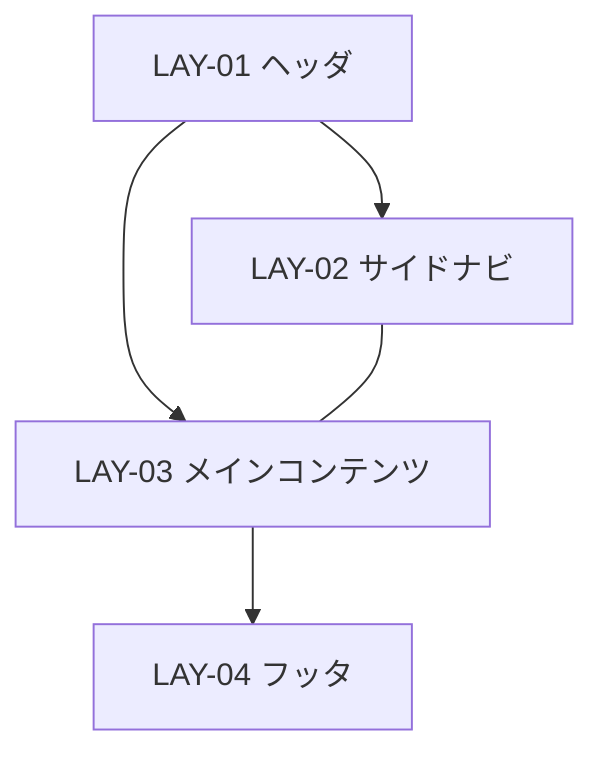

# 画面詳細設計: UI-NNN {{画面名}}

本ドキュメントは画面詳細設計のテンプレートである。`docs/design/screen/UI-NNN-{slug}/screen.md` として配置し、各章を埋める。章の順序は固定（概要 → 静的構造 → 動的構造 → 外部連携 → 多言語 → 注意事項）。

- 対象画面: UI-NNN {{画面名}}
- 対応する UI-NNN: [interface-design.md の該当節](../../interface/interface-design.md#ui-nnn)
- 対応するスタイルガイド: [../style-guide.md](../style-guide.md)
- 作成日 / 最終更新日: YYYY-MM-DD / YYYY-MM-DD
- 版: 0.1（ドラフト）

---

## 1. 画面概要

- **UI-NNN**: UI-NNN {{画面名}}（種別: 画面）
- **画面の目的**: {{1〜2 文}}
- **関連 UC-NNN**: UC-XXX, UC-YYY
- **関連 PER-NNN / SCN-NNN**: PER-001（{{呼称}}）が SCN-003（{{シナリオ名}}）で利用。プライマリペルソナの特性: {{例: 「現場での片手操作・通信不安定・中断再開あり」}}
- **関連 JOB-NNN / FLW-NNN**: JOB-002 の FLW-005 の中間ステップ（起点: UI-001、終点: UI-010）。主経路上にあり中断再開想定 {{あり / なし}}。
- **本画面の主 CTA**: {{1 つ（多くて 2 つ）。例: 「保存して次へ」ボタン（CMP-001 Button / primary）}}
- **関連 UXI-NNN**: UXI-004「{{課題名}}」に対する解消を 6 章 DYN-01 と 7 章で行う。
- **主なアクター・権限**: {{ロール名・業務状態。例: 「編集権限を持つ担当者のみ、下書き状態のレコードに対してのみ編集可能」}}
- **入力・出力項目の参照**: [interface-design.md の UI-NNN 節](../../interface/interface-design.md#ui-nnn) を参照（再掲しない）
- **起動 API の参照**: 同上（API-XXX、API-YYY 等）
- **画面間遷移の参照**: 同上。入口: UI-001, UI-003 / 出口: UI-010（成功）, UI-001（キャンセル）

---

## 2. レイアウト

### 2.1 領域分割



### 2.2 領域一覧

| LAY-NN | 役割 | 主な CMP-NNN | 固定 / スクロール | ブレークポイント変化（詳細は 7 章） |
|---|---|---|---|---|
| LAY-01 | ヘッダ | CMP-XX Header, CMP-XX Breadcrumb | 固定（sticky） | モバイルではハンバーガー化 |
| LAY-02 | サイドナビ | CMP-XX Sidebar | 固定 | モバイルでは非表示（ドロワー化） |
| LAY-03 | メインコンテンツ | CMP-XX Card, CMP-XX FormField |   | カラム数を 12 → 4 に |
| LAY-04 | フッタ | CMP-XX Button (primary, secondary) | 固定（sticky bottom） | ボタンを縦積みに |

画面固有のカスタム配置がある場合はここに追記する。スタイルガイドの `CMP-NNN` に無いものは、複数画面で再利用性があれば昇格候補として 10.3 に記録する。

---

## 3. コンポーネント配置

| # | LAY | CMP-NNN (バリアント・サイズ) | 表示条件 | 紐付く項目 / API | 備考 |
|---|---|---|---|---|---|
| 1 | LAY-01 | CMP-XX Header | 常時 | - |   |
| 2 | LAY-01 | CMP-XX Breadcrumb | 常時 | - |   |
| 3 | LAY-02 | CMP-XX Sidebar | 常時 | - |   |
| 4 | LAY-03 | CMP-XX FormField (TextField / md) | 常時 | 入力項目 XXX (VR-NNN) |   |
| 5 | LAY-03 | CMP-XX FormField (Select / md) | 常時 | 入力項目 YYY (VR-NNN) | 選択肢は API-ZZZ から取得 |
| 6 | LAY-03 | CMP-XX FormField (TextArea / md) | 入力項目 XXX が「その他」の場合 | 入力項目 XXX-other | 条件は 6 章 DYN-01 参照 |
| 7 | LAY-03 | CMP-XX Card | ST-04 正常時のみ | - |   |
| 8 | LAY-04 | CMP-001 Button (primary, md) | 常時 | イベント→ API-XXX |   |
| 9 | LAY-04 | CMP-001 Button (ghost, md) | 常時 | キャンセル遷移 |   |
| 10 | LAY-04 | CMP-001 Button (danger, md) | 所有者権限のみ | イベント→ API-DELETE | 5 章 権限差分参照 |

---

## 4. 画面状態一覧（ST-NN）

本章は HCD の `FB-NNN`（フィードバック方針）を画面上の具体表現に落とす。

| ST-NN | 状態名 | 発生契機 | 対応 FB-NNN | 応答時間区分 | 見え方 | メッセージ種別 | ユーザーの次操作 |
|---|---|---|---|---|---|---|---|
| ST-01 | 初期 | 初期描画 | FB-001 | 瞬時 | LAY-03 にスケルトン（3 行）、LAY-04 ボタンは disabled | - | 待機 |
| ST-02 | 読込中（初回） | API-XXX 応答待ち | FB-002 | 短時間 | LAY-03 にスケルトン継続 | - | 待機 |
| ST-03 | 空（データなし） | API-XXX が空配列を返した | - | - | Empty State（「まだデータがありません」+ CTA「新規作成」 / フィルタ 0 件時は「フィルタを外す」） | 情報 | CTA を押す |
| ST-04 | 正常表示 | API-XXX が成功 | - | - | LAY-03 にデータ表示、LAY-04 ボタン活性 | - | 編集 / 保存 / キャンセル |
| ST-05 | サブミット中 | primary ボタン押下後 | FB-003 | 短時間〜長時間 | primary ボタンに Spinner 内蔵、全フォームを readonly 相当に | - | 待機 |
| ST-06 | サブミット成功 | API-ZZZ が成功 | FB-004 | 瞬時 | Toast「保存しました」、UI-010 へ遷移 | 成功 | 遷移後の次画面操作 |
| ST-07 | 部分エラー | 一部項目でバリデーション失敗 | FB-005 | 瞬時 | 該当 FormField に inline エラー表示、primary ボタン disabled | エラー | 該当項目修正 |
| ST-08 | 致命エラー | API 側エラー（500 / タイムアウト） | FB-006 | 短時間〜長時間 | ページ全体に Alert、「再試行」ボタン | エラー | 再試行 / 戻る |
| ST-09 | 無権限 | 認可チェックで 403 | FB-007 | 瞬時 | 「閲覧権限がありません」ガード画面、管理者連絡 CTA | エラー | 戻る / 連絡 |
| ST-10 | 破壊的操作確認 | 削除ボタン押下 | FB-008 | 瞬時 | CMP-XX Modal で「本当に削除しますか？」、primary ボタン色は danger | 警告 | 確認 / キャンセル |

### 4.1 状態遷移図

```mermaid
stateDiagram-v2
    [*] --> ST-01
    ST-01 --> ST-02: 初期描画
    ST-02 --> ST-03: 空
    ST-02 --> ST-04: 成功
    ST-02 --> ST-08: API エラー
    ST-04 --> ST-07: 入力エラー
    ST-07 --> ST-04: 修正済
    ST-04 --> ST-05: サブミット
    ST-05 --> ST-06: 成功
    ST-05 --> ST-07: バリデーションエラー
    ST-05 --> ST-08: API エラー
    ST-06 --> [*]
    ST-04 --> ST-10: 削除ボタン
    ST-10 --> ST-05: 確認
    ST-10 --> ST-04: キャンセル
```

---

## 5. 権限別表示差分

| 権限条件 | 表示 LAY | 非表示 LAY | 操作不可項目 / CMP | 代替表示 | 由来 |
|---|---|---|---|---|---|
| 読取専用ロール | LAY-01, LAY-02, LAY-03 | LAY-04（編集用ボタン） | 全 FormField を readonly | フォームの代わりに静的表示 | UC-XXX 事前条件 |
| 所有者以外 | LAY-01 〜 LAY-04 | - | 削除ボタン（#10）を非表示 | - | RULE-YYY（所有権制約） |
| 確定済み状態 | 全領域 | - | 全 FormField を readonly、削除ボタンを非表示 | 静的表示 + 「この状態では編集できません」バナー | RULE-ZZZ（状態遷移制約） |
| 他テナント | - | 全て | - | 「見つかりません」を返す（ST-09 ではなく 404 扱い。情報漏洩抑止） | セキュリティ方針 |

**無権限と存在しないの表示切替方針**: 同一テナント内での権限不足は ST-09（無権限）で明示、テナント境界を越えた場合は「存在しない」として 404 扱い。

**動的な権限変化**: セッション中に権限剥奪された場合、次の API 呼出で 401/403 が返るため、グローバルハンドラが再ログイン誘導 or 画面ロックを出す（I/F 側で決められた方針に従う）。

---

## 6. フォーム動的挙動

| DYN-NN | トリガ項目 | 対象項目 | 挙動 | 発火タイミング | 依存する業務条件 |
|---|---|---|---|---|---|
| DYN-01 | 入力項目 XXX | 入力項目 XXX-other | XXX が「その他」選択時に XXX-other を表示・必須化 | onChange | VR-NNN（条件付き必須） |
| DYN-02 | 入力項目 AMOUNT, TAX_RATE | 入力項目 TOTAL | TOTAL = AMOUNT × (1 + TAX_RATE) を自動計算、ユーザー編集不可 | onChange（debounced 300ms） | BRU-NNN |
| DYN-03 | 入力項目 COUNTRY | 入力項目 PREFECTURE | COUNTRY が日本以外なら PREFECTURE を非表示・任意化 | onChange | - |
| DYN-04 | 入力項目 EMAIL | - | 形式チェック（VR-NNN）、エラー時に inline メッセージ | onBlur | VR-NNN |

**サブミット時の挙動**:
- primary ボタンは全必須項目が埋まるまで disabled。
- 二重送信防止: クリック直後に disabled、ST-05 遷移。
- バリデーション失敗時: ST-07 へ、該当項目にスクロール。

---

## 7. レスポンシブ挙動

| ブレークポイント | 想定端末 | LAY 挙動 | ナビ変形 | テーブル変形 |
|---|---|---|---|---|
| bp.sm (〜640) | スマホ縦 | LAY-02 非表示（ハンバーガー化）、LAY-03 は 1 カラム、LAY-04 のボタンは縦積み・full width | ハンバーガー → Drawer | カード形式に変換 |
| bp.md (640〜1024) | スマホ横 / 小タブレット | LAY-02 は折り畳み可能、LAY-03 は 2 カラム |   | 重要列のみ表示 |
| bp.lg (1024〜1280) | タブレット | LAY-02 常時表示、LAY-03 は 2 カラム |   | 全列表示 |
| bp.xl (1280〜1536) | デスクトップ | 既定レイアウト |   | 全列表示 + ピン留め |
| bp.2xl (1536〜) | 広幅デスクトップ | LAY-03 の最大幅を制限（読みやすさ優先） |   |   |

**崩してはいけないもの**: 画面タイトル、主 CTA（primary ボタン）、現在のフロー位置表示（Breadcrumb）は全ブレークポイントで視界に入ること。

**特殊ケース**: 縦向き iPad のキーボード表示時、LAY-04 のボタン行が画面外に押し出されないよう、キーボード表示時は LAY-04 を float に切り替える。

---

## 8. イベントと画面遷移

| イベント | トリガ条件 | 起動 API | API 呼出中 | 成功時 | 失敗時 | 確認モーダル |
|---|---|---|---|---|---|---|
| primary ボタン押下 | 全必須項目埋まり & VR 通過 | API-XXX | ST-05 | ST-06 → UI-010 へ遷移 | ST-07 or ST-08 | なし（破壊的でない） |
| ghost ボタン押下（キャンセル） | 常時 | - | - | UI-001 へ戻る | - | フォームに変更あれば「保存せずに戻る？」 |
| danger ボタン押下（削除） | 所有者 & 編集可状態 | API-DELETE | ST-05 | Toast「削除しました」→ UI-001 へ | ST-08 | ST-10（必須） |
| Breadcrumb のリンク押下 | 常時 | - | - | 対応画面へ遷移 | - | フォームに変更あれば「保存せずに戻る？」 |

**非同期完了通知**: 本画面では非同期処理はなし（該当時は「エクスポート要求→完了後にベル通知バッジ」等を記述）。

**遷移元・遷移先**:
- 入口: UI-001（一覧画面からの編集）/ UI-003（検索結果からの詳細編集）
- 出口: UI-010（保存成功）/ UI-001（キャンセル・削除）

**モーダル・ドロワー**: ST-10 の確認モーダル（CMP-XX Modal）は 8 章のイベント表で管理。

---

## 9. 多言語・テキスト長変動方針

- **想定言語**: 日本語（主）・英語。変動倍率: 英語基準で日本語 ×1.3。
- **長文時の挙動**:
  - ボタンラベル: 幅可変（折返しなし）、長すぎる場合は省略 + ツールチップ。
  - FormField ラベル: 幅固定で折返し許容（最大 2 行）。
  - Breadcrumb: パンくずが多い場合は中間を省略（`...`）。
- **テキスト方向**: RTL 非対応（対応時は全 LAY を左右反転、アイコン向きも反転）。
- **数値・通貨・日付の書式**: ロケールに従う（例: 日本語では `2026/04/23`・`¥1,234`、英語では `Apr 23, 2026`・`$1,234.00`）。

---

## 10. 注意事項

### 10.1 リスク・懸念点

| RISK-NNN | 内容 | 影響範囲 | 顕在化条件 | 暫定対応 | 実装・QA への申し送り |
|---|---|---|---|---|---|
| RISK-001 |   |   |   |   |   |
| RISK-002 |   |   |   |   |   |

### 10.2 代替案と採らない理由

| ALT-NNN | 対象判断 | 代替案概要 | 採らない理由 | 再検討条件 |
|---|---|---|---|---|
| ALT-001 | レイアウト骨格 | サイドバーなし（全幅メイン） |   |   |
| ALT-002 | ローディング表現 | スケルトン vs スピナー vs 楽観的更新 |   |   |
| ALT-003 | エラーの出し方 | モーダル vs インライン vs トースト |   |   |
| ALT-004 | サブミット後挙動 | 同画面に残る vs 一覧へ戻る vs 詳細へ遷移 |   |   |
| ALT-005 | 確認モーダル採否 | すべての破壊操作で採る vs undo 可能操作では省略 |   |   |
| ALT-006 | モバイル時のテーブル | 横スクロール vs カード化 vs 列省略 |   |   |

### 10.3 後続工程への申し送り事項

**実装への申し送り**:

| HO-I-NNN | 内容 | 想定選択肢 | 決定責任者 | 相談先 |
|---|---|---|---|---|
| HO-I-001 | 画面固有の微調整値をトークン化するか | する / しない |   |   |
| HO-I-002 | 状態管理ストア構造 | グローバル / 画面ローカル |   |   |
| HO-I-003 | URL 設計 | クエリパラメータ / パスパラメータ |   |   |
| HO-I-004 | データ取得戦略 | SSR / CSR / ISR / SWR |   |   |

**QA・テスト設計への申し送り**:

| HO-T-NNN | 内容 | 想定選択肢 | 決定責任者 | 相談先 |
|---|---|---|---|---|
| HO-T-001 | 各 ST-NN のビジュアルリグレッション対象 |   |   |   |
| HO-T-002 | 権限差分の網羅テスト |   |   |   |
| HO-T-003 | フォーム動的挙動のインタラクションテスト |   |   |   |
| HO-T-004 | アクセシビリティ（スクリーンリーダー・キーボード操作）検証 |   |   |   |
| HO-T-005 | レスポンシブ検証対象ブレークポイント |   |   |   |

**スタイルガイドへの昇格候補**:

| CAN-NNN | パターン概要 | 本画面での使用箇所 | 再利用可能性 | 昇格時の CMP 候補名 |
|---|---|---|---|---|
| CAN-001 |   |   |   |   |

**HCD / UI・UX 設計への逆流候補**:

| HO-U-NNN | 内容 | 逆流理由 | 相談先 |
|---|---|---|---|
| HO-U-001 |   |   |   |
