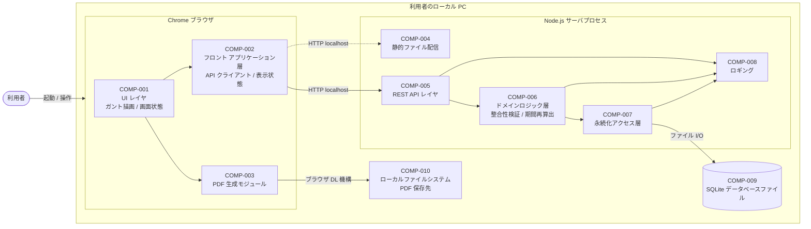
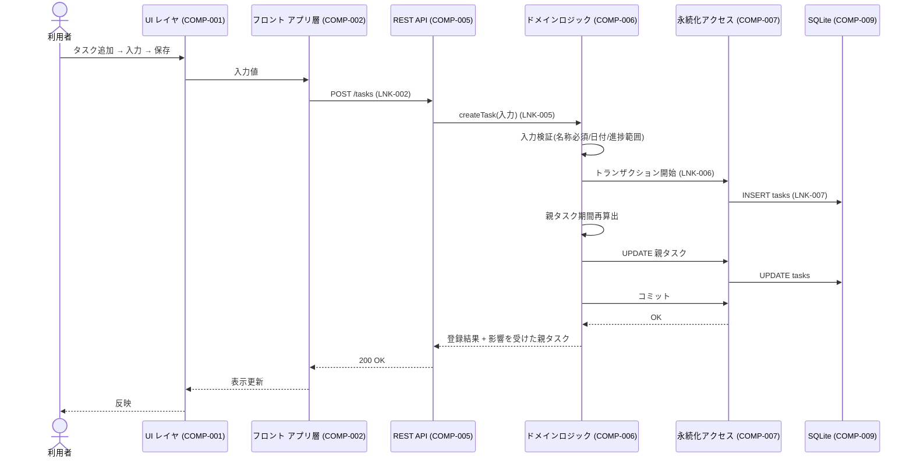
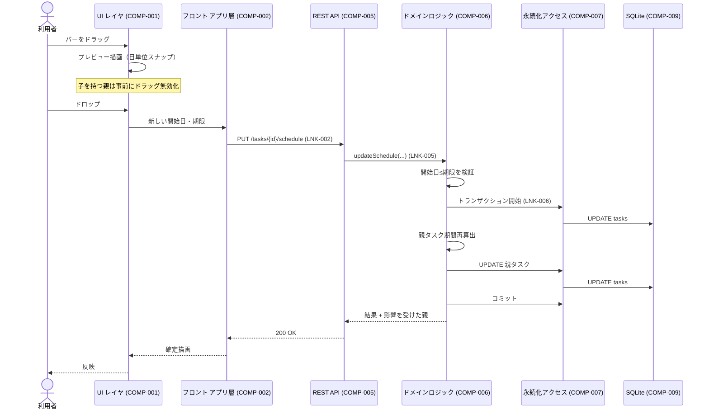
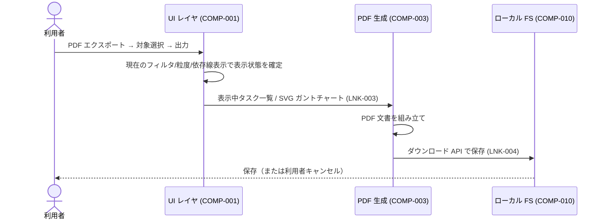

# アーキテクチャ設計書

本ドキュメントは、要件定義書（[`docs/requirements/functional.md`](../../requirements/functional.md) / `docs/requirements/usecase/` / [`docs/requirements/non-functional.md`](../../requirements/non-functional.md)）に基づき、基本設計の起点となる論理構成を整理する。物理配置・ネットワーク構成・具体クラウドサービスの選定はインフラ設計工程の対象とするが、本システムは NFR-004 によりローカル PC 上のスタンドアロン Web アプリと確定しており、インフラ設計工程はスキップ（[`docs/requirements/design-plan.md`](../../requirements/design-plan.md)）となっているため、対応する論点は本ドキュメントで最小限言及するに留める。

- 対象システム名: WBS / ガントチャート管理ツール（ローカル Web アプリ）
- 対応する要件定義書: [`docs/requirements/functional.md`](../../requirements/functional.md) / [`docs/requirements/usecase/`](../../requirements/usecase/) / [`docs/requirements/non-functional.md`](../../requirements/non-functional.md)
- 作成日 / 最終更新日: 2026-05-19 / 2026-05-19
- 版: 0.1（ドラフト）

---

## 1. 構成概要

### 1.1 システム全体の要約

本システムは、利用者のローカル PC 上で動作するスタンドアロン Web アプリケーションである。利用者は Chrome（macOS）からローカルホスト経由で本アプリにアクセスし、プロジェクトとタスク（親子・依存関係を含む）を管理する。フロントエンドはガントチャートを SVG で自前描画し、PDF 出力もブラウザ内で生成する。バックエンドは単一の Node.js プロセスで起動し、静的フロントの配信と REST API の提供、および SQLite ファイルへの永続化を担う。マルチユーザー利用・ネットワーク越し利用・外部システム連携は要件外であり、認証認可・通信暗号化・外部 SaaS 連携は本構成では持たない。

主な設計方針:

- **単一プロセスのモノリス**: 1 台の PC・1 プロセスで完結。フロント配信 / API / 永続化を 1 つの Node.js プロセスに同居させる。
- **クライアントリッチ・サーバ薄型**: ガントチャートの描画・編集・PDF 生成はブラウザ側で完結させ、バックエンドは CRUD と整合性検証（循環参照防止・親期間再算出など）に専念する。
- **同期完結 / 非同期境界なし**: 単一プロセスかつ単一利用者のため、キュー・ワーカー・イベント駆動は導入しない。すべての応答時間に書き込み完了までを含める。

### 1.2 コンポーネント配置図（論理）

論理的な責務配置のみを示す。インフラ境界（リージョン / AZ / VPC / 公開網・ファイアウォール）は本システムには存在しない（ローカル PC 完結）。

### 1.3 スコープと前提

- スコープ内:
  - ローカル PC（macOS）上のスタンドアロン Web アプリ（UC-001〜UC-009 全て）
  - フロント / バックエンド / SQLite を 1 台で完結
  - PDF 出力（タスク一覧 / ガントチャート）はブラウザ側で生成
- スコープ外 / 非対応:
  - ユーザー認証・認可・権限管理（要件で「含まない」と明記）
  - マルチユーザー同時編集
  - ネットワーク越しの利用、外部システム連携
  - 既存システムからのデータ移行
  - 通信暗号化（localhost 内のため対象外）
  - 高可用性・冗長化・バックアップ自動化（OS 機能に委ねる）
- 前提（要件・環境・既存資産）:
  - 動作環境: Chrome 最新版 × macOS（最新および 1 つ前のメジャー）× 1280×720 以上（NFR-003）
  - 規模: 1 プロジェクト最大 500 タスク・1,000 依存関係（NFR-002）
  - データストアは SQLite ファイル 1 個に全プロジェクトを格納する（[`design-plan.md`](../../requirements/design-plan.md) 申し送り 8 への回答）
  - 利用者は技術的素養のある単独ユーザーであり、ローカルサーバの起動操作（コマンド / ショートカット実行）を許容する

---

## 2. 構成要素一覧

| COMP-ID  | 名称                        | 区分         | 主な責務（何をする / 何をしない）                                                                                                                                                                                                                                                                                                                           | 実行レイヤ                                 | 関連 UC・NFR・UI                                 |
| -------- | --------------------------- | ------------ | ----------------------------------------------------------------------------------------------------------------------------------------------------------------------------------------------------------------------------------------------------------------------------------------------------------------------------------------------------------- | ------------------------------------------ | ------------------------------------------------ |
| COMP-001 | UI レイヤ（ビュー）         | クライアント | 画面（UI-001〜UI-007）の描画、ガントチャート（SVG）の描画、ユーザー操作の受付を担う。整合性検証や永続化はここでは行わず COMP-002 / COMP-005 / COMP-006 に委譲する。                                                                                                                                                                                         | 利用者端末（ブラウザ）                     | UC-001〜UC-009, UI-001〜UI-007, NFR-001, NFR-003 |
| COMP-002 | フロント アプリケーション層 | クライアント | 画面状態管理、API クライアント、表示用のフィルタ・整列ロジック、ドラッグ&ドロップの一次受付を担う。データの正本管理はここでは行わずサーバ側を正本とする。サーバ側の整合性検証結果に従い表示を確定する。                                                                                                                                                     | 利用者端末（ブラウザ）                     | UC-001〜UC-009, NFR-001                          |
| COMP-003 | PDF 生成モジュール          | クライアント | タスク一覧（UI-008）・ガントチャート（UI-009）の PDF 生成を担う。生成後の保存はブラウザのダウンロード機構に委ね、自前で書き込み API を呼ばない。                                                                                                                                                                                                            | 利用者端末（ブラウザ）                     | UC-009, UI-007〜UI-009                           |
| COMP-004 | 静的ファイル配信            | API          | フロントエンドのビルド成果物（HTML / JS / CSS / アセット）を localhost 上に配信する。動的処理は持たない。                                                                                                                                                                                                                                                   | サーバサイド（Node.js プロセス）           | NFR-003, NFR-004                                 |
| COMP-005 | REST API レイヤ             | API          | クライアントからの HTTP リクエストを受け、入力の表層検証・ルーティング・COMP-006 への委譲・レスポンス整形を担う。業務ルール（循環検出・期間再算出など）はここでは持たず COMP-006 に委譲する。                                                                                                                                                               | サーバサイド（Node.js プロセス）           | UC-001〜UC-009, NFR-001                          |
| COMP-006 | ドメインロジック層          | API          | プロジェクト / タスク / 依存関係の不変条件を司る。具体的には、(a) タスク名必須、(b) 開始日 ≤ 期限、(c) 進捗 0〜100%、(d) 親子の循環参照防止、(e) 依存関係の循環防止・自己依存禁止・重複禁止、(f) 親タスク期間（開始日 = 子の最小開始日、期限 = 子の最大期限）の再算出、(g) 削除時の子の昇格と依存関係の連動削除、を担う。SQL 構文や HTTP の知識は持たない。 | サーバサイド（Node.js プロセス）           | UC-002〜UC-005, UC-007, NFR-002                  |
| COMP-007 | 永続化アクセス層            | API          | SQLite に対する CRUD と単一トランザクション境界の管理を担う。業務ルールは持たない（COMP-006 で集約）。                                                                                                                                                                                                                                                      | サーバサイド（Node.js プロセス）           | UC-001〜UC-009, NFR-002, NFR-004                 |
| COMP-008 | ロギング                    | API          | アプリケーションログ（操作ログ・エラーログ）を標準出力およびローカルログファイルに書き出す。監視基盤への連携・ローテーション運用は持たない（ローカル単独利用のため）。                                                                                                                                                                                      | サーバサイド（Node.js プロセス）           | NFR-004                                          |
| COMP-009 | SQLite データベースファイル | DB           | プロジェクト・タスク・依存関係を永続化する単一の SQLite ファイル。全プロジェクトを 1 ファイルに格納する。                                                                                                                                                                                                                                                   | データストア層（ローカルファイルシステム） | UC-001〜UC-009, NFR-002, NFR-004                 |
| COMP-010 | ローカルファイルシステム    | データストア | 生成された PDF の保存先。ブラウザのダウンロード機構を経由してアクセスされ、アプリは直接書き込まない。                                                                                                                                                                                                                                                       | データストア層（ローカルファイルシステム） | UC-009                                           |

メモ:

- 単一利用者・単一プロセス前提のため、認証コンポーネント・キャッシュ・メッセージング・外部サービスは持たない（要件で含まないと明記、または規模上不要）。
- バックエンドの内部分割（API / ドメイン / DAO）はモノリス内のレイヤ分割であり、別プロセスではない。**コンポーネント設計工程はスキップ**（[`design-plan.md`](../../requirements/design-plan.md)）されているため、本書での「区分: API」の内部レイヤ分割はそのまま実装に引き継ぐ。
- 監視基盤・ログ基盤製品の選定はインフラ設計工程の対象だが、本システムは NFR-004 によりインフラ設計工程をスキップしているため、ローカル標準出力・ローカルファイル書き出しの方針を本書で確定する。

---

## 3. 主要な通信・連携

### 3.1 リンク一覧

外部システム連携は要件外のため、すべてローカル PC 内部のリンクのみとなる。プロトコル列の「HTTP(localhost)」はネットワーク越しではないことを明示するための表記。

| LNK-ID  | 発側 COMP                      | 受側 COMP | 契機                           | プロトコル                          | 同期/非同期 | 失敗時の扱い                                                                                | 関連 UC・UI            |
| ------- | ------------------------------ | --------- | ------------------------------ | ----------------------------------- | ----------- | ------------------------------------------------------------------------------------------- | ---------------------- |
| LNK-001 | COMP-002                       | COMP-004  | 起動時・画面遷移時             | HTTP(localhost) GET                 | 同期        | ブラウザがエラー表示。利用者は再読込で復旧                                                  | 全 UC, UI-001〜UI-007  |
| LNK-002 | COMP-002                       | COMP-005  | 利用者操作（CRUD・フィルタ等） | HTTP(localhost) REST                | 同期        | エラー応答を画面にエラーメッセージとして表示。状態は操作前を維持                            | UC-001〜UC-009         |
| LNK-003 | COMP-001                       | COMP-003  | 利用者が PDF 出力を実行        | 関数呼び出し（ブラウザ内）          | 同期        | 生成失敗時は UC-009 例外フローに従いエラーメッセージ表示・ファイル未生成                    | UC-009, UI-007〜UI-009 |
| LNK-004 | COMP-003                       | COMP-010  | PDF 生成完了                   | ブラウザのダウンロード API          | 同期        | 利用者によるキャンセル / 書き込み失敗時はブラウザ側で通知（アプリは関知しない）             | UC-009                 |
| LNK-005 | COMP-005                       | COMP-006  | API 受信                       | 関数呼び出し（プロセス内）          | 同期        | ドメイン例外を捕捉し、API レスポンスとして 4xx を返す                                       | UC-001〜UC-009         |
| LNK-006 | COMP-006                       | COMP-007  | ドメインロジック実行           | 関数呼び出し（プロセス内）          | 同期        | SQLite 例外（書き込み失敗・ロック等）を捕捉し、トランザクションをロールバックして上位に伝搬 | UC-001〜UC-009         |
| LNK-007 | COMP-007                       | COMP-009  | DAO 実行                       | ファイル I/O（SQLite ドライバ経由） | 同期        | I/O 例外は上位へ伝搬し、API は 5xx を返す。書き込み中の致命的失敗は再起動で復旧（OS 任せ）  | UC-001〜UC-009         |
| LNK-008 | COMP-005 / COMP-006 / COMP-007 | COMP-008  | 任意（操作・例外発生時）       | 関数呼び出し（プロセス内）          | 同期        | ロギング自体の失敗は無視し、業務処理に影響させない                                          | NFR-004                |

### 3.2 主要ユースケースのフロー

UC のうち、コンポーネント境界をまたいで非自明な順序がある 3 件を図示する。要件定義書のシーケンスとは粒度（クライアント / API / ドメイン / DAO の分解）が異なるが、矛盾はない。

#### UC-002 タスクを登録する

#### UC-007 ガントチャート上でタスク期間を変更する

#### UC-009 PDF エクスポート

サーバへの API 呼び出しは PDF 出力経路には含まれない（生成はクライアント完結）。タスクが 0 件の場合は V 層で例外フローに分岐し、生成自体を抑止する。

### 3.3 同期 / 非同期境界の方針

- **ユーザ応答時間に含める区間**: 利用者操作から SQLite への書き込み完了 → API レスポンス → 画面再描画まで、すべて同期に含める。NFR-001 の「操作後 1 秒以内」「初期描画 2 秒以内」はこの全区間で達成する。
- **非同期化する区間**: なし。単一プロセス・単一利用者のためキューやワーカーは導入しない。
- **最悪ケースの遅延許容上限**: NFR-001 に従う（初期描画 2 秒以内、操作後再描画 1 秒以内）。500 タスク / 1,000 依存関係（NFR-002）規模で達成する。
- **PDF 生成**: 同期 UI 上の処理だが、データ量によっては数秒オーダーとなるためフロント側でローディング表示を出し、利用者をブロックしない UX とする（詳細は HCD / UI 設計工程）。

---

## 4. 採用理由

要件 ID と紐付けて主要判断の根拠を整理する。

- **単一の Node.js プロセス（フロント配信 + REST API + SQLite アクセス）を採用**
  - 紐付く要件: NFR-004（ローカル PC 上で動作する Web アプリ）、NFR-003（Chrome × macOS）、UC-001〜UC-009 全般
  - 根拠: 動作環境がローカル PC 1 台に限定され、ネットワーク越し利用・マルチユーザーは要件外。プロセス分割（フロント配信と API 別プロセス）は CORS / ポート管理 / 起動手順の複雑化を招き、要件で正当化できない。Tauri / Electron 等の組込みランタイムは「Chrome 限定」という対応環境要件と矛盾する（同梱 Chromium と利用者の Chrome が二重になる）。
- **データストアに SQLite を採用し、全プロジェクトを単一ファイルに格納**
  - 紐付く要件: NFR-004（SQLite を使用、ローカル配置）、UC-001（プロジェクト一覧表示）、NFR-002（500 タスク・1,000 依存関係）
  - 根拠: SQLite は NFR-004 で確定済み。単一ファイル方式は「プロジェクト一覧」（UC-001）取得時にフォルダ走査が不要で起動・切替がシンプルになる。500 タスク × N プロジェクト規模では性能上の問題はない。バックアップは OS 機能で 1 ファイルをコピーすればよく、利用者の運用負荷も小さい。
- **認証認可コンポーネントを持たない**
  - 紐付く要件: 機能要件 スコープ外（「ユーザー管理（認証・認可・権限）は含まない」）、NFR-003（デスクトップ PC）
  - 根拠: 要件で明示的にスコープ外。ローカル PC 上で単独利用者が動かす前提のため、認証認可を導入する正当化要件がない。利用者識別が必要なフィールド（タスクの「担当者」）はフリーテキストで保持し、認証主体ではない（UC-002 / UC-003）。
- **ガントチャートを SVG で自前描画し、PDF もクライアント生成**
  - 紐付く要件: UC-006（表示粒度切替・依存線表示切替・期限超過の視覚化）、UC-007（ドラッグ&ドロップで期間変更）、UC-009（PDF エクスポート）、NFR-001（再描画 1 秒以内）
  - 根拠: UC-006 / UC-007 は依存線表示切替・期限超過の色変え・粒度切替・1 日単位スナップなど、表現とインタラクションのカスタマイズ要件が密。既存ライブラリは挙動の自由度に制約があり要件に追従しづらい。500 タスク規模なら SVG の自前描画で NFR-001 を満たせる。PDF をクライアント側（jsPDF 等）で生成することで、画面表示状態（SVG）をそのままベクター出力でき、サーバに Puppeteer / Chromium を同梱する必要がなく単一プロセスのシンプルさを保てる。
- **バックエンドを REST API（プレゼンテーション / ドメイン / DAO のレイヤ分割）に統一**
  - 紐付く要件: UC-002〜UC-005, UC-007 のドメインロジック（循環防止・期間再算出・削除時の昇格と連動削除）、[`design-plan.md`](../../requirements/design-plan.md)（クラス設計を簡略実施・コンポーネント設計はスキップ）
  - 根拠: ドメインロジック（循環参照防止・親期間再算出・依存関係の不変条件）に業務性があるため、クライアント単独で完結させると整合性が脆くなる。バックエンドを正本とすることでフロントは表示と一次受付に専念でき、不変条件の集中管理が可能。コンポーネント設計工程をスキップしている関係で、レイヤ分割はアーキ設計書で決め切る必要があり、本書で確定させる。
- **同期完結（非同期キュー・イベント・ワーカーを導入しない）**
  - 紐付く要件: NFR-001（応答時間目標）、NFR-002（規模上限）、機能要件 スコープ外（マルチユーザー同時編集なし）
  - 根拠: 単一利用者・単一プロセス・規模上限 500 タスクのため、書き込み完了までを応答に含めても NFR-001 を達成可能。非同期キューを導入すると「DB に書き込んだ後の通知」「失敗時の再送・冪等性」など二次的な複雑度が増し、要件で正当化できない。
- **ロギングはローカル標準出力 + ローカルファイル（監視基盤連携なし）**
  - 紐付く要件: NFR-004（運用環境・インフラ制約）、機能要件 スコープ外（外部システム連携なし）
  - 根拠: ローカル単独利用かつ SLA 要件・監視要件が要件定義に存在しない。利用者自身が問題切り分けに使う最低限のログがあればよく、外部監視基盤への連携は要件で正当化できない。

---

## 5. 代替案と採らない理由

| ALT-ID  | 対象判断            | 代替案概要                                                                        | 採らない理由                                                                                                                                                                                                                                                                                                                                   | 再検討条件                                                                                   |
| ------- | ------------------- | --------------------------------------------------------------------------------- | ---------------------------------------------------------------------------------------------------------------------------------------------------------------------------------------------------------------------------------------------------------------------------------------------------------------------------------------------- | -------------------------------------------------------------------------------------------- |
| ALT-001 | データストア種別    | NoSQL（ドキュメント DB / KVS など）を採用する                                     | 親子・依存関係・複合キー・参照整合・トランザクション境界が業務上重要で、関係モデルの強みが要件に合致する。NoSQL を選ぶと不変条件（循環参照防止など）の実装コストが増える。NFR-004 で SQLite が確定。                                                                                                                                           | NFR-004 が変更され、かつ「並列利用者が多く部分整合性で十分」となった場合                     |
| ALT-002 | 同期 / 非同期境界   | 書き込みと派生処理（親期間再算出・親への進捗集約等）を非同期キュー経由に分離      | 単一利用者・500 タスク規模では同期完結で NFR-001 を達成可能。キュー導入により失敗時再送・冪等性などの設計負荷が増し、要件で正当化できない。                                                                                                                                                                                                    | マルチユーザー同時編集が要件に追加された場合、または規模が想定の 10 倍以上に拡大した場合     |
| ALT-003 | 認証方式            | 自前 ID / パスワード管理、または外部 IdP 委譲                                     | 要件でスコープ外。導入は機能要件と矛盾する。                                                                                                                                                                                                                                                                                                   | マルチユーザー化または共有 PC 上での識別が要件に追加された場合                               |
| ALT-004 | 機能配置の切り分け  | フロント単独（バックエンドなし、SQLite を sql.js / wa-sqlite でブラウザ内に持つ） | (a) 不変条件をフロント単独で守ると改ざんに対し脆い（個人利用とはいえ整合性破壊で復旧不能なデータ状態になる）、(b) ローカルファイル書き込み API がブラウザの制約上扱いにくい（OPFS / File System Access API は Chrome では使えるが利用者の権限ダイアログ操作を伴う）、(c) ロギング・運用上のシンプルさで Node 側に DAO を持つほうが扱いやすい。 | ブラウザ機能の安定化が進み、起動操作（コマンド実行）を排除する強い要求が出た場合             |
| ALT-005 | 機能配置の切り分け  | Tauri / Electron でデスクトップアプリ配布                                         | NFR-003 で「Chrome 最新版」と環境が確定しているため、Chromium 同梱型ランタイムはブラウザ重複となりサイズ・更新運用コストに見合わない。                                                                                                                                                                                                         | 配布を不特定多数の非技術者に拡大する要件が追加された場合（インストーラの体験価値が出てくる） |
| ALT-006 | PDF 生成側          | サーバ側で Puppeteer / wkhtmltopdf により生成                                     | サーバプロセスに Chromium 等の重い依存が同梱され、ローカル配布のシンプルさを損なう。ガントチャートはクライアント側に SVG として存在するため、これを直接 PDF に貼るほうが情報損失が少ない。                                                                                                                                                     | フォント埋め込みやページレイアウト要件が高度化し、クライアント実装で品質を満たせない場合     |
| ALT-007 | ガントチャート描画  | dhtmlx-gantt / frappe-gantt 等の既存ライブラリ採用                                | UC-006 / UC-007 で要求される、依存線表示切替・期限超過の色変え・粒度切替時の 1 日単位スナップ・親バーのドラッグ抑止など、ライブラリ仕様に縛られたくない挙動が複数ある。500 タスク規模なら自前 SVG で性能・カスタマイズ性とも有利。                                                                                                             | 描画機能が想定以上に肥大化し、自前実装の保守コストがライブラリ採用を上回ると判断された場合   |
| ALT-008 | SQLite ファイル単位 | プロジェクト 1 個につき 1 ファイル                                                | UC-001（プロジェクト一覧表示）の起動時毎にフォルダ走査が必要となり、起動シーケンスが複雑になる。プロジェクト切替時にファイルを開閉する状態管理コストが増える。                                                                                                                                                                                 | 大規模化（プロジェクト数が数百以上）し、単一ファイルでの肥大が問題になった場合               |

メモ:

- インフラ寄りの判断（クラウド / オンプレ、リージョン、具体サービス、冗長化方式、CI/CD・IaC、監視製品）はインフラ設計工程の対象だが、本システムはインフラ設計工程スキップ（[`design-plan.md`](../../requirements/design-plan.md)）のため代替案検討も省略する。

---

## 6. リスク・懸念点

| RISK-ID  | 内容                                                       | 影響範囲                               | 顕在化条件                                                                       | 暫定対応                                                                                                                   | 詳細設計への申し送り                                                                                                |
| -------- | ---------------------------------------------------------- | -------------------------------------- | -------------------------------------------------------------------------------- | -------------------------------------------------------------------------------------------------------------------------- | ------------------------------------------------------------------------------------------------------------------- |
| RISK-001 | ガントチャート描画性能が NFR-001 を侵食する可能性          | COMP-001（UI 層）, UC-006, UC-007      | 500 タスク × 1,000 依存関係で、依存線表示 ON + 月粒度 + フィルタなしの組合せ     | 仮想スクロール / 可視領域のみ描画 / 依存線の遅延描画を採用方針とする。実装後に NFR-001 達成を実測検証                      | 描画戦略（仮想スクロール、依存線のレイヤ分離、再描画の差分最適化）を詳細設計で具体化                                |
| RISK-002 | 親タスク期間・進捗の集約方針が未確定                       | COMP-006（ドメイン層）, UC-002〜UC-007 | 子タスク更新時に親タスクへの集約挙動が複数解釈可能                               | 期間は「子の最小開始日 / 最大期限」、進捗は本書では決め切らずクラス設計工程へ。書き込みは都度再算出方針を採用              | [`design-plan.md`](../../requirements/design-plan.md) 申し送り 4・5 を引き取り、クラス設計工程で確定                |
| RISK-003 | 循環参照検出の性能                                         | COMP-006（ドメイン層）, UC-003, UC-005 | タスク数・依存関係数が NFR-002 上限近くで、繰返し編集時に DFS 計算量が体感に響く | 都度 DFS で実装し、500 タスク規模で NFR-001 達成可能と仮定。逸脱が確認されれば最適化を検討                                 | [`design-plan.md`](../../requirements/design-plan.md) 申し送り 6 を引き取り、クラス設計工程で検出アルゴリズムを確定 |
| RISK-004 | 期限超過判定の基準日が未確定                               | COMP-001 / COMP-002, UC-006            | 利用者が「今日」を任意に変更する操作要求が出た場合に挙動が定義されていない       | 暫定: PC のローカル時刻を基準とする（変更不可）                                                                            | [`design-plan.md`](../../requirements/design-plan.md) 申し送り 7 を引き取り、HCD / 機能設計工程で確定               |
| RISK-005 | フロント正本化リスク（ドラッグ操作の即時反映と楽観的更新） | COMP-002（フロント アプリ層）, UC-007  | ドラッグ後のサーバ検証で失敗した際に画面が確定済み状態を表示する可能性           | サーバ応答までは確定描画を保留し、応答後に確定する方針（楽観的更新は採用しない）                                           | UI の応答性と整合性の両立方針を詳細設計で具体化（ローディング表示・ロールバックパターン）                           |
| RISK-006 | SQLite ファイル破損時の復旧手段                            | COMP-009, 全 UC                        | 強制終了・ストレージ障害等                                                       | 起動時に PRAGMA integrity_check を行い、破損検知時は利用者に通知。バックアップ自動化は持たないため OS 機能でのコピーを案内 | 利用者向け案内・破損検知時の UI 動線を詳細設計 / HCD で確定                                                         |
| RISK-007 | アプリケーション更新時のスキーマ移行                       | COMP-007, COMP-009                     | アプリのバージョン更新でスキーマ変更が発生したとき                               | スキーマバージョン管理テーブルを設け、起動時に未適用の差分マイグレーションを実行する方針とする                             | マイグレーション仕組みの詳細はデータ設計工程で確定                                                                  |
| RISK-008 | ローカルサーバの起動失敗 / ポート競合                      | COMP-004, COMP-005                     | 利用者の PC で既に同ポートが使用中                                               | 既定ポート + 失敗時のフォールバックポート挙動を方針とし、利用者へエラー表示                                                | 起動シーケンス・ポート設定の UX を詳細設計で確定                                                                    |
| RISK-009 | ロギングのファイル肥大化                                   | COMP-008                               | 長期利用時にローカルログファイルが肥大化                                         | 最低限のサイズ上限とローテーション方針（例: 日次 + 直近 N 日保持）を持つ                                                   | ローテーション仕様の数値は詳細設計で確定                                                                            |

リスクの典型カテゴリのうち、本システムでは以下は該当しないか影響軽微:

- 外部サービス障害時のフォールバック（外部サービスを持たない）
- 認証認可の責務境界（認証認可を持たない）
- データ整合性（非同期境界をまたぐ場合）（非同期境界なし）
- 法令・規制適合（データ所在地・保存期間）（ローカル PC で利用者が管理、要件未指定）
- 移行時の新旧並行運用（既存システムからの移行は要件外）

---

## 7. 後続工程への申し送り事項

[`design-plan.md`](../../requirements/design-plan.md) の申し送り事項のうち、本アーキ設計で確定したもの・引き取り先を整理する。

### 7.1 詳細設計（機能 / 画面単位）への申し送り

| ID       | 内容                                                                                                     | 想定選択肢                                                     | 決定責任者 / 相談先      |
| -------- | -------------------------------------------------------------------------------------------------------- | -------------------------------------------------------------- | ------------------------ |
| HO-D-001 | ガントチャート描画最適化（仮想スクロール / 依存線のレイヤ分離 / 差分再描画）                             | 仮想スクロール採用 / 全件描画継続                              | 機能設計 / フロント実装  |
| HO-D-002 | 親タスク期間の自動算出のトリガと粒度（[`design-plan.md`](../../requirements/design-plan.md) 申し送り 4） | (a) 都度算出（永続化しない） / (b) 永続化                      | クラス設計 / データ設計  |
| HO-D-003 | 親タスクの進捗集約有無（[`design-plan.md`](../../requirements/design-plan.md) 申し送り 5）               | (a) 子から自動算出 / (b) 親独自に保持 / (c) 親は進捗を持たない | クラス設計 / HCD         |
| HO-D-004 | 循環参照検出アルゴリズム（[`design-plan.md`](../../requirements/design-plan.md) 申し送り 6）             | (a) 都度 DFS / (b) 推移閉包テーブル維持                        | クラス設計 / データ設計  |
| HO-D-005 | 「期限超過」の判定基準日（[`design-plan.md`](../../requirements/design-plan.md) 申し送り 7）             | (a) PC ローカル時刻固定 / (b) 利用者が基準日を変更可能         | HCD / 機能設計           |
| HO-D-006 | 個別 API 項目仕様（リクエスト / レスポンス DTO）                                                         | -                                                              | インタフェース設計       |
| HO-D-007 | テーブル定義（カラム・型・制約・索引）                                                                   | -                                                              | データ設計               |
| HO-D-008 | UI 詳細（画面項目・状態遷移・エラー表示・ローディング表示）                                              | -                                                              | インタフェース設計 / HCD |
| HO-D-009 | ロギング詳細（出力レベル・フォーマット・ローテーション数値）                                             | -                                                              | 詳細設計                 |
| HO-D-010 | スキーマ移行（マイグレーション）方式                                                                     | (a) 起動時自動適用 / (b) 手動コマンド                          | データ設計               |
| HO-D-011 | ローカルサーバの既定ポート / フォールバック方針                                                          | -                                                              | 詳細設計                 |

### 7.2 インフラ設計への申し送り

[`design-plan.md`](../../requirements/design-plan.md) によりインフラ設計工程はスキップ。物理配置（ローカル PC）・ネットワーク構成（なし）・冗長化（なし）・監視基盤（なし）・CI/CD（要件外）はすべて本構成で完結する。本書には申し送り事項なし。

---

## 8. 要件 ID 対応表（トレーサビリティ）

要件定義書側の主要 ID と本書の COMP-NNN / LNK-NNN の紐付けを一覧化する。チェックリスト「要件定義書との紐付け」の確認結果でもある。

| 要件 ID        | 概要                                   | 主に紐付く COMP                                            | 主に紐付く LNK                              |
| -------------- | -------------------------------------- | ---------------------------------------------------------- | ------------------------------------------- |
| UC-001         | プロジェクトを管理する                 | COMP-001, COMP-002, COMP-005, COMP-006, COMP-007, COMP-009 | LNK-001, LNK-002, LNK-005, LNK-006, LNK-007 |
| UC-002         | タスクを登録する                       | COMP-001, COMP-002, COMP-005, COMP-006, COMP-007, COMP-009 | LNK-002, LNK-005, LNK-006, LNK-007          |
| UC-003         | タスクを編集する                       | COMP-001, COMP-002, COMP-005, COMP-006, COMP-007, COMP-009 | LNK-002, LNK-005, LNK-006, LNK-007          |
| UC-004         | タスクを削除する                       | COMP-001, COMP-002, COMP-005, COMP-006, COMP-007, COMP-009 | LNK-002, LNK-005, LNK-006, LNK-007          |
| UC-005         | タスク間の依存関係を管理する           | COMP-001, COMP-002, COMP-005, COMP-006, COMP-007, COMP-009 | LNK-002, LNK-005, LNK-006, LNK-007          |
| UC-006         | ガントチャートを表示する               | COMP-001, COMP-002, COMP-005, COMP-007, COMP-009           | LNK-001, LNK-002, LNK-005, LNK-006, LNK-007 |
| UC-007         | ガントチャート上でタスク期間を変更する | COMP-001, COMP-002, COMP-005, COMP-006, COMP-007, COMP-009 | LNK-002, LNK-005, LNK-006, LNK-007          |
| UC-008         | タスクをフィルタする                   | COMP-001, COMP-002, COMP-005, COMP-007, COMP-009           | LNK-002, LNK-005, LNK-007                   |
| UC-009         | PDF エクスポート                       | COMP-001, COMP-002, COMP-003, COMP-010                     | LNK-003, LNK-004                            |
| NFR-001        | 画面応答時間                           | COMP-001, COMP-002, COMP-005, COMP-006, COMP-007           | 全 LNK                                      |
| NFR-002        | 同時タスク件数 / 依存関係件数          | COMP-006, COMP-007, COMP-009                               | LNK-006, LNK-007                            |
| NFR-003        | 対応環境                               | COMP-001, COMP-002, COMP-003, COMP-004                     | LNK-001                                     |
| NFR-004        | 運用環境・インフラ制約                 | COMP-004, COMP-005, COMP-007, COMP-008, COMP-009           | 全 LNK                                      |
| UI-001〜UI-007 | 画面                                   | COMP-001                                                   | LNK-001, LNK-002, LNK-003                   |
| UI-008, UI-009 | 帳票（PDF）                            | COMP-003, COMP-010                                         | LNK-003, LNK-004                            |

機能要件のインタフェース要件には SIF / HIF / CIF（システム間 / 人 / 他システム間）は定義されておらず（要件は単一アクター・外部システム連携なし）、本書でも該当リンクは持たない。

---

## 9. 参照ドキュメント

- 要件定義書（機能要件）: [`docs/requirements/functional.md`](../../requirements/functional.md)
- 要件定義書（非機能要件）: [`docs/requirements/non-functional.md`](../../requirements/non-functional.md)
- ユースケース詳細: [`docs/requirements/usecase/`](../../requirements/usecase/)
- 後続設計プラン: [`docs/requirements/design-plan.md`](../../requirements/design-plan.md)
