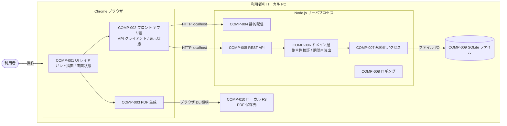
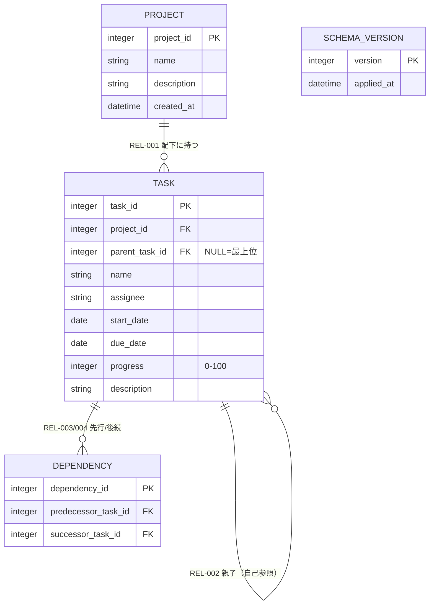

# 基本設計書（収束版）

> 本書は要件定義・アーキテクチャ・データ・インタフェース・クラス各設計書を、意思決定に必要な情報のみに絞り込んで再編した収束版です。詳細は各章末尾のリンク先を参照してください。

- 対象システム名: WBS / ガントチャート管理ツール（ローカル Web アプリ）
- 作成日 / 最終更新日: 2026-05-19 / 2026-05-19
- 版: 0.1（ドラフト・収束版）

---

## 1. 概要

Excel ベースの WBS 管理を置き換える、利用者のローカル PC 上で動作する単独利用者向け Web アプリケーション。プロジェクト・タスク（親子・依存関係を含む）の管理と、ガントチャート表示・PDF エクスポートを提供する。動作環境は Chrome × macOS × 1280×720 以上、データは SQLite ファイル 1 個に格納する。

---

## 2. スコープ

**含むもの**
- プロジェクトの作成・編集・削除・切替（同時に開けるのは 1 つ）
- タスクの CRUD（担当者・期間・進捗・親子・説明）と依存関係の追加・削除
- ガントチャート表示（粒度切替・依存線表示切替・期限超過の視覚化・ドラッグ&ドロップでの期間変更）
- タスクフィルタ（担当者・開始日・期限・親タスク）
- タスク一覧・ガントチャートの PDF エクスポート

**含まないもの**
- ユーザー認証・認可・権限管理、マルチユーザー同時編集
- ネットワーク越しの利用、外部システム連携、既存システムからのデータ移行
- バックアップ自動化（OS 機能に委ねる）

---

## 3. 前提・制約

- **規模**: 1 プロジェクト最大 500 タスク・1,000 依存関係（NFR-002）
- **環境**: Chrome 最新版 × macOS（最新および 1 つ前のメジャー）× 1280×720 以上 × デスクトップ PC（NFR-003）
- **応答性能**: 初期描画 2 秒以内、操作後再描画 1 秒以内（NFR-001）
- **データストア**: SQLite ファイル 1 個に全プロジェクトを格納（NFR-004、アーキ設計確定）
- **利用者**: 技術的素養のある単独利用者。ローカルサーバ起動操作（コマンド実行）を許容
- **要件外**: 通信暗号化、高可用性、冗長化、SLA、監査ログ

---

## 4. 技術スタック / 方針

- **実行形態**: 単一の Node.js プロセスがフロント配信 + REST API + SQLite アクセスを同居（プロセス分割なし、Tauri / Electron 不採用）
- **フロントエンド**: SVG でガントチャートを自前描画、PDF もクライアント側で生成（jsPDF 系を想定）
- **バックエンド**: REST API（プレゼンテーション / ドメイン / DAO の 3 レイヤ）、同期完結
- **データストア**: SQLite。全プロジェクトを単一ファイル、物理 FK 制約 + `PRAGMA foreign_keys = ON`
- **認証**: なし（localhost 限定）
- **同期 / 非同期**: 全 API 同期完結。キュー・ワーカー・イベント駆動なし
- **キー方針**: サロゲートキー（整数 ID）+ 業務的一意性は UK で表現
- **削除方針**: 物理削除（履歴・監査列なし、唯一の例外は ENT-001.created_at）
- **派生値の永続化**: 親タスクの開始日・期限・進捗は **書き込み時に再算出して永続化**（描画コスト低減・描画ロジック単純化のため）

---

## 5. システム構成

論理コンポーネント配置（インフラ境界なし、すべて利用者のローカル PC 内）。

主要判断の根拠:
- **単一プロセス + Chrome 直接利用**: NFR-003 で Chrome 限定。Tauri / Electron は Chromium 重複となり不採用
- **クライアントリッチ / サーバ薄型**: ガント描画・PDF 生成はブラウザ側、バックエンドは CRUD + 整合性検証に専念
- **ガント自前 SVG**: UC-006 / UC-007 のカスタム挙動（依存線切替・色変え・スナップ・親バー抑止）が既存ライブラリ仕様に縛られるため

参照: [アーキテクチャ設計書 §1, §4, §5](architecture/architecture.md)

---

## 6. インフラ設計

**スキップ判定済**。NFR-004 によりローカル PC 上のスタンドアロン Web アプリと確定しており、サーバ冗長化・ネットワーク設計・監視基盤・バックアップ運用・DBMS 製品選定（SQLite で確定）・CI/CD の論点が存在しない。SQLite ファイルの配置場所およびバックアップは利用者が OS 機能で管理する前提（[design-plan.md](../requirements/design-plan.md)）。

---

## 7. コンポーネント設計

**スキップ判定済**。単一プロセスのモノリス構成で、コンポーネント間の物理境界・通信プロトコル・配置差異が存在しないため。アーキテクチャ設計のレイヤ分割（プレゼンテーション / ドメイン / データアクセス）でモジュール責務を整理する（[design-plan.md](../requirements/design-plan.md)）。

| COMP-ID | 名称 | 区分 | 主な責務 |
|---|---|---|---|
| COMP-001 | UI レイヤ | クライアント | 画面描画、ガント SVG、操作受付 |
| COMP-002 | フロント アプリ層 | クライアント | 状態管理、API クライアント、フィルタ・整列 |
| COMP-003 | PDF 生成モジュール | クライアント | タスク一覧 / ガントチャートの PDF 化 |
| COMP-004 | 静的配信 | サーバ | フロント成果物を localhost で配信 |
| COMP-005 | REST API | サーバ | 入力検証・ルーティング・ドメイン委譲・応答整形 |
| COMP-006 | ドメインロジック | サーバ | 不変条件（循環防止・期間再算出・削除波及）を司る |
| COMP-007 | 永続化アクセス | サーバ | SQLite CRUD・トランザクション境界管理 |
| COMP-008 | ロギング | サーバ | 標準出力 + ローカルファイル（外部監視連携なし） |
| COMP-009 | SQLite ファイル | DB | 全プロジェクトの永続化 |
| COMP-010 | ローカル FS | DataStore | PDF 保存先（ブラウザ DL 機構経由） |

参照: [アーキテクチャ設計書 §2, §3](architecture/architecture.md)

---

## 8. データ設計

エンティティは 4 種（ENT-001〜003 は業務、ENT-004 は技術メタ）。物理削除を基本、履歴・監査列は持たない。

重要ポイント:
- **PK 方針**: 全エンティティでサロゲート（整数 ID）採用。依存関係は (predecessor, successor) を UK
- **親派生値の永続化**: 親タスクの `start_date` / `due_date` / `progress` は書き込み時に COMP-006 が再算出して永続化（描画都度の再帰集計を回避、NFR-001 達成マージンを確保）
- **親 progress 集約**: 「子から自動算出」は方針確定、具体式は未決（[第13章 未決事項](#13-未決事項) 参照）
- **削除波及**: プロジェクト削除 → 配下タスク・依存関係を連鎖削除（RULE-012）。タスク削除 → 子の `parent_task_id` を NULL に昇格 + 関与依存関係を連鎖削除（RULE-013）
- **循環参照防止**: 親子（RULE-004）・依存（RULE-007）ともに**都度 DFS** で検出。推移閉包テーブルなどのキャッシュは持たない（500 タスク規模では不要）
- **整合性ルール**: 必須・値域・参照整合性・業務ルールを RULE-001〜013 に集約。違反は「登録拒否 / 自動補正 / 連鎖削除 / NULL 化」のいずれかで明示
- **スキーマ移行**: ENT-004 に適用済バージョンを記録、起動時に未適用差分を順次適用する方針

参照: [データ設計書 §3, §4, §5](data/data-design.md)

---

## 9. インタフェース設計

REST API 13 本（API-001〜013）と UI 9 種（UI-001〜009、画面 7 + 帳票 2）。SIF / HIF / CIF は該当なし（外部システム連携・機器連携・ネットワーク越し利用がない）。

**API 一覧（CRUD）**:

| API-ID | メソッド | 論理パス | 目的 | 関連 UI / UC |
|---|---|---|---|---|
| API-001 | GET | `/projects` | プロジェクト一覧取得 | UI-001 / UC-001 |
| API-002 | POST | `/projects` | プロジェクト作成 | UI-002 / UC-001 |
| API-003 | PUT | `/projects/{id}` | プロジェクト更新 | UI-002 / UC-001 |
| API-004 | DELETE | `/projects/{id}` | プロジェクト削除（連鎖削除件数を返す） | UI-001 / UC-001 |
| API-005 | GET | `/projects/{id}` | プロジェクト詳細取得 | UI-002 / UC-001 |
| API-006 | GET | `/projects/{id}/tasks` | タスク一覧取得（フラット、フィルタなし） | UI-003 / UC-006, UC-008 |
| API-007 | POST | `/projects/{id}/tasks` | タスク作成 | UI-004 / UC-002 |
| API-008 | PUT | `/tasks/{id}` | タスク全項目更新 | UI-004 / UC-003 |
| API-009 | PUT | `/tasks/{id}/schedule` | 開始日・期限のみ更新（ドラッグ専用） | UI-003 / UC-007 |
| API-010 | DELETE | `/tasks/{id}` | タスク削除 | UI-003 / UC-004 |
| API-011 | GET | `/projects/{id}/dependencies` | 依存関係一覧取得 | UI-003, UI-005 / UC-005, UC-006 |
| API-012 | POST | `/projects/{id}/dependencies` | 依存関係 1 件追加 | UI-005 / UC-005 |
| API-013 | DELETE | `/dependencies/{id}` | 依存関係 1 件削除 | UI-005 / UC-005 |

重要ポイント:
- **認証**: 全 API 不要（localhost 限定、要件で認証はスコープ外）
- **同期完結**: 全 API 同期。リトライなし、クライアント側多重押下抑止で対応
- **API-009 を分離する理由**: ドラッグ操作中の意図せぬ他項目上書きを構造的に防ぐ
- **フィルタ・PDF・ガント描画**: サーバ API を呼ばずクライアント側で完結（UC-006/008/009）
- **応答**: 親系統に波及する更新時は `recalculated_ancestors` を返却 → クライアント再描画
- **バリデーション**: 画面（即時 UX 用）+ API（業務正当性最終判断）の二重実施。共通根拠を VR-001〜011 として 1 本化（データ設計 RULE-NNN 由来）
- **エラー応答**: 統一構造（機械可読 ERR-NNN + 人間可読メッセージ + 相関 ID）。HTTP ステータスは粗いシグナル、詳細は本体の ERR-NNN

**エラーカタログ（ERR-NNN）**:

| ERR-ID | 分類 | HTTP | 監査・ログ |
|---|---|---|---|
| ERR-001 | 入力不正（VR 違反） | 400 | INFO |
| ERR-002 | 業務ルール違反（RULE 違反、循環・重複等） | 422 / 409 | INFO |
| ERR-003 | 存在しない | 404 | WARN |
| ERR-004 | クライアント側抑止（API 呼出なし） | − | なし |
| ERR-005 | 永続化失敗（SQLite I/O） | 500 | ERROR + 相関 ID 表示 |
| ERR-006 | システム内部 | 500 | ERROR + 相関 ID 表示 |

参照: [インタフェース設計書 §2, §3, §4, 付録 A](interface/interface-design.md)

---

## 10. 画面設計

**詳細設計工程に委ねる**。本書および上流設計では、UI ごとの**論理仕様**（入力項目・出力項目・画面イベントと起動 API・画面間遷移・想定エラー）までを [インタフェース設計書 §3.1](interface/interface-design.md) に集約済み。ピクセル配置・配色・最終文言・コンポーネント分割・スケルトン UI・ローディング表示等は詳細設計（HO-D-001 / HO-D-003 / HO-D-007 / HO-D-008 / HO-D-009）の対象。

要件側 UI-NNN（参考）:

| UI-ID | 名称 | 種別 | 関連 UC |
|---|---|---|---|
| UI-001 | プロジェクト選択画面 | 画面 | UC-001 |
| UI-002 | プロジェクト編集ダイアログ | 画面 | UC-001 |
| UI-003 | WBS メイン画面（ツリー + ガント + ツールバー） | 画面 | UC-002〜UC-009 |
| UI-004 | タスク編集ダイアログ | 画面 | UC-002, UC-003 |
| UI-005 | 依存関係編集ダイアログ | 画面 | UC-005 |
| UI-006 | フィルタパネル | 画面 | UC-008 |
| UI-007 | PDF エクスポート設定 | 画面 | UC-009 |
| UI-008 | タスク一覧 PDF | 帳票 | UC-009 |
| UI-009 | ガントチャート PDF | 帳票 | UC-009 |

---

## 11. HCD / UIUX

**未着手**。[design-plan.md](../requirements/design-plan.md) で「簡略実施」と判定されているが、現時点で成果物は未作成。利用者は単独ペルソナのため検討量は小さいが、以下の論点が未確定として残る:

- 主要タスクフロー（プロジェクト切替 / タスク登録 / ドラッグでの期間変更 / フィルタ運用 / PDF 出力）
- 期限超過の視覚化方針と基準日の扱い（PC ローカル時刻固定 を暫定方針として採用）
- ドラッグ抑止・読み取り専用化時の利用者への案内方法
- キーボード操作・フォーカス管理・スクリーンリーダ対応（NFR では要求なし、最低限の確保方針のみ確定）
- 削除確認ダイアログの文言と連鎖削除影響の提示

具体化は HCD / UIUX 設計工程（未実施）および詳細設計（HO-D-007 / HO-D-008 / HO-D-009）で行う。

---

## 12. 非機能 / 運用

| 観点 | 内容 | 根拠 |
|---|---|---|
| 応答性能 | 初期描画 2 秒以内、操作後再描画 1 秒以内、500 タスク × 1,000 依存関係まで保証 | NFR-001, NFR-002 |
| 対応環境 | Chrome 最新版 × macOS（最新および 1 つ前）× 1280×720 以上、日本語 | NFR-003 |
| 実行形態 | ローカル PC 単独動作、SQLite ファイル 1 個、ネットワーク越し利用なし | NFR-004 |
| ロギング | 標準出力 + ローカルファイル、INFO / WARN / ERROR の 3 段階、外部監視連携なし | NFR-004 |
| 相関 ID | 全 API 応答に付与。ERR-005 / ERR-006 のときのみ画面に短縮形を表示 | 障害切り分け用途 |
| バックアップ | OS 機能で SQLite ファイルをコピー（利用者運用）。アプリ側で自動化しない | NFR-004 |
| スキーマ移行 | ENT-004 に適用済バージョンを記録。起動時に未適用差分を順次適用（方針） | アーキ RISK-007 |
| 起動失敗対策 | 既定ポート + フォールバックポート、整合性チェック（PRAGMA integrity_check）破損検知時は利用者通知 | アーキ RISK-006, RISK-008 |
| セキュリティ | 認証認可なし（localhost）、SQL インジェクション対策（パラメタライズドクエリ）、XSS 対策（FW エスケープ）、CSRF はトークンなしで Same-Origin / CORS で遮断方針 | 要件 スコープ外 + アプリ責務 |
| 機微情報 | 該当なし（認証情報・個人情報・金額情報を扱わない）。assignee はフリーテキストで認証主体ではない | アーキ採用理由 |

---

## 13. 未決事項

意思決定が必要な論点を **論点単位** に統合した。各上流ドキュメントに散在する HO-D-NNN は本表に集約する。

| 項目 | 内容 | 影響範囲 | 優先度 |
|---|---|---|---|
| OPEN-01 | 親タスクの **progress 集約アルゴリズム**（重み付き平均 / 単純平均 / 完了子数の割合 / 子の最小）。現状は「子から自動算出」のみ確定 | 第8章 / RULE-010, ENT-002.progress, CLS-003, CLS-004, API-007/008 | High |
| OPEN-02 | 親が **子をすべて失った場合の派生値の挙動**（直前値保持 + 編集可能化 / リセット / 利用者確認） | 第8章 / ENT-002, CLS-004, UI-004 | High |
| OPEN-03 | **スキーマ移行（マイグレーション）の実装方式**（起動時自動適用 / 手動コマンド / 起動時検出 + 利用者確認） | 第8章 / ENT-004, アーキ RISK-007 | High |
| OPEN-04 | **日付の物理保存形式**（ISO 8601 文字列 / Unix エポック / Julian Day）。期限超過判定は PC ローカル時刻基準で確定済み | 第8章 / ENT-002.start_date, due_date | Mid |
| OPEN-05 | **UC-008 フィルタの assignee 一致方式**（部分一致暫定 / 前方一致 / 完全一致）と入力正規化（前後空白除去・NFC） | 第9章 / UI-006, ENT-002.assignee | Mid |
| OPEN-06 | **PDF ファイル名規則**（プロジェクト名サニタイズ、日時フォーマット、種別接尾辞、衝突回避） | 第9章 / UI-007, UI-008, UI-009 | Mid |
| OPEN-07 | **ローカルサーバの既定ポート / フォールバック挙動 + フロント API ベース URL の決定方法** | 第5章, 第12章 / COMP-004, COMP-005, UI-001 | Mid |
| OPEN-08 | **API の具体 JSON スキーマ**（フィールド命名規則 snake/camel、バージョニング、相関 ID 形式、CORS / SameSite 設定） | 第9章 / 全 API | Mid |
| OPEN-09 | **API-008 で親タスク直接編集禁止項目**（start_date / due_date / progress）送信時の挙動（無視 / 400 を返す） | 第9章 / API-008, VR-010 | Mid |
| OPEN-10 | **タイムアウト具体秒数**（CRUD 系・タスク一覧取得・連鎖削除を伴う削除系）と **ログレベル / ローテーション数値** | 第9章, 第12章 / 全 API, COMP-008 | Low |
| OPEN-11 | **UI 詳細仕様**（レイアウト、配色、文言、ローディング表示、トースト、削除確認、キーボード操作、アクセシビリティ） | 第10章, 第11章 / UI-001〜009 | Mid |
| OPEN-12 | **HCD / UIUX 設計の実施**（ペルソナ・主要タスクフロー・UX 課題整理） | 第11章 / 全 UI | Mid |
| OPEN-13 | **ガントチャート描画最適化方針**（仮想スクロール / 依存線レイヤ分離 / 差分再描画）。NFR-001 達成のための実装戦略 | 第5章, 第12章 / COMP-001, UC-006, UC-007 | Mid |
| OPEN-14 | **索引戦略**（tasks.project_id, parent_task_id, dependencies.predecessor/successor, フィルタ用複合索引等） | 第8章 / ENT-002, ENT-003 | Low |
| OPEN-15 | **created_at / updated_at の採否拡張**（要件側 ENT-001 の created_at 以外への横展開） | 第8章 / ENT-001〜003 | Low |
| OPEN-16 | **依存関係 API 粒度**（個別 CRUD 維持 / 一括置換 API 追加） | 第9章 / API-012, API-013, UI-005 | Low |

優先度の方針:
- **High**: ロジック / データ整合性に直結し、実装着手前に決め切る必要があるもの
- **Mid**: UX / 利用に影響し、画面・詳細設計の前に決めたいもの
- **Low**: 末端の数値・文言・索引等、実装中の発見で決めても支障が小さいもの

---

## 参照

- 要件定義（機能要件）: [docs/requirements/functional.md](../requirements/functional.md)
- 要件定義（非機能要件）: [docs/requirements/non-functional.md](../requirements/non-functional.md)
- ユースケース詳細: [docs/requirements/usecase/](../requirements/usecase/)
- 後続設計プラン: [docs/requirements/design-plan.md](../requirements/design-plan.md)
- アーキテクチャ設計書: [docs/design/architecture/architecture.md](architecture/architecture.md)
- データ設計書: [docs/design/data/data-design.md](data/data-design.md)
- インタフェース設計書: [docs/design/interface/interface-design.md](interface/interface-design.md)
- クラス設計書（中核クラス簡略版）: [docs/design/class/class-design.md](class/class-design.md)
