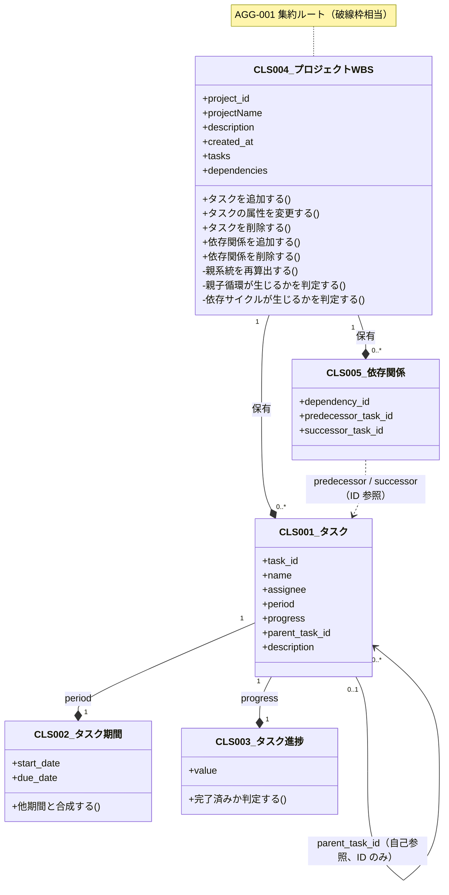
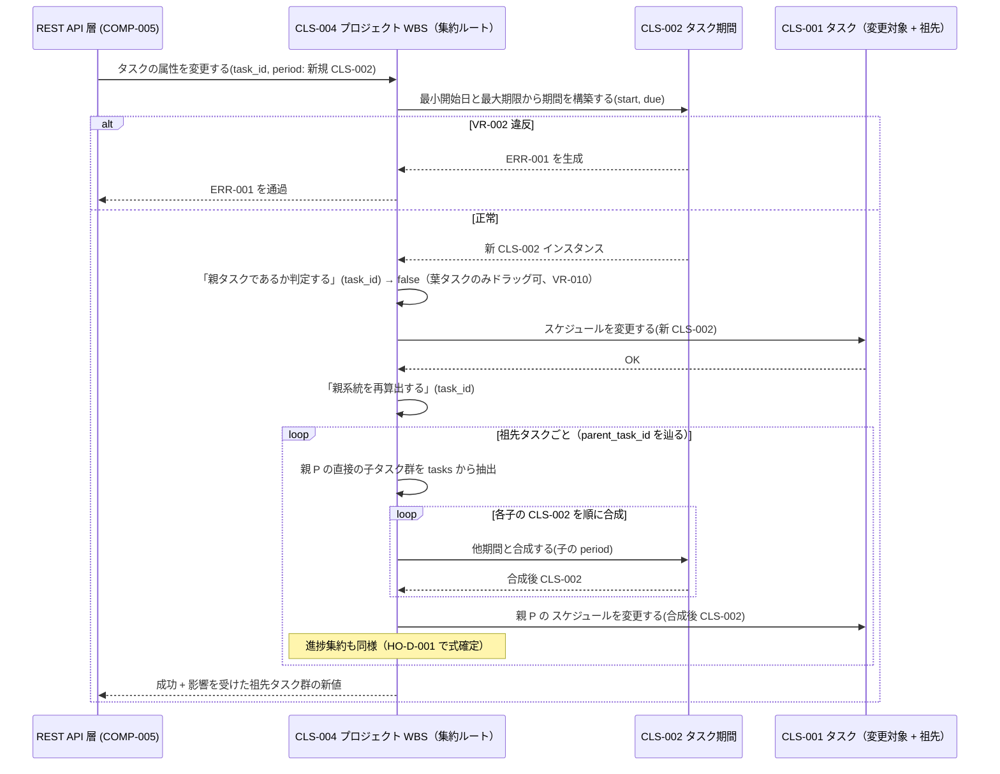
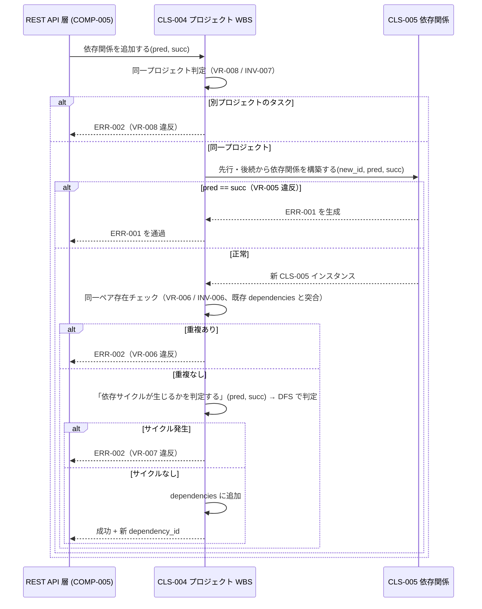

# クラス設計書（中核クラス簡略版）

本ドキュメントは、要件定義書・アーキテクチャ設計書・データ設計書・インタフェース設計書に基づき、ドメイン層の中核クラスのみを論理クラス構造として整理する。[`docs/requirements/design-plan.md`](../../requirements/design-plan.md) の判定に従い、対象は「親タスク期間の再帰算出 / 親子・依存関係の循環参照防止 / 依存関係の不変条件」に関わる中核クラスに限定する。プレゼンテーション層・REST API ハンドラ・永続化アクセス層・ロギング層のクラス、および UI 派生のフィルタ・PDF 生成クラスは本書の対象外（詳細設計工程で扱う）。

- 対象システム名: WBS / ガントチャート管理ツール（ローカル Web アプリ）
- 対応する要件定義書: [`docs/requirements/functional.md`](../../requirements/functional.md) / [`docs/requirements/usecase/`](../../requirements/usecase/) / [`docs/requirements/non-functional.md`](../../requirements/non-functional.md)
- 対応するアーキテクチャ設計書: [`docs/design/architecture/architecture.md`](../architecture/architecture.md)
- 対応するデータ設計書: [`docs/design/data/data-design.md`](../data/data-design.md)
- 対応するインタフェース設計書: [`docs/design/interface/interface-design.md`](../interface/interface-design.md)
- 対応するコンポーネント設計書: なし（[`docs/requirements/design-plan.md`](../../requirements/design-plan.md) によりスキップ。本書では `MOD-NNN` の代わりに `COMP-NNN` を所属として記す）
- 作成日 / 最終更新日: 2026-05-19 / 2026-05-19
- 版: 0.1（ドラフト、中核クラス簡略版）

---

## 1. クラス設計方針

本クラス設計全体を貫く方針を以下に示す。論理クラス構造レベルの判断のみを扱う。

- **採用するステレオタイプの語彙**: エンティティ / 値オブジェクト / 集約ルート / ドメインサービス。プレゼンテーション層・永続化層のクラス（リポジトリ・アダプタ・DTO 等）は本書の対象外とし、詳細設計に委ねる。
- **所属の表現**: コンポーネント設計工程がスキップされているため `MOD-NNN` は存在しない。代わりに、アーキテクチャ設計書の `COMP-006`（ドメインロジック層）を全クラスの所属コンポーネントとして記す。`LYR-NNN` も同様にアーキ設計書の論理レイヤ表現を流用する（プレゼン / API / ドメイン / DAO / DB）。
- **ドメインモデル貧血症の回避**: タスク・依存関係・タスク期間・タスク進捗は属性保持だけのクラスにせず、自身に関わる業務判断（値域チェック・自身の派生値計算）と不変条件維持を自クラス内で完結させる。集約横断の業務判断（親系統の再算出・循環検出）は集約ルート（CLS-004）に集約する。アプリケーション層には業務判断を流出させない。
- **値オブジェクトの採用基準**: 業務的に意味を持つプリミティブの組合せ（開始日と期限のペア、0〜100 の進捗値）は値オブジェクトに昇格する。理由は (a) `start_date ≤ due_date` の不変条件を 1 箇所で守れる、(b) 進捗の値域（0〜100 整数）を散在させずに済む、(c) 2 箇所以上で同じ制約を再実装する事態を避ける。
- **可変性原則**: 値オブジェクト（CLS-002 タスク期間 / CLS-003 タスク進捗）は不変。状態変更時は新しいインスタンスを生成する。エンティティ（CLS-001 タスク / CLS-005 依存関係）は識別子（task_id / dependency_id）で同一性を保ちつつ、属性は可変。集約ルート（CLS-004 プロジェクト WBS）は可変。
- **同一性の判定**: エンティティは識別子（task_id / dependency_id / project_id）等価。値オブジェクトは全属性値等価。
- **集約境界とトランザクション境界**: **1 プロジェクト = 1 集約**とする（AGG-001 プロジェクト WBS 集約）。理由は (a) 親タスクの派生値再算出（RULE-009 / RULE-010）が集約内に閉じ、(b) 循環依存検出（RULE-007）も同一プロジェクト内のタスク・依存関係に閉じ、(c) NFR-002 上限（500 タスク / 1,000 依存関係）が 1 トランザクションで扱える規模である。集約をまたぐ更新は本システムには存在しない。
- **属性の公開原則**: 属性は原則非公開（限定公開）。状態変化は意味のある操作経由で行う（例: タスク期間の更新は `タスクのスケジュールを変更する` 経由、Setter は持たない）。
- **不変条件の維持責任**: 値オブジェクト・エンティティは生成時にクラス内不変条件を検査し、破れる場合はインスタンス生成を拒否する（例外を生成）。集約ルートは集約全体の不変条件（INV-001〜INV-007）を、状態変化操作の完了時点で必ず守る。
- **永続化との分離**: 本クラス設計は論理構造のみを扱い、SQLite テーブル列・ORM マッピング・楽観ロック用バージョン列等は持ち込まない。データ設計書の `RULE-009 / RULE-010` で確定した「親派生値の書き込み時永続化」は、集約ルートが操作完了時に派生値を再計算した結果として、永続化アクセス層（COMP-007）が保存する責務分担とする。集約ルート自身は「派生値を再計算する」までを担い、保存トリガは持たない。
- **例外の扱い**: 業務正当性違反（VR-001〜VR-011）は集約ルートまたは値オブジェクト・エンティティが業務例外として生成する（ERR-001 / ERR-002 に対応）。SQLite I/O 失敗（ERR-005）・予期せぬ例外（ERR-006）は本層では生成せず、永続化アクセス層から通過させる。具体例外クラスの階層は詳細設計に委ねる。
- **null の扱い**: 親タスク参照（parent_task_id）は最上位タスクで未指定。論理型としては `Optional<タスクID>` を採用する。担当者・説明は空文字を許容する（必須項目ではない）。
- **共通型・値オブジェクトの昇格基準**: 本書では「2 箇所以上で使われる業務ルールはクラスに昇格」を歯止めとする。例: `start_date ≤ due_date` はタスク自身と UI ドラッグ操作の両方で守られるため CLS-002 タスク期間に昇格。担当者名・タスク名は現時点でフリーテキストの単純文字列に留め、値オブジェクト化しない（要件で正当化されない）。

---

## 2. クラス一覧

ドメイン層の中核クラスのみ列挙する。本書では新規 `CLS-NNN` を採番する。

| CLS-ID | 名称 | ステレオタイプ | 所属 COMP | 所属 LYR | 対応 ENT | 所属 AGG | 主な責務 | 関連 UC | 可変性 | 再利用性 |
|--------|------|----------------|-----------|----------|----------|----------|----------|---------|--------|----------|
| CLS-001 | タスク | エンティティ | COMP-006 | ドメイン層 | ENT-002 | AGG-001 | 1 件のタスクの状態（名前・担当者・期間・進捗・親参照・説明）を保持し、自身に閉じた不変条件（名前必須・期間整合・進捗値域）を守る | UC-002, UC-003, UC-004, UC-007 | 可変 | プロジェクト固有 |
| CLS-002 | タスク期間 | 値オブジェクト | COMP-006 | ドメイン層 | ENT-002（部分） | AGG-001 | 開始日と期限のペア。`start_date ≤ due_date` を生成時不変条件として守る | UC-002, UC-003, UC-007 | 不変 | プロジェクト固有 |
| CLS-003 | タスク進捗 | 値オブジェクト | COMP-006 | ドメイン層 | ENT-002（部分） | AGG-001 | 0〜100 の整数。値域を生成時不変条件として守る | UC-002, UC-003 | 不変 | プロジェクト固有 |
| CLS-004 | プロジェクト WBS | エンティティ（集約ルート） | COMP-006 | ドメイン層 | ENT-001 / ENT-002 / ENT-003 | AGG-001 | 1 プロジェクト配下のタスク群・依存関係群・親子ツリーを保有。親系統の派生値再算出・親子循環参照検出・依存循環検出・依存重複検出を担い、集約全体の不変条件を守る | UC-001〜UC-007 | 可変 | プロジェクト固有 |
| CLS-005 | 依存関係 | エンティティ | COMP-006 | ドメイン層 | ENT-003 | AGG-001 | 1 件の依存関係（先行 / 後続のタスク ID ペア）を保持し、自身に閉じた不変条件（先行 ≠ 後続）を守る | UC-005 | 可変（ただし属性変更は許可しない） | プロジェクト固有 |

メモ:
- 本書では「中核クラスのみ簡略に設計」の方針に沿い、5 クラスに絞る。プレゼンテーション層・REST API ハンドラ・永続化アクセス層・ロギング・PDF 生成・フィルタ等のクラスは詳細設計工程で別途設計する。
- CLS-004 プロジェクト WBS は ENT-001 プロジェクト・ENT-002 タスク群・ENT-003 依存関係群を 1 つの集約として束ねる集約ルートである。要件側 ENT-001（プロジェクト）の属性（name / description / created_at）も本クラスが直接保持する設計とする。ENT-001 を別エンティティに分けない理由は 6.2 ALT-001 で説明する。
- CLS-005 依存関係は識別子（dependency_id）で同一性を保つエンティティだが、属性変更は許可しない（依存関係の変更は「削除 + 追加」で表現する、データ設計書 ENT-003 ライフサイクル参照）。可変性は形式上「可変」だが、状態を変える操作は持たない。

---

## 3. 各クラス詳細

### CLS-001 タスク

**概要**: プロジェクト配下の作業項目を表すエンティティ。1 件のタスクの状態（名前・担当者・期間・進捗・親参照・説明）と、自身に閉じた業務ルール（VR-001 タスク名必須）を守る。ステレオタイプ: エンティティ / 所属 COMP: COMP-006 / 所属 LYR: ドメイン層 / 対応 ENT: ENT-002 / 所属 AGG: AGG-001（集約内エンティティ）。

**責務**: 自身の属性値（名前・担当者・期間・進捗・親参照・説明）を保持し、自身に閉じた業務ルール（タスク名必須・期間整合は CLS-002 経由・進捗値域は CLS-003 経由）を守る。一方、親系統の派生値再算出・親子循環参照検出・依存関係の整合検証は本クラスでは行わず、集約ルート（CLS-004）に委譲する。親タスク（自身を親として参照する子が存在する状態）かどうかの動的判定は本クラスでは保持せず、CLS-004 が集約全体の親子関係を見て判定する。

**属性一覧**:

| 属性名（論理） | 論理型 | 可視性 | 可変 | 役割 | 制約 | 概要 |
|----------------|--------|--------|------|------|------|------|
| task_id | タスク ID（整数） | 限定公開 | 不変 | 識別子 | 1 以上の整数 | 集約内識別子。同一プロジェクト内で一意 |
| name | 文字列 | 限定公開 | 可変 | 値 | 必須・空文字不可（前後空白除去後も 1 文字以上、VR-001） | タスク名 |
| assignee | 文字列 | 限定公開 | 可変 | 値 | 任意（空可） | 担当者名（フリーテキスト） |
| period | CLS-002 タスク期間（参照） | 限定公開 | 可変 | 値 | 必須 | 開始日・期限のペア（VR-002 は CLS-002 内で保証） |
| progress | CLS-003 タスク進捗（参照） | 限定公開 | 可変 | 値 | 必須 | 進捗値（VR-003 は CLS-003 内で保証） |
| parent_task_id | Optional<タスク ID> | 限定公開 | 可変 | 参照 | 同一プロジェクト配下のタスク ID または未指定（VR-008 の同一プロジェクト判定は CLS-004 で保証） | 親タスクの参照。最上位タスクは未指定 |
| description | 文字列 | 限定公開 | 可変 | 値 | 任意（空可） | 説明・備考 |

**操作一覧**: 中核ロジックに絞り、自身に閉じた状態変化操作のみ示す。集約横断の操作（親系統の再算出・親変更時の循環防止）は CLS-004 経由で呼び出される。

| 操作名 | 引数 | 戻り値 | 可視性 | 事前条件 | 事後条件 | 例外 | 実装する UC / 由来 |
|--------|------|--------|--------|----------|----------|------|-------------------|
| 名前を変更する | name: 文字列 | void | 限定公開 | 引数 name が VR-001 を満たす（空文字不可） | 自身の name が更新されている | 生成: ERR-001（VR-001 違反） | UC-003 / VR-001 |
| スケジュールを変更する | period: CLS-002 タスク期間 | void | 限定公開 | （CLS-002 生成時に VR-002 検査済） | 自身の period が更新されている | 通過: ERR-001（VR-002、CLS-002 から） | UC-003, UC-007 / VR-002 |
| 進捗を変更する | progress: CLS-003 タスク進捗 | void | 限定公開 | （CLS-003 生成時に VR-003 検査済） | 自身の progress が更新されている | 通過: ERR-001（VR-003、CLS-003 から） | UC-003 / VR-003 |
| 担当者を変更する | assignee: 文字列 | void | 限定公開 | なし | 自身の assignee が更新されている | なし | UC-003 |
| 親を変更する | newParent: Optional<タスク ID> | void | 限定公開 | 引数の親参照が VR-004（循環なし）・VR-008（同一プロジェクト）を満たす（事前検査は集約ルート CLS-004 が行う） | 自身の parent_task_id が更新されている | 通過: ERR-002（VR-004 / VR-008、CLS-004 から） | UC-003 / VR-004, VR-008 |
| 説明を変更する | description: 文字列 | void | 限定公開 | なし | 自身の description が更新されている | なし | UC-003 |
| 自身が他タスクの子孫であるかを判定する | candidateAncestor: タスク ID, lookupParent: タスク ID → Optional<タスク ID> | 真偽値 | 限定公開 | なし | candidateAncestor から再帰的に親をたどった経路上に自身の task_id が現れる場合 true | なし | UC-003 / VR-004（循環判定の補助） |

メモ:
- 「親タスクの start_date / due_date / progress は利用者からの直接編集不可」（VR-010 / RULE-011）は、本クラスでは引数として受け取った値を機械的に格納するため検査せず、集約ルート CLS-004 の「スケジュールを変更する」「進捗を変更する」操作で「対象タスクが子を持つかを動的判定し、子を持つ場合は ERR-002 を生成」する設計とする。
- 「自身が他タスクの子孫であるかを判定する」操作は VR-004（親子循環防止）検出のためのプリミティブとして提供する。実際の循環判定は集約ルート CLS-004 が、本操作と全タスクの親参照テーブル（lookupParent）を引数として渡して呼び出す。

**クラス不変条件**:
- 生成時および任意の操作完了時に、name は前後空白除去後 1 文字以上である（VR-001）
- 生成時および任意の操作完了時に、period は CLS-002 のインスタンスであり、start_date ≤ due_date である（VR-002、CLS-002 が保証）
- 生成時および任意の操作完了時に、progress は CLS-003 のインスタンスであり、0 ≤ value ≤ 100 である（VR-003、CLS-003 が保証）
- parent_task_id は未指定または自身以外のタスク ID である（自己参照禁止、VR-004 の自己ループ部）。集約全体の循環は CLS-004 が守る

**参照する他クラス（協調・依存）**:
- CLS-002 タスク期間（集約内参照、属性として保持）
- CLS-003 タスク進捗（集約内参照、属性として保持）
- CLS-001 タスク自身を `parent_task_id` で ID 参照（集約内 ID 参照、直接インスタンス参照は持たない）

**生成・破棄**:
- 生成: 集約ルート CLS-004 のファクトリ操作（`タスクを追加する`）経由、または永続化アクセス層が SQLite から復元する経路。コンストラクタ引数: task_id, name, assignee, period, progress, parent_task_id, description。生成時にクラス不変条件を検査し、破れる場合は ERR-001 を生成して生成自体を拒否する。
- 破棄: CLS-004 から除去された時点で参照が外れる。プロセス内 GC 任せ。

**可変性**: 可変。状態を変える操作: 名前を変更する / スケジュールを変更する / 進捗を変更する / 担当者を変更する / 親を変更する / 説明を変更する。

**等価性**: 識別子等価（task_id で比較）。

**対応エンティティ（ENT-002）との対応**:
- ENT-002 のうち本クラスが担当する属性: task_id, name, assignee, start_date / due_date（CLS-002 経由）, progress（CLS-003 経由）, parent_task_id, description
- 本クラスが直接保持しない ENT-002 の属性: project_id（集約ルート CLS-004 が暗黙的に持つ。本クラスは「自身がどのプロジェクトに属するか」を意識しない）
- データ設計にない属性: なし

**対応するバリデーション（VR-NNN）**:
- VR-001: 「名前を変更する」操作の事前条件、および生成時不変条件
- VR-002: CLS-002 タスク期間に委譲（CLS-002 の生成時不変条件）
- VR-003: CLS-003 タスク進捗に委譲（CLS-003 の生成時不変条件）
- VR-004（親子循環防止）: 集約ルート CLS-004 に委譲。本クラスは「自身が他タスクの子孫であるか」の判定プリミティブを提供する
- VR-008（同一プロジェクト判定）: 集約ルート CLS-004 に委譲（本クラスは project_id を知らないため）

**対応するエラー（ERR-NNN）**:
- 生成: ERR-001（VR-001 違反時、`名前を変更する` 操作および生成時）
- 通過: ERR-001（VR-002 / VR-003、CLS-002 / CLS-003 から）
- 通過: ERR-002（VR-004 / VR-008、CLS-004 から）

**実装する業務ルール（BRU / RULE）**:
- RULE-001（タスク名必須）: 主たる実装担当
- RULE-002（start_date ≤ due_date）: CLS-002 に委譲
- RULE-003（progress 0〜100）: CLS-003 に委譲
- RULE-004（親子循環防止）: CLS-004 に委譲（本クラスは判定プリミティブのみ提供）
- RULE-008（同一プロジェクト）: CLS-004 に委譲
- 要件側 BRU-NNN は要件定義書未定義のため参照なし（データ設計書 5 章メモ参照）

**備考**: parent_task_id 経由の自己参照は ID 参照のみで、CLS-001 同士の直接インスタンス参照は持たない（循環参照のオブジェクトグラフを作らないため）。実際の親オブジェクトへのアクセスは集約ルート CLS-004 経由で行う。

---

### CLS-002 タスク期間

**概要**: 開始日と期限のペアを表す値オブジェクト。`start_date ≤ due_date`（VR-002 / RULE-002）を生成時不変条件として守る。ステレオタイプ: 値オブジェクト / 所属 COMP: COMP-006 / 所属 LYR: ドメイン層 / 対応 ENT: ENT-002（部分、start_date / due_date 属性のみ） / 所属 AGG: AGG-001。

**責務**: 開始日と期限のペアを保持し、両者の順序関係（VR-002）を生成時に守る。一方、業務的な意味づけ（タスクのスケジュール変更、ドラッグ操作との対応）はここでは行わず、CLS-001 タスクおよび CLS-004 集約ルートに委譲する。

**属性一覧**:

| 属性名（論理） | 論理型 | 可視性 | 可変 | 役割 | 制約 | 概要 |
|----------------|--------|--------|------|------|------|------|
| start_date | 日付 | 限定公開 | 不変 | 値 | start_date ≤ due_date | 開始日 |
| due_date | 日付 | 限定公開 | 不変 | 値 | start_date ≤ due_date | 期限 |

**操作一覧**: 値オブジェクトの基本操作と、業務上必要な派生計算のみを提供する。

| 操作名 | 引数 | 戻り値 | 可視性 | 事前条件 | 事後条件 | 例外 | 実装する UC / 由来 |
|--------|------|--------|--------|----------|----------|------|-------------------|
| 最小開始日と最大期限から期間を構築する | start_date: 日付, due_date: 日付 | CLS-002 タスク期間（新規インスタンス） | 公開（ファクトリ） | start_date ≤ due_date | 期間インスタンスが生成されている | 生成: ERR-001（VR-002 違反時） | UC-002, UC-003, UC-007 / VR-002 |
| 他期間と合成する（最小開始日・最大期限を採る） | other: CLS-002 タスク期間 | CLS-002 タスク期間（新規インスタンス） | 公開 | なし | 戻り値の start_date = min(自身.start_date, other.start_date)、due_date = max(自身.due_date, other.due_date) | なし（合成結果は VR-002 を必ず満たす） | RULE-009（親期間集約の補助プリミティブ） |
| 等価判定 | other: 任意 | 真偽値 | 公開 | なし | other が CLS-002 で start_date / due_date がともに等しい場合 true | なし | （値等価） |

**クラス不変条件**:
- 生成時に start_date ≤ due_date が成り立つ（VR-002 / RULE-002）。破れる場合は生成自体を拒否し、ERR-001 を生成する
- インスタンスは不変。生成後に start_date / due_date は変更できない（新しい期間が必要な場合はファクトリで新規インスタンスを生成する）

**参照する他クラス（協調・依存）**: 他のドメインクラスへの参照は持たない（純粋値オブジェクト）。

**生成・破棄**:
- 生成: ファクトリ「最小開始日と最大期限から期間を構築する」経由のみ。コンストラクタ直接呼出は限定公開とし、外部からは必ずファクトリ経由で生成する（生成時不変条件検査を回避させないため）
- 破棄: GC 任せ

**可変性**: 不変。

**等価性**: 値等価（start_date / due_date がともに等しい）。

**対応エンティティ（ENT-002）との対応**:
- ENT-002 のうち本クラスが担当する属性: start_date, due_date

**対応するバリデーション（VR-NNN）**:
- VR-002: 生成時不変条件として実装

**対応するエラー（ERR-NNN）**:
- 生成: ERR-001（VR-002 違反時）

**実装する業務ルール（BRU / RULE）**:
- RULE-002（start_date ≤ due_date）: 主たる実装担当
- RULE-009（親期間 = 子の最小開始日・最大期限）の集約プリミティブ（「他期間と合成する」操作）を提供する

**備考**: 親タスク期間の再帰算出（RULE-009）の核は、集約ルート CLS-004 が子タスクの CLS-002 を `他期間と合成する` で順次合成して得る期間を、親タスクの新しい CLS-002 として設定する流れで実現する。

---

### CLS-003 タスク進捗

**概要**: 0〜100 の整数進捗値を表す値オブジェクト。値域（VR-003 / RULE-003）を生成時不変条件として守る。ステレオタイプ: 値オブジェクト / 所属 COMP: COMP-006 / 所属 LYR: ドメイン層 / 対応 ENT: ENT-002（部分、progress 属性のみ） / 所属 AGG: AGG-001。

**責務**: 進捗値（0〜100 の整数）を保持し、値域（VR-003）を生成時に守る。完了判定（`value == 100`）のような業務上意味のある述語を提供する。一方、親タスクの進捗集約アルゴリズム（重み付き平均 / 単純平均 等）は本クラスでは決定せず、集約ルート CLS-004 経由で算出する（HO-D-001 参照）。

**属性一覧**:

| 属性名（論理） | 論理型 | 可視性 | 可変 | 役割 | 制約 | 概要 |
|----------------|--------|--------|------|------|------|------|
| value | 整数 | 限定公開 | 不変 | 値 | 0 ≤ value ≤ 100 | 進捗パーセンテージ |

**操作一覧**:

| 操作名 | 引数 | 戻り値 | 可視性 | 事前条件 | 事後条件 | 例外 | 実装する UC / 由来 |
|--------|------|--------|--------|----------|----------|------|-------------------|
| 値から進捗を構築する | value: 整数 | CLS-003 タスク進捗（新規インスタンス） | 公開（ファクトリ） | 0 ≤ value ≤ 100 | 進捗インスタンスが生成されている | 生成: ERR-001（VR-003 違反時） | UC-002, UC-003 / VR-003 |
| 完了済みか判定する | （なし） | 真偽値 | 公開 | なし | value == 100 のとき true | なし | UC-006（期限超過視覚化の対象判定） |
| 等価判定 | other: 任意 | 真偽値 | 公開 | なし | other が CLS-003 で value が等しい場合 true | なし | （値等価） |

**クラス不変条件**:
- 生成時に 0 ≤ value ≤ 100 が成り立つ。破れる場合は ERR-001 を生成し、生成自体を拒否する
- インスタンスは不変

**参照する他クラス（協調・依存）**: なし（純粋値オブジェクト）。

**生成・破棄**:
- 生成: ファクトリ「値から進捗を構築する」経由のみ
- 破棄: GC 任せ

**可変性**: 不変。

**等価性**: 値等価（value が等しい）。

**対応エンティティ（ENT-002）との対応**:
- ENT-002 のうち本クラスが担当する属性: progress

**対応するバリデーション（VR-NNN）**:
- VR-003: 生成時不変条件として実装

**対応するエラー（ERR-NNN）**:
- 生成: ERR-001（VR-003 違反時）

**実装する業務ルール（BRU / RULE）**:
- RULE-003（progress 0〜100）: 主たる実装担当
- RULE-010（親進捗 = 子から算出）: アルゴリズム本体は集約ルート CLS-004 が担うが、集約結果の整数値を本クラスで包む（値域逸脱を防ぐ役割）

**備考**: 進捗集約アルゴリズム（重み付き平均 / 単純平均 / 完了子数の割合 等）の選定は HO-D-001 へ申し送り。本クラスは「整数値を包む値オブジェクト」までを責務とし、集約計算式自体は持たない。

---

### CLS-004 プロジェクト WBS（集約ルート）

**概要**: 1 プロジェクト配下のタスク群・依存関係群・親子ツリー全体を保有する集約ルート。プロジェクト自身のメタ情報（name / description / created_at）も併せて保持する。集約全体に関わる業務不変条件（INV-001〜INV-007）を守る責任を負う。ステレオタイプ: エンティティ（集約ルート） / 所属 COMP: COMP-006 / 所属 LYR: ドメイン層 / 対応 ENT: ENT-001（プロジェクト）+ ENT-002（タスク群）+ ENT-003（依存関係群）/ 所属 AGG: AGG-001。

**責務**: 集約内のタスク群と依存関係群を保持し、(a) タスクの追加・更新・削除時の親系統派生値再算出（RULE-009 / RULE-010）、(b) 親子循環参照検出（RULE-004）、(c) 依存関係追加時の循環依存検出（RULE-007）・重複検出（RULE-006）・自己依存検出（RULE-005）・同一プロジェクト判定（RULE-008）、(d) タスク削除時の子の親参照 NULL 化と関与依存関係の連動削除（RULE-013）、(e) 親タスクの直接編集禁止（RULE-011 / VR-010）の判定、を担う。一方、SQLite への永続化・API レスポンス整形・画面表示用のフィルタは本クラスでは行わず、それぞれ COMP-007（永続化）/ COMP-005（API）/ COMP-002（フロント）に委ねる。

**属性一覧**: 中核ロジックに絞り、主要属性のみ示す。

| 属性名（論理） | 論理型 | 可視性 | 可変 | 役割 | 制約 | 概要 |
|----------------|--------|--------|------|------|------|------|
| project_id | プロジェクト ID（整数） | 限定公開 | 不変 | 識別子 | 1 以上の整数 | プロジェクトの識別子 |
| projectName | 文字列 | 限定公開 | 可変 | 値 | 必須・空文字不可（VR-009） | プロジェクト名 |
| description | 文字列 | 限定公開 | 可変 | 値 | 任意（空可） | プロジェクトの説明 |
| created_at | 日時 | 限定公開 | 不変 | 値 | 作成時の現在日時 | プロジェクト作成日時 |
| tasks | コレクション<CLS-001 タスク>（タスク ID をキーとしたマップ相当） | 限定公開 | 可変 | 値 | 同一 project_id 配下のみ | プロジェクト配下の全タスク |
| dependencies | コレクション<CLS-005 依存関係>（依存関係 ID をキーとしたマップ相当） | 限定公開 | 可変 | 値 | 各依存の先行・後続が tasks 内に存在し、同一プロジェクト配下 | プロジェクト配下の全依存関係 |

**操作一覧**: 中核ロジックに絞り、業務的に意味のある操作のみ示す。

| 操作名 | 引数 | 戻り値 | 可視性 | 事前条件 | 事後条件 | 例外 | 実装する UC / 由来 |
|--------|------|--------|--------|----------|----------|------|-------------------|
| タスクを追加する | task: CLS-001 タスク（新規）, parent_task_id: Optional<タスク ID> | void | 公開 | task.name が VR-001、task.period が VR-002、task.progress が VR-003、parent_task_id 指定時は同一プロジェクト配下（VR-008）・親変更後に循環なし（VR-004） | tasks に追加され、親系統の派生値が再算出されている（RULE-009 / RULE-010） | 生成: ERR-001（VR-001/VR-002/VR-003 違反、CLS-001/002/003 から通過する場合もあり）/ ERR-002（VR-004 / VR-008 違反） | UC-002 |
| タスクの属性を変更する | task_id: タスク ID, 変更内容（name / assignee / period / progress / parent_task_id / description のいずれか以上） | void | 公開 | 対象タスクが tasks に存在する。親タスク（子を持つタスク）の場合 period / progress の変更は拒否（VR-010）。parent 変更時は循環なし（VR-004）・同一プロジェクト（VR-008） | 対象タスクの属性が更新され、period / progress / parent_task_id の変更時は影響を受ける親系統の派生値が再算出されている | 生成: ERR-002（VR-010 / VR-004 / VR-008 違反）/ 通過: ERR-001（CLS-001/002/003 から） / ERR-003（対象タスク不存在） | UC-003, UC-007 |
| タスクを削除する | task_id: タスク ID | 削除に伴う影響件数（昇格子数・連鎖削除依存数） | 公開 | 対象タスクが tasks に存在する | 対象タスクが tasks から除去され、子タスクの parent_task_id が未指定（NULL）に更新され、対象タスクが先行または後続として関与する依存関係が dependencies から除去され、元の親系統の派生値が再算出されている（RULE-013） | 生成: ERR-003（対象不存在） | UC-004 |
| 依存関係を追加する | predecessor_task_id: タスク ID, successor_task_id: タスク ID | CLS-005 依存関係（新規） | 公開 | predecessor ≠ successor（VR-005）、同一プロジェクト配下（VR-008）、同一ペアが既存に存在しない（VR-006）、追加後に依存サイクルが生じない（VR-007） | dependencies に追加される | 生成: ERR-001（VR-005 違反）/ ERR-002（VR-006 / VR-007 / VR-008 違反）/ 通過: ERR-003（先行・後続のいずれかが不存在） | UC-005 |
| 依存関係を削除する | dependency_id: 依存関係 ID | void | 公開 | 対象依存関係が dependencies に存在する | dependencies から除去される | 生成: ERR-003（対象不存在） | UC-005 |
| 親タスクであるか判定する（子を持つか） | task_id: タスク ID | 真偽値 | 限定公開 | 対象タスクが tasks に存在する | tasks の中に parent_task_id = task_id を持つタスクが 1 件以上存在する場合 true | なし | RULE-011, VR-010 の判定プリミティブ |
| 親系統を再算出する | leafChangedTaskId: タスク ID（変更の起点となった葉側タスク ID） | void | 限定公開 | leafChangedTaskId が tasks に存在する、または直前まで存在した | leafChangedTaskId から parent_task_id を辿った祖先系統すべての period / progress が、各々の直接の子から再算出されている | なし（無限ループ防止は VR-004 で担保） | RULE-009, RULE-010 |
| 親子循環が生じるかを判定する | candidateChildId: タスク ID, candidateParentId: タスク ID | 真偽値 | 限定公開 | 両 ID が tasks に存在する | candidateChildId を candidateParentId の子に設定した結果、親子経路上に循環が生じる場合 true | なし | RULE-004, VR-004 |
| 依存サイクルが生じるかを判定する | predecessor_task_id: タスク ID, successor_task_id: タスク ID | 真偽値 | 限定公開 | 両 ID が tasks に存在する | 新規依存 (pred → succ) を追加した結果、依存グラフに有向サイクルが生じる場合 true（都度 DFS で判定） | なし | RULE-007, VR-007 |

**クラス不変条件**: 集約全体の不変条件は 4.3 で `INV-NNN` として採番する。本クラス自身の局所不変条件（属性レベル）は以下:
- 任意の操作完了時点で、projectName は空文字でない（VR-009）
- 任意の操作完了時点で、tasks 内の各タスクの parent_task_id は未指定または tasks 内に存在する別タスクの task_id である
- 任意の操作完了時点で、dependencies 内の各依存関係の predecessor / successor は tasks 内に存在する

**参照する他クラス（協調・依存）**:
- CLS-001 タスク（集約内エンティティ、コレクションで保持）
- CLS-002 タスク期間（CLS-001 を経由した間接参照、および「他期間と合成する」を直接利用）
- CLS-003 タスク進捗（CLS-001 を経由した間接参照、および「値から進捗を構築する」を直接利用）
- CLS-005 依存関係（集約内エンティティ、コレクションで保持）

**生成・破棄**:
- 生成: アプリケーション層（COMP-005）が永続化アクセス層（COMP-007）からプロジェクト + タスク群 + 依存関係群を一括ロードして CLS-004 を組み立てる。コンストラクタ引数: project_id, projectName, description, created_at, tasks のコレクション, dependencies のコレクション。生成時に整合性チェック（孤立した parent_task_id・孤立した依存関係 ID 参照がないこと）を行う
- 破棄: API 応答後、または当該プロジェクトを閉じた時点でアプリケーション層が参照を解放。GC 任せ

**可変性**: 可変。状態を変える操作: タスクを追加する / タスクの属性を変更する / タスクを削除する / 依存関係を追加する / 依存関係を削除する / 親系統を再算出する。

**等価性**: 識別子等価（project_id で比較）。

**対応エンティティ（ENT-NNN）との対応**:
- ENT-001 プロジェクトの属性: project_id, name（projectName）, description, created_at をすべて担当
- ENT-002 タスクの属性: tasks コレクションを通じて間接担当（直接の保持は CLS-001 に委譲）
- ENT-003 依存関係の属性: dependencies コレクションを通じて間接担当（直接の保持は CLS-005 に委譲）
- データ設計にない属性: なし

**対応するバリデーション（VR-NNN）**:
- VR-004（親子循環防止）: 「親子循環が生じるかを判定する」操作で実装、「タスクを追加する」「タスクの属性を変更する」の事前条件で利用
- VR-006（依存重複禁止）: 「依存関係を追加する」操作の事前条件で実装
- VR-007（依存循環禁止）: 「依存サイクルが生じるかを判定する」操作で実装、「依存関係を追加する」の事前条件で利用
- VR-008（同一プロジェクト）: 全ての追加・更新操作の事前条件で実装（本クラスが project_id を知る唯一の場所）
- VR-009（プロジェクト名必須）: 集約ルートの projectName 属性のクラス不変条件として実装
- VR-010（親タスク直接編集禁止）: 「タスクの属性を変更する」操作の事前条件で実装（「親タスクであるか判定する」プリミティブを内部利用）

**対応するエラー（ERR-NNN）**:
- 生成: ERR-001（VR-005 違反、依存関係追加時）/ ERR-002（VR-004 / VR-006 / VR-007 / VR-008 / VR-010 違反）/ ERR-003（タスク ID・依存関係 ID の不存在）
- 通過: ERR-001（VR-001 / VR-002 / VR-003、CLS-001 / CLS-002 / CLS-003 から）

**実装する業務ルール（BRU / RULE）**:
- RULE-004（親子循環防止）: 主たる実装担当
- RULE-005（自己依存禁止）: 「依存関係を追加する」操作の事前条件
- RULE-006（依存重複禁止）: 主たる実装担当
- RULE-007（依存循環禁止）: 主たる実装担当
- RULE-008（同一プロジェクト）: 主たる実装担当
- RULE-009（親期間 = 子の最小開始日・最大期限）: 主たる実装担当（「親系統を再算出する」操作で実装）
- RULE-010（親進捗 = 子からの算出）: 主たる実装担当（具体算出式は HO-D-001 に申し送り）
- RULE-011（親タスク直接編集禁止）: 主たる実装担当
- RULE-013（タスク削除時の子の昇格 + 依存関係連鎖削除）: 主たる実装担当

**備考**:
- 「親系統を再算出する」は、leafChangedTaskId の parent_task_id から始めて、parent_task_id が未指定になるまで（最上位タスクに到達するまで）祖先を辿り、各祖先について `その祖先の直接の子全員の CLS-002 タスク期間を `他期間と合成する` で集約し、新しい CLS-002 を構築して setPeriod する` を繰り返す。進捗の集約も同様に祖先順に再算出する（具体式は HO-D-001）。VR-004 により親子グラフはツリーであることが保証されるため、無限ループは生じない
- 親変更時（UC-003 で parent_task_id を変更する場合）は、変更前の親系統と変更後の親系統の両方を再算出する必要がある（変更前の親は子を 1 つ失う、変更後の親は子を 1 つ得る）。これは「タスクの属性を変更する」操作内で両方の `親系統を再算出する` を順次呼び出すことで実現する
- 循環検出アルゴリズムは「都度 DFS」（データ設計書 5 章メモ・HO-D-008 / アーキ設計書 RISK-003 / HO-D-004）の方針を踏襲。推移閉包テーブル等のキャッシュは持たない

---

### CLS-005 依存関係

**概要**: タスク間の先行 / 後続関係を表すエンティティ。1 件の依存関係（predecessor_task_id, successor_task_id のペア）を保持し、自身に閉じた業務ルール（VR-005 自己依存禁止）を守る。ステレオタイプ: エンティティ / 所属 COMP: COMP-006 / 所属 LYR: ドメイン層 / 対応 ENT: ENT-003 / 所属 AGG: AGG-001（集約内エンティティ）。

**責務**: 依存関係 1 件の identity（dependency_id）と先行 / 後続のペアを保持し、自己依存禁止（VR-005）を生成時に守る。一方、ペア重複禁止（VR-006）・循環禁止（VR-007）・同一プロジェクト判定（VR-008）は集約全体に渡る判断のため、集約ルート CLS-004 に委譲する。

**属性一覧**:

| 属性名（論理） | 論理型 | 可視性 | 可変 | 役割 | 制約 | 概要 |
|----------------|--------|--------|------|------|------|------|
| dependency_id | 依存関係 ID（整数） | 限定公開 | 不変 | 識別子 | 1 以上の整数 | 集約内識別子 |
| predecessor_task_id | タスク ID（整数） | 限定公開 | 不変 | 参照 | 後続と異なる（VR-005）。同一プロジェクト配下（VR-008、CLS-004 が保証） | 先行タスクの ID |
| successor_task_id | タスク ID（整数） | 限定公開 | 不変 | 参照 | 先行と異なる（VR-005）。同一プロジェクト配下（VR-008、CLS-004 が保証） | 後続タスクの ID |

**操作一覧**: 値オブジェクト的に振る舞うため、状態変更操作は持たない。

| 操作名 | 引数 | 戻り値 | 可視性 | 事前条件 | 事後条件 | 例外 | 実装する UC / 由来 |
|--------|------|--------|--------|----------|----------|------|-------------------|
| 先行・後続から依存関係を構築する | dependency_id, predecessor_task_id, successor_task_id | CLS-005 依存関係（新規） | 公開（ファクトリ） | predecessor_task_id ≠ successor_task_id（VR-005） | 依存関係インスタンスが生成されている | 生成: ERR-001（VR-005 違反） | UC-005 / VR-005 |
| 同一ペアか判定する | other: CLS-005 依存関係 | 真偽値 | 公開 | なし | predecessor_task_id と successor_task_id がともに等しい場合 true | なし | RULE-006 の判定プリミティブ |

**クラス不変条件**:
- 生成時に predecessor_task_id ≠ successor_task_id が成り立つ（VR-005 / RULE-005）。破れる場合は ERR-001 を生成

**参照する他クラス（協調・依存）**:
- CLS-001 タスクを predecessor_task_id / successor_task_id で ID 参照（集約内 ID 参照、直接インスタンス参照は持たない）

**生成・破棄**:
- 生成: 集約ルート CLS-004 の「依存関係を追加する」操作経由、または永続化アクセス層が SQLite から復元する経路
- 破棄: CLS-004 から除去された時点で参照が外れる

**可変性**: 形式上「可変」（エンティティ）だが、属性変更操作を持たない（変更時は削除 + 追加で表現、データ設計書 ENT-003 ライフサイクル参照）。

**等価性**: 識別子等価（dependency_id で比較）。なお業務的な「ペアの等価性」は「同一ペアか判定する」操作で別途提供（VR-006 検査用）。

**対応エンティティ（ENT-003）との対応**:
- ENT-003 のすべての属性（dependency_id, predecessor_task_id, successor_task_id）を担当

**対応するバリデーション（VR-NNN）**:
- VR-005: 生成時不変条件として実装
- VR-006 / VR-007 / VR-008: 集約ルート CLS-004 に委譲

**対応するエラー（ERR-NNN）**:
- 生成: ERR-001（VR-005 違反時）

**実装する業務ルール（BRU / RULE）**:
- RULE-005（自己依存禁止）: 主たる実装担当
- RULE-006（重複禁止）: CLS-004 に委譲（「同一ペアか判定する」プリミティブを提供）
- RULE-007（循環禁止）: CLS-004 に委譲
- RULE-008（同一プロジェクト）: CLS-004 に委譲

**備考**: predecessor / successor は CLS-001 タスクの ID 参照のみで、CLS-001 インスタンスへの直接参照は持たない。これは依存グラフのオブジェクトサイクル化を避けるためで、グラフ走査（循環検出）は CLS-004 が ID から CLS-001 を引きながら DFS で行う設計とする。

---

## 4. 集約と関連

### 4.1 集約（AGG-NNN）

| AGG-ID | 名称 | 集約ルート | 集約に含まれるクラス | 対応 ENT | トランザクション境界の意味 | 主な状態遷移の担い手 | 関連 UC |
|--------|------|------------|----------------------|----------|----------------------------|----------------------|---------|
| AGG-001 | プロジェクト WBS 集約 | CLS-004 プロジェクト WBS | CLS-001, CLS-002, CLS-003, CLS-004, CLS-005 | ENT-001, ENT-002, ENT-003 | 1 プロジェクト単位で整合性を保つ最小単位。タスクの追加・更新・削除、依存関係の追加・削除、それに伴う親系統の派生値再算出はすべて同一トランザクション内で完了させる | CLS-004 の「タスクを追加する」「タスクの属性を変更する」「タスクを削除する」「依存関係を追加する」「依存関係を削除する」「親系統を再算出する」 | UC-001〜UC-007 |

メモ:
- 集約は 1 つのみ。本システムは単一プロジェクトしか開かない（要件: 同時に開けるのは 1 つ）ため、複数集約をまたぐトランザクションは存在しない
- 集約サイズの上限は NFR-002（500 タスク / 1,000 依存関係）に縛られる。アーキ設計 RISK-003 で「都度 DFS で NFR-001 達成可能」と確認済み
- 集約ルート CLS-004 を経由しない内部参照・更新は禁止する。具体的には:
  - REST API 層（COMP-005）は CLS-001 / CLS-005 を直接操作しない（必ず CLS-004 経由）
  - 永続化アクセス層（COMP-007）は CLS-004 全体をロード / セーブする責務とし、CLS-001 / CLS-005 を単体で取り扱うインタフェースは持たない（または持つ場合でもドメイン層の不変条件を経由する設計とする。詳細は HO-D-002 で確定）
- ENT-004 スキーマバージョン（データ設計書）は技術メタデータであり、業務集約には含めない。本クラス設計の対象外

集約図:

### 4.2 クラス間関連（ASSOC-NNN）

| ASSOC-ID | 関連元 CLS | 関連先 CLS | 関連種別 | 方向 | 多重度 | ライフサイクル依存 | 対応 REL-NNN | 概要 |
|----------|------------|------------|----------|------|--------|---------------------|--------------|------|
| ASSOC-001 | CLS-004 プロジェクト WBS | CLS-001 タスク | 合成 | 単方向（CLS-004 → CLS-001） | 1 : 0..* | 強（プロジェクト消滅で全タスク消滅） | REL-001 | プロジェクトはその配下にタスクを保有する |
| ASSOC-002 | CLS-004 プロジェクト WBS | CLS-005 依存関係 | 合成 | 単方向 | 1 : 0..* | 強（プロジェクト消滅で全依存関係消滅） | REL-003, REL-004 | プロジェクトはその配下に依存関係を保有する |
| ASSOC-003 | CLS-001 タスク | CLS-002 タスク期間 | 合成 | 単方向 | 1 : 1 | 強（タスク消滅で期間も消滅） | （ENT-002 の属性として REL なし） | タスクは 1 つのタスク期間値オブジェクトを保有 |
| ASSOC-004 | CLS-001 タスク | CLS-003 タスク進捗 | 合成 | 単方向 | 1 : 1 | 強 | （ENT-002 の属性として REL なし） | タスクは 1 つのタスク進捗値オブジェクトを保有 |
| ASSOC-005 | CLS-001 タスク | CLS-001 タスク | 関連（ID 参照のみ） | 単方向（子 → 親、parent_task_id 経由） | 0..* : 0..1 | 独立（親削除時に子の参照は CLS-004 が NULL に昇格） | REL-002 | 自己参照によるツリー構造（タスクの親子）。直接インスタンス参照は持たず ID 参照のみ |
| ASSOC-006 | CLS-005 依存関係 | CLS-001 タスク | 依存（ID 参照のみ） | 単方向（依存関係 → 先行タスク） | 0..* : 1 | 強（先行タスク消滅で依存関係消滅、CLS-004 が連鎖削除） | REL-003 | 依存関係が先行タスクを ID 参照する |
| ASSOC-007 | CLS-005 依存関係 | CLS-001 タスク | 依存（ID 参照のみ） | 単方向（依存関係 → 後続タスク） | 0..* : 1 | 強 | REL-004 | 依存関係が後続タスクを ID 参照する |

メモ:
- DEP-NNN（コンポーネント間依存）はコンポーネント設計工程がスキップされているため非対応
- 親子関係（ASSOC-005）と依存関係（ASSOC-006 / ASSOC-007）はいずれも CLS-001 への ID 参照のみとし、直接インスタンス参照は持たない。これにより (a) オブジェクトグラフに循環ができない、(b) 集約ルート CLS-004 経由でないと別タスクに到達できない（集約ルート経由原則の自然な担保）、(c) JSON 直列化（永続化・API 応答）が単純化される、というメリットを得る
- 双方向関連は持たない（親 → 子の逆方向参照を持たない）。子を集める必要がある場面（親系統再算出など）では、集約ルート CLS-004 が tasks コレクション全体を走査して `parent_task_id == 親 ID` のタスクを集める

クラス図: 4.1 の集約図と同じ。

### 4.3 不変条件（INV-NNN）

| INV-ID | 内容 | 成立範囲 | 維持責任者 | 検査タイミング | 違反時の扱い | 由来 |
|--------|------|----------|-------------|-----------------|---------------|------|
| INV-001 | 親タスク（子を持つタスク）の period.start_date = 子タスク群の start_date の最小、period.due_date = 子タスク群の due_date の最大 | AGG-001 内 | CLS-004 プロジェクト WBS（「親系統を再算出する」操作で実現） | タスク追加・属性変更・削除の各操作完了時 | 自動再計算（書き込み時に CLS-004 が再算出して period を更新） | RULE-009 |
| INV-002 | 親タスクの progress は子タスクの progress から算出された値である | AGG-001 内 | CLS-004 プロジェクト WBS | タスク追加・属性変更・削除の各操作完了時 | 自動再計算（具体式は HO-D-001） | RULE-010 |
| INV-003 | 親タスクの period / progress は利用者からの直接編集を受け付けない | AGG-001 内 | CLS-004 プロジェクト WBS（「タスクの属性を変更する」操作の事前条件で「親タスクであるか判定する」を利用） | 「タスクの属性を変更する」操作の事前条件 | 操作拒否（ERR-002 を生成、VR-010 違反） | RULE-011, VR-010 |
| INV-004 | tasks コレクション内の親子関係に循環参照が生じない（タスクの parent_task_id を辿った経路は必ず最上位（未指定）で終端する） | AGG-001 内 | CLS-004 プロジェクト WBS（「親子循環が生じるかを判定する」を「タスクを追加する」「タスクの属性を変更する」の事前条件で利用） | タスク追加時 / 親変更時の事前条件 | 操作拒否（ERR-002 を生成、VR-004 違反） | RULE-004, VR-004 |
| INV-005 | dependencies コレクション内の依存関係に有向サイクルが生じない | AGG-001 内 | CLS-004 プロジェクト WBS（「依存サイクルが生じるかを判定する」を「依存関係を追加する」の事前条件で利用、都度 DFS） | 依存関係追加時の事前条件 | 操作拒否（ERR-002 を生成、VR-007 違反） | RULE-007, VR-007 |
| INV-006 | dependencies コレクション内で、(predecessor_task_id, successor_task_id) のペアは一意である | AGG-001 内 | CLS-004 プロジェクト WBS（「依存関係を追加する」の事前条件で既存ペアと突合） | 依存関係追加時の事前条件 | 操作拒否（ERR-002 を生成、VR-006 違反） | RULE-006, VR-006 |
| INV-007 | tasks 内の各タスクの parent_task_id、および dependencies 内の各依存関係の predecessor / successor は、すべて同じ project_id の集約に属する（同一プロジェクト配下） | AGG-001 内 | CLS-004 プロジェクト WBS（「タスクを追加する」「タスクの属性を変更する」「依存関係を追加する」の事前条件） | 追加・親変更・依存追加の各操作の事前条件 | 操作拒否（ERR-002 を生成、VR-008 違反） | RULE-008, VR-008 |

メモ:
- 値オブジェクト（CLS-002 / CLS-003）のクラス内不変条件（VR-002 / VR-003）は本表には採番せず、3 章の各クラス詳細「クラス不変条件」にインラインで記述する（生成時のみの単純な値域チェックで、横断性を持たないため）
- 同様に CLS-001 タスクの name 必須（VR-001）、CLS-005 依存関係の自己依存禁止（VR-005）、CLS-004 集約ルートの projectName 必須（VR-009）も各クラス内に閉じるためインラインで扱う
- INV-001〜INV-007 は集約内不変条件である。本システムは集約が 1 つしかなく、集約横断不変条件は存在しない（結果整合を要する不変条件もなし）
- データ設計書 5 章の整合性ルール（RULE-001〜RULE-013）は、上記 INV と各クラスのインライン不変条件のいずれかで受け止められている（RULE-001 → CLS-001 / RULE-002 → CLS-002 / RULE-003 → CLS-003 / RULE-004 → INV-004 / RULE-005 → CLS-005 / RULE-006 → INV-006 / RULE-007 → INV-005 / RULE-008 → INV-007 / RULE-009 → INV-001 / RULE-010 → INV-002 / RULE-011 → INV-003 / RULE-012 → CLS-004「タスクを削除する」操作 + 永続化側のトランザクション境界 / RULE-013 → CLS-004「タスクを削除する」操作）

---

## 5. 代表シーケンス

ユーザ指定の中核ロジック（親タスク期間の再帰算出・親子循環参照防止・依存関係循環防止）を確認するため、UC-007（ガントチャート上で期間変更）と UC-005（依存関係追加）を代表として図示する。

### 5.1 UC-007 タスクのスケジュール変更（親タスク期間の再帰算出）

利用者がドラッグ&ドロップで葉タスクの開始日・期限を変更した際の、ドメイン層内部のクラス間呼出を示す。アーキ設計書 3.2 UC-007 のシーケンスを CLS 粒度に分解したもので、矛盾はない。

シーケンスの読み取りどころ:
- 集約ルート CLS-004 がすべての集約内不変条件（INV-001 / INV-002 / INV-003）を守っている。葉タスクの直接編集はそのまま許可するが、親タスクの period 直接編集は INV-003 で拒否される
- 呼出元（API 層）は集約内の CLS-001 / CLS-002 に直接触れない（集約ルート経由原則）
- VR-002 違反は CLS-002 の生成時に発生し、ERR-001 として集約ルートを通過して API 層に返る
- 親系統の再算出は parent_task_id を辿るだけで完結し、tasks コレクションの全走査は伴わない（INV-004 によりツリーであることが保証されている）

### 5.2 UC-005 依存関係の追加（循環依存検出）

利用者が依存関係を 1 件追加する際の循環検出を示す。

シーケンスの読み取りどころ:
- 自己依存禁止（VR-005）は CLS-005 の生成時に拒否される（責務局所化）
- 重複禁止（VR-006）と循環禁止（VR-007）は集約ルートが既存 dependencies と突合・DFS で判定する。これらは集約全体を見る必要があるため CLS-005 では守れない
- 循環検出は「都度 DFS」（データ設計書 5 章メモ・アーキ設計書 RISK-003）。INV-005 の維持責任者として CLS-004 が一貫して担う

---

## 6. 注意事項

### 6.1 リスク・懸念点

| RISK-ID | 内容 | 影響範囲 | 顕在化条件 | 暫定対応 | 詳細設計・テスト設計への申し送り |
|---------|------|----------|-------------|-----------|-----------------------------------|
| RISK-001 | 親系統の再算出漏れリスク | CLS-004 / INV-001, INV-002 | タスク追加・更新・削除・親変更・依存関係変更 ※ 依存関係変更は派生値に影響しないが、設計時の検討漏れを念頭に置く | CLS-004 のすべての公開操作で `親系統を再算出する` を呼ぶ責務とし、テスト設計で「親系統が再算出されないシナリオ」を網羅する。永続化との連携は同一トランザクション内で集約ルートの操作完了 → 集約全体保存の順を厳守 | HO-T-001 で再算出網羅テストを必須化 |
| RISK-002 | 親が子をすべて失った場合の派生値の扱いが未定（直前値を残すか、リセットするか） | CLS-004 / INV-001, INV-002 | UC-004（最後の子を削除）、UC-003（最後の子の親付け替え） | データ設計書 RISK-002 / HO-D-004 の方針「直前の派生値を残し、利用者が UI-004 で編集可能となる（読み取り専用解除）」を踏襲。CLS-004 の「タスクを削除する」「タスクの属性を変更する」が「対象タスクの親が以後子を持たなくなる場合、その親の period / progress は更新せず、以後は CLS-001 の操作経由で利用者編集可能とする」挙動を取る | HO-D-002 で確定 |
| RISK-003 | 親タスクの progress 集約アルゴリズムが未確定（RULE-010 は方針のみ、具体式未定） | CLS-004 / INV-002 | 子の進捗が異なる値を取る一般ケース | 暫定: 期間（due_date − start_date）で重み付けした加重平均（データ設計書 RISK-003 暫定）。本クラス設計は「集約ルートが算出 → CLS-003 で値域チェック付きで包む」の構造だけ決め切り、式自体は HO-D-001 へ申し送り | HO-D-001 で式を確定 |
| RISK-004 | 「中核クラスのみ」の方針により、アプリケーションサービス（COMP-005 内部のハンドラ）・リポジトリ（COMP-007）・DTO（API 入出力）のクラスを本書で設計しないため、それらと CLS-004 の連携契約が暗黙になっている | CLS-004 と COMP-005 / COMP-007 の境界 | 詳細設計工程でアプリケーションサービスを設計する際、CLS-004 の操作粒度（タスク 1 件単位 vs 一括）と整合しない設計が提案される可能性 | 本書 3 章で CLS-004 の公開操作を列挙済み。詳細設計時に「API ハンドラは必ず CLS-004 の公開操作 1 つに 1 対 1 でマッピングし、CLS-001 / CLS-005 を直接呼ばない」原則を申し送り | HO-D-003 で確定 |
| RISK-005 | 循環検出（INV-004 / INV-005）の都度 DFS が NFR-001 を達成できるか | CLS-004 / INV-004, INV-005 | NFR-002 上限近く（500 タスク / 1,000 依存関係）で繰返し編集 | アーキ設計書 RISK-003 / HO-D-004 の方針を踏襲し都度 DFS で進める。NFR-001 達成を実測検証 | HO-T-002 でパフォーマンステストを計画 |
| RISK-006 | parent_task_id 経由の ID 参照のみとした結果、集約内のあるタスクから「自身の子タスク群」を集めるには tasks 全件走査が必要 | CLS-004 内のパフォーマンス | 親系統再算出時に、各祖先ごとに子を集める処理 | 500 タスク規模では全件走査でも数 ms 程度で完結する想定（NFR-002 上限）。子マップ（parent_task_id → 子 ID リスト）を CLS-004 内のキャッシュとして持つ案は HO-D-004 へ申し送り | HO-D-004 で確定 |
| RISK-007 | 永続化アクセス層（COMP-007）が CLS-001 / CLS-005 を単体取得する API を提供すると、ドメイン層の不変条件を回避した部分更新が可能になってしまう | CLS-004 / 集約ルート経由原則 | COMP-007 の設計時に効率化目的で単体 API を作る誘惑 | 本書の方針「集約ルート CLS-004 を経由しない更新は禁止」を詳細設計時のレビュー観点として申し送り。COMP-007 は CLS-004 全体のロード / セーブを基本とする | HO-D-003 で COMP-007 のインタフェース粒度を確定 |
| RISK-008 | 「親タスクの period / progress 直接編集禁止」（INV-003）の検査タイミング | CLS-004 / INV-003 / RULE-011 | 利用者が UI を介さず API を直接呼んだ場合、または UI のバグで読み取り専用が外れた場合 | CLS-004 の「タスクの属性を変更する」操作の事前条件で「親タスクであるか判定する」プリミティブを呼び、対象が子を持つ場合は period / progress 更新を ERR-002 で拒否する。UI 側読み取り専用化（VR-010）は二重防御 | HO-T-001 で「UI を経由しない API 呼出」の負経路テストを必須化 |
| RISK-009 | 要件側 BRU-NNN（業務ルール ID）の未定義 | 全 CLS | 業務ルール変更時の追跡 | データ設計書 RULE-NNN を業務ルールの代理 ID として扱う方針を踏襲。要件側で BRU-NNN が定義された際は本書を再整合 | （要件側起源のため申し送り不要） |

リスクの典型カテゴリ（本書での該当 / 非該当の宣言）:
- 該当: 不変条件の置き場（RISK-001 / RISK-006）、集約境界の曖昧さ防止（RISK-007）、本書スコープ縮小による暗黙契約（RISK-004）
- 非該当: ドメインモデル貧血症（CLS-001 / CLS-002 / CLS-003 / CLS-005 はそれぞれ業務操作を自身に持つ。CLS-004 は集約横断ロジックを担う設計）、神クラス（CLS-004 は本システムの集約が 1 つしかないため自然な大きさ。属性 6・操作 8 程度で許容範囲）、循環依存（オブジェクトレベルでの循環は ID 参照化で排除済み）、永続化都合の混入（永続化用属性は本書に持ち込まず詳細設計に委ねる）、DTO のドメイン層侵入（境界の DTO は本書対象外、COMP-002 / COMP-005 で扱う）
- 非該当だが補足: 「親が子を失った場合の派生値」（RISK-002）は仕様未確定だが、本クラス構造の妥当性自体には影響しないため、暫定方針で進める

### 6.2 代替案と採らない理由

| ALT-ID | 対象判断 | 代替案概要 | 採らない理由 | 再検討条件 |
|--------|----------|------------|---------------|-------------|
| ALT-001 | プロジェクト・タスク・依存関係を別集約に分ける | AGG-001 プロジェクト集約 / AGG-002 タスク集約 / AGG-003 依存関係集約 と 3 つに分ける | 親タスク派生値再算出（INV-001 / INV-002）が同一集約内に閉じなくなり、結果整合またはドメインサービス経由の同期更新が必要になる。500 タスク / 1,000 依存関係の規模では 1 集約に統合しても NFR-001 達成可能で、複雑性のメリットが薄い | プロジェクト規模が 10 倍以上に拡大した場合 |
| ALT-002 | ENT-001 プロジェクトを独立エンティティとして CLS-NNN に分ける | CLS-プロジェクト（name / description / created_at のみ）と CLS-004 プロジェクト WBS（タスク・依存のみ）を分け、前者を集約ルートにする | 集約ルートを「プロジェクトメタ」「WBS 構造」の 2 つに分けると、参照が増えるだけで責務分離の利得が薄い。プロジェクトメタは tasks / dependencies と一体の集約として扱うほうが、書き込み時のトランザクション境界が自然に揃う | プロジェクトメタが大量の付随情報（カレンダー定義・休日設定・通知設定など）を持つように要件が拡張された場合 |
| ALT-003 | 値オブジェクト化 | start_date / due_date / progress をプリミティブ（日付・整数）のまま CLS-001 タスクの属性として持つ | (a) VR-002（期間順序）・VR-003（進捗値域）が CLS-001 内のあちこちに散らばる、(b) 親タスク期間の合成操作（「他期間と合成する」）の置き場がなくなり、CLS-004 にユーティリティ関数として置くことになりやすい（手続き型に傾く）。値オブジェクト化のコストは小さく、CLS-001 の責務もスリムにできる | プリミティブ型をそのまま使う言語慣習があり、値オブジェクト化のメリットが運用上問題化する場合（本プロジェクトでは該当しない） |
| ALT-004 | 親子グラフ・依存グラフを専用クラスに分離 | CLS-親子ツリー / CLS-依存グラフ をドメインサービスとして CLS-004 から独立させる | (a) 集約ルートが薄くなりすぎ、「責務はあるがすべてサービスに委譲する」構造になる、(b) 親子ツリーと依存グラフの 2 つを CLS-004 で同時に管理することで「親系統再算出時に依存関係も影響を受けないか」等の横断確認が局所化しやすい、(c) 「中核クラスのみ簡略に」の方針にも合う | 親子ツリーまたは依存グラフのロジックが大幅に肥大化し、CLS-004 が神クラス化する場合 |
| ALT-005 | 循環検出を推移閉包テーブルで管理 | CLS-004 内に祖先 / 後続の全ペアを保持するキャッシュを持ち、O(1) で循環判定 | データ設計書 ALT-006 で却下済み（500 タスク・1,000 依存関係規模では都度 DFS で NFR-001 達成可能、推移閉包の更新メンテナンスコストが過剰）。本書もこの方針を踏襲 | プロジェクト規模が 5,000 タスク級に拡大し、編集応答が悪化した場合 |
| ALT-006 | 親系統再算出のトリガを CLS-001 タスク自身が持つ | CLS-001 が `スケジュールを変更する` 完了時に「親に通知」イベントを発行し、親が自身の period を再算出する（Observer パターン） | (a) CLS-001 同士の親への直接インスタンス参照が必要となり、ID 参照のみの方針（ASSOC-005）と矛盾する、(b) 集約ルートが「いつ整合性が完了したか」を追跡できなくなる、(c) テスト時のセットアップが複雑化する。集約ルートが明示的にトリガする現方針のほうが、責務と検査タイミングが一義に追える | 集約規模が拡大して再算出範囲を最小化する強い要求が出た場合 |
| ALT-007 | 親系統再算出の永続化粒度 | アーキ設計書 HO-D-002 / データ設計書方針: 永続化する（採用済み） vs 都度算出（非採用） | データ設計書 1 章方針および ALT-005 で「永続化採用」が確定。本書もこの前提を踏襲し、CLS-004 が再算出した結果は集約セーブ時に COMP-007 が SQLite に保存する | データ設計書側の方針が変わった場合 |
| ALT-008 | 親タスクの period / progress 直接編集禁止の検査位置 | UI 側読み取り専用化のみで担保し、API 側では検査しない | UI のバグや UI を経由しない呼出で破られた場合に整合性が崩れる。多重防御として API（CLS-004）側でも検査するのが堅実 | （該当なし） |
| ALT-009 | CLS-005 依存関係を値オブジェクトにする | dependency_id を持たず、(predecessor_task_id, successor_task_id) のペアで識別する値オブジェクト | UC-005 / API-013 で「依存関係 ID で 1 件指定して削除する」契約があり、識別子が必要。識別子を持つならエンティティとして扱うのが素直 | API 契約が「ペア指定で削除」に変更された場合（要件変更となるため可能性低い） |

メモ:
- ファクトリの分離（コンストラクタ生成 vs 専用ファクトリ）について: CLS-002 / CLS-003 はファクトリメソッド（クラスメソッド）形式の生成のみ提供し、CLS-001 / CLS-005 は集約ルート CLS-004 の操作経由でのみ生成する設計とした。これにより値オブジェクトの不変条件検査と、エンティティの集約ルート経由原則の両方を構造的に守れる。専用ファクトリクラスを別途立てる必要性は本規模では薄い
- 継承 vs 委譲について: 本書の中核 5 クラスにはステレオタイプ間の継承関係は存在しない（is-a 関係がない）。継承ツリーの懸念は本書では非該当

### 6.3 後続工程への申し送り事項

#### 詳細設計・実装への申し送り

| HO-D-ID | 内容 | 想定選択肢 | 決定責任者 / 相談先 |
|---------|------|------------|----------------------|
| HO-D-001 | 親タスクの progress 集約アルゴリズム（具体式） | (a) 期間（due_date − start_date）で重み付き平均（暫定）/ (b) 子数で単純平均 / (c) 最小値 / (d) 完了子数の割合 | クラス詳細設計 / HCD（データ設計書 HO-D-003、アーキ設計書 HO-D-003 と同一論点） |
| HO-D-002 | 親が子を失った場合の派生値の挙動 | (a) 直前値を保持し読み取り専用解除（暫定）/ (b) NULL またはデフォルト値にリセット / (c) 利用者に確認 | クラス詳細設計 / HCD（データ設計書 HO-D-004 と同一論点） |
| HO-D-003 | アプリケーションサービス（API ハンドラ）と CLS-004 の連携契約 | (a) API ハンドラは CLS-004 の公開操作 1 つにつき 1 ハンドラ（推奨）/ (b) ハンドラが複数操作を組み合わせる | 詳細設計（COMP-005 / COMP-006 の境界） |
| HO-D-004 | CLS-004 内の子マップ（parent_task_id → 子 ID リスト）キャッシュの導入要否 | (a) 持たない（tasks 全件走査、推奨）/ (b) 持つ（更新時にキャッシュ同期） | 詳細設計（パフォーマンス測定後に判断） |
| HO-D-005 | 循環検出（INV-004 / INV-005）の DFS 実装方式 | (a) アプリ層で隣接リストを動的構築して DFS（推奨）/ (b) SQLite の再帰 CTE を活用（永続化層に依存し、集約ルートに業務ロジックが閉じなくなる懸念あり） | 詳細設計（データ設計書 HO-D-008 と同一論点） |
| HO-D-006 | 言語固有の型指定（タスク ID / 依存関係 ID / プロジェクト ID の型、日付の型、Optional の表現） | TypeScript の number / Date / null / `undefined` 等、または独自型エイリアス | 詳細設計 |
| HO-D-007 | フレームワーク固有機構の適用（アノテーション・デコレータ・DI コンテナのスコープ等） | プロジェクト採用フレームワークに従う | 詳細設計 |
| HO-D-008 | 例外階層の具体クラス名・継承関係（ERR-001 / ERR-002 / ERR-003 の業務例外） | 詳細設計（インタフェース設計書 HO-D-002 / HO-D-003 を引き取り） | 詳細設計 |
| HO-D-009 | ディレクトリ・パッケージ構成 | ドメイン層 1 ディレクトリ集約 / 集約単位ディレクトリ等 | 詳細設計 |

#### テスト設計への申し送り

| HO-T-ID | 内容 | 想定選択肢 | 決定責任者 / 相談先 |
|---------|------|------------|----------------------|
| HO-T-001 | INV-001〜INV-007 の各不変条件について、CLS-004 のすべての公開操作で守られるかを網羅的に確認するテスト方針 | 操作 × 不変条件のマトリクス網羅、または代表シナリオ網羅 | テスト設計 |
| HO-T-002 | 循環検出（INV-004 / INV-005）の NFR-001 達成性を検証する性能テスト | 500 タスク / 1,000 依存関係の上限近傍でのレスポンス測定 | テスト設計 |
| HO-T-003 | 値オブジェクト CLS-002 / CLS-003 の生成時不変条件（VR-002 / VR-003）の境界値テスト方針 | start_date == due_date / progress = 0 / progress = 100 等の境界 | テスト設計 |
| HO-T-004 | 親系統再算出（INV-001 / INV-002）のテスト方針 | 1 階層・複数階層・親付け替え時の前後親再算出・最後の子削除時の挙動（RISK-002）の各ケース | テスト設計 |
| HO-T-005 | 親タスク直接編集禁止（INV-003）の負経路テスト（API を経由した直接呼出での拒否確認） | テスト設計 |
| HO-T-006 | 親子循環防止（INV-004）・依存循環防止（INV-005）の境界条件テスト方針 | 1 ステップ循環・複数ステップ循環・自己ループの各ケース | テスト設計 |

---

## 7. 参照ドキュメント

- 要件定義書（機能要件）: [`docs/requirements/functional.md`](../../requirements/functional.md)
- 要件定義書（非機能要件）: [`docs/requirements/non-functional.md`](../../requirements/non-functional.md)
- ユースケース詳細: [`docs/requirements/usecase/`](../../requirements/usecase/)
- 後続設計プラン: [`docs/requirements/design-plan.md`](../../requirements/design-plan.md)
- アーキテクチャ設計書: [`docs/design/architecture/architecture.md`](../architecture/architecture.md)
- データ設計書: [`docs/design/data/data-design.md`](../data/data-design.md)
- インタフェース設計書: [`docs/design/interface/interface-design.md`](../interface/interface-design.md)
