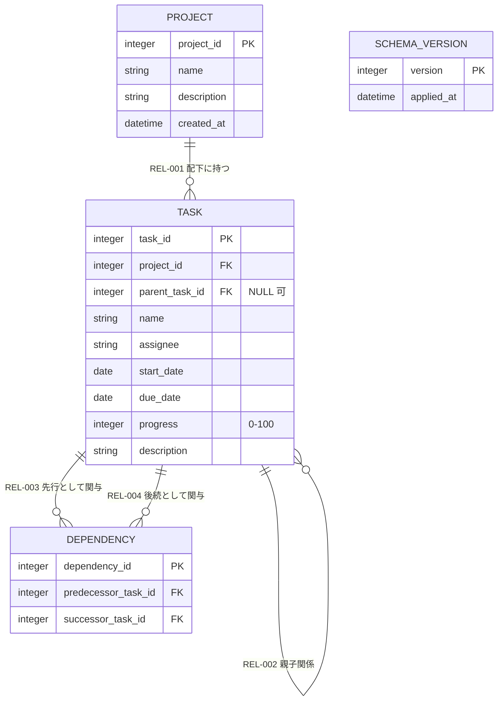

# データ設計書

本ドキュメントは、要件定義書（[`docs/requirements/functional.md`](../../requirements/functional.md) / `docs/requirements/usecase/` / [`docs/requirements/non-functional.md`](../../requirements/non-functional.md)）およびアーキテクチャ設計書（[`docs/design/architecture/architecture.md`](../architecture/architecture.md)）に基づき、基本設計の論理データモデルを整理する。物理テーブル定義（DBMS 固有の型・索引・SQL）は詳細設計工程の対象とし、本書では論理モデルレベルの判断のみを扱う。

- 対象システム名: WBS / ガントチャート管理ツール（ローカル Web アプリ）
- 対応する要件定義書: [`docs/requirements/functional.md`](../../requirements/functional.md) / [`docs/requirements/usecase/`](../../requirements/usecase/) / [`docs/requirements/non-functional.md`](../../requirements/non-functional.md)
- 対応するアーキテクチャ設計書: [`docs/design/architecture/architecture.md`](../architecture/architecture.md)
- 作成日 / 最終更新日: 2026-05-19 / 2026-05-19
- 版: 0.1（ドラフト）

---

## 1. データ設計方針

- **データモデル種別**: 関係モデル（SQLite 単一ファイル）。アーキテクチャ設計書 NFR-004 およびアーキ設計の決定を再掲。親子・依存関係・参照整合性・トランザクション境界が業務上重要であり、関係モデルの強みが要件に合致する。
- **キー方針**: サロゲートキー（整数 ID）を全エンティティで基本採用。理由は (a) 業務的属性（プロジェクト名・タスク名）は変更され得るため自然キーの不変性が担保しづらい、(b) 全エンティティで採番方針を統一することで参照（FK）と画面操作（個別更新・削除）の表現が一貫する。業務的に一意となる組合せは UK で表現する。
- **識別粒度・マルチテナント**: 単一利用者・ローカル PC スタンドアロン。マルチテナントは持たない。プロジェクトを業務データのトップ識別子とし、タスク・依存関係はプロジェクト配下でスコープを切る。
- **削除方針**: 物理削除を基本とする。理由は (a) 単一利用者で監査要件・履歴参照要件が存在しない、(b) UC-001（プロジェクト削除で配下を連鎖削除）、UC-004（タスク削除で関連依存関係を連鎖削除、子は親参照を NULL に昇格）と物理削除が整合する、(c) 論理削除は「削除済みを除いた一意性」など実装コストを伴うが、これを正当化する要件がない。削除済みデータを参照する UC は存在しない。
- **履歴・監査方針**: 履歴テーブルは持たない（過去値の参照を要求する UC が存在しない）。監査 4 項目（作成者・作成日時・更新者・更新日時）も基本的に採用しない（認証なし・単一利用者のため「作成者・更新者」は意味を持たない）。例外として、要件側の ENT-001 プロジェクトに明記された「作成日」は採用する。`updated_at` の採否は詳細設計に申し送る。
- **状態管理の表現**: 業務上の明示的なステータス列は持たない。タスクの「完了」は `progress = 100` で表現される（UC-003 / UC-006 の「進捗 100% のタスクは期限超過の視覚化対象から外れる」に従う）。状態履歴は持たない。
- **参照整合性の方針**: 論理モデル上、すべての FK 関係を宣言する。物理 FK 制約の宣言（SQLite の `FOREIGN KEY` および `PRAGMA foreign_keys = ON`）も方針として確定する（実装上の宣言は詳細設計）。削除時連鎖の挙動はエンティティ別に「3. 各エンティティ詳細」のライフサイクルおよび「5. 整合性ルール」で明示する。
- **派生属性の永続化方針**: 親タスクの開始日・期限・進捗は子から再算出される派生値であるが、本設計では**書き込み時に再算出して永続化する**方針を採る。理由は (a) 描画・PDF 出力の都度に再帰集計を行うと NFR-001（操作後 1 秒以内・初期描画 2 秒以内）達成のマージンが減る、(b) 全タスクが同一スキーマを保つほうが API レスポンスと描画ロジックが単純化する、(c) 書き込み時は影響を受ける親系統のみを再算出すればよく、500 タスク規模での更新コストは許容範囲。これによりアーキ設計の HO-D-002 / HO-D-003 の選択肢から「永続化」を採用したことになる。

---

## 2. エンティティ一覧

| ENT-ID | 名称 | 区分 | 概要 | ライフサイクル概要 | 保持責務 COMP | 由来 ENT（要件側） | 関連 UC・NFR |
|--------|------|------|------|----------------------|------------------|--------------------|----------------|
| ENT-001 | プロジェクト | マスタ | WBS の括り。同時に開けるのは 1 つ | 長期保持（物理削除あり、配下を連鎖削除） | COMP-009 | ENT-001 | UC-001, NFR-002, NFR-004 |
| ENT-002 | タスク | マスタ | プロジェクト配下の作業項目。親子構造を持ち、親は子から派生 | 長期保持（物理削除あり、子は親参照を NULL に昇格） | COMP-009 | ENT-002 | UC-002〜UC-009, NFR-001, NFR-002 |
| ENT-003 | 依存関係 | マスタ | タスク間の先行 / 後続関係（依存線の元データ） | 長期保持（物理削除あり、関連タスク削除で連鎖削除） | COMP-009 | ENT-003 | UC-004, UC-005, UC-006, NFR-002 |
| ENT-004 | スキーマバージョン | ログ・監査 | DB スキーマの版数管理（追記のみ） | 長期保持（追記のみ、削除不可） | COMP-009 | 新規（アーキ設計 RISK-007 由来） | NFR-004 |

メモ:
- ENT-001〜ENT-003 は要件側 ENT-NNN を引き継ぎ、内容は維持する。本書で属性・主キー・関連・整合性を肉付けする。
- ENT-004 は本設計で新規採番した技術メタデータ。アーキ設計 RISK-007（アプリ更新時のスキーマ移行）への対応として導入する。要件側に追加すべきかどうかは「6.1 リスク・懸念点」に記録する。
- 保持責務 COMP はすべて COMP-009（SQLite データベースファイル）。副次的なコピー（ブラウザ内のメモリキャッシュ）は COMP-002（フロント アプリケーション層）に存在するが、これは正本ではなく一時的な表示状態であるため本表には含めない。

---

## 3. 各エンティティ詳細

### ENT-001 プロジェクト

**概要**: WBS の括りを表すエンティティ。利用者は 1 度に 1 プロジェクトのみ開いて操作する。要件側 ENT-001 と対応する。

**属性一覧**:

| 属性名（論理） | 論理型 | 必須 | 役割 | 値の範囲・列挙値 | 概要 |
|-----------------|--------|------|------|--------------------|------|
| project_id | 整数 | ○ | PK | 1 以上の整数（採番） | プロジェクトの内部識別子 |
| name | 文字列 | ○ | 値 | 空文字不可 | プロジェクト名。表示・選択時の主な識別表示 |
| description | 文字列 | − | 値 | 任意（空可） | プロジェクトの説明 |
| created_at | 日時 | ○ | 値 | 作成時の現在日時 | プロジェクトの作成日時。要件側 ENT-001「作成日」由来 |

**キーの考え方**:
- PK: サロゲート（project_id）
- UK: 採用しない。プロジェクト名の重複は要件で禁じられていないため許容する。UC-001 でプロジェクト一覧から利用者が目視で識別する運用とする。
- 自然キーを採らない理由: 名前は変更されうるため不変性が保証できない。

**ライフサイクル**:
- 生成契機: UC-001（プロジェクトを管理する）の「新規作成」操作。UI-002 で利用者が name / description を入力し保存した時点で作成。
- 更新契機: UC-001 の「編集」操作で name / description を更新可能。created_at は不変。
- 削除方針: 物理削除。UC-001 の「削除」操作で削除確認ダイアログ承認後に物理削除する。配下のタスクおよび依存関係も同一トランザクションで連鎖削除する（REL-001、REL-003、REL-004 参照）。

**状態遷移**: 該当なし（状態を持たないエンティティ）。

**監査・履歴**:
- 監査 4 項目: 一部のみ採用。created_at のみ（要件側 ENT-001 由来）。updater / updated_at / created_by は採用しない。updated_at の追加検討は HO-D-002 に申し送り。
- 履歴テーブル: 不要。過去のプロジェクト名・説明を参照する UC が存在しない。

**備考**: 特になし。索引候補・性能懸念は「6. 注意事項」に集約する。

---

### ENT-002 タスク

**概要**: プロジェクト配下の作業項目を表すエンティティ。親子構造（自己参照）と先行 / 後続の依存関係を持つ。親タスク（= 子を持つタスク）の開始日・期限・進捗は子から再算出された派生値を保持する。要件側 ENT-002 と対応する。

**属性一覧**:

| 属性名（論理） | 論理型 | 必須 | 役割 | 値の範囲・列挙値 | 概要 |
|-----------------|--------|------|------|--------------------|------|
| task_id | 整数 | ○ | PK | 1 以上の整数（採番） | タスクの内部識別子 |
| project_id | 参照（ENT-001） | ○ | FK | 既存プロジェクトの project_id | 所属プロジェクト |
| parent_task_id | 参照（ENT-002） | − | FK | 同一プロジェクト内の既存 task_id / NULL（最上位） | 親タスク。NULL は最上位タスクを意味する |
| name | 文字列 | ○ | 値 | 空文字不可 | タスク名。空欄での保存不可（UC-002, UC-003） |
| assignee | 文字列 | − | 値 | 任意（空可） | 担当者名。フリーテキストで保持し、認証主体ではない（UC-002 / UC-003） |
| start_date | 日付 | ○ | 値 | start_date ≤ due_date | 開始日。親タスクの場合は子の最小開始日を保持（派生・永続化） |
| due_date | 日付 | ○ | 値 | start_date ≤ due_date | 期限。親タスクの場合は子の最大期限を保持（派生・永続化） |
| progress | 整数 | ○ | 値 / 派生 | 0 〜 100 | 進捗 (%)。子を持たないタスクは利用者入力。親タスクは子の進捗から再算出した結果を保持（派生・永続化）。算出式の確定は HO-D-003 |
| description | 文字列 | − | 値 | 任意（空可） | 説明・備考 |

**キーの考え方**:
- PK: サロゲート（task_id）。UC-003（編集）/ UC-004（削除）/ UC-005（依存関係の対象指定）/ UC-007（ドラッグ&ドロップによる更新）でタスクを一意に参照するために必要。
- UK: 採用しない。タスク名はプロジェクト内で重複可能（要件で禁じられていない）。
- 自己参照: parent_task_id による自己参照を持つ。同一プロジェクト内に閉じる（親子をまたいで異なるプロジェクトのタスクは指定不可、RULE-008）。

**ライフサイクル**:
- 生成契機: UC-002（タスクを登録する）。UI-004 で利用者が入力し保存した時点で作成。親タスクが指定された場合は、その親系統の start_date / due_date / progress を同一トランザクションで再算出する。
- 更新契機:
  - UC-003（タスクを編集する）: name / assignee / start_date / due_date / progress / parent_task_id / description が更新対象。親を変更した場合は変更前後の親系統を再算出する。
  - UC-007（ガントチャート上で期間変更）: start_date / due_date が更新対象。親系統の再算出を伴う。
  - 子タスクの追加・更新・削除に伴う波及更新: 親タスクの start_date / due_date / progress は子から再算出される（RULE-009、RULE-010）。
  - 親タスクの start_date / due_date / progress は利用者からの直接編集不可（RULE-011、UC-003 で読み取り専用）。
- 削除方針: 物理削除。UC-004 の削除操作で対象タスクを物理削除する。同一トランザクションで以下を実施する:
  - 子タスクの parent_task_id を NULL に更新（最上位への昇格、UC-004）
  - 対象タスクが先行または後続として関与する依存関係を連鎖削除（UC-004、REL-003、REL-004）
  - 削除対象に親が存在した場合、その親系統の派生値を再算出
- プロジェクト削除時は配下タスクを連鎖削除する（REL-001）。

**状態遷移**: 該当なし。明示的なステータス列を持たない。要件側で「完了」は progress = 100 で表現される（UC-006、UC-003）。

**監査・履歴**:
- 監査 4 項目: 採用しない。要件側に作成日時の指定がなく、認証なし環境では作成者・更新者が意味を持たない。created_at / updated_at の追加検討は HO-D-002。
- 履歴テーブル: 不要。タスクの過去値を参照する UC が存在しない（ガントチャートは現在値のみを表示する）。

**備考**: 親タスク判定は parent_task_id を持つことではなく、「自身を parent_task_id として参照する子タスクが存在するか」で判定する（スキーマ上は区別しない）。これにより UC-007 の「子を持つタスクのドラッグ抑止」は子の有無の動的判定で実現する。

---

### ENT-003 依存関係

**概要**: タスク間の先行 / 後続関係を表すエンティティ。ガントチャート上の依存線の元データとなる。要件側 ENT-003 と対応する。

**属性一覧**:

| 属性名（論理） | 論理型 | 必須 | 役割 | 値の範囲・列挙値 | 概要 |
|-----------------|--------|------|------|--------------------|------|
| dependency_id | 整数 | ○ | PK | 1 以上の整数（採番） | 依存関係の内部識別子 |
| predecessor_task_id | 参照（ENT-002） | ○ | FK, UK | 既存 task_id（同一プロジェクト内） | 先行タスク |
| successor_task_id | 参照（ENT-002） | ○ | FK, UK | 既存 task_id（同一プロジェクト内、predecessor_task_id と異なる） | 後続タスク |

**キーの考え方**:
- PK: サロゲート（dependency_id）。UC-005 の個別削除で参照する。
- UK: (predecessor_task_id, successor_task_id) の組合せ。同一の先行・後続ペアの重複登録を禁ずる（RULE-006、UC-005）。
- 自然キー（複合）を PK に採らない理由: 全エンティティのキー方針を「サロゲート + UK」で統一するため。動作上の差は小さいが、API・画面操作上の参照表現が統一される利点を取る。

**ライフサイクル**:
- 生成契機: UC-005（タスク間の依存関係を管理する）。UI-005 で利用者が追加した時点で作成。
- 更新契機: なし。依存関係は predecessor / successor の組合せのみを保持し、その変更は「削除 + 追加」で表現する。
- 削除方針: 物理削除。以下のいずれかで削除される:
  - UC-005 で利用者が明示的に削除
  - UC-004 でタスクを削除した際に、当該タスクが先行または後続として関与する依存関係を連鎖削除（REL-003、REL-004）
  - UC-001 でプロジェクトを削除した際に、配下タスク経由で間接的に連鎖削除

**状態遷移**: 該当なし。

**監査・履歴**:
- 監査 4 項目: 採用しない。
- 履歴テーブル: 不要。

**備考**: predecessor_task_id と successor_task_id は同一プロジェクト配下のタスクに限定する（プロジェクト跨ぎの依存は要件外、RULE-008 派生）。

---

### ENT-004 スキーマバージョン

**概要**: DB スキーマの版数を記録する技術メタデータ。アプリ起動時に未適用のマイグレーション差分を判定するために使用する。アーキ設計 RISK-007 への対応として導入。

**属性一覧**:

| 属性名（論理） | 論理型 | 必須 | 役割 | 値の範囲・列挙値 | 概要 |
|-----------------|--------|------|------|--------------------|------|
| version | 整数 | ○ | PK | 1 以上の整数（昇順、連番） | 適用済みスキーマバージョン番号 |
| applied_at | 日時 | ○ | 値 | 適用時の現在日時 | 当該バージョンが適用された日時 |

**キーの考え方**:
- PK: version（自然キー）。サロゲートは持たない。バージョン番号自体が業務的・運用的に一意であり、不変。

**ライフサイクル**:
- 生成契機: アプリ起動時のマイグレーション処理。未適用の差分を順に適用し、適用完了ごとに 1 レコード追加する。
- 更新契機: なし（追記専用）。
- 削除方針: 削除不可（追記専用）。NFR-004（運用環境・インフラ制約）の維持目的。

**状態遷移**: 該当なし。

**監査・履歴**: applied_at が監査属性を兼ねる。

**備考**: マイグレーションの実装方式（起動時自動適用 vs 手動コマンド）は HO-D-005 に申し送る。

---

## 4. 関連図

### 4.1 エンティティ関連図

メモ:
- 要件定義書の `erDiagram` との差分: 主要構造（プロジェクト 1: タスク N、タスクの親子自己参照、タスク 1: 依存関係 N（先行 / 後続））は要件側と一致する。属性は要件側「主な保有情報」を本書で具体化したのみで、新規エンティティの追加もない。ENT-004 スキーマバージョンは技術メタデータのため erDiagram からは独立した存在として図には含めるが業務関連は持たない。
- 主要属性に絞った網羅は本図、属性の完全列挙は「3. 各エンティティ詳細」で担保する。

### 4.2 関連一覧

| REL-ID | 親 ENT | 子 ENT | 多重度 | 参照の向き | 依存の強さ（親が消えると子も消えるか） | 関連の意味 | 関連 UC |
|--------|--------|--------|--------|-------------|------------------------------------------|-------------|-----------|
| REL-001 | ENT-001 プロジェクト | ENT-002 タスク | 1 : 0..N | 子（タスク） → 親（プロジェクト） | 強（連鎖削除） | プロジェクトはその配下にタスクを保有する | UC-001, UC-002 |
| REL-002 | ENT-002 タスク（親） | ENT-002 タスク（子） | 1 : 0..N（自己参照、parent_task_id 経由） | 子 → 親（NULL = 最上位） | 弱（親削除時に子の parent_task_id を NULL に昇格） | タスクは別タスクを親に持てる（階層構造） | UC-002, UC-003, UC-004 |
| REL-003 | ENT-002 タスク（先行） | ENT-003 依存関係 | 1 : 0..N | 依存関係 → 先行タスク | 強（連鎖削除） | タスクが他タスクの先行として関与する関係 | UC-004, UC-005, UC-006 |
| REL-004 | ENT-002 タスク（後続） | ENT-003 依存関係 | 1 : 0..N | 依存関係 → 後続タスク | 強（連鎖削除） | タスクが他タスクの後続として関与する関係 | UC-004, UC-005, UC-006 |

自己参照・循環参照に関する注記:
- **REL-002（タスクの親子）は自己参照のツリー構造**。終端条件は parent_task_id = NULL（最上位）。サイクル禁止（RULE-004）により、有向非巡回グラフ（ツリー）として扱える。
- **ENT-003 依存関係は ENT-002 タスク間に DAG を構成する**。依存関係を介したサイクル禁止（RULE-007）により、先行 → 後続のたどりは有向非巡回グラフとなる。
- 上記 2 つのグラフは互いに独立。親子グラフ（ツリー）と依存グラフ（DAG）の整合性は業務上要求されていない（同じ親の下にあるタスク同士の依存関係も、親子をまたぐ依存関係も許容される）。

---

## 5. 整合性ルール

| RULE-ID | 内容 | 対象 ENT | カテゴリ | 違反時の扱い | 関連 UC・NFR |
|---------|------|----------|----------|---------------|----------------|
| RULE-001 | タスク名は必須（空文字不可） | ENT-002 | 必須性 | 登録拒否（アプリケーション層 = COMP-006 で検証、画面入力段階でも UI 側で警告） | UC-002, UC-003 |
| RULE-002 | start_date ≤ due_date | ENT-002 | 値域 | 登録拒否（アプリケーション層で検証、画面入力段階でも UI 側で警告） | UC-002, UC-003, UC-007 |
| RULE-003 | progress は 0 以上 100 以下の整数 | ENT-002 | 値域 | 登録拒否（アプリケーション層で検証） | UC-002, UC-003 |
| RULE-004 | タスクの親子関係に循環参照が生じないこと（自身の子孫を親に指定不可） | ENT-002（REL-002） | 値域・状態遷移 | 登録拒否（アプリケーション層で検証、検出は都度 DFS） | UC-003 |
| RULE-005 | 依存関係の predecessor_task_id ≠ successor_task_id（自己依存禁止） | ENT-003 | 値域 | 登録拒否（アプリケーション層で検証、画面入力段階でも UI 側で警告） | UC-005 |
| RULE-006 | 依存関係 (predecessor_task_id, successor_task_id) の組合せは一意（同一ペアの重複禁止） | ENT-003 | 一意性 | 登録拒否（データ層で UK 違反を検出、アプリケーション層で事前判定） | UC-005 |
| RULE-007 | 依存関係を介した循環依存が生じないこと | ENT-003（REL-003、REL-004） | 値域・状態遷移 | 登録拒否（アプリケーション層で検証、検出は都度 DFS） | UC-005 |
| RULE-008 | タスクの parent_task_id および依存関係の predecessor / successor は、当該タスクと同一プロジェクト配下のタスクであること | ENT-002, ENT-003 | 参照整合性 | 登録拒否（アプリケーション層で検証） | UC-001, UC-003, UC-005 |
| RULE-009 | 親タスク（子を持つタスク）の start_date = 子タスク群の start_date の最小、due_date = 子タスク群の due_date の最大 | ENT-002（REL-002） | 業務ルール | 自動補正（書き込み時に COMP-006 が再算出して永続化） | UC-002, UC-003, UC-004, UC-007 |
| RULE-010 | 親タスクの progress は子タスクの progress から自動算出された値を保持する | ENT-002（REL-002） | 業務ルール | 自動補正（書き込み時に COMP-006 が再算出して永続化）。算出式は HO-D-003 で確定 | UC-002, UC-003, UC-004 |
| RULE-011 | 親タスクの start_date / due_date / progress は利用者からの直接編集を受け付けない（読み取り専用） | ENT-002 | 業務ルール | 登録拒否（画面入力段階で読み取り専用化、アプリケーション層でも検証） | UC-003, UC-007 |
| RULE-012 | プロジェクト削除時、配下タスクおよび依存関係を同一トランザクションで連鎖削除する | ENT-001 → ENT-002, ENT-003 | 参照整合性 | 連鎖削除（データ層の FK 制約 + アプリケーション層の整合性確認） | UC-001 |
| RULE-013 | タスク削除時、子タスクの parent_task_id を NULL に更新し、関連依存関係を同一トランザクションで連鎖削除する | ENT-002 → ENT-002, ENT-003 | 参照整合性 | NULL 化（子）+ 連鎖削除（依存）（アプリケーション層で順序制御）。元の親系統を再算出する | UC-004 |

メモ:
- 違反時の扱いは「登録拒否」「自動補正」「連鎖削除」「NULL 化」のいずれかで明示。詳細な実装位置（データ層 FK 制約か、アプリケーション層検証か、画面入力検証か）の最終確定は詳細設計工程だが、本表で方針を決め切る。
- 要件定義書には現時点で `BRU-NNN`（業務ルール ID）が定義されていないため、本表は要件側 BRU を参照していない。整合性ルールのうち UC 側の例外フローに直接記述されている制約（RULE-001 〜 RULE-007、RULE-011）は、要件側のフロー記述で十分に表現されているとみなす。RULE-009 / RULE-010 はアーキ設計 COMP-006 の不変条件として明示されており、それを本書で具体化したもの。
- 循環参照検出（RULE-004 / RULE-007）の実装アルゴリズムは「都度 DFS」を方針とする（アーキ設計 RISK-003 / HO-D-004 を引き取り）。推移閉包テーブルなどデータ層側の補助構造は持たない（規模上不要、ALT-006 参照）。

---

## 6. 注意事項

### 6.1 リスク・懸念点

| RISK-ID | 内容 | 影響範囲 | 顕在化条件 | 暫定対応 | 詳細設計への申し送り |
|---------|------|----------|-------------|-----------|------------------------|
| RISK-001 | 親タスクの派生値（start_date / due_date / progress）を永続化する方針のもとで、書き込み時の再算出漏れ・順序ミスが起きると整合性が崩れる（DB 上は親子で食い違った値となる） | ENT-002 / RULE-009, RULE-010 | 親系統の更新を伴う書き込み（UC-002, UC-003, UC-004, UC-005 ※依存先行などのバルク更新, UC-007） | 全ての親系統更新を 1 トランザクションに包み、トランザクションコミット直前に再算出ロジックを必ず通す方針とする | 再算出のトリガ・順序・テスト方針を詳細設計（クラス設計）で具体化。COMP-006 の関心事 |
| RISK-002 | 親が子をすべて失った場合の派生値の扱いが未定。親 → 通常タスクに転じる際の start_date / due_date / progress の初期値が決まっていない | ENT-002 / RULE-009, RULE-010 | UC-004（子をすべて削除）、UC-003（最後の子の親付け替え） | 暫定: 子を失った時点で「直前の派生値を残す」とし、利用者が UI-004 で編集可能となる（読み取り専用解除）方針とする | HO-D-004 で確定 |
| RISK-003 | 進捗の親集約アルゴリズムが未確定（重み付き平均 / 単純平均 / 子の最小 / 別途保持）。RULE-010 は「子から算出」の方針のみ示し、具体式は定めていない | ENT-002 / RULE-010 | 子の進捗が異なる値を取る一般ケース | 暫定: 期間（due_date − start_date）で重み付けした加重平均で進行。詳細設計工程で確定 | HO-D-003 で確定 |
| RISK-004 | 認証なし環境で「assignee（担当者）」はフリーテキストのため、表記揺れ（例: 「山田太郎」「山田 太郎」「Yamada」）でフィルタが意図通り動かない可能性 | ENT-002 / UC-008 | UC-008 のフィルタ実行時 | 暫定: 完全一致または部分一致のテキスト一致で進行（要件記載通り）。表記揺れ吸収は要件外 | 詳細設計（インタフェース設計）でフィルタの一致方式（前方一致 / 部分一致 / 完全一致）を確定 |
| RISK-005 | 日付の保存形式・タイムゾーン仕様が未確定。UC-006 の「期限超過」判定は PC のローカル時刻基準（アーキ RISK-004 で確定）だが、保存時の日付表現が ISO 8601 文字列か Unix エポックかなどで詳細設計に揺れがある | ENT-002 / UC-006 | 日付境界での判定（深夜操作・タイムゾーン跨ぎ） | 暫定: 日付（date 型）として日単位でのみ保持し、時刻成分は持たない。「期限超過」は PC のローカル日付（YYYY-MM-DD）と due_date の単純比較とする | HO-D-006 で物理的な日付保存形式を確定 |
| RISK-006 | スキーマ移行（マイグレーション）の運用が未確定。アプリ更新で破壊的変更が発生した際の利用者側 DB ファイルの取り扱いが定まっていない | ENT-004 / NFR-004 | アプリのバージョン更新時 | 暫定: ENT-004 スキーマバージョンに記録し、起動時に未適用差分を順次適用する方針 | HO-D-005 で適用方式（自動 / 手動）を確定 |
| RISK-007 | ENT-004（スキーマバージョン）は要件側 ENT-NNN に存在しない技術メタデータであり、要件側に追加すべきか本書に閉じるかの方針が未決 | 要件定義書 / ENT-004 | 要件側ドキュメントとの整合確認時 | 暫定: 本書側で導入し、要件側には追加しない（業務エンティティではない技術都合のため） | 要件側の運用ポリシー（技術メタを要件に含めるか）の方針が決まり次第同期 |
| RISK-008 | progress が「子を持たない状態のときの直接入力値」と「子を持つ状態の派生値」を 1 つの列で兼ねるため、状態遷移（子の追加・削除）で意味が切り替わる | ENT-002 / RULE-010, RULE-011 | UC-002（親に最初の子を追加）、UC-004（最後の子を削除）、UC-003（親付け替え） | 暫定: 「子を持つ状態」かを動的判定し、UI と検証ロジックで読み取り専用 / 編集可能を切り替える | クラス設計で派生計算の責務と入力検証の責務を分離して具体化 |
| RISK-009 | UC-004 のタスク削除で「最上位への昇格」が起きた場合、昇格後のタスクが当該プロジェクト内で「最上位 = 親を持たない」タスク群に混ざる。これに伴う表示順や暗黙の順序仕様は要件で未指定 | ENT-002 / UC-004 | UC-004 削除後の UC-006 表示 | 暫定: 表示順は task_id の昇順または name 順とし、削除前の階層位置は記憶しない | HO-D-007（タスクの表示順仕様）に申し送り |

リスクの典型カテゴリのうち、本システムでは以下は該当しないか影響軽微:
- マスタ変更のトランザクション波及（マスタ / トランザクションの明確な分離なし、過去値参照 UC なし）
- 多通貨・多言語の保持粒度（金額・多言語要件なし）
- 監査項目の保存期間と法令・規制（監査項目を持たない、ローカル単独利用）
- 外部システムから取り込むデータの権威性（外部連携なし）
- 非正規化の誘惑（親タスクの派生永続化は採用済み。それ以外で正規化崩しの動機がない）

### 6.2 代替案と採らない理由

| ALT-ID | 対象判断 | 代替案概要 | 採らない理由 | 再検討条件 |
|--------|----------|------------|---------------|-------------|
| ALT-001 | キー方針 | 自然キーを PK にする（例: タスク名 + プロジェクト ID） | タスク名は変更可能（UC-003）であり PK の不変性が担保できない。プロジェクト内で重複も許容されるため、自然キーで一意性も保証できない | 業務上「タスク名は不変かつプロジェクト内一意」というルールが明文化された場合 |
| ALT-002 | 削除方針 | 論理削除（削除フラグ列）を全エンティティで採用 | 単一利用者・監査要件・履歴参照 UC なし。論理削除を採ると「削除済みを除く一意性」「画面・フィルタからの除外」「カスケード扱いの再設計」など実装コストが増し、要件で正当化できない | 監査要件または「ごみ箱」機能の要件が追加された場合 |
| ALT-003 | 履歴の持ち方 | タスク・依存関係に履歴テーブル（変更前後の値を保持） | 過去値を参照する UC が存在しない。500 タスク × 編集頻度を考えるとデータ量も実装コストも要件未充当 | 「過去のスケジュールに戻す」等の UC が追加された場合 |
| ALT-004 | エンティティ分割 | 依存関係を ENT-003 として独立せず、ENT-002 タスクに「先行タスク」属性を 1 つだけ持たせる | UC-005 で 1 タスクに対し複数の先行・後続を持てる必要があり、配列を持たないリレーショナルモデルでは別エンティティ化が必須 | 1 タスク 1 先行のみとする業務ルールが採用された場合（実質ありえない） |
| ALT-005 | 派生項目の扱い | 親タスクの start_date / due_date / progress を永続化せず、表示時に都度算出（DB は子のみを保持） | (a) 500 タスク × 1,000 依存関係（NFR-002）規模での再帰集計が描画ごとに発生し、NFR-001（操作後 1 秒・初期描画 2 秒）達成のマージンが減る、(b) API レスポンス・PDF 出力のいずれでも親値が必要なため、毎回算出するより書き込み時に 1 回算出するほうが総コストが小さい、(c) スキーマが「子のみ」「親は別ビュー」と分かれると描画側のロジックが複雑化 | クライアント描画性能が想定以上に十分で、書き込み時の整合性管理コストが運用上問題化した場合 |
| ALT-006 | 循環参照検出 | 推移閉包テーブル（祖先 / 後続の全ペアを別テーブルに永続化）で参照時の判定を高速化 | 500 タスク・1,000 依存関係規模では都度 DFS で NFR-001 を達成可能（アーキ RISK-003 でも同方針）。推移閉包は更新時のメンテナンスコスト（O(N²) 級）と整合性管理の負担が大きく、規模に対し過剰 | 規模が 10 倍以上（5,000 タスク級）に拡大し、編集応答が悪化した場合 |
| ALT-007 | 依存関係のキー | 複合自然キー (predecessor_task_id, successor_task_id) を PK とする | 機能的には等価だが、全エンティティの「サロゲート + UK」方針に揃えることで API / 画面操作上の参照表現が統一される。サロゲートを採るデメリットは ID 列が 1 つ増えるのみで、500 タスク規模では無視できる | 「すべてのエンティティで自然キーを基本とする」という方針への切り替えが組織標準化された場合 |
| ALT-008 | タスクのステータス列 | progress と独立した `status` 列（未着手 / 進行中 / 完了 / 中断 等）を持つ | 要件側に明示的なステータス区分が存在せず、「完了」は progress = 100 で表現されている（UC-003, UC-006）。独立ステータスを導入すると progress との整合（例: progress = 100 だが status = 進行中）の整合性ルールが新たに必要となり、要件で正当化できない | 「中断」「未着手」など progress では表現しきれない状態を区別する UC が追加された場合 |

メモ:
- 物理設計寄りの判断（索引列・正規化崩し・パーティション等）は本表に含めず、詳細設計の代替案検討で扱う。

### 6.3 後続工程への申し送り事項

#### 詳細設計（機能・画面単位 / 物理テーブル設計）への申し送り

| HO-D-ID | 内容 | 想定選択肢 | 決定責任者 / 相談先 |
|---------|------|------------|----------------------|
| HO-D-001 | 索引戦略の確定（典型候補: tasks.project_id、tasks.parent_task_id、dependencies.predecessor_task_id、dependencies.successor_task_id、フィルタ用に tasks.assignee / start_date / due_date の組合せ） | 単列索引のみ / 複合索引（クエリパターンに応じて） | データ設計 / フロント実装（クエリパターン提供） |
| HO-D-002 | created_at / updated_at の採否拡張（要件側 ENT-001 の「作成日」以外への横展開） | (a) 全エンティティに created_at / updated_at を追加 / (b) 採用しない / (c) ENT-002 タスクのみ追加 | データ設計 |
| HO-D-003 | 親タスクの progress 集約アルゴリズム（具体式） | (a) 期間（due_date − start_date）で重み付き平均 / (b) 子数で単純平均 / (c) 最小値 / (d) 完了子数の割合 | クラス設計 / HCD（[`design-plan.md`](../../requirements/design-plan.md) 申し送り 5 / アーキ HO-D-003 由来） |
| HO-D-004 | 親が子を失った場合の派生値の挙動（直前値を残す / リセット / 利用者編集可能化） | (a) 直前値を保持し読み取り専用解除 / (b) NULL またはデフォルト値にリセット / (c) 利用者に確認 | クラス設計 / HCD |
| HO-D-005 | スキーマ移行（マイグレーション）の実装方式 | (a) 起動時に未適用差分を自動適用 / (b) コマンドで手動適用 / (c) 起動時に検出のみ・適用は利用者確認後 | 詳細設計（アーキ HO-D-010 / RISK-007 由来） |
| HO-D-006 | 日付の物理保存形式 | (a) ISO 8601 文字列（YYYY-MM-DD） / (b) Unix エポック（秒） / (c) Julian Day | データ設計（詳細） |
| HO-D-007 | 同一プロジェクト内のタスクの既定表示順（特に削除昇格後） | (a) task_id 昇順 / (b) name 順 / (c) start_date 順 / (d) ユーザ指定順を別途持つ | HCD / インタフェース設計 |
| HO-D-008 | 親子・依存関係の循環参照検出アルゴリズムの実装詳細（都度 DFS の実装方式） | (a) アプリ層で隣接リストを構築し DFS / (b) SQLite の再帰 CTE を活用 | クラス設計 / データ層実装（アーキ HO-D-004 由来） |
| HO-D-009 | DBMS（SQLite）固有の型指定（TEXT / INTEGER / REAL / NUMERIC のいずれを用いるか） | SQLite の型親和性ルールに沿った具体マッピング | データ設計（詳細） |
| HO-D-010 | 物理 FK 制約の宣言可否と `PRAGMA foreign_keys = ON` の運用 | (a) FK 制約を宣言し PRAGMA で有効化 / (b) アプリ層でのみ整合性確保 | データ設計（詳細） |
| HO-D-011 | UC-008 フィルタの assignee 一致方式 | (a) 完全一致 / (b) 前方一致 / (c) 部分一致 | インタフェース設計（RISK-004 由来） |

#### インフラ設計への申し送り

アーキテクチャ設計書のとおり、本システムはインフラ設計工程をスキップする（[`design-plan.md`](../../requirements/design-plan.md) / NFR-004 によりローカル PC 完結が確定）。物理配置（ローカル PC）・ネットワーク構成（なし）・冗長化（なし）・バックアップ運用（OS 機能に委ねる）・DBMS 製品選定（SQLite で確定）・ストレージ容量見積り（500 タスク × N プロジェクト規模で問題にならない）はすべて確定済みであり、本書から申し送る事項はない。

---

## 7. 要件・アーキ ID 対応表（トレーサビリティ）

| 要件 / アーキ ID | 概要 | 主に紐付く ENT | 主に紐付く RULE | 主に紐付く REL |
|---|---|---|---|---|
| UC-001 | プロジェクトを管理する | ENT-001, ENT-002, ENT-003 | RULE-012 | REL-001 |
| UC-002 | タスクを登録する | ENT-002 | RULE-001, RULE-002, RULE-003, RULE-008, RULE-009, RULE-010 | REL-001, REL-002 |
| UC-003 | タスクを編集する | ENT-002 | RULE-001 〜 RULE-004, RULE-008, RULE-009, RULE-010, RULE-011 | REL-002 |
| UC-004 | タスクを削除する | ENT-002, ENT-003 | RULE-013 | REL-002, REL-003, REL-004 |
| UC-005 | タスク間の依存関係を管理する | ENT-003 | RULE-005, RULE-006, RULE-007, RULE-008 | REL-003, REL-004 |
| UC-006 | ガントチャートを表示する | ENT-002, ENT-003 | RULE-009, RULE-010 | REL-002, REL-003, REL-004 |
| UC-007 | ガントチャート上でタスク期間を変更する | ENT-002 | RULE-002, RULE-009, RULE-010, RULE-011 | REL-002 |
| UC-008 | タスクをフィルタする | ENT-002 | - | - |
| UC-009 | PDF エクスポート | ENT-002, ENT-003 | - | REL-002, REL-003, REL-004 |
| NFR-001 | 画面応答時間 | ENT-002（派生永続化）, ENT-003 | RULE-009, RULE-010（永続化により再算出を書き込み時に集中） | - |
| NFR-002 | 500 タスク / 1,000 依存関係 | ENT-002, ENT-003 | RULE-004, RULE-007（都度 DFS で対応） | REL-002, REL-003, REL-004 |
| NFR-004 | 運用環境・インフラ制約 | ENT-001 〜 ENT-004 | - | - |
| COMP-006 不変条件 (a)〜(g) | アーキ層の業務ルール | ENT-002, ENT-003 | RULE-001 〜 RULE-013 | REL-002, REL-003, REL-004 |
| COMP-009 SQLite | 保持責務 | ENT-001 〜 ENT-004 | 全 RULE | 全 REL |
| RISK-007（アーキ） | スキーマ移行 | ENT-004 | - | - |

メモ:
- 全 ENT がいずれかの UC または NFR に紐付いていることを確認済み（ENT-001 → UC-001, ENT-002 → UC-002〜UC-009, ENT-003 → UC-004, UC-005, UC-006, ENT-004 → NFR-004 / アーキ RISK-007）。
- 全 ENT の保持責務 COMP は COMP-009（SQLite）に集約。

---

## 8. 参照ドキュメント

- 要件定義書（機能要件）: [`docs/requirements/functional.md`](../../requirements/functional.md)
- 要件定義書（非機能要件）: [`docs/requirements/non-functional.md`](../../requirements/non-functional.md)
- ユースケース詳細: [`docs/requirements/usecase/`](../../requirements/usecase/)
- アーキテクチャ設計書: [`docs/design/architecture/architecture.md`](../architecture/architecture.md)
- 後続設計プラン: [`docs/requirements/design-plan.md`](../../requirements/design-plan.md)
