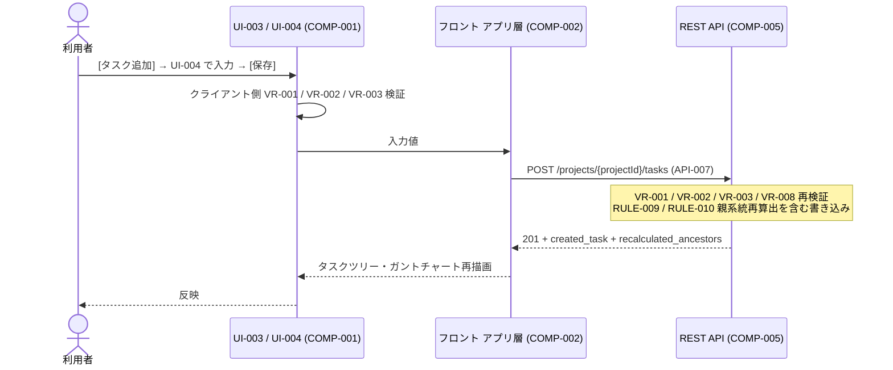
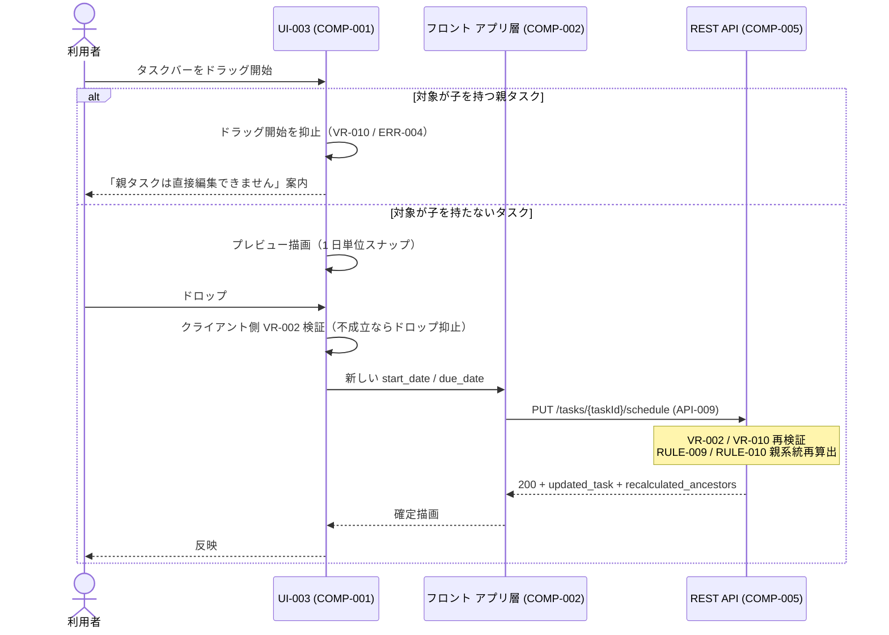
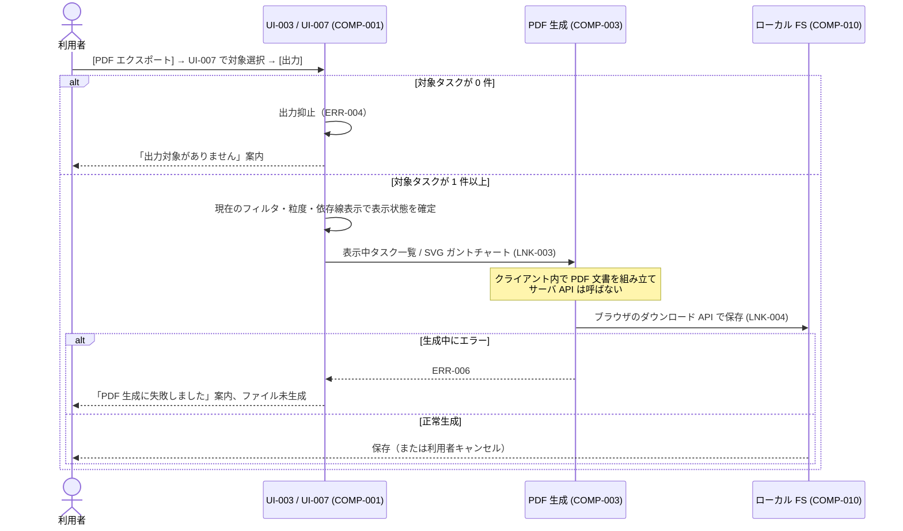

# インタフェース設計書

本ドキュメントは、要件定義書（[`docs/requirements/functional.md`](../../requirements/functional.md) / `docs/requirements/usecase/` / [`docs/requirements/non-functional.md`](../../requirements/non-functional.md)）、アーキテクチャ設計書（[`docs/design/architecture/architecture.md`](../architecture/architecture.md)）、データ設計書（[`docs/design/data/data-design.md`](../data/data-design.md)）に基づき、基本設計の起点となる**論理インタフェース契約**を整理する。画面のピクセル配置・配色・最終文言・JSON スキーマ・物理ネットワーク設定など、実装工程で変わりうる詳細は本ドキュメントの対象外とする。

- 対象システム名: WBS / ガントチャート管理ツール（ローカル Web アプリ）
- 対応する要件定義書: [`docs/requirements/functional.md`](../../requirements/functional.md) / [`docs/requirements/usecase/`](../../requirements/usecase/) / [`docs/requirements/non-functional.md`](../../requirements/non-functional.md)
- 対応するアーキテクチャ設計書: [`docs/design/architecture/architecture.md`](../architecture/architecture.md)
- 対応するデータ設計書: [`docs/design/data/data-design.md`](../data/data-design.md)
- 作成日 / 最終更新日: 2026-05-19 / 2026-05-19
- 版: 0.1（ドラフト）

---

## 1. I/F 設計方針

本インタフェース設計全体を貫く方針を以下に示す。論理契約レベルの判断のみを扱い、製品選定や具体設定値には踏み込まない。

- **API 呼出様式**: REST を基本とする。リソース指向で `プロジェクト` / `タスク` / `依存関係` を URI 上に表現し、CRUD は HTTP メソッドで表現する。RPC / GraphQL / メッセージングは採用しない（単一クライアント・単一プロセス・少数エンドポイントのため REST の表現力で十分。アーキ設計 ALT-007 の自前 SVG 描画方針と整合し、API 設計を最小限に保つ）。
- **人間向け I/F の種別適用方針**:
  - **画面**: 採用。対象利用者は単独の利用者（NFR-003）。UI-001〜UI-007 として要件定義書に列挙済み。
  - **帳票**: 採用。フォーマットは PDF のみ（UC-009 / UI-008 / UI-009）。CSV / Excel は要件外。
  - **通知**: 採用しない。単一利用者・単一プロセス・外部システム連携なし（要件 スコープ外）のため、メール・SMS・チャット等への送出経路を持たない。
  - **CLI**: 採用しない。利用者操作はすべて画面（UI-003）から行う前提。ローカルサーバの起動コマンドはアプリの操作 I/F ではなく運用シェル操作に位置付け、本書の対象外とする。
  - **音声（VUI / IVR）**: 採用しない。要件で音声・電話チャネルは想定外。
  - **チャット・メールボット**: 採用しない。要件で外部チャネルは想定外。
- **バリデーションの責務分離**: 画面側（UI-002 / UI-004 / UI-005 / UI-006）は UX 向上を目的とした即時検証（必須・形式・値域）を担い、保存ボタン押下前に利用者へエラーを表示する。API 側（COMP-005 / COMP-006）は業務正当性の最終判断を行い、画面側を通過した値であっても必ず再検証する。両者で共通する制約は VR-NNN として本書に集約し、データ設計の RULE-NNN を参照する形で同一根拠から派生させる。
- **認証認可の位置**: 認証認可を持たない。要件で「ユーザー管理（認証・認可・権限）は含まない」と明記されており、アーキ設計でも認証コンポーネントは導入しない。すべての API は認証不要として扱う（実体としては localhost からの呼出のみを受け付けるため、ネットワーク越しの不正アクセス経路がない）。
- **エラー表現の統一**: すべての API のエラーレスポンスを「機械可読なコード（ERR-NNN）＋人間可読なメッセージ＋詳細（VR-NNN / RULE-NNN 等の参照）」の統一構造で揃える。HTTP ステータスは分類の粗いシグナルとして用い、詳細はボディの ERR-NNN で識別する。フィールド命名規則・JSON 構造の最終形は詳細設計で確定する。
- **同期／非同期の境界適用**: すべての API を**同期完結**とする。アーキ設計の「非同期化する区間: なし」を I/F に落とし込む。利用者操作 → API 呼出 → SQLite 書き込み → 画面再描画までを 1 つの同期チェーンとする。PDF 生成（UC-009）はサーバ API を呼ばずクライアント内で完結する。
- **タイムアウト・リトライの基本方針**:
  - **画面同期 API**（CRUD 系すべて）: 短めのタイムアウトを採る。リトライはサーバ側で実施しない。クライアント側は失敗時に利用者へエラーを提示し、利用者が再操作することで再試行する。
  - **PDF 生成（クライアント内）**: タイムアウトは設定しない（利用者操作のキャンセルのみ）。データ量によっては数秒オーダーとなるため、フロント側でローディング表示を出す（HCD / UI 設計工程で具体化）。
  - 具体秒数は詳細設計で確定する。本書では「短め」「リトライなし」の方針に留める。
- **機微情報の取り扱い**: 本システムは認証情報・個人情報・金額情報を扱わない。`assignee`（担当者）はフリーテキストで保持されるが、認証主体ではない単なる文字列であり、機微扱いとはしない。リクエスト・レスポンス・ログいずれも平文で扱ってよい。例外として、ログには SQL クエリ全文・スタックトレースの過剰出力を避ける方針を 5 章で示す。
- **ファイル／帳票の文字コード・改行コード原則**: 帳票（UI-008 / UI-009）は PDF のみで、文字コード・改行コードの直接的な論点は持たない（PDF 内部のフォント埋め込みは詳細設計）。本システムはファイル形式の SIF を持たないため、入出力テキストファイルに関する原則は持たない。

---

## 2. インタフェース一覧

### 2.1 人間向けインタフェース一覧（UI-NNN）

要件定義書の `UI-NNN` をそのまま引き継ぐ。本ドキュメントで新規採番はしない。本システムは画面 7 種・帳票 2 種のみで、通知・CLI・音声・ボットは採用しない（1 章で宣言）。

| UI-ID | 名称 | 種別 | 対象利用者 | チャネル | 主な起動 API | 関連 UC | 関連 ENT |
|-------|------|------|-----------|---------|---------------|---------|---------|
| UI-001 | プロジェクト選択画面 | 画面 | 利用者 | Chrome（localhost） | API-001, API-005 | UC-001 | ENT-001 |
| UI-002 | プロジェクト編集ダイアログ | 画面 | 利用者 | Chrome（localhost） | API-002, API-003, API-004 | UC-001 | ENT-001 |
| UI-003 | WBS メイン画面 | 画面 | 利用者 | Chrome（localhost） | API-006, API-009, API-010, API-011 | UC-002〜UC-009 | ENT-001, ENT-002, ENT-003 |
| UI-004 | タスク編集ダイアログ | 画面 | 利用者 | Chrome（localhost） | API-007, API-008 | UC-002, UC-003 | ENT-002 |
| UI-005 | 依存関係編集ダイアログ | 画面 | 利用者 | Chrome（localhost） | API-012, API-013 | UC-005 | ENT-003 |
| UI-006 | フィルタパネル | 画面 | 利用者 | Chrome（localhost） | （クライアント側フィルタ／API 呼出なし） | UC-008 | ENT-002 |
| UI-007 | PDF エクスポート設定 | 画面 | 利用者 | Chrome（localhost） | （クライアント生成／API 呼出なし） | UC-009 | ENT-002, ENT-003 |
| UI-008 | タスク一覧 PDF | 帳票 | 利用者 | ブラウザのダウンロード機構 | （クライアント生成） | UC-009 | ENT-002 |
| UI-009 | ガントチャート PDF | 帳票 | 利用者 | ブラウザのダウンロード機構 | （クライアント生成） | UC-009 | ENT-002, ENT-003 |

メモ:
- 種別の凡例は `画面 / 帳票 / 通知 / CLI / 音声 / チャット / メール / その他` を使う。本プロジェクトでは画面・帳票のみを採用（他種別の不採用は 1 章で宣言）。
- UI-006 / UI-007 / UI-008 / UI-009 はサーバ API を呼ばずクライアント内処理で完結するため、「主な起動 API」列は API 呼出なしを明示する。

### 2.2 API インタフェース一覧（API-NNN）

本ドキュメントで新規採番する（`API-001` から）。すべて Node.js プロセス（COMP-005）が localhost で受け付ける REST API。発側は常に COMP-002（フロント アプリケーション層）、受側は常に COMP-005（REST API レイヤ）であり、内部的に COMP-006（ドメイン）→ COMP-007（永続化）→ COMP-009（SQLite）に連なる。

| API-ID | 名称 | メソッド | 論理パス | 目的 | 認証 | 同期・非同期 | 発側 COMP | 受側 COMP | 関連 UI・UC | 関連 LNK |
|--------|------|---------|---------|------|------|------|-----------|-----------|-----------|---------|
| API-001 | プロジェクト一覧取得 | GET | `/projects` | 全プロジェクトを一覧で返す | 不要 | 同期 | COMP-002 | COMP-005 | UI-001, UC-001 | LNK-002 |
| API-002 | プロジェクト作成 | POST | `/projects` | 新規プロジェクトを作成する | 不要 | 同期 | COMP-002 | COMP-005 | UI-002, UC-001 | LNK-002 |
| API-003 | プロジェクト更新 | PUT | `/projects/{projectId}` | プロジェクトの名称・説明を更新する | 不要 | 同期 | COMP-002 | COMP-005 | UI-002, UC-001 | LNK-002 |
| API-004 | プロジェクト削除 | DELETE | `/projects/{projectId}` | プロジェクトを削除（配下タスク・依存関係を連鎖削除） | 不要 | 同期 | COMP-002 | COMP-005 | UI-001, UC-001 | LNK-002 |
| API-005 | プロジェクト詳細取得 | GET | `/projects/{projectId}` | 単一プロジェクトの最新値を取得（編集ダイアログ用） | 不要 | 同期 | COMP-002 | COMP-005 | UI-001, UI-002, UC-001 | LNK-002 |
| API-006 | タスク一覧取得 | GET | `/projects/{projectId}/tasks` | プロジェクト配下の全タスクを取得 | 不要 | 同期 | COMP-002 | COMP-005 | UI-003, UC-006, UC-008 | LNK-002 |
| API-007 | タスク作成 | POST | `/projects/{projectId}/tasks` | プロジェクト配下に新規タスクを作成 | 不要 | 同期 | COMP-002 | COMP-005 | UI-004, UC-002 | LNK-002 |
| API-008 | タスク更新 | PUT | `/tasks/{taskId}` | タスクの全項目（編集可能なもの）を更新 | 不要 | 同期 | COMP-002 | COMP-005 | UI-004, UC-003 | LNK-002 |
| API-009 | タスクスケジュール更新 | PUT | `/tasks/{taskId}/schedule` | 開始日・期限のみを更新（ドラッグ&ドロップ用） | 不要 | 同期 | COMP-002 | COMP-005 | UI-003, UC-007 | LNK-002 |
| API-010 | タスク削除 | DELETE | `/tasks/{taskId}` | タスクを削除（子は親参照を NULL に昇格、関与する依存関係を連鎖削除） | 不要 | 同期 | COMP-002 | COMP-005 | UI-003, UC-004 | LNK-002 |
| API-011 | 依存関係一覧取得 | GET | `/projects/{projectId}/dependencies` | プロジェクト配下の全依存関係を取得 | 不要 | 同期 | COMP-002 | COMP-005 | UI-003, UI-005, UC-005, UC-006 | LNK-002 |
| API-012 | 依存関係追加 | POST | `/projects/{projectId}/dependencies` | 先行・後続ペアの依存関係を 1 件追加 | 不要 | 同期 | COMP-002 | COMP-005 | UI-005, UC-005 | LNK-002 |
| API-013 | 依存関係削除 | DELETE | `/dependencies/{dependencyId}` | 依存関係を 1 件削除 | 不要 | 同期 | COMP-002 | COMP-005 | UI-005, UC-005 | LNK-002 |

メモ:
- 認証列は全 API で「不要」。1 章の方針に従う。
- API-009 を API-008 から分離する理由は 3 章 / 6.2 ALT-007 で説明する（ドラッグ操作中の意図せぬ他項目変更の防止）。
- UC-006（ガントチャート表示）・UC-008（フィルタ）・UC-009（PDF）は新規 API を持たない。
  - UC-006: API-006 + API-011 の組合せで実現
  - UC-008: 取得済みデータをクライアント側でフィルタ（アーキ設計 COMP-002 の責務）
  - UC-009: クライアント側で PDF 生成（アーキ設計 COMP-003 の責務）
- 全 API は **`Content-Type: application/json`** を基本とする（具体ヘッダ仕様は詳細設計）。

### 2.3 システム間インタフェース一覧（SIF-NNN）

**該当なし。** 要件定義書に `SIF-NNN` の定義はなく、機能要件のスコープで「ネットワーク越しの利用、外部システム連携」を明示的に除外している。アーキテクチャ設計書でも外部システム連携を持たない構成として確定済み（NFR-004）。

### 2.4 ハードウェアインタフェース一覧（HIF-NNN）

**該当なし。** 要件定義書に `HIF-NNN` の定義はない。本システムは利用者の標準的なデスクトップ PC 上で動作する Web アプリ（NFR-003）であり、機器との直接連携を持たない。PDF の保存はブラウザのダウンロード機構に委ねる（アーキ設計 COMP-003 → COMP-010、LNK-004）ため、アプリは機器・OS の I/F に直接踏み込まない。

### 2.5 通信インタフェース一覧（CIF-NNN）

**該当なし（要件側に未定義）。** 要件定義書に `CIF-NNN` は定義されていない。本システムはネットワーク越しの利用を行わず、すべての通信は同一 PC 上の localhost ループバック上の HTTP（COMP-002 ⇔ COMP-005、LNK-001 / LNK-002）に閉じる。外部システムへの通信経路を持たないため、TLS / VPN / ファイアウォール等の通信境界は存在しない。

参考: 本ドキュメントの API-001〜API-013 はすべて LNK-002（COMP-002 → COMP-005）に乗り、UI のアセット取得は LNK-001（COMP-002 → COMP-004）に乗る。これら 2 リンクはアーキ設計書で確定済みで、本書では追加の通信仕様を持たない。

---

## 3. 各インタフェース仕様

### 3.1 人間向けインタフェース仕様（UI-NNN）

本プロジェクトで採用する種別（画面・帳票）の仕様のみを記述する。通知・CLI・音声・チャット/メールボットは 1 章で不採用宣言済み。

#### 3.1.1 画面仕様

##### UI-001 プロジェクト選択画面（画面）

**概要**: 既存プロジェクトの一覧を提示し、利用者がプロジェクトを開く・新規作成・編集・削除するための起点となる画面。起動時およびプロジェクト切替時に表示される。関連 UC: UC-001。

**入力項目**:

| 項目名（論理） | 論理型 | 必須 | 既定値 | 値域・選択肢 | 対応 ENT・属性 | バリデーション ID |
|---------------|-------|------|--------|------------|----------------|-------------------|
| 選択中プロジェクト | 参照（ENT-001） | △（操作による） | 未選択 | 一覧に表示された project_id | ENT-001.project_id | − |

備考: 利用者の入力項目はプロジェクト選択のみ。検索・絞り込みは要件で求められていない（プロジェクト数は十数件規模を想定）。

**出力項目**:

| 項目名（論理） | 論理型 | 源泉 | 空欄時の表示 | 概要 |
|---------------|-------|------|-------------|------|
| プロジェクト名 | 文字列 | ENT-001.name | （空文字は登録時に禁止） | 一覧の主表示 |
| 説明 | 文字列 | ENT-001.description | ハイフン or 空白 | 補助表示 |
| 作成日 | 日時 | ENT-001.created_at | − | 並び・参考情報 |
| プロジェクト件数 | 整数 | API-001 応答の件数 | 0 | 0 件のときは新規作成案内を表示 |

**画面イベントと起動 API**:

| イベント | 起動 API | 事前条件 | 事後の画面遷移 | 想定エラー |
|----------|---------|---------|---------------|-----------|
| 画面初期表示 | API-001 | アプリ起動済み | 一覧描画、0 件時は新規作成案内 | ERR-005, ERR-006 |
| [新規作成] 押下 | （API 呼出なし） | − | UI-002（新規モード） | − |
| [編集] 押下 | API-005 | プロジェクトを 1 件選択中 | UI-002（編集モード、最新値を表示） | ERR-003, ERR-005 |
| [削除] 押下 → 確認 [はい] | API-004 | プロジェクトを 1 件選択中、確認ダイアログ承認 | 一覧を再取得（API-001） | ERR-003, ERR-005, ERR-006 |
| [削除] 押下 → 確認 [いいえ] | （API 呼出なし） | − | 同画面のまま | − |
| [開く] 押下 | （API-006 / API-011 へ） | プロジェクトを 1 件選択中 | UI-003 へ遷移し、配下タスク・依存関係を読み込む | ERR-003, ERR-005 |

**画面間遷移**: 起点は「アプリ起動」または UI-003 のツールバー「プロジェクト切替」。遷移先は UI-002（新規／編集）または UI-003（開く後）。要件定義書の画面遷移と齟齬なし。

**備考**: 削除は配下のタスク・依存関係を連鎖削除する（RULE-012、UC-001 代替フロー）。削除の影響範囲（配下件数）を確認ダイアログで明示する方針とする（最終文言は HO-D-008）。

##### UI-002 プロジェクト編集ダイアログ（画面）

**概要**: プロジェクトの新規作成または既存プロジェクトの編集を行う。関連 UC: UC-001（基本フロー 4、代替フロー「既存プロジェクトを編集」）。

**入力項目**:

| 項目名（論理） | 論理型 | 必須 | 既定値 | 値域・選択肢 | 対応 ENT・属性 | バリデーション ID |
|---------------|-------|------|--------|------------|----------------|-------------------|
| プロジェクト名 | 文字列 | ○ | （編集時は現在値、新規時は空） | 空文字不可（前後空白除去後も 1 文字以上） | ENT-001.name | VR-009 |
| 説明 | 文字列 | − | （編集時は現在値、新規時は空） | 任意（空可） | ENT-001.description | − |

**出力項目**:

| 項目名（論理） | 論理型 | 源泉 | 空欄時の表示 | 概要 |
|---------------|-------|------|-------------|------|
| 編集中プロジェクトの作成日 | 日時 | ENT-001.created_at | − | 編集モードのみ表示（読み取り専用） |

**画面イベントと起動 API**:

| イベント | 起動 API | 事前条件 | 事後の画面遷移 | 想定エラー |
|----------|---------|---------|---------------|-----------|
| 新規モードで開く | （API 呼出なし） | UI-001 で [新規作成] 押下 | 同画面（入力待ち） | − |
| 編集モードで開く | API-005 | UI-001 で対象を選択し [編集] 押下 | 同画面（最新値を表示） | ERR-003, ERR-005 |
| [保存] 押下（新規） | API-002 | VR-009 を通過 | UI-002 を閉じ、UI-001 一覧を再描画 | ERR-001, ERR-005, ERR-006 |
| [保存] 押下（編集） | API-003 | VR-009 を通過 | UI-002 を閉じ、UI-001 一覧を再描画 | ERR-001, ERR-003, ERR-005, ERR-006 |
| [キャンセル] 押下 | （API 呼出なし） | − | UI-002 を閉じる | − |

**画面間遷移**: UI-001 ⇔ UI-002（モーダル）。

**備考**: 編集時、画面表示前に API-005 を呼んで最新値を取得する（他経路での同時更新がない単一利用者環境でも、長時間放置後の再編集での古い値表示を避ける軽量な保険）。

##### UI-003 WBS メイン画面（画面）

**概要**: 選択中プロジェクトのタスクツリー（左）とガントチャート（右）を主表示とし、ツールバー（上部）から表示粒度切替・依存線表示切替・フィルタ起動・PDF エクスポート起動・プロジェクト切替を行う。関連 UC: UC-002〜UC-009。

**入力項目**（ツールバー操作・選択操作）:

| 項目名（論理） | 論理型 | 必須 | 既定値 | 値域・選択肢 | 対応 ENT・属性 | バリデーション ID |
|---------------|-------|------|--------|------------|----------------|-------------------|
| 表示粒度 | 列挙 | ○ | 日 | { 日, 月 } | − | − |
| 依存線表示 | 真偽値 | ○ | ON | { ON, OFF } | − | − |
| 選択中タスク | 参照（ENT-002） | △（操作による） | 未選択 | プロジェクト配下のいずれかの task_id | ENT-002.task_id | − |
| ドラッグ位置（バー全体／左端／右端） | 日付 | △（操作中のみ） | − | 1 日単位スナップ | ENT-002.start_date, due_date | VR-002 |

**出力項目**（タスクツリー + ガントチャート）:

| 項目名（論理） | 論理型 | 源泉 | 空欄時の表示 | 概要 |
|---------------|-------|------|-------------|------|
| プロジェクト名 | 文字列 | ENT-001.name | − | ヘッダ表示 |
| タスク名 | 文字列 | ENT-002.name | − | ツリーノード／バーラベル |
| 担当者 | 文字列 | ENT-002.assignee | ハイフン or 空白 | タスク行に併記 |
| 開始日 | 日付 | ENT-002.start_date | − | バーの左端位置 |
| 期限 | 日付 | ENT-002.due_date | − | バーの右端位置 |
| 進捗 | 整数（0〜100） | ENT-002.progress | 0 | バー内部の塗りつぶし量 |
| 親タスク参照 | 参照（ENT-002） | ENT-002.parent_task_id | （ルート扱い） | ツリー階層 |
| 期限超過フラグ（派生） | 真偽値 | システム日付 > due_date かつ progress < 100 | false | バーの色変え対象 |
| 子を持つフラグ（派生） | 真偽値 | 自身を親として参照する他タスクの存在 | false | UI-004 / UI-003 のドラッグ可否判定に使う |
| 依存線（先行 → 後続） | 線分（座標） | ENT-003.predecessor_task_id, successor_task_id とタスクの座標から派生 | − | 依存線表示 ON のときのみ描画 |
| 表示中タスク件数 | 整数 | フィルタ後の件数 | 0 | 0 件のとき UC-006 / UC-008 の空状態案内を表示 |

**画面イベントと起動 API**:

| イベント | 起動 API | 事前条件 | 事後の画面遷移 | 想定エラー |
|----------|---------|---------|---------------|-----------|
| 画面初期表示 | API-006, API-011 | プロジェクト選択済み（UI-001 から遷移） | タスクツリー・ガントチャート描画 | ERR-003, ERR-005, ERR-006 |
| 表示粒度切替（日／月） | （API 呼出なし） | − | ガントチャートを当該粒度で再描画 | − |
| 依存線表示切替（ON／OFF） | （API 呼出なし） | − | 依存線の表示／非表示を即時反映 | − |
| [タスク追加] 押下 | （API-007 経由） | − | UI-004（新規モード） | − |
| タスクを選択して [子タスクを追加] | （API-007 経由） | タスクを 1 件選択中 | UI-004（新規モード、親 = 選択タスク） | − |
| タスクを選択して [編集] | （API-008 経由） | タスクを 1 件選択中 | UI-004（編集モード） | − |
| タスクを選択して [削除] → 確認 [はい] | API-010 | タスクを 1 件選択中、確認ダイアログ承認 | タスクツリー・ガントチャート再描画 | ERR-003, ERR-005, ERR-006 |
| タスクを選択して [依存関係を編集] | （API-012 / API-013 経由） | タスクを 1 件選択中 | UI-005 | − |
| [フィルタ] 押下 | （API 呼出なし） | − | UI-006 を表示 | − |
| [PDF エクスポート] 押下 | （API 呼出なし） | − | UI-007 を表示 | ERR-004（対象 0 件） |
| [プロジェクト切替] 押下 | （API-001 へ） | − | UI-001 へ戻る | − |
| バー全体をドラッグ&ドロップ | API-009 | 対象タスクが子を持たない（VR-010） | バーを新位置で確定描画、親系統を再描画 | ERR-001（VR-002）, ERR-002（VR-010）, ERR-005, ERR-006 |
| バー左端をドラッグ&ドロップ | API-009 | 対象タスクが子を持たない（VR-010）、開始日 ≤ 期限（VR-002） | 同上 | 同上 |
| バー右端をドラッグ&ドロップ | API-009 | 対象タスクが子を持たない（VR-010）、開始日 ≤ 期限（VR-002） | 同上 | 同上 |
| 子を持つ親タスクのバーをドラッグしようとする | （操作抑止、API 呼出なし） | − | ドラッグを開始させずに案内表示 | ERR-002（VR-010） |

**画面間遷移**: UI-001（開く）→ UI-003。UI-003 から UI-004 / UI-005 / UI-006 / UI-007（モーダル）。UI-003 から UI-001（プロジェクト切替）。

**備考**:
- ドラッグ操作は楽観的更新を採らず、API-009 応答後に確定描画する（アーキ設計 RISK-005 の方針）。応答までの間はプレビュー描画で利用者にフィードバックする。
- 期限超過判定の基準日は PC のローカル時刻を採用する暫定方針（アーキ設計 RISK-004 / HO-D-005）。最終確定は HCD / 機能設計工程。
- 進捗 100% のタスクは期限超過視覚化の対象外（UC-006 / UC-003）。

##### UI-004 タスク編集ダイアログ（画面）

**概要**: タスクの新規作成または既存タスクの編集を行う。関連 UC: UC-002（新規）、UC-003（編集）。

**入力項目**:

| 項目名（論理） | 論理型 | 必須 | 既定値 | 値域・選択肢 | 対応 ENT・属性 | バリデーション ID |
|---------------|-------|------|--------|------------|----------------|-------------------|
| タスク名 | 文字列 | ○ | （編集時は現在値、新規時は空） | 空文字不可 | ENT-002.name | VR-001 |
| 担当者 | 文字列 | − | 空 | 任意（空可） | ENT-002.assignee | − |
| 開始日 | 日付 | ○ | （編集時は現在値、新規時は今日） | start_date ≤ due_date | ENT-002.start_date | VR-002 |
| 期限 | 日付 | ○ | （編集時は現在値、新規時は今日） | start_date ≤ due_date | ENT-002.due_date | VR-002 |
| 進捗 | 整数 | △（未入力時は 0 として登録） | （編集時は現在値、新規時は 0） | 0 〜 100 | ENT-002.progress | VR-003 |
| 親タスク | 参照（ENT-002） | − | （新規・子追加時は呼出元から渡された値、編集時は現在値） | 同一プロジェクト配下の既存 task_id / 未指定 | ENT-002.parent_task_id | VR-004, VR-008 |
| 説明 | 文字列 | − | 空 | 任意（空可） | ENT-002.description | − |

**動的挙動（親タスクとしての挙動）**:
- 対象タスクが子を持つ場合（編集モード）、`開始日` / `期限` / `進捗` は読み取り専用となる（VR-010 / RULE-011）。読み取り専用である旨を画面上で案内する（最終文言は HO-D-009）。
- 対象タスクが子を持たない場合、これらは編集可能。

**出力項目**:

| 項目名（論理） | 論理型 | 源泉 | 空欄時の表示 | 概要 |
|---------------|-------|------|-------------|------|
| 子の有無（派生表示） | 真偽値 | 取得済みタスク群から派生 | − | 読み取り専用化の根拠を利用者に示す |

**画面イベントと起動 API**:

| イベント | 起動 API | 事前条件 | 事後の画面遷移 | 想定エラー |
|----------|---------|---------|---------------|-----------|
| 新規モードで開く | （API 呼出なし） | UI-003 で [タスク追加] | 同画面（入力待ち） | − |
| 子タスク追加モードで開く | （API 呼出なし） | UI-003 で対象を選び [子タスクを追加]、親 = 選択タスクを設定 | 同画面（親が事前設定済み） | − |
| 編集モードで開く | （API 呼出なし、UI-003 のキャッシュから） | UI-003 で対象を選び [編集] | 同画面（現在値を表示） | − |
| [保存] 押下（新規） | API-007 | VR-001, VR-002, VR-003, VR-008 を通過 | UI-004 を閉じ、UI-003 を再描画 | ERR-001, ERR-005, ERR-006 |
| [保存] 押下（編集） | API-008 | VR-001, VR-002, VR-003, VR-004, VR-008, VR-010 を通過 | UI-004 を閉じ、UI-003 を再描画 | ERR-001, ERR-002, ERR-003, ERR-005, ERR-006 |
| [キャンセル] 押下 | （API 呼出なし） | − | UI-004 を閉じる | − |

**画面間遷移**: UI-003 ⇔ UI-004（モーダル）。

**備考**:
- 進捗未入力時は 0% として登録する（UC-002 代替フロー）。
- 親タスク変更による循環参照（VR-004）はサーバ側で最終判定し、画面側でも保存前に検出可能であれば事前抑止する（取得済みタスク群から判定可能）。
- 親タスクの直接編集禁止（VR-010）は画面側で読み取り専用化、サーバ側でも再検証（編集禁止項目が送られてきても無視 or エラー）する。

##### UI-005 依存関係編集ダイアログ（画面）

**概要**: 対象タスクを基準に、当該タスクが先行となる依存関係および後続となる依存関係を一覧表示し、追加・削除する。関連 UC: UC-005。

**入力項目**:

| 項目名（論理） | 論理型 | 必須 | 既定値 | 値域・選択肢 | 対応 ENT・属性 | バリデーション ID |
|---------------|-------|------|--------|------------|----------------|-------------------|
| 追加: 先行タスク | 参照（ENT-002） | ○（追加時） | − | 同一プロジェクト配下、対象タスクと異なる | ENT-003.predecessor_task_id | VR-005, VR-006, VR-007, VR-008 |
| 追加: 後続タスク | 参照（ENT-002） | ○（追加時） | − | 同一プロジェクト配下、対象タスクと異なる | ENT-003.successor_task_id | VR-005, VR-006, VR-007, VR-008 |
| 削除: 依存関係 | 参照（ENT-003） | ○（削除時） | − | 一覧に表示された dependency_id | ENT-003.dependency_id | − |

**出力項目**:

| 項目名（論理） | 論理型 | 源泉 | 空欄時の表示 | 概要 |
|---------------|-------|------|-------------|------|
| 先行関係一覧（対象が先行）| リスト | ENT-003 のうち対象タスクが predecessor のもの | 「先行関係なし」案内 | UI 上の表 |
| 後続関係一覧（対象が後続）| リスト | ENT-003 のうち対象タスクが successor のもの | 「後続関係なし」案内 | UI 上の表 |
| 相手タスク名（各行） | 文字列 | ENT-002.name | − | dependency 行の補助表示 |

**画面イベントと起動 API**:

| イベント | 起動 API | 事前条件 | 事後の画面遷移 | 想定エラー |
|----------|---------|---------|---------------|-----------|
| 画面初期表示 | （API 呼出なし、UI-003 のキャッシュから派生） | UI-003 で対象タスクを選び [依存関係を編集] | 同画面（一覧表示） | − |
| [依存関係を追加] 押下 | API-012 | VR-005, VR-006, VR-007, VR-008 を通過 | 一覧を再描画 | ERR-001, ERR-002 |
| [依存関係を削除] 押下 → 確認 [はい] | API-013 | 一覧から 1 件選択中、確認ダイアログ承認 | 一覧を再描画 | ERR-005, ERR-006 |
| [保存] 押下 / [閉じる] 押下 | （API 呼出なし） | − | UI-005 を閉じ、UI-003 を再描画 | − |

**画面間遷移**: UI-003 ⇔ UI-005（モーダル）。

**備考**:
- UC-005 の「保存」操作は一括コミットではなく、追加・削除が個別 API で都度反映される。利用者が ダイアログを閉じた時点で UI-003 に最終状態が反映される。一括置換 API（PUT /tasks/{taskId}/dependencies など）の採否は 6.2 ALT-009 で検討。
- 重複（VR-006）・自己依存（VR-005）・循環依存（VR-007）はサーバ側で最終判定し、画面側でも追加ボタン押下前に事前抑止する（取得済みデータから判定可能）。

##### UI-006 フィルタパネル（画面）

**概要**: 担当者・開始日範囲・期限範囲・親タスク条件で、タスクツリーおよびガントチャートの表示対象を絞り込む。関連 UC: UC-008。

**入力項目**:

| 項目名（論理） | 論理型 | 必須 | 既定値 | 値域・選択肢 | 対応 ENT・属性 | バリデーション ID |
|---------------|-------|------|--------|------------|----------------|-------------------|
| 担当者（テキスト一致） | 文字列 | − | 空 | 任意（空時は条件無視） | ENT-002.assignee | − |
| 開始日範囲 from | 日付 | − | 空 | from ≤ to | ENT-002.start_date | VR-011 |
| 開始日範囲 to | 日付 | − | 空 | from ≤ to | ENT-002.start_date | VR-011 |
| 期限範囲 from | 日付 | − | 空 | from ≤ to | ENT-002.due_date | VR-011 |
| 期限範囲 to | 日付 | − | 空 | from ≤ to | ENT-002.due_date | VR-011 |
| 親タスク（配下のみ表示）| 参照（ENT-002） | − | 未指定 | 同一プロジェクト配下の task_id / 未指定 | ENT-002.parent_task_id（祖先関係） | − |

**出力項目**:

| 項目名（論理） | 論理型 | 源泉 | 空欄時の表示 | 概要 |
|---------------|-------|------|-------------|------|
| ヒット件数（プレビュー）| 整数 | クライアント側フィルタ結果 | 0 | 適用前に件数を提示（推奨運用、最終確定は詳細設計） |

**画面イベントと起動 API**:

| イベント | 起動 API | 事前条件 | 事後の画面遷移 | 想定エラー |
|----------|---------|---------|---------------|-----------|
| 画面初期表示 | （API 呼出なし） | UI-003 で [フィルタ] 押下 | 現在の条件を初期表示 | − |
| [適用] 押下 | （API 呼出なし、クライアント側） | VR-011 を通過 | UI-006 を閉じ、UI-003 のタスクツリー・ガントチャートをフィルタ後の状態で再描画 | ERR-001 |
| [クリア] 押下 | （API 呼出なし） | − | 条件初期化、UI-003 を全タスク表示で再描画 | − |
| [キャンセル] 押下 | （API 呼出なし） | − | UI-006 を閉じる（フィルタ状態は変更しない） | − |

**画面間遷移**: UI-003 ⇔ UI-006（モーダル or サイドパネル）。

**備考**:
- フィルタはクライアント側で実施する（COMP-002 の責務）。サーバ API へは渡さない。
- 担当者フィルタの一致方式（前方一致 / 部分一致 / 完全一致）は未確定。データ設計 RISK-004 を引き取り HO-D-006 へ申し送る。
- 複数条件は AND 結合（UC-008 代替フロー）。
- 「条件に合致するタスクが 0 件」のときの空状態案内は UI-003 のメッセージ領域で表示する（最終文言は HO-D-009）。

##### UI-007 PDF エクスポート設定（画面）

**概要**: PDF 出力対象（タスク一覧 / ガントチャート / 両方）を選択し、出力を実行する。関連 UC: UC-009。

**入力項目**:

| 項目名（論理） | 論理型 | 必須 | 既定値 | 値域・選択肢 | 対応 ENT・属性 | バリデーション ID |
|---------------|-------|------|--------|------------|----------------|-------------------|
| 出力対象 | 列挙 | ○ | 両方 | { タスク一覧, ガントチャート, 両方 } | − | − |

**出力項目**:

| 項目名（論理） | 論理型 | 源泉 | 空欄時の表示 | 概要 |
|---------------|-------|------|-------------|------|
| 現在の表示状態（フィルタ・粒度・依存線表示）の確認サマリ | 文字列 | UI-003 / UI-006 の現在状態 | − | 利用者に「この状態で出力されます」を明示する |
| 対象タスク件数 | 整数 | フィルタ後の件数 | 0 | 0 件の場合は [出力] ボタンを無効化または抑止 |

**画面イベントと起動 API**:

| イベント | 起動 API | 事前条件 | 事後の画面遷移 | 想定エラー |
|----------|---------|---------|---------------|-----------|
| 画面初期表示 | （API 呼出なし） | UI-003 で [PDF エクスポート] 押下 | 同画面（既定値で初期表示） | − |
| [出力] 押下 | （クライアント側 PDF 生成 → ダウンロード API） | 対象タスクが 1 件以上 | UI-007 を閉じ、ブラウザのダウンロードが開始する | ERR-004（対象 0 件）, ERR-006 |
| [キャンセル] 押下 | （API 呼出なし） | − | UI-007 を閉じる | − |

**画面間遷移**: UI-003 ⇔ UI-007（モーダル）。

**備考**: 生成は完全にクライアント内で完結し、サーバ API は呼び出さない（アーキ設計 COMP-003、LNK-003 / LNK-004）。

#### 3.1.2 帳票仕様

##### UI-008 タスク一覧 PDF（帳票）

**概要**: 現在の表示状態（フィルタ・並び順）に基づき、選択中プロジェクト配下のタスクを表形式で出力した PDF。関連 UC: UC-009。

**抽出条件**: UI-003 / UI-006 で現在適用されているフィルタ条件をそのまま利用する。サーバへ条件を渡さない（クライアント側で確定済みの表示状態をそのまま PDF 化）。

**出力項目**:

| 項目名（論理） | 論理型 | 源泉 | 空欄時の表現 | 概要 |
|---------------|-------|------|-------------|------|
| タスク名 | 文字列 | ENT-002.name | − | 表の主表示 |
| 担当者 | 文字列 | ENT-002.assignee | ハイフン or 空白 | − |
| 開始日 | 日付 | ENT-002.start_date | − | − |
| 期限 | 日付 | ENT-002.due_date | − | − |
| 進捗 | 整数（0〜100） | ENT-002.progress | 0 | 「%」付与の表示は詳細設計 |
| 親タスク名 | 文字列 | 親タスクの ENT-002.name（派生） | ハイフン or 空白 | ルートタスクの場合は空欄表現 |
| 期限超過フラグ（派生） | 真偽値 | システム日付 > due_date かつ progress < 100 | false | 行ハイライトの根拠 |

**出力フォーマット**: PDF のみ。CSV / Excel は要件外。

**ファイル名規則の方針**: 「プロジェクト名 + 出力日時 + 種別（タスク一覧 / ガントチャート / 両方）」を含む可変構成とする。最終命名規則は HO-D-005 で確定する。プロジェクト名にファイル名として不適な文字が含まれる場合の置換ルールも同申し送り内で扱う。

**文字コード・改行コード**: PDF は文字エンコードを内包するため対象外。

**大量件数時の扱い**: 1 プロジェクト最大 500 タスク（NFR-002）であり、PDF 化は同期 UI 上の処理として完結する。分割ダウンロード・非同期生成への切替は採用しない。生成中はローディング表示を出して利用者をブロックしない UX とする（アーキ設計 3.3、最終具体は詳細設計）。

**備考**: 列幅・書式・ページ区切り・ロゴ等のレイアウト詳細は詳細設計（HCD / インタフェース設計詳細）で確定する。

##### UI-009 ガントチャート PDF（帳票）

**概要**: 現在の表示状態（フィルタ・表示粒度・依存線表示）に基づき、ガントチャートをベクター形式で出力した PDF。関連 UC: UC-009。

**抽出条件**: UI-003 / UI-006 / UI-007 で現在適用されているフィルタ条件・表示粒度・依存線表示状態をそのまま利用する。

**出力項目**: 画面上に描画されている SVG（タスクバー・依存線・タイムライン軸・行ラベル等）をそのまま PDF 化する。論理項目としては UI-008 と同じデータ群に依存するが、見た目はガントチャートの図表となる。

**出力フォーマット**: PDF のみ。

**ファイル名規則の方針**: UI-008 と同じ規則を用いる（種別が「ガントチャート」または「両方」となる）。

**文字コード・改行コード**: 対象外。

**大量件数時の扱い**: 500 タスク（NFR-002）まで同期生成で対応する。タイムライン期間が長い場合に複数ページに分割するかどうか（横方向の継続）は詳細設計で確定する（HO-D-005 と併せて検討）。

**備考**:
- PDF は SVG → PDF のベクター変換を基本とし、画像化（ラスタライズ）は補助手段とする。フォント埋め込み・色変換などの細部は HO-D-005 / HO-D-009 で確定。
- 「両方」を選択した場合は、タスク一覧（UI-008）とガントチャート（UI-009）を 1 つの PDF に複数ページとして結合する。順序は「タスク一覧 → ガントチャート」を方針とする（最終確定は詳細設計）。

### 3.2 API インタフェース仕様（API-NNN）

すべての API は localhost 上の Node.js（COMP-005）が受け付ける。すべて認証不要（1 章方針）。エラー応答は 4 章「エラーカタログ」に準拠し、機械可読な ERR-NNN を含む統一構造で返す（フィールドの最終形は HO-D-002）。

#### API-001 プロジェクト一覧取得

**概要**: 全プロジェクトを一覧で返す。UI-001 の初期表示で使用する。関連: UC-001, UI-001, LNK-002。

**エンドポイント**: `GET /projects`

**リクエスト**: クエリ・ボディともになし。

**レスポンス**（成功時）:

| 項目名（論理） | 論理型 | 必須 | 源泉 | 概要 |
|---------------|-------|------|------|------|
| プロジェクト一覧 | リスト | ○ | ENT-001 | 0 件のときは空配列を返す |
| プロジェクト一覧[*].project_id | 整数 | ○ | ENT-001.project_id | − |
| プロジェクト一覧[*].name | 文字列 | ○ | ENT-001.name | − |
| プロジェクト一覧[*].description | 文字列 | − | ENT-001.description | 空文字は許容 |
| プロジェクト一覧[*].created_at | 日時 | ○ | ENT-001.created_at | − |

リスト応答のページネーション: 不要（プロジェクト数は十数件規模を想定、件数上限は要件で明示されていない）。全件返却。

**主要ステータス**:

| ステータス | 発生条件 | 対応 ERR |
|-----------|---------|---------|
| 200 | 正常取得（0 件含む） | − |
| 500 | システム内部エラー | ERR-006 |

**冪等性・同時実行**: 取得系のため冪等。同時実行制御不要。

**タイムアウト・リトライ方針**: 画面同期 API（短め）。リトライなし。

**認証・認可**: 不要。

**備考**: 件数が 0 件の場合は UI-001 が新規作成案内を表示する。

---

#### API-002 プロジェクト作成

**概要**: 新規プロジェクトを作成する。UI-002 の新規モード保存時に使用する。関連: UC-001, UI-002, LNK-002。

**エンドポイント**: `POST /projects`

**リクエスト**:

| 項目名（論理） | 論理型 | 必須 | 値域・列挙 | 対応 ENT・属性 | バリデーション ID | 概要 |
|---------------|-------|------|------------|----------------|------------------|------|
| name | 文字列 | ○ | 空文字不可（前後空白除去後も 1 文字以上） | ENT-001.name | VR-009 | プロジェクト名 |
| description | 文字列 | − | 任意（空可） | ENT-001.description | − | 説明 |

**レスポンス**（成功時）:

| 項目名（論理） | 論理型 | 必須 | 源泉 | 概要 |
|---------------|-------|------|------|------|
| project_id | 整数 | ○ | ENT-001.project_id | サーバ採番された ID |
| name | 文字列 | ○ | ENT-001.name | − |
| description | 文字列 | − | ENT-001.description | − |
| created_at | 日時 | ○ | ENT-001.created_at | サーバ採番された作成日時 |

**主要ステータス**:

| ステータス | 発生条件 | 対応 ERR |
|-----------|---------|---------|
| 201 | 正常作成 | − |
| 400 | VR-009 違反（name 未入力等） | ERR-001 |
| 500 | システム内部エラー（SQLite 書き込み失敗等） | ERR-005, ERR-006 |

**冪等性・同時実行**: 非冪等（複数回呼び出すと複数件作成される）。クライアント側で多重押下抑止を行う方針（UI-002 の保存ボタンは押下後に無効化）。サーバ側のリクエスト ID による二重登録抑止は採用しない（単一利用者・localhost のため二重送信リスクが低い）。

**タイムアウト・リトライ方針**: 画面同期 API（短め）。リトライなし。

**認証・認可**: 不要。

**備考**: `created_at` はサーバ側で採番する（クライアントから受け取らない）。

---

#### API-003 プロジェクト更新

**概要**: プロジェクトの name / description を更新する。UI-002 の編集モード保存時に使用する。関連: UC-001, UI-002, LNK-002。

**エンドポイント**: `PUT /projects/{projectId}`

**リクエスト**:

| 項目名（論理） | 論理型 | 必須 | 値域・列挙 | 対応 ENT・属性 | バリデーション ID | 概要 |
|---------------|-------|------|------------|----------------|------------------|------|
| name | 文字列 | ○ | 空文字不可 | ENT-001.name | VR-009 | プロジェクト名 |
| description | 文字列 | − | 任意（空可） | ENT-001.description | − | 説明 |

`created_at` は不変のため受け付けない（送信されても無視する）。

**レスポンス**（成功時）:

| 項目名（論理） | 論理型 | 必須 | 源泉 | 概要 |
|---------------|-------|------|------|------|
| project_id | 整数 | ○ | ENT-001.project_id | − |
| name | 文字列 | ○ | ENT-001.name | − |
| description | 文字列 | − | ENT-001.description | − |
| created_at | 日時 | ○ | ENT-001.created_at | − |

**主要ステータス**:

| ステータス | 発生条件 | 対応 ERR |
|-----------|---------|---------|
| 200 | 正常更新 | − |
| 400 | VR-009 違反 | ERR-001 |
| 404 | 指定 project_id が存在しない | ERR-003 |
| 500 | システム内部エラー | ERR-005, ERR-006 |

**冪等性・同時実行**: 冪等（同一ボディで複数回呼んでも結果は同じ）。楽観ロックは持たない（単一利用者）。

**タイムアウト・リトライ方針**: 画面同期 API（短め）。リトライなし。

**認証・認可**: 不要。

**備考**: 楽観ロック（バージョン属性）の必要性は将来のマルチユーザー化時に再検討。本要件では不要。

---

#### API-004 プロジェクト削除

**概要**: プロジェクトを削除する。配下のタスクおよび依存関係を同一トランザクションで連鎖削除する（RULE-012）。UI-001 の削除操作時に使用する。関連: UC-001, UI-001, LNK-002。

**エンドポイント**: `DELETE /projects/{projectId}`

**リクエスト**: クエリ・ボディともになし。

**レスポンス**（成功時）:

| 項目名（論理） | 論理型 | 必須 | 源泉 | 概要 |
|---------------|-------|------|------|------|
| deleted_project_id | 整数 | ○ | 削除した project_id | 確認用 |
| deleted_task_count | 整数 | ○ | 連鎖削除されたタスク件数 | UI 上のサマリ表示用 |
| deleted_dependency_count | 整数 | ○ | 連鎖削除された依存関係件数 | 同上 |

**主要ステータス**:

| ステータス | 発生条件 | 対応 ERR |
|-----------|---------|---------|
| 200 | 正常削除（204 ではなく 200 で件数を返す） | − |
| 404 | 指定 project_id が存在しない（または既に削除済み） | ERR-003 |
| 500 | システム内部エラー | ERR-005, ERR-006 |

**冪等性・同時実行**: 冪等とは見なさない（2 回目以降は 404）。クライアント側は確認ダイアログで二重押下を抑止する。

**タイムアウト・リトライ方針**: 画面同期 API（短め）。連鎖削除を含むため、500 タスク × 1,000 依存関係（NFR-002）規模の上限を考慮して、CRUD 系の中ではやや余裕を見た値とする方針。具体秒数は HO-D-004。リトライなし。

**認証・認可**: 不要。

**備考**: 削除はトランザクション境界を 1 つに揃え、部分削除（プロジェクトだけ残ってタスクが消える等）が起きないようにする（RULE-012、アーキ設計 COMP-007 の責務）。

---

#### API-005 プロジェクト詳細取得

**概要**: 単一プロジェクトの最新値を取得する。UI-002 編集モード起動時の最新値再取得に使用する。関連: UC-001, UI-001, UI-002, LNK-002。

**エンドポイント**: `GET /projects/{projectId}`

**リクエスト**: なし。

**レスポンス**（成功時）:

| 項目名（論理） | 論理型 | 必須 | 源泉 | 概要 |
|---------------|-------|------|------|------|
| project_id | 整数 | ○ | ENT-001.project_id | − |
| name | 文字列 | ○ | ENT-001.name | − |
| description | 文字列 | − | ENT-001.description | − |
| created_at | 日時 | ○ | ENT-001.created_at | − |

**主要ステータス**:

| ステータス | 発生条件 | 対応 ERR |
|-----------|---------|---------|
| 200 | 正常取得 | − |
| 404 | 指定 project_id が存在しない | ERR-003 |
| 500 | システム内部エラー | ERR-006 |

**冪等性・同時実行**: 取得系のため冪等。

**タイムアウト・リトライ方針**: 画面同期 API（短め）。リトライなし。

**認証・認可**: 不要。

**備考**: 配下のタスクは別 API（API-006）で取得する。

---

#### API-006 タスク一覧取得

**概要**: 指定プロジェクト配下の全タスクを取得する。UI-003 の初期表示で使用する。関連: UC-006, UC-008, UI-003, LNK-002。

**エンドポイント**: `GET /projects/{projectId}/tasks`

**リクエスト**: クエリ・ボディともになし。フィルタはクライアント側で行う（COMP-002）ため、サーバ側にフィルタパラメータを渡さない。

**レスポンス**（成功時）:

| 項目名（論理） | 論理型 | 必須 | 源泉 | 概要 |
|---------------|-------|------|------|------|
| タスク一覧 | リスト | ○ | ENT-002 | プロジェクト配下の全タスク（0 件含む） |
| タスク一覧[*].task_id | 整数 | ○ | ENT-002.task_id | − |
| タスク一覧[*].project_id | 整数 | ○ | ENT-002.project_id | − |
| タスク一覧[*].parent_task_id | 整数 / null | − | ENT-002.parent_task_id | NULL は最上位 |
| タスク一覧[*].name | 文字列 | ○ | ENT-002.name | − |
| タスク一覧[*].assignee | 文字列 | − | ENT-002.assignee | 空文字許容 |
| タスク一覧[*].start_date | 日付 | ○ | ENT-002.start_date | 親タスクは派生値（永続化済み） |
| タスク一覧[*].due_date | 日付 | ○ | ENT-002.due_date | 親タスクは派生値（永続化済み） |
| タスク一覧[*].progress | 整数 | ○ | ENT-002.progress | 親タスクは派生値（永続化済み） |
| タスク一覧[*].description | 文字列 | − | ENT-002.description | 空文字許容 |

**主要ステータス**:

| ステータス | 発生条件 | 対応 ERR |
|-----------|---------|---------|
| 200 | 正常取得（0 件含む） | − |
| 404 | 指定 project_id が存在しない | ERR-003 |
| 500 | システム内部エラー | ERR-006 |

リスト応答のページネーション: 不要。NFR-002 で 500 タスク上限が明示されており、全件一括返却で性能要件（NFR-001 の初期描画 2 秒以内）を達成可能。

**冪等性・同時実行**: 取得系のため冪等。

**タイムアウト・リトライ方針**: 画面同期 API（短め寄りだが 500 件まで返すため CRUD より若干余裕を見る方針）。具体秒数は HO-D-004。リトライなし。

**認証・認可**: 不要。

**備考**: フロント側で「子の有無」は受信したタスク群から派生判定する（ENT-002 備考、RULE-011 / RULE-009 とも整合）。サーバ側で子の有無を別フラグとして返さない（受信側で必要十分な情報があるため）。

---

#### API-007 タスク作成

**概要**: 指定プロジェクト配下に新規タスクを作成する。UI-004 の新規モード保存時に使用する。親タスクが指定された場合、その親系統の派生値（start_date / due_date / progress）を同一トランザクションで再算出する（RULE-009 / RULE-010）。関連: UC-002, UI-004, LNK-002。

**エンドポイント**: `POST /projects/{projectId}/tasks`

**リクエスト**:

| 項目名（論理） | 論理型 | 必須 | 値域・列挙 | 対応 ENT・属性 | バリデーション ID | 概要 |
|---------------|-------|------|------------|----------------|------------------|------|
| name | 文字列 | ○ | 空文字不可 | ENT-002.name | VR-001 | − |
| assignee | 文字列 | − | 任意（空可） | ENT-002.assignee | − | − |
| start_date | 日付 | ○ | start_date ≤ due_date | ENT-002.start_date | VR-002 | − |
| due_date | 日付 | ○ | start_date ≤ due_date | ENT-002.due_date | VR-002 | − |
| progress | 整数 | △ | 0 〜 100 | ENT-002.progress | VR-003 | 未指定時は 0 として登録（UC-002 代替フロー） |
| parent_task_id | 整数 / null | − | 同一 projectId 配下の既存 task_id / NULL | ENT-002.parent_task_id | VR-008 | NULL は最上位 |
| description | 文字列 | − | 任意（空可） | ENT-002.description | − | − |

**レスポンス**（成功時）:

| 項目名（論理） | 論理型 | 必須 | 源泉 | 概要 |
|---------------|-------|------|------|------|
| created_task | オブジェクト | ○ | 作成された ENT-002 | API-006 の 1 件と同じ構造 |
| recalculated_ancestors | リスト | − | 影響を受けた親系統のタスク群 | 派生値が再算出されたタスク（再描画用） |

**主要ステータス**:

| ステータス | 発生条件 | 対応 ERR |
|-----------|---------|---------|
| 201 | 正常作成 | − |
| 400 | VR-001 / VR-002 / VR-003 違反 | ERR-001 |
| 404 | 指定 project_id が存在しない / parent_task_id が存在しない | ERR-003 |
| 422 | VR-008 違反（親タスクが別プロジェクト配下） | ERR-002 |
| 500 | システム内部エラー | ERR-005, ERR-006 |

**冪等性・同時実行**: 非冪等。クライアント側で多重押下抑止（UI-004 の保存ボタン）。サーバ側のリクエスト ID 受付は採用しない。

**タイムアウト・リトライ方針**: 画面同期 API（短め）。リトライなし。

**認証・認可**: 不要。

**備考**: 親系統の派生再算出（RULE-009 / RULE-010）は本 API のサーバ側で完結する。クライアントは `recalculated_ancestors` を受け取って表示を更新する。

---

#### API-008 タスク更新

**概要**: 既存タスクの編集可能項目を更新する。親変更時は変更前後の親系統を再算出する。親タスク（子を持つタスク）の start_date / due_date / progress は受け付けない（RULE-011 / VR-010）。UI-004 の編集モード保存時に使用する。関連: UC-003, UI-004, LNK-002。

**エンドポイント**: `PUT /tasks/{taskId}`

**リクエスト**:

| 項目名（論理） | 論理型 | 必須 | 値域・列挙 | 対応 ENT・属性 | バリデーション ID | 概要 |
|---------------|-------|------|------------|----------------|------------------|------|
| name | 文字列 | ○ | 空文字不可 | ENT-002.name | VR-001 | − |
| assignee | 文字列 | − | 任意 | ENT-002.assignee | − | − |
| start_date | 日付 | ○ | start_date ≤ due_date | ENT-002.start_date | VR-002, VR-010 | 親タスクの場合は受け付けない（送信されても無視 or 400） |
| due_date | 日付 | ○ | start_date ≤ due_date | ENT-002.due_date | VR-002, VR-010 | 同上 |
| progress | 整数 | ○ | 0 〜 100 | ENT-002.progress | VR-003, VR-010 | 同上 |
| parent_task_id | 整数 / null | − | 同一プロジェクト配下の既存 task_id / NULL、自身の子孫を指定不可 | ENT-002.parent_task_id | VR-004, VR-008 | − |
| description | 文字列 | − | 任意 | ENT-002.description | − | − |

**レスポンス**（成功時）:

| 項目名（論理） | 論理型 | 必須 | 源泉 | 概要 |
|---------------|-------|------|------|------|
| updated_task | オブジェクト | ○ | 更新後の ENT-002 | − |
| recalculated_ancestors | リスト | − | 影響を受けた親系統（旧親系統＋新親系統） | 再描画用 |

**主要ステータス**:

| ステータス | 発生条件 | 対応 ERR |
|-----------|---------|---------|
| 200 | 正常更新 | − |
| 400 | VR-001 / VR-002 / VR-003 違反、または VR-010 違反（親タスクの直接編集試行） | ERR-001, ERR-002 |
| 404 | 指定 taskId が存在しない / parent_task_id が存在しない | ERR-003 |
| 422 | VR-004 違反（循環参照）/ VR-008 違反（別プロジェクト参照） | ERR-002 |
| 500 | システム内部エラー | ERR-005, ERR-006 |

**冪等性・同時実行**: 冪等。

**タイムアウト・リトライ方針**: 画面同期 API（短め）。リトライなし。

**認証・認可**: 不要。

**備考**:
- 親タスクの場合の start_date / due_date / progress の扱い（無視するか 400 にするか）の最終判断は HO-D-002 で確定。本書では「サーバが業務正当性を最終判断する」原則を維持し、矛盾する値が来た場合は 400 を返す方針を推奨する（クライアントのバグを早期に検出できるため）。
- 循環参照検出（VR-004）の実装は都度 DFS（データ設計 RULE-004 / アーキ設計 HO-D-004）。

---

#### API-009 タスクスケジュール更新

**概要**: タスクの開始日・期限のみを更新する。ガントチャート上のドラッグ&ドロップ操作（UC-007）専用。タスク名・進捗・親などの他項目は受け付けない。子を持つタスクは対象外（VR-010）。関連: UC-007, UI-003, LNK-002。

**エンドポイント**: `PUT /tasks/{taskId}/schedule`

**リクエスト**:

| 項目名（論理） | 論理型 | 必須 | 値域・列挙 | 対応 ENT・属性 | バリデーション ID | 概要 |
|---------------|-------|------|------------|----------------|------------------|------|
| start_date | 日付 | ○ | start_date ≤ due_date | ENT-002.start_date | VR-002, VR-010 | − |
| due_date | 日付 | ○ | start_date ≤ due_date | ENT-002.due_date | VR-002, VR-010 | − |

**レスポンス**（成功時）:

| 項目名（論理） | 論理型 | 必須 | 源泉 | 概要 |
|---------------|-------|------|------|------|
| updated_task | オブジェクト | ○ | 更新後の ENT-002 | − |
| recalculated_ancestors | リスト | − | 影響を受けた親系統 | 再描画用 |

**主要ステータス**:

| ステータス | 発生条件 | 対応 ERR |
|-----------|---------|---------|
| 200 | 正常更新 | − |
| 400 | VR-002 違反（start_date > due_date） | ERR-001 |
| 404 | 指定 taskId が存在しない | ERR-003 |
| 422 | VR-010 違反（子を持つタスクのスケジュール更新試行） | ERR-002 |
| 500 | システム内部エラー | ERR-005, ERR-006 |

**冪等性・同時実行**: 冪等。

**タイムアウト・リトライ方針**: 画面同期 API（短め）。クライアント側はドラッグ操作の特性上、利用者がリトライを意図的に行う（ドロップ位置を変えて再操作）ためサーバ側でのリトライは行わない。

**認証・認可**: 不要。

**備考**:
- API-008 から分離する理由は、ドラッグ操作中に意図せずタスク名・進捗等を上書きするリスクを構造的に排除するため。詳細は 6.2 ALT-007。
- 422（子を持つタスク）の発生はクライアント側で抑止（ドラッグ操作自体を開始させない）するが、保険としてサーバ側で再検証する（VR-010）。

---

#### API-010 タスク削除

**概要**: タスクを削除する。同一トランザクションで、子タスクの parent_task_id を NULL に昇格させ、対象タスクが先行または後続として関与する依存関係を連鎖削除する。元の親が存在した場合はその親系統を再算出する（RULE-013）。関連: UC-004, UI-003, LNK-002。

**エンドポイント**: `DELETE /tasks/{taskId}`

**リクエスト**: クエリ・ボディともになし。

**レスポンス**（成功時）:

| 項目名（論理） | 論理型 | 必須 | 源泉 | 概要 |
|---------------|-------|------|------|------|
| deleted_task_id | 整数 | ○ | 削除した task_id | − |
| promoted_child_task_ids | リスト（整数） | ○ | 親参照が NULL になった子タスクの task_id 群 | 0 件可 |
| deleted_dependency_ids | リスト（整数） | ○ | 連鎖削除された dependency_id 群 | 0 件可 |
| recalculated_ancestors | リスト | − | 元の親系統 | 元親が存在した場合のみ |

**主要ステータス**:

| ステータス | 発生条件 | 対応 ERR |
|-----------|---------|---------|
| 200 | 正常削除 | − |
| 404 | 指定 taskId が存在しない | ERR-003 |
| 500 | システム内部エラー | ERR-005, ERR-006 |

**冪等性・同時実行**: 冪等とは見なさない（2 回目以降は 404）。確認ダイアログで二重押下を抑止する。

**タイムアウト・リトライ方針**: 画面同期 API（短め寄り）。リトライなし。

**認証・認可**: 不要。

**備考**: 削除前後で親系統の派生値が変わる可能性があるため、再算出結果をクライアントに返して描画を更新する。

---

#### API-011 依存関係一覧取得

**概要**: 指定プロジェクト配下の全依存関係を取得する。UI-003 の初期表示および UI-005 の表示元として使用する。関連: UC-005, UC-006, UI-003, UI-005, LNK-002。

**エンドポイント**: `GET /projects/{projectId}/dependencies`

**リクエスト**: クエリ・ボディともになし。

**レスポンス**（成功時）:

| 項目名（論理） | 論理型 | 必須 | 源泉 | 概要 |
|---------------|-------|------|------|------|
| 依存関係一覧 | リスト | ○ | ENT-003 | 0 件含む |
| 依存関係一覧[*].dependency_id | 整数 | ○ | ENT-003.dependency_id | − |
| 依存関係一覧[*].predecessor_task_id | 整数 | ○ | ENT-003.predecessor_task_id | − |
| 依存関係一覧[*].successor_task_id | 整数 | ○ | ENT-003.successor_task_id | − |

リスト応答のページネーション: 不要。NFR-002 で 1,000 件上限が明示されており、全件一括返却で性能要件を達成可能。

**主要ステータス**:

| ステータス | 発生条件 | 対応 ERR |
|-----------|---------|---------|
| 200 | 正常取得 | − |
| 404 | 指定 projectId が存在しない | ERR-003 |
| 500 | システム内部エラー | ERR-006 |

**冪等性・同時実行**: 取得系のため冪等。

**タイムアウト・リトライ方針**: 画面同期 API（短め）。リトライなし。

**認証・認可**: 不要。

**備考**: UI-005 は本 API の応答をクライアント側で対象タスクごとに分離して表示する（先行関係一覧 / 後続関係一覧）。

---

#### API-012 依存関係追加

**概要**: 先行・後続ペアの依存関係を 1 件追加する。UI-005 の [追加] 操作時に使用する。関連: UC-005, UI-005, LNK-002。

**エンドポイント**: `POST /projects/{projectId}/dependencies`

**リクエスト**:

| 項目名（論理） | 論理型 | 必須 | 値域・列挙 | 対応 ENT・属性 | バリデーション ID | 概要 |
|---------------|-------|------|------------|----------------|------------------|------|
| predecessor_task_id | 整数 | ○ | 同一 projectId 配下の既存 task_id、successor_task_id と異なる | ENT-003.predecessor_task_id | VR-005, VR-008 | − |
| successor_task_id | 整数 | ○ | 同一 projectId 配下の既存 task_id、predecessor_task_id と異なる | ENT-003.successor_task_id | VR-005, VR-008 | − |

サーバは追加実行前に以下も検証する: VR-006（重複禁止）、VR-007（循環依存禁止）。

**レスポンス**（成功時）:

| 項目名（論理） | 論理型 | 必須 | 源泉 | 概要 |
|---------------|-------|------|------|------|
| dependency_id | 整数 | ○ | 採番された ID | − |
| predecessor_task_id | 整数 | ○ | ENT-003.predecessor_task_id | − |
| successor_task_id | 整数 | ○ | ENT-003.successor_task_id | − |

**主要ステータス**:

| ステータス | 発生条件 | 対応 ERR |
|-----------|---------|---------|
| 201 | 正常追加 | − |
| 400 | VR-005 違反（自己依存） | ERR-001 |
| 404 | predecessor_task_id / successor_task_id / projectId が存在しない | ERR-003 |
| 409 | VR-006 違反（同一ペアの重複登録） | ERR-002 |
| 422 | VR-007 違反（循環依存）/ VR-008 違反（別プロジェクト参照） | ERR-002 |
| 500 | システム内部エラー | ERR-005, ERR-006 |

**冪等性・同時実行**: 非冪等（複数回呼ぶと VR-006 で 409）。実質的には冪等（同じペアは 2 件作れない）。

**タイムアウト・リトライ方針**: 画面同期 API（短め）。リトライなし。

**認証・認可**: 不要。

**備考**: 循環依存検出（VR-007）は都度 DFS。検出ロジックの実装詳細はクラス設計（データ設計 HO-D-008 / アーキ設計 HO-D-004）。

---

#### API-013 依存関係削除

**概要**: 依存関係を 1 件削除する。UI-005 の [削除] 操作時に使用する。関連: UC-005, UI-005, LNK-002。

**エンドポイント**: `DELETE /dependencies/{dependencyId}`

**リクエスト**: クエリ・ボディともになし。

**レスポンス**（成功時）:

| 項目名（論理） | 論理型 | 必須 | 源泉 | 概要 |
|---------------|-------|------|------|------|
| deleted_dependency_id | 整数 | ○ | 削除した dependency_id | − |

**主要ステータス**:

| ステータス | 発生条件 | 対応 ERR |
|-----------|---------|---------|
| 200 | 正常削除 | − |
| 404 | 指定 dependencyId が存在しない | ERR-003 |
| 500 | システム内部エラー | ERR-005, ERR-006 |

**冪等性・同時実行**: 冪等とは見なさない（2 回目以降は 404）。

**タイムアウト・リトライ方針**: 画面同期 API（短め）。リトライなし。

**認証・認可**: 不要。

**備考**: 依存関係削除はタスクの派生値に影響しない（依存関係はタスクの start_date / due_date / progress と独立）。再算出は不要。

---

### 3.3 システム間インタフェース仕様（SIF-NNN）

**該当なし**（2.3 節参照）。本システムは外部システム連携を持たない。

### 3.4 ハードウェアインタフェース仕様（HIF-NNN）

**該当なし**（2.4 節参照）。本システムは機器との直接連携を持たない。

### 3.5 通信インタフェース仕様（CIF-NNN）

**該当なし**（2.5 節参照）。本ドキュメントの API-001〜API-013 はすべて LNK-002（localhost 上の HTTP）に乗り、UI 静的アセット取得は LNK-001 に乗る。具体の HTTP/HTTPS 切替・ポート番号・ヘッダ仕様はインフラ設計工程の対象だが、本システムはインフラ設計工程をスキップするため、ローカル平文 HTTP で確定（localhost ループバックのため通信暗号化不要、アーキ設計 1.3）。

---

## 4. エラー・例外方針

個別のエラー条件は 3 章の各 I/F 仕様内で列挙したが、横串の分類・扱いは本章で決める。

### 4.1 エラーカタログ（ERR-NNN）

本プロジェクトは画面・帳票のみで通知・CLI・音声・ボット・HIF を持たないため、利用者向け挙動列は「画面」「帳票」「全 I/F 共通」の 3 観点で記述する。

| ERR-ID | 分類 | 代表的な原因 | 利用者向け挙動 | 再試行可否 | 監査・ログ方針 | 関連 API・UI |
|--------|------|--------------|--------------|-----------|----------------|---------------|
| ERR-001 | 入力不正（VR 違反） | 必須未入力、形式・値域違反（VR-001, VR-002, VR-003, VR-005, VR-009, VR-011） | 画面: ダイアログ内でフォーム再表示＋該当項目ハイライト＋エラーメッセージ。閉じずに修正させる。 | 修正後に可 | 通常ログ（INFO）。スタックトレースなし | API-002, API-003, API-007〜API-009, API-012, UI-002, UI-004, UI-005, UI-006 |
| ERR-002 | 業務ルール違反 | RULE-NNN 違反（循環参照 VR-004 / VR-007、依存関係重複 VR-006、親プロジェクト跨ぎ VR-008、親項目直接編集 VR-010） | 画面: ダイアログ内でフォーム再表示＋違反内容（どの項目がどう問題か）を明示。閉じずに修正させる。一覧経由の場合は一覧画面にトースト or インラインメッセージ。 | 修正後に可 | 通常ログ（INFO） | API-007, API-008, API-012, UI-004, UI-005 |
| ERR-003 | 存在しない | 指定 ID（projectId / taskId / dependencyId）が存在しない・既に削除済み | 画面: 「対象が見つかりません」案内＋一覧の再読み込みを促すまたは自動再読み込み。UI-001 / UI-003 はリスト再取得で復旧。 | 不可（対象消滅）。一覧再取得で操作対象を見直す | 通常ログ（WARN） | API-003〜API-013, UI-001, UI-003, UI-005 |
| ERR-004 | 操作抑止 | クライアント側で抑止すべき業務制約に該当（PDF 対象 0 件、子を持つ親タスクのドラッグ試行） | 画面: 操作前にボタン無効化または明示的な抑止メッセージ。サーバ呼出を行わない。 | 抑止条件解消後に可 | ログ出力不要（純粋な UI フィードバック） | UI-003, UI-007 |
| ERR-005 | 外部依存失敗（永続化失敗） | SQLite I/O 失敗（ファイル破損 / ディスク満杯 / 排他ロック競合 等） | 画面: 「データの保存に失敗しました。再試行するか、アプリを再起動してください」案内＋相関 ID 表示。状態は操作前を維持。 | 再試行可（利用者が同じ操作を再実行）。アプリ再起動も選択肢。 | 通常ログ（ERROR）。スタックトレースを含む | 全 API（書き込み系）、UI-002〜UI-005, UI-007 |
| ERR-006 | システム内部 | 予期せぬ例外、ロジックバグ、ランタイム異常 | 画面: 「予期しないエラーが発生しました」案内＋相関 ID 表示。状態は操作前を維持。 | 不可（仕様上、利用者には再現性なし） | 通常ログ（ERROR）。スタックトレース含む | 全 API・全 UI |

メモ:
- 認証・認可系のエラー（典型的な ERR-002 / ERR-003 相当）は、本システムが認証認可を持たないため存在しない。
- HTTP ステータスは ERR-NNN の分類に対し以下のように対応させる方針:
  - ERR-001 → 400
  - ERR-002 → 422（業務ルール違反）または 409（一意性違反）
  - ERR-003 → 404
  - ERR-005 / ERR-006 → 500
- ERR-004 は API を呼ばずクライアント側で完結する分類で、HTTP ステータスを伴わない。

### 4.2 例外フローとユースケースの整合

各ユースケースの例外フローに登場する分岐を、本章の `ERR-NNN` に対応付ける。最終的な画面文面は詳細設計（HO-D-009）で確定する。

| UC | 例外フロー | 対応 ERR | 提示パターン |
|----|-----------|---------|------------|
| UC-001 | プロジェクト名未入力 | ERR-001 (VR-009) | UI-002 でフォーム再表示 |
| UC-001 | 存在しないプロジェクトを開こうとした | ERR-003 | UI-001 で案内＋一覧再読み込み |
| UC-002 | タスク名未入力 / 開始日 > 期限 / 進捗範囲外 | ERR-001 (VR-001, VR-002, VR-003) | UI-004 でフォーム再表示 |
| UC-003 | タスク名未入力 / 開始日 > 期限 / 進捗範囲外 | ERR-001 (VR-001, VR-002, VR-003) | UI-004 でフォーム再表示 |
| UC-003 | 親変更により循環参照 | ERR-002 (VR-004) | UI-004 でフォーム再表示＋違反内容明示 |
| UC-003 | 親タスクの開始日・期限直接編集試行 | UI 上で読み取り専用化（ERR-004 相当の抑止）。API への到達はバグ扱いで ERR-002 (VR-010) | UI-004 で読み取り専用＋案内 |
| UC-004 | SQLite 書き込みエラー等の基盤レベル例外 | ERR-005 | UI-003 にエラーメッセージ表示 |
| UC-005 | 先行 = 後続（自己依存） | ERR-001 (VR-005) | UI-005 で追加抑止＋メッセージ |
| UC-005 | 循環依存 | ERR-002 (VR-007) | UI-005 でメッセージ |
| UC-005 | 同一ペアの重複登録 | ERR-002 (VR-006) → HTTP 409 | UI-005 でメッセージ |
| UC-006 | タスク 0 件 | ERR-004 相当の空状態 | UI-003 内で案内 |
| UC-007 | 子を持つ親タスクをドラッグ試行 | ERR-004 (UI 抑止) | UI-003 で抑止＋案内 |
| UC-007 | 開始日 > 期限 となる位置にドラッグ | ERR-001 (VR-002) → 抑止（ドロップさせない） | UI-003 でドロップ抑止 |
| UC-008 | 開始 > 終了 の範囲入力 | ERR-001 (VR-011) | UI-006 でフォーム再表示 |
| UC-008 | 条件合致 0 件 | ERR-004 相当の空状態 | UI-003 内で案内 |
| UC-009 | 対象タスク 0 件 | ERR-004 (UI 抑止) | UI-007 で [出力] 無効化＋案内 |
| UC-009 | PDF 生成中エラー | ERR-006 | UI-003 にエラーメッセージ表示、PDF は未生成 |

### 4.3 外部依存失敗の方針（ERR-005 詳細）

本システムの外部依存は SQLite ファイル（COMP-009）のみ。

- **同期呼出中の SQLite 失敗**: 即時エラーを返す（縮退・古いデータでの応答は行わない）。書き込み中はトランザクションをロールバックして整合性を保つ（アーキ設計 LNK-006 / LNK-007）。
- **アプリ起動時の整合性チェック**: 起動時に PRAGMA integrity_check 等で破損検知を行い、破損検知時は UI 上で利用者に通知する（アーキ設計 RISK-006）。
- **画面側の見せ方**: 「データの保存に失敗しました。再試行するか、アプリを再起動してください」を案内し、利用者操作の判断を促す。自動リトライは行わない。
- **バックアップ復旧**: 利用者が OS 機能で `.sqlite` ファイルをコピーバックアップしている前提（NFR-004）。自動バックアップ・自動リストアは持たない。

### 4.4 相関 ID と追跡性

- すべての API 応答（成功・失敗の両方）に**相関 ID**（trace ID 相当）を含める方針とする。値の採番方法・伝搬経路の詳細はインフラ設計工程の対象だが、本システムはインフラ設計をスキップするため、Node.js プロセス内で生成する UUID 等のシンプルな採番で確定する（具体形式は HO-D-002）。
- **利用者画面への表示**: ERR-005 / ERR-006 のときのみ、エラーメッセージに相関 ID（短縮形）を併記する。ERR-001 / ERR-002 / ERR-003 のような利用者起因のエラーには相関 ID を表示しない（不要な技術的ノイズを避ける）。
- **監査要件との紐付け**: 本要件には責任追跡性 NFR が存在しない（単一利用者・認証なし）ため、相関 ID は監査ではなく**障害切り分けのため**の手段に位置付ける。ログにすべての相関 ID と該当 API 呼出を記録する（アーキ設計 COMP-008）。

---

## 5. セキュリティ考慮

本章はセキュリティの**論理契約レベル**の決定に閉じる。具体製品の選定・設定値は本システムの性質上ほぼ存在しないが、原則として詳細設計・インフラ設計の対象とする。

- **認証の責務位置**: 認証なし（アーキ設計の決定を再掲）。すべての API は認証不要。利用者は localhost からのみアプリにアクセスでき、ネットワーク越しの不正アクセス経路はない。
- **認可判定の粒度**: 認可なし（単一利用者）。タスクの `assignee`（担当者）はフリーテキストで保持され、認可主体ではない（UC-002 / UC-003、アーキ設計 採用理由）。
- **機微情報の扱い**:
  - 機微扱い項目: 本システムでは該当なし。プロジェクト名・タスク名・担当者名・説明はいずれも一般業務文字列として扱う。
  - リクエスト・レスポンス: 全項目を平文で扱う（localhost のため）。
  - ログ: SQL クエリの全文出力は避ける（巨大化防止）。スタックトレースは ERR-005 / ERR-006 でのみ出力。それ以外の業務データはログに残してよい（個人情報相当ではないため）。
- **入力の正規化・サニタイズ方針**:
  - 画面入力: タスク名・プロジェクト名・担当者名・説明は前後空白を除去する原則とする。ユニコード正規化（NFC）の適用要否は HO-D-006 で確定。
  - API 側: 画面側を通過した値であっても、必ず再検証する（1 章方針の再掲）。
  - SQL インジェクション対策: SQLite アクセスはすべてパラメタライズドクエリで行う原則（プリペアドステートメント / バインド変数）。文字列連結による SQL 構築は禁止（アーキ設計 COMP-007 の責務）。
  - XSS 対策: フロントエンド（COMP-001）は標準的なテンプレートエンジン・フレームワークのエスケープを利用し、生 HTML を innerHTML として注入しない原則。文字列をそのまま属性値に埋め込むときも適切にエスケープする。
  - パストラバーサル対策: 本システムはファイル受信を持たないため非該当。PDF 生成のダウンロードはブラウザのダウンロード機構に委ねるため、サーバ側でファイルパスを組み立てる経路はない。
- **認証情報と秘密情報の授受**: 本システムは認証情報・API キー・署名鍵を扱わない。
- **監査ログの取得点**: 監査要件が NFR にないため、業務操作の監査ログ取得点は持たない。ログは障害切り分け用途に限定し、INFO（操作開始・完了）・WARN（VR・RULE 違反）・ERROR（ERR-005 / ERR-006）の 3 段階を方針とする（数値・ローテーション具体仕様は HO-D-004）。
- **同時実行・なりすまし防止**:
  - 楽観ロック: 採用しない（単一利用者）。更新トークン・バージョン属性は持たない。
  - CSRF: 認証 Cookie がないため、サーバ側で CSRF トークンを発行する必然性が薄い。localhost 限定で SameSite 設定の判断は HO-D-002 で確定。
  - レート制限: 採用しない（単一利用者、localhost）。
  - 起動時のポート競合・他プロセスからの localhost アクセスは想定リスクだが、Same-Origin Policy 下で他オリジンからの呼出は CORS により遮断する方針（具体設定は HO-D-002）。

---

## 6. 注意事項

注意事項は単一の表ではなく、以下 3 区分で整理する。

### 6.1 リスク・懸念点

| RISK-ID | 内容 | 影響範囲 | 顕在化条件 | 暫定対応 | 詳細設計・インフラ設計への申し送り |
|---------|------|---------|-----------|---------|-----------------------------------|
| RISK-001 | 画面側バリデーション（VR）とサーバ側再検証のズレ | UI-002 / UI-004 / UI-005 / UI-006 と API-002 〜 API-012 横断 | クライアントだけ修正した・サーバだけ修正した場合 | 本書で VR-NNN をデータ設計 RULE-NNN に紐付けて両者で共有することで根拠を 1 本化。詳細設計でクライアント／サーバ共通のバリデーション定義を一元管理する仕組みを検討 | バリデーション定義の共通化（型生成や宣言的スキーマ）の採否を詳細設計で確定 |
| RISK-002 | ガントチャート上のドラッグ操作の楽観的更新と整合性 | UI-003 / API-009 / UC-007 | ドラッグ後のサーバ検証で失敗した際に、画面が確定済み状態を一瞬でも表示する | サーバ応答までは確定描画を保留し、応答後に確定する方針（アーキ設計 RISK-005 を踏襲）。応答までの間はプレビュー描画 | プレビュー → 確定の UX、ロールバック時のアニメーション挙動を詳細設計で確定 |
| RISK-003 | クライアント側フィルタの将来のサーバ移行可能性 | UI-006 / API-006 / UC-008 | プロジェクトのタスク件数が想定（500 件 / NFR-002）を大幅に超えた場合 | 暫定: NFR-002 の範囲ではクライアント側フィルタで NFR-001 を達成可能。サーバ側フィルタへの拡張は API-006 にクエリパラメータを追加することで対応可能とし、設計を阻害しないよう URI を維持 | サーバ側フィルタ追加時のクエリパラメータ設計を詳細設計で確定（HO-D-006 の延長） |
| RISK-004 | UC-008 フィルタの assignee 一致方式が未確定 | UI-006 | フィルタ実行時 | 暫定: クライアント側で部分一致を採る方針（フリーテキスト前提で実利が高い）。前方・完全一致への変更は容易 | データ設計 RISK-004 を引き取り HO-D-006 で確定 |
| RISK-005 | 親タスクの進捗集約アルゴリズム未確定（HO-D-003 引取） | UI-004 / API-007 / API-008 表示 | 親タスクの progress 表示・編集要否の判断時 | 暫定: 子から自動算出（具体式は未確定）。UI-004 で親タスクの progress は読み取り専用 | データ設計 HO-D-003 を引き取りクラス設計で確定 |
| RISK-006 | 削除操作の連続実行による誤削除 | UI-001 / UI-003 / API-004 / API-010 | 確認ダイアログを反射的に「はい」連打した場合 | 確認ダイアログに削除対象の名前・連鎖削除件数（プロジェクトなら配下タスク数・依存数）を明示し、リスクを視認可能にする | 確認ダイアログ文言・連続押下の Cooldown 等 UX は HO-D-008 |
| RISK-007 | PDF 生成中の画面操作によるデータ不整合 | UI-007 / UI-008 / UI-009 / UC-009 | 大量タスクで生成時間が長くなり、生成中に利用者が他操作（タスク追加等）を行った場合 | 暫定: PDF 生成中は UI-007 のローディング表示を出し、UI-003 を操作不可状態にする方針（モーダル維持） | ローディング表示と操作抑止の UX を HO-D-009 |
| RISK-008 | ファイル名の衝突 | UI-008 / UI-009 | 同じプロジェクト・同じ秒で複数回 PDF を出力した場合 | ブラウザのダウンロード API がファイル名を自動付番する挙動に委ねる方針。ファイル名にミリ秒を含めない場合の衝突は許容 | ファイル名規則と衝突回避ポリシーを HO-D-005 |
| RISK-009 | API-009 と API-008 の責務分離が画面実装側で誤認される | API-008 / API-009 / UI-003 / UI-004 | フロント実装者が「スケジュール変更にも API-008 を使う」と判断した場合、ドラッグ操作中の他項目意図せず上書きリスクが残る | API のドキュメント（本書）と詳細設計で「ドラッグ&ドロップは必ず API-009」と明示する。コードレビューで担保 | フロント実装者向けの操作 → API マッピング表を詳細設計で添付 |
| RISK-010 | ガントチャートのキーボード操作・アクセシビリティ | UI-003 / UC-006, UC-007 | キーボードのみで操作する利用者やスクリーンリーダ利用者がドラッグ&ドロップを使えない | 要件は NFR-003 で「デスクトップ PC・Chrome」と限定されており明示的なアクセシビリティ要件はないが、最低限のキーボード操作（タスク選択・編集ダイアログ起動）は確保する方針 | キーボード操作・フォーカス管理・スクリーンリーダ対応の最終仕様は HO-D-007 |
| RISK-011 | localhost ポート競合時のフロントエンド側挙動 | UI-001（初期表示） | 起動時に既定ポートが占有されている | サーバ側はアーキ設計 RISK-008 で代替ポートにフォールバックする方針。フロント側は固定 URL での接続を前提とするため、フォールバック発生時にはユーザに案内を出す | フロント側の API ベース URL の決定方法（起動時に注入するか、設定ファイルから読むか）を HO-D-009 |
| RISK-012 | 一括 / 個別の依存関係 API 粒度の判断（API-012 / API-013 の単位） | UI-005 / API-012 / API-013 | UI-005 で「保存」操作のセマンティクスを誤解すると、追加・削除がアトミックでない | 本書では個別 CRUD を採用し、UI-005 はリアルタイム反映（追加・削除が即時 API 呼出）とする方針 | UX 上「保存」ボタンの位置付け（モーダルを閉じる操作）を詳細設計で明示 |

リスクの典型カテゴリ（本書での該当 / 非該当の宣言）:
- 該当: クライアント／サーバのバリデーション齟齬（RISK-001）、楽観的更新と整合性（RISK-002）、フィルタの位置（RISK-003）、削除の誤操作（RISK-006）、PDF 生成中の操作（RISK-007）
- 非該当: CLI のシェル展開、音声認識誤認識、ボットなりすまし、ハードウェア未接続、機微情報のログ混入（機微情報を扱わない）、大量ファイル取り込み、外部システムのレイアウト変更（外部システムなし）
- 非該当だが補足: ページネーション総件数トレードオフ（NFR-002 で件数上限が明示されており現時点では非該当だが、将来拡張時に RISK-003 として顕在化する）

### 6.2 代替案と採らない理由

本書で扱う論理契約判断のうち、検討して採らなかった案を記録する。

| ALT-ID | 対象判断 | 代替案概要 | 採らない理由 | 再検討条件 |
|--------|---------|------------|--------------|-----------|
| ALT-001 | API 呼出様式 | GraphQL / RPC / メッセージング | エンドポイント数が 13 と少なく、CRUD で表現できるため REST の表現力で十分。GraphQL の柔軟性はオーバーフェッチ/アンダーフェッチ問題が起きるほどの取得パターン多様性がない。RPC は HTTP メソッドによる意図表現が消えて可読性が下がる。メッセージングは同期完結方針（1 章）と矛盾 | 取得パターンが多様化し、画面ごとに必要な項目が大きく異なるようになった場合 |
| ALT-002 | ページネーション方式 | カーソル型 / オフセット型ページネーションの導入 | プロジェクト件数・タスク件数（500）・依存関係件数（1,000）が NFR-002 で上限明示されており、全件返却で NFR-001 を達成可能。ページネーションを導入すると UI-003 のガントチャート全体描画と整合が取りづらく、複雑化する | NFR-002 の上限が大幅に拡大された場合（5,000 タスク級） |
| ALT-003 | エラー応答構造 | HTTP ステータスのみ | フロントエンドがエラー理由（どの VR / RULE 違反か）を利用者に提示できなくなる。利用者の修正導線が壊れる | 対象クライアントが API テスト用 CLI 等に限定された場合（本ケースではあり得ない） |
| ALT-004 | 冪等性の担保位置 | サーバ側のクライアントリクエスト ID 受付による二重登録抑止 | 単一利用者・localhost で二重送信リスクが低く、クライアント側の押下抑止で十分。リクエスト ID 受付は実装コストに見合わない | マルチユーザー化、またはネットワーク経由でのアクセスが要件に追加された場合 |
| ALT-005 | バリデーションの重複 | サーバ側のみに集約しクライアント側検証を省略 | 単一利用者でもサーバ往復のたびに UX が悪化する。NFR-001（操作後 1 秒以内）は守られても、フォームの「保存 → エラー → 修正 → 保存」のループは利用者にとって退屈。クライアント検証で即時フィードバックする UX を優先 | 想定外の負荷でクライアント検証ロジックが過大になった場合 |
| ALT-006 | PDF 生成位置 | サーバ側で Puppeteer 等を使って生成 | アーキ設計 ALT-006 で却下済み。サーバプロセスに重い依存を抱えることでローカル配布のシンプルさが損なわれる。SVG → PDF のクライアント生成で十分 | フォント埋め込みやページレイアウト要件が高度化し、クライアント実装で品質を満たせない場合 |
| ALT-007 | スケジュール更新 API の分離 | API-008 にスケジュールも含めて一本化し、API-009 を持たない | ドラッグ操作中に意図せず name / progress / parent_task_id が画面状態と齟齬していた場合、それらも上書きしてしまうリスクがある。API-009 で受け取る項目を start_date / due_date に絞ることで、構造的に副作用を排除する。エンドポイント数は 1 つ増えるが、責務の明確さを優先 | フロントエンドが画面状態の完全性を別の仕組みで保証できる場合（楽観的更新と整合性検証を両立する方式の採用等） |
| ALT-008 | フィルタの実施位置 | サーバ側でフィルタ（API-006 にクエリパラメータを追加） | NFR-002 規模ではクライアント側で十分。サーバ側にすると、フィルタ条件変更のたびにサーバ往復が発生し、操作 UX が劣化する（NFR-001 の「操作後 1 秒」は守れるが体感的に遅い）。アーキ設計 COMP-002 の責務「表示用のフィルタ・整列ロジック」とも整合 | プロジェクトのタスク件数が想定を大幅に超え、クライアント側保持データ量が問題化した場合（RISK-003 が顕在化した場合） |
| ALT-009 | 依存関係 API の粒度 | 一括置換 API（`PUT /tasks/{taskId}/dependencies` で先行・後続を全置換） | UI-005 が「対象タスクごとの先行・後続編集」という UI モデルに対して、一括置換 API はトランザクション境界としては綺麗だがクライアント実装が複雑化する（差分検出が必要）。個別 CRUD のほうが UI 設計と素直に対応する。重複・循環の検出はサーバ側で各追加時に行う | UI-005 が「全体一覧から多数の依存を一気に組み替える」UI モデルに変更された場合 |
| ALT-010 | エラー時の状態保持 | サーバ側で楽観的に書き込みを完了させ、クライアント側はエラー時にロールバック表示する | 単一利用者・localhost で「サーバ書き込み完了 + クライアント側のロールバック」が同時に必要となるシナリオが薄い。サーバが書き込み前にエラーを返す方針（4 章）のほうがシンプル | 描画応答が遅く、楽観的更新による UX 改善が NFR-001 達成の主因となる場合 |
| ALT-011 | プロジェクト切替の操作 UX | プロジェクトを開いたまま別プロジェクトのデータも並列に保持する | 要件で「同時に開けるのは 1 つ」と明示（機能要件 スコープ）。並列保持は要件に反する | 要件変更 |

メモ:
- 本書で扱わない判断（TLS 設定、WAF 製品、LB 振分け、CDN 配信ルール）はインフラ設計の対象だが、本システムはインフラ設計工程をスキップする（NFR-004 / [`design-plan.md`](../../requirements/design-plan.md)）ため、代替案検討も省略する。
- 採用しない人間向け I/F 種別（CLI / 音声 / チャット / メール / 通知）に関する代替案は表に含めない（1 章で不採用を宣言済み）。

### 6.3 後続工程への申し送り事項

#### 詳細設計（機能・画面 / API 精密仕様）への申し送り

| HO-D-ID | 内容 | 想定選択肢 | 決定責任者 / 相談先 |
|---------|------|-----------|---------------------|
| HO-D-001 | 画面 UI レイアウト・コンポーネント分割・配色・アイコン・余白・タイポグラフィ | − | フロント実装 / HCD |
| HO-D-002 | API の具体 JSON スキーマ・フィールド命名規則（snake_case / camelCase）・バージョニング記法（`/v1/...` の要否）・相関 ID の形式・CORS / SameSite 設定 | snake_case / camelCase の選択、相関 ID は UUID v4 等 | 詳細設計 / フロント実装 |
| HO-D-003 | バリデーションメッセージの最終文言（VR-001〜VR-011 ごと）・エラー画面の汎用テキスト | − | 詳細設計 / HCD |
| HO-D-004 | タイムアウト具体秒数（CRUD 系・タスク一覧取得・連鎖削除を含む削除系）・ログレベル別の出力閾値・ログローテーション数値 | CRUD: 5〜10 秒、削除系: 10〜30 秒など方針候補 | 詳細設計 |
| HO-D-005 | PDF ファイル名規則（プロジェクト名のサニタイズルール、日時フォーマット、種別接尾辞）・PDF ページ区切り・大量タスク時の横方向ページ送り | 「{プロジェクト名}_{種別}_{YYYYMMDD-HHMMSS}.pdf」候補 | 詳細設計 / HCD |
| HO-D-006 | UC-008 フィルタの assignee 一致方式（前方・部分・完全）と入力正規化（前後空白除去・NFC 正規化） | 部分一致（暫定）/ 前方一致 / 完全一致 | 詳細設計 / HCD（データ設計 HO-D-011 / 本書 RISK-004 引き取り） |
| HO-D-007 | UI-003 のキーボード操作・フォーカス管理・スクリーンリーダ対応の範囲 | 最低限の Tab 順序・タスク選択キー・編集ショートカット 等 | 詳細設計 / HCD |
| HO-D-008 | 削除確認ダイアログの文言・連鎖削除の影響表示（プロジェクト削除時の配下タスク件数、タスク削除時の昇格子・連鎖依存件数）・連打防止 | 文言の最終形と Cooldown の有無 | 詳細設計 / HCD |
| HO-D-009 | ローディング表示・トースト表示・モーダル挙動・PDF 生成中の操作抑止 UX・初期表示中のスケルトン UI | 標準的な UX パターン | 詳細設計 / HCD |
| HO-D-010 | API-008 で「親タスクの直接編集禁止項目（start_date / due_date / progress）」が送られてきた場合の挙動（無視 vs 400 を返す） | 400 を返す（推奨）/ 無視する | 詳細設計 |
| HO-D-011 | API-006 のレスポンスでタスクをツリー構造で返すか、フラットなリストで返すか | フラット（推奨、クライアントで構築）/ ツリー（サーバで構築） | 詳細設計 / フロント実装 |
| HO-D-012 | 親タスクの progress 集約アルゴリズムを UI で利用者にどう説明するか（UI-004 のヘルプ文言） | データ設計 HO-D-003 確定後 | HCD |

#### インフラ設計への申し送り

[`design-plan.md`](../../requirements/design-plan.md) によりインフラ設計工程はスキップ。物理配置（ローカル PC）・ネットワーク構成（なし）・冗長化（なし）・監視基盤（なし）・CI/CD（要件外）・API ゲートウェイ・WAF・LB の選定はいずれも対象外で、本書から申し送る事項はない。

---

## 7. 参照ドキュメント

- 要件定義書（機能要件）: [`docs/requirements/functional.md`](../../requirements/functional.md)
- 要件定義書（非機能要件）: [`docs/requirements/non-functional.md`](../../requirements/non-functional.md)
- ユースケース詳細: [`docs/requirements/usecase/`](../../requirements/usecase/)
- アーキテクチャ設計書: [`docs/design/architecture/architecture.md`](../architecture/architecture.md)
- データ設計書: [`docs/design/data/data-design.md`](../data/data-design.md)
- 後続設計プラン: [`docs/requirements/design-plan.md`](../../requirements/design-plan.md)

---

## 付録 A: バリデーションルール一覧（VR-NNN）

本ドキュメントで参照する VR-NNN を集約する。出自はデータ設計 RULE-NNN またはユースケース例外フロー。

| VR-ID | 内容 | 適用先 I/F | 出自（RULE / UC） |
|-------|------|------------|-------------------|
| VR-001 | タスク名は必須・空文字不可（前後空白除去後も 1 文字以上） | UI-004, API-007, API-008 | RULE-001 / UC-002, UC-003 |
| VR-002 | start_date ≤ due_date | UI-004, UI-003（ドラッグ）, API-007, API-008, API-009 | RULE-002 / UC-002, UC-003, UC-007 |
| VR-003 | progress は 0 〜 100 の整数 | UI-004, API-007, API-008 | RULE-003 / UC-002, UC-003 |
| VR-004 | タスクの親子関係に循環参照が生じないこと | UI-004, API-008 | RULE-004 / UC-003 |
| VR-005 | 依存関係の predecessor ≠ successor（自己依存禁止） | UI-005, API-012 | RULE-005 / UC-005 |
| VR-006 | 依存関係 (predecessor, successor) ペアの重複禁止 | UI-005, API-012 | RULE-006 / UC-005 |
| VR-007 | 依存関係を介した循環依存が生じないこと | UI-005, API-012 | RULE-007 / UC-005 |
| VR-008 | parent_task_id / predecessor_task_id / successor_task_id は同一プロジェクト配下 | UI-004, UI-005, API-007, API-008, API-012 | RULE-008 / UC-001, UC-003, UC-005 |
| VR-009 | プロジェクト名は必須・空文字不可 | UI-002, API-002, API-003 | UC-001 例外フロー |
| VR-010 | 親タスク（子を持つタスク）の start_date / due_date / progress は直接編集不可 | UI-004, UI-003（ドラッグ）, API-008, API-009 | RULE-011 / UC-003, UC-007 |
| VR-011 | フィルタの開始日範囲・期限範囲: from ≤ to | UI-006 | UC-008 例外フロー |

---

## 付録 B: 代表ユースケースのシーケンス

人間向け I/F → API → 内部処理の流れを、コンポーネント境界をまたぐ非自明な順序の 3 ケースで示す。アーキ設計書の sequenceDiagram を本書の API-NNN 粒度に分解したもので、相互に矛盾はない。

### B.1 UC-002 タスクを登録する

### B.2 UC-007 ガントチャート上でタスク期間を変更する

### B.3 UC-009 PDF エクスポート

