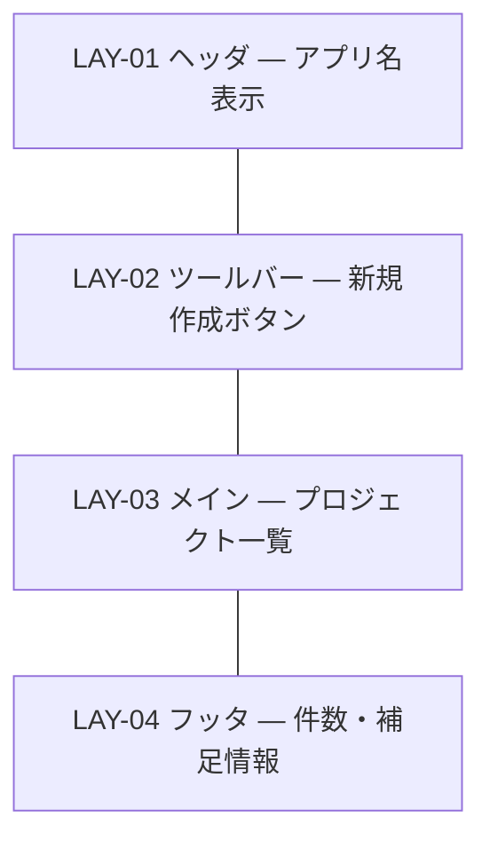
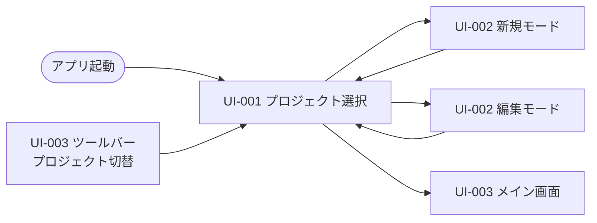

# UI-001 プロジェクト選択画面 — 画面詳細設計

本ドキュメントはインタフェース設計書の `UI-001`（種別: 画面）の画面単位詳細設計である。レイアウト・状態・コンポーネント配置・動的挙動を、スタイルガイド（`docs/design/screen/style-guide.md`）の `DTK-NNN` / `CMP-NNN` を参照する形で確定する。

- 対応 UI: [`UI-001 プロジェクト選択画面`](../../interface/interface-design.md#ui-001-プロジェクト選択画面画面)
- 対応 UC: UC-001
- 対応 HCD: PER-001 / SCN-001 / JOB-001 / JOB-008 / FLW-001
- 関連スタイルガイド: [`style-guide.md`](../style-guide.md)
- 作成日 / 最終更新日: 2026-05-19 / 2026-05-19
- 版: 0.1（ドラフト）

---

## 1. 画面概要

- **UI-NNN**: UI-001 プロジェクト選択画面
- **種別**: 画面
- **対象利用者**: 利用者（PER-001 個人 WBS 管理者）
- **画面の目的**: 既存プロジェクトの一覧を提示し、利用者がプロジェクトを「開く」「新規作成」「編集」「削除」する起点となる画面。アプリ起動時およびプロジェクト切替時に表示される。
- **関連 UC**: UC-001（プロジェクトを管理する）
- **関連 PER / SCN**: PER-001（個人 WBS 管理者・Excel 経験者・macOS デスクトップ環境・本ツールは初見〜習熟混在）。SCN-001（プロジェクト初期セットアップ）・SCN-002（日次の進捗更新 — 開始時に開く）。
- **関連 JOB / FLW**:
  - JOB-001（プロジェクトを開いて WBS を即座に把握する）— 本画面は FLW-001（起動 → メイン画面で WBS を把握する）の**起点**
  - JOB-008（プロジェクトを切り替える / 削除する）— 本画面が主舞台
- **本画面の主 CTA**: **[開く]**（選択中プロジェクトを開いて UI-003 へ遷移）。FLW-001 の主操作で、毎日の業務開始時に最頻実行される。**[新規作成]** が次点の CTA（初回利用時の主操作・SCN-001）。
- **関連 UXI**:
  - UXI-006（空状態での次アクション誘導）— タスク 0 件の論点に加え、プロジェクト 0 件状態にも適用
  - UXI-007（プロジェクト削除の確認強度引き上げ）— 本画面の [削除] が主舞台
- **主なアクター・権限**: 単一利用者・権限なし（要件 NFR-003 / NFR-004、認証認可なし）。権限別表示差分は持たない（5 章は「該当なし」）。
- **入力・出力項目の参照**: [`interface-design.md` UI-001](../../interface/interface-design.md#ui-001-プロジェクト選択画面画面)。本画面で再掲しない。
- **起動 API の参照**: API-001（一覧取得）/ API-004（削除）/ API-005（編集モード時の最新値取得）。詳細は [`interface-design.md`](../../interface/interface-design.md)。
- **画面間遷移の参照**: 入口 = アプリ起動 / UI-003 ツールバー「プロジェクト切替」。出口 = UI-002（新規・編集モーダル）/ UI-003（開いた後）。

---

## 2. レイアウト



| LAY-NN | 役割                                                                                                                                     | 主な CMP                                                        | 固定 / スクロール | ブレークポイント変化の概要                                                        |
| ------ | ---------------------------------------------------------------------------------------------------------------------------------------- | --------------------------------------------------------------- | ----------------- | --------------------------------------------------------------------------------- |
| LAY-01 | ヘッダ。アプリ名「WBS 管理ツール」のみを表示するシンプルな上部バー                                                                       | CMP-027 Header（軽量モード）                                    | 固定              | DTK-100 以上で変化なし                                                            |
| LAY-02 | ツールバー。主 CTA「[+ 新規作成]」ボタンを右寄せ配置。検索・絞り込みは持たない（プロジェクト数は十数件規模、要件で検索未指定）           | CMP-016 Toolbar / CMP-001 Button（primary）                     | 固定              | DTK-100 以上で変化なし                                                            |
| LAY-03 | メイン領域。既存プロジェクトの一覧を縦並びのカードで表示。各行に「プロジェクト名・説明・作成日」と「[開く] [編集] [削除]」の操作ボタン群 | CMP-014 Card（interactive）/ CMP-018 Stack / CMP-001 Button × 3 | スクロール        | 解像度が広い場合（DTK-101 / DTK-102）はカード幅の最大値で頭打ち（一覧の中央寄せ） |
| LAY-04 | フッタ。プロジェクト件数を補足表示（「全 N 件」など）                                                                                    | CMP-018 Stack / DTK-047                                         | 固定              | 変化なし                                                                          |

メモ:

- LAY-03 の各カードのレイアウトは「左: プロジェクト情報（名・説明・作成日）」「右: 操作ボタン群」の横並び（CMP-019 Inline）を採用する。
- 1280×720 を最低解像度として、上下スクロールが必要になるのは LAY-03 のみ。LAY-01 / LAY-02 / LAY-04 は常時画面内に視認可能。

---

## 3. コンポーネント配置

| 配置順 | 領域                              | CMP                | バリアント・サイズ | 表示条件                         | 紐付く入出力項目 / API                        | 備考                                                                                                                       |
| ------ | --------------------------------- | ------------------ | ------------------ | -------------------------------- | --------------------------------------------- | -------------------------------------------------------------------------------------------------------------------------- |
| 1      | LAY-01                            | CMP-027 Header     | default            | 常時                             | −                                             | 中央にアプリ名「WBS 管理ツール」                                                                                           |
| 2      | LAY-02                            | CMP-001 Button     | primary / md       | 常時                             | イベント: [新規作成] 押下 → UI-002 起動       | ラベル「+ 新規作成」。LAY-02 右寄せ                                                                                        |
| 3      | LAY-03                            | CMP-014 Card       | interactive        | 一覧の各行（プロジェクト件数分） | 出力: ENT-001.name / description / created_at | カード自体のクリックは [開く] と同義（A11Y のため操作ボタンとは別領域で扱う、HO-I-001 で確定）                             |
| 3.1    | LAY-03 / Card 内左側              | CMP-018 Stack      | spacing=`space.1`  | 常時                             | 出力                                          | プロジェクト名（`text.h3` 相当）・説明（`text.body.sm`、空時はハイフン）・作成日（`text.body.sm`、`text.code` で日付表示） |
| 3.2    | LAY-03 / Card 内右側              | CMP-019 Inline     | spacing=`space.2`  | 常時                             | −                                             | 操作ボタン群を横並びに配置                                                                                                 |
| 3.2.1  | LAY-03 / Card 内右側              | CMP-001 Button     | primary / md       | 常時                             | イベント: [開く] 押下 → UI-003 遷移           | ラベル「開く」。主 CTA                                                                                                     |
| 3.2.2  | LAY-03 / Card 内右側              | CMP-001 Button     | secondary / md     | 常時                             | イベント: [編集] 押下 → API-005 + UI-002 起動 | ラベル「編集」                                                                                                             |
| 3.2.3  | LAY-03 / Card 内右側              | CMP-001 Button     | secondary / md     | 常時                             | イベント: [削除] 押下 → CMP-028 起動          | ラベル「削除」（押下後に danger な ConfirmDialog）                                                                         |
| 4      | LAY-03（プロジェクト 0 件時のみ） | CMP-023 EmptyState | no-data            | 一覧 0 件時のみ（ST-03）         | −                                             | タイトル「プロジェクトがありません」、CTA: 「+ 最初のプロジェクトを作成」（→ UI-002 起動）。HCD UXI-006 を実装             |
| 5      | LAY-04                            | CMP-018 Stack      | −                  | プロジェクト 1 件以上時のみ      | 出力: API-001 応答件数                        | 「全 N 件」表示（`text.body.sm` / DTK-047）                                                                                |

メモ:

- カード内の操作ボタン 3 つ（開く・編集・削除）は CMP-001 を使い、`primary` は [開く] のみ（HCD 主 CTA を強調）。
- [削除] は CMP-001 の `danger` バリアントではなく `secondary` を使う。理由は削除実行の確定は CMP-028 ConfirmDialog 内の `danger` ボタンで行うため、起動ボタンは secondary に降ろし誤押下リスクを下げる。

---

## 4. 画面状態一覧

| ST-NN | 状態名                                        | 発生契機                                                                       | 対応 FB         | 応答時間区分                  | 見え方（CMP-NNN / DTK-NNN 参照）                                                                                                                       | 主要メッセージ種別                                                                                               | ユーザーが取れる次の操作                                        |
| ----- | --------------------------------------------- | ------------------------------------------------------------------------------ | --------------- | ----------------------------- | ------------------------------------------------------------------------------------------------------------------------------------------------------ | ---------------------------------------------------------------------------------------------------------------- | --------------------------------------------------------------- |
| ST-01 | 初期表示開始                                  | アプリ起動 / プロジェクト切替直後                                              | FB-001          | 瞬時                          | LAY-01 / LAY-02 は即時描画、LAY-03 は CMP-026 Skeleton（プロジェクト 3 行分のグレー帯）を表示                                                          | −                                                                                                                | 待機（操作不可）                                                |
| ST-02 | 読込中（初回）                                | API-001 呼出中                                                                 | FB-002 / FB-003 | 短時間（NFR-001 の 2 秒以内） | ST-01 のスケルトン継続。応答が 1 秒を超えそうな場合のみ CMP-024 Spinner を中央表示（補助）                                                             | −                                                                                                                | 待機（操作不可）                                                |
| ST-03 | 空（プロジェクト 0 件）                       | API-001 が空配列を返した                                                       | −               | −                             | LAY-03 に CMP-023 EmptyState の `no-data`。LAY-04 件数表示は非表示                                                                                     | 情報「プロジェクトがありません」+ CTA「最初のプロジェクトを作成」                                                | [新規作成]（LAY-02 または EmptyState CTA）                      |
| ST-04 | 正常表示（1 件以上）                          | API-001 が 1 件以上の配列を返した                                              | FB-005          | −                             | LAY-03 に各プロジェクトのカード一覧、LAY-04 に件数表示                                                                                                 | −                                                                                                                | 各カードの [開く] / [編集] / [削除]、または LAY-02 [新規作成]   |
| ST-05 | 削除確認中                                    | LAY-03 の [削除] 押下                                                          | FB-008          | −                             | CMP-028 ConfirmDialog `destructive` がオーバーレイ表示。背景の LAY-01〜04 は scrim（DTK-028）で遮蔽                                                    | 警告「プロジェクト『○○』を削除しますか？」+ 影響範囲表示「配下のタスク N 件と依存関係 M 件も同時に削除されます」 | [削除] 確定 / [キャンセル] / Escape                             |
| ST-06 | 削除実行中                                    | ConfirmDialog の `danger` ボタン押下                                           | FB-002          | 短時間（API-004 応答待ち）    | ConfirmDialog 内の `danger` ボタンが loading 状態（CMP-024 内蔵）。ボタン disable                                                                      | −                                                                                                                | 待機（API 応答まで）                                            |
| ST-07 | 削除成功                                      | API-004 200 応答                                                               | FB-006          | −                             | ConfirmDialog 閉鎖 → CMP-021 Toast `success` 「プロジェクト『○○』を削除しました」表示 → API-001 再取得で ST-04 に戻る                                  | 成功                                                                                                             | 一覧の再操作                                                    |
| ST-08 | 削除キャンセル                                | ConfirmDialog の [キャンセル] / Escape                                         | −               | −                             | ConfirmDialog 閉鎖 → ST-04 に戻る                                                                                                                      | −                                                                                                                | 一覧の再操作                                                    |
| ST-09 | 編集モーダル起動中                            | LAY-03 の [編集] 押下                                                          | FB-002          | 短時間（API-005 応答待ち）    | LAY-03 の対象カードの [編集] ボタンが loading 状態                                                                                                     | −                                                                                                                | 待機（応答後に UI-002 起動）                                    |
| ST-10 | エラー（一覧取得失敗）                        | API-001 が 4xx / 5xx を返した                                                  | FB-007          | −                             | LAY-03 に CMP-023 EmptyState `error` を表示。タイトル「プロジェクトを読み込めませんでした」+ CTA「再読み込み」+ 相関 ID 表示（ERR-005 / ERR-006 のみ） | エラー（ERR-005 / ERR-006）                                                                                      | [再読み込み]（→ API-001 再呼出）                                |
| ST-11 | エラー（削除失敗）                            | API-004 が 4xx / 5xx を返した                                                  | FB-007          | −                             | ConfirmDialog を閉じた後に CMP-021 Toast `error` 「削除に失敗しました（相関 ID: xxx）」を表示。一覧は変更前のまま                                      | エラー（ERR-003 / ERR-005 / ERR-006）                                                                            | 再試行（再度 [削除] 押下）、または `Toast` のリトライアクション |
| ST-12 | エラー（存在しないプロジェクトを開く / 編集） | API-005 が 404（ERR-003）を返した、または [開く] 後の API-006 / API-011 で 404 | FB-007          | −                             | CMP-021 Toast `error`「対象プロジェクトが見つかりません」表示 → API-001 を再取得して一覧を最新化（ST-04 に戻る）                                       | エラー（ERR-003）                                                                                                | 一覧から再選択                                                  |

### 4.1 状態遷移図

```mermaid
stateDiagram-v2
  [*] --> ST-01: 起動 / 切替
  ST-01 --> ST-02: 描画開始
  ST-02 --> ST-03: 0 件
  ST-02 --> ST-04: 1 件以上
  ST-02 --> ST-10: API-001 失敗
  ST-10 --> ST-02: 再読み込み
  ST-04 --> ST-05: [削除] 押下
  ST-05 --> ST-06: 確定
  ST-05 --> ST-08: キャンセル / Escape
  ST-08 --> ST-04
  ST-06 --> ST-07: 成功
  ST-06 --> ST-11: 失敗
  ST-07 --> ST-04: 一覧再取得
  ST-11 --> ST-04: 一覧維持
  ST-04 --> ST-09: [編集] 押下
  ST-09 --> [*]: UI-002 へ遷移
  ST-09 --> ST-12: 404
  ST-12 --> ST-04
  ST-04 --> [*]: [開く] → UI-003 へ遷移
  ST-04 --> [*]: [新規作成] → UI-002 へ遷移
  ST-03 --> [*]: [新規作成] → UI-002 へ遷移
```

メモ:

- ST-05〜ST-08（削除のサブフロー）は HCD FB-008 / RISK-010 / UXI-007 を実装する中心。
- ST-12 はインタフェース設計 ERR-003（存在しない）の典型。一覧再取得で復旧する設計。

---

## 5. 権限別表示差分

**該当なし**。

理由: 本システムは認証認可を持たない（要件 NFR-003 / NFR-004、インタフェース設計 1 章で確定）。利用者は単一利用者・常時すべてのプロジェクトを CRUD 可能。

「無権限」と「存在しない」の区別: 「無権限」状態は存在しないため、すべての「対象が見つからない」エラーは ERR-003（存在しない）として扱う。

動的な権限変化: 該当なし（認証なしのため変化しない）。

---

## 6. フォーム動的挙動

本画面にはフォーム入力が存在しない（プロジェクト名等の入力は UI-002 で扱う）。本章は該当なし。

唯一の動的挙動: **多重押下抑止**。

- [削除] 押下後の ConfirmDialog 内の `danger` ボタンは 1 回押下で loading 状態になり、API-004 応答までは disable（CMP-001 の loading 状態）。HCD UXI-007 / インタフェース設計 RISK-006 を実装。
- [開く] 押下後、対象カード内の全ボタンは UI-003 への遷移中は disable とする方針（実装で確定 → HO-I-001）。

---

## 7. レスポンシブ挙動

| ブレークポイント    | 想定             | LAY 挙動                                                                             | ナビゲーション                 | テーブル                     |
| ------------------- | ---------------- | ------------------------------------------------------------------------------------ | ------------------------------ | ---------------------------- |
| DTK-100（1280px〜） | 最低保証解像度   | LAY-03 はビューポート幅全体を使用。カード最大幅は 800px を目安（中央寄せ、両側余白） | 単一ヘッダのみ。サイドナビなし | 該当なし（カード一覧のため） |
| DTK-101（1600px〜） | 標準デスクトップ | LAY-03 カード最大幅は 1000px 程度に拡張（具体値は HO-I-001）                         | 同上                           | −                            |
| DTK-102（1920px〜） | フル HD 以上     | LAY-03 カード最大幅は同上で頭打ち。両側余白がさらに広がる                            | 同上                           | −                            |

崩してはいけないもの:

- LAY-02 の [新規作成] ボタンは常時視界内（ST-03 でも EmptyState の CTA とは別に LAY-02 にも残す）
- 各カードの [開く] ボタンは常時視界内（縮小幅でも表示維持）

ブレークポイント間で変化しないもの:

- カード内のレイアウト（左: 情報 / 右: 操作ボタン）
- フォントサイズ・スペーシング

---

## 8. イベントと画面遷移

| イベント                           | トリガ条件                                  | 起動 API                                       | API 呼出中の画面挙動                              | 成功時                                        | 失敗時                 | 確認モーダル                    |
| ---------------------------------- | ------------------------------------------- | ---------------------------------------------- | ------------------------------------------------- | --------------------------------------------- | ---------------------- | ------------------------------- |
| 画面初期表示                       | アプリ起動 / プロジェクト切替で本画面に到達 | API-001                                        | ST-01 → ST-02                                     | ST-03（0 件）/ ST-04（1 件以上）              | ST-10（CMP-023 error） | 不要                            |
| [+ 新規作成] 押下                  | LAY-02                                      | −                                              | −                                                 | UI-002 を新規モードで起動                     | −                      | 不要                            |
| カードの [開く] 押下               | LAY-03 / Card                               | −（後続で API-006 / API-011 を UI-003 が呼ぶ） | カード内ボタン群を disable                        | UI-003 へ遷移                                 | ST-12（Toast）→ ST-04  | 不要                            |
| カードの [編集] 押下               | LAY-03 / Card                               | API-005                                        | ST-09（対象 [編集] ボタンが loading）             | UI-002 を編集モードで起動（最新値を初期値に） | ST-12                  | 不要                            |
| カードの [削除] 押下               | LAY-03 / Card                               | −                                              | −                                                 | ST-05（CMP-028 destructive 表示）             | −                      | **必須**（CMP-028 destructive） |
| CMP-028 [削除] 押下（確定）        | ST-05 中                                    | API-004                                        | ST-06（ConfirmDialog の danger ボタンが loading） | ST-07（Toast success + 一覧再取得 → ST-04）   | ST-11（Toast error）   | −                               |
| CMP-028 [キャンセル] 押下 / Escape | ST-05 中                                    | −                                              | −                                                 | ST-08 → ST-04                                 | −                      | −                               |
| エラー時 [再読み込み] 押下         | ST-10 中                                    | API-001                                        | ST-02                                             | ST-03 / ST-04                                 | ST-10（継続）          | −                               |
| エラー時 Toast の [再試行] 押下    | ST-11 中                                    | API-004                                        | ST-06                                             | ST-07                                         | ST-11（継続）          | −                               |

### 8.1 破壊的操作（プロジェクト削除）の確認設計

HCD UXI-007 / FB-008 / インタフェース設計 RISK-006 / HO-D-008 を本画面で具体化する。

- **ConfirmDialog（CMP-028 destructive）の構成**:
  - タイトル: 「プロジェクト『○○』を削除しますか？」（プロジェクト名を引用）
  - 説明: 「この操作は取り消せません。」+ **影響範囲表示**: 「配下のタスク **N 件** と依存関係 **M 件** も同時に削除されます。」（件数は API-005 取得時または別途軽量 API による事前取得。本リリースでは UI-001 が API-001 で受け取ったプロジェクト情報のみ持つため、件数表示は HO-I-002 で代替実装方針を確定する。暫定的にはタスク件数を「— 件」と表示しない場合は省略可能）
  - 主操作: CMP-001 `danger` バリアントの「削除する」ボタン（既定フォーカスは置かない）
  - 副操作: CMP-001 `secondary` の「キャンセル」（**既定フォーカス**。HCD UXI-007 を実装、Enter で誤確定しないように）
- **連打防止**: 削除確定後は ConfirmDialog 内の主操作ボタンが loading 状態 + disable で、API-004 応答まで操作不可。
- **戻る挙動**: Escape または [キャンセル] で一覧に戻る。

### 8.2 画面遷移（入口・出口）



戻るボタン（ブラウザ履歴）の挙動は単一ページアプリ前提で、ブラウザの戻るで履歴を遡る挙動を持たない（実装方針は HO-I-001）。

---

## 9. 多言語・テキスト長変動方針

- **対応言語**: 日本語のみ。多言語対応はしない（要件 NFR-003 / スタイルガイド 4.1 と整合）。
- **長文時の挙動**:
  - プロジェクト名: 1 行内で表示し、長文時は末尾省略（`text-overflow: ellipsis`）+ ホバー時のツールチップで全文表示。
  - 説明: 1〜2 行で省略表示し、ホバー時のツールチップで全文表示。
- **テキスト方向**: LTR のみ。
- **数値・日付の書式**: 作成日は `YYYY/MM/DD` または `YYYY-MM-DD` 表記（具体は HO-I-006）。
- **将来の多言語化に向けた配慮**: ボタンラベル・タイトル等のマイクロコピーは実装側で抽象化（メッセージキー化）の余地を残す（→ HO-I-001）。

---

## 10. 注意事項

### 10.1 リスク・懸念点

| RISK-NNN | 内容                                                                                                   | 影響範囲                 | 顕在化条件                                                   | 暫定対応                                                                             | 実装・QA への申し送り                       |
| -------- | ------------------------------------------------------------------------------------------------------ | ------------------------ | ------------------------------------------------------------ | ------------------------------------------------------------------------------------ | ------------------------------------------- |
| RISK-001 | プロジェクト削除の影響範囲表示（配下タスク件数・依存件数）を API-001 が返していない                    | LAY-03 / CMP-028 / ST-05 | プロジェクトが多数の配下を持っている場合に「影響が見えない」 | API-001 にカウント追加 or 削除確認時に追加の軽量 API を呼ぶ方針を実装側で確定        | HO-I-002                                    |
| RISK-002 | プロジェクト名の重複が許容されており、一覧で同名 2 件を区別する手掛かりが name と created_at のみ      | LAY-03                   | 同名プロジェクトを誤って削除                                 | 削除確認ダイアログに作成日を併記                                                     | HO-I-002                                    |
| RISK-003 | エラー Toast の自動消去タイミングがエラー識別の妨げになる可能性                                        | CMP-021 / ST-11 / ST-12  | エラー Toast を見逃す                                        | スタイルガイドで「error は手動消去」を採用済み（CMP-021 仕様）                       | −                                           |
| RISK-004 | [開く] 後に UI-003 で API-006 / API-011 が失敗した場合の戻り経路                                       | UI-001 → UI-003          | UI-003 の初期 API が失敗してメイン画面が描画できない         | UI-003 側で「プロジェクト選択画面に戻る」導線を提供する想定（UI-003 詳細で確定）     | UI-003 側 HO-I-NNN                          |
| RISK-005 | プロジェクトが多数（数十件以上）になった場合、一覧の縦スクロールが長くなり JOB-001（即座の把握）を阻害 | LAY-03 / ST-04           | 利用が長期化した場合                                         | 要件側でプロジェクト件数上限がないため設計範囲外。検索・並び替えは要件外で実装しない | 利用実態に応じて HCD 側で再検討（HO-U-001） |
| RISK-006 | カード自体のクリックで [開く] と同義にする実装の場合、[編集] [削除] とのクリック領域分離が必要         | LAY-03 / Card            | クリック領域が重なって誤操作                                 | 操作ボタン群（CMP-019 Inline）の領域は明示的にクリックイベントを停止                 | HO-I-001                                    |
| RISK-007 | ST-09（編集モーダル起動中の API-005 待ち）が体感上長く感じられる                                       | LAY-03 / ST-09           | API-005 が NFR-001（1 秒以内）を逸脱した場合                 | CMP-024 Spinner を [編集] ボタン内に表示                                             | NFR 監視（HO-T-NNN）                        |

### 10.2 代替案と採らない理由

| ALT-NNN | 対象判断                   | 代替案概要                                                                                    | 採らない理由                                                                                                                              | 再検討条件                                       |
| ------- | -------------------------- | --------------------------------------------------------------------------------------------- | ----------------------------------------------------------------------------------------------------------------------------------------- | ------------------------------------------------ |
| ALT-001 | レイアウトの骨格           | サイドバーで「プロジェクト一覧」を常時表示し、メイン領域で選択中プロジェクトの WBS を直接編集 | 要件で「1 度に 1 プロジェクト表示」と明示されており、プロジェクト切替時には明示的に UI-001 を経由する設計。サイドバー常時表示は要件と齟齬 | 要件変更（複数プロジェクト同時操作）             |
| ALT-002 | 一覧の表示手段             | テーブル形式（フラット行表示）                                                                | 操作ボタン 3 つを行内に納めるとデスクトップでも視覚的に詰まる。プロジェクト件数が少ない想定（数〜数十件）でカードの方が視認性が良い       | プロジェクト件数が 100 件以上になった場合        |
| ALT-003 | ローディング表現           | スピナーのみ（スケルトンを使わない）                                                          | スケルトンは構造の予測可能性を与え、JOB-001 の体感速度に寄与する。スタイルガイドの CMP-026 を採用                                         | スケルトン実装コストが過大と判明した場合         |
| ALT-004 | エラーの出し方             | モーダル                                                                                      | 一覧取得失敗は画面全体の機能不全のためインライン（EmptyState `error`）の方が自然。削除失敗は Toast で一覧を維持する方が UX が良い         | 重大エラー時にモーダルで強制注意を促す要件追加時 |
| ALT-005 | フォームのサブミット先挙動 | 削除後に削除済みプロジェクトの「最後の状態」を表示する                                        | 物理削除のため復元不可。削除済みを表示する意味がない（データ設計 1 章「履歴・監査方針」と整合）                                           | 論理削除に変更された場合                         |
| ALT-006 | 確認モーダルの採否         | 全削除を軽確認のみで統一                                                                      | プロジェクト削除は配下を一括連鎖削除する破壊度が高く、軽確認では誤操作リスクが大きい（HCD UXI-007）                                       | プロジェクト単位の連鎖削除が無くなった場合       |

### 10.3 後続工程への申し送り事項

#### 実装への申し送り

| HO-I-NNN | 内容                                                                                                          | 想定選択肢                           | 決定責任者 / 相談先 |
| -------- | ------------------------------------------------------------------------------------------------------------- | ------------------------------------ | ------------------- |
| HO-I-001 | カード自体のクリック挙動（[開く] と同義にするか、ボタン押下のみで遷移するか）と、操作ボタン群とのイベント分離 | カード = 開く / ボタンのみ           | 実装担当 / HCD      |
| HO-I-002 | プロジェクト削除確認時の影響範囲（配下タスク件数・依存件数）取得方法                                          | API-001 拡張 / 別軽量 API / 表示省略 | 実装担当            |
| HO-I-003 | エラー Toast のリトライアクション（[再試行] ボタン）の有無と挙動                                              | あり / なし                          | 実装担当            |
| HO-I-004 | プロジェクト一覧の並び順（作成日昇順 / 降順 / 最終操作日順）                                                  | 作成日降順（既定推奨）               | 実装担当 / HCD      |
| HO-I-005 | URL 設計（プロジェクト選択画面の URL とプロジェクト切替時の URL 変化）                                        | `/projects` / `/` 等                 | 実装担当            |
| HO-I-006 | 作成日の表示フォーマット                                                                                      | YYYY/MM/DD / YYYY-MM-DD 等           | 実装担当            |

#### QA・テスト設計への申し送り

| HO-T-NNN | 内容                                                                                                                | 想定選択肢            | 決定責任者 / 相談先 |
| -------- | ------------------------------------------------------------------------------------------------------------------- | --------------------- | ------------------- |
| HO-T-001 | ST-01〜ST-12 全状態のビジュアルリグレッション対象化                                                                 | 全状態 / 主要状態のみ | QA                  |
| HO-T-002 | キーボード操作テスト（Tab 順序、Enter/Space での発火、Escape での ConfirmDialog 閉鎖、CancelButton 既定フォーカス） | 必須                  | QA                  |
| HO-T-003 | API-001 / API-004 / API-005 の各エラー応答時の挙動テスト（404 / 500 / タイムアウト）                                | 必須                  | QA                  |
| HO-T-004 | プロジェクトが 0 件・1 件・10 件・50 件規模での一覧の見え方・スクロール挙動                                         | 各規模で目視          | QA                  |

#### スタイルガイドへの昇格候補

| CAN-NNN | パターン概要                                    | 本画面での使用箇所          | 再利用可能性                                          | 昇格時の CMP 候補名                        |
| ------- | ----------------------------------------------- | --------------------------- | ----------------------------------------------------- | ------------------------------------------ |
| CAN-001 | カード型の一覧行（情報 + 操作ボタン群の横並び） | LAY-03 各プロジェクトカード | 中（UI-005 依存関係一覧でも類似パターンが出る可能性） | `CMP-ListRow` 等の名称で本ガイドに追加検討 |

#### HCD / UI・UX 設計への逆流候補

| HO-U-NNN | 内容                                                                                                                      | 逆流理由                                                                 | 相談先         |
| -------- | ------------------------------------------------------------------------------------------------------------------------- | ------------------------------------------------------------------------ | -------------- |
| HO-U-001 | プロジェクト件数が多数になった場合の検索・並び替え UX の検討                                                              | RISK-005 連動。JOB-001（即座の把握）の阻害要因                           | HCD            |
| HO-U-002 | カード自体のクリックで [開く] と同義にするかどうかの判断（一般的な業務ツールではカード = 開くが多いが、要件側で明示なし） | RISK-006 連動                                                            | HCD            |
| HO-U-003 | プロジェクト削除確認時の影響範囲表示が要件側 / HCD 側で明示されていない                                                   | RISK-001 連動。FB-008 / UXI-007 の具体化として、要件 HO-R-NNN として記録 | HCD / 要件定義 |
