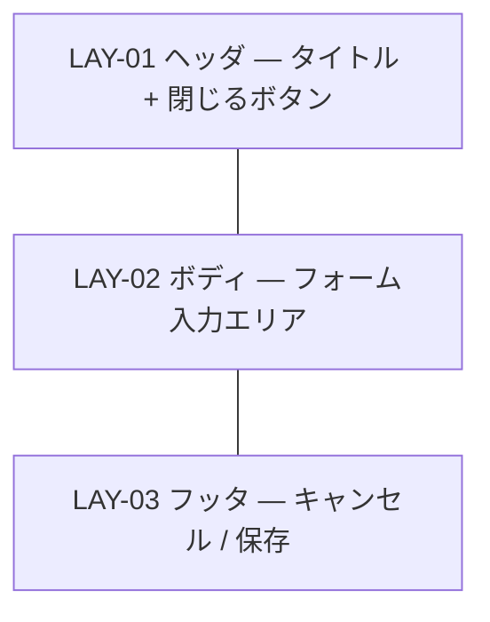

# UI-002 プロジェクト編集ダイアログ — 画面詳細設計

- 対応 UI: [`UI-002 プロジェクト編集ダイアログ`](../../interface/interface-design.md#ui-002-プロジェクト編集ダイアログ画面)
- 対応 UC: UC-001
- 対応 HCD: PER-001 / SCN-001 / JOB-008 / FLW-011（空状態起点）
- 関連スタイルガイド: [`style-guide.md`](../style-guide.md)
- 作成日 / 最終更新日: 2026-05-19 / 2026-05-19
- 版: 0.1（ドラフト）

---

## 1. 画面概要

- **UI-NNN**: UI-002 プロジェクト編集ダイアログ
- **種別**: 画面（モーダルダイアログ）
- **対象利用者**: PER-001
- **画面の目的**: プロジェクトの新規作成または既存プロジェクトの編集（プロジェクト名・説明の入力 / 編集）を行う。UI-001 から起動するモーダル。
- **関連 UC**: UC-001（基本フロー 4「新規作成」、代替フロー「既存プロジェクトを編集」）
- **関連 PER / SCN**: PER-001。SCN-001（プロジェクト初期セットアップ）の起点。
- **関連 JOB / FLW**: JOB-008（プロジェクトを切り替える / 削除する）の関連、JOB-001 起点としての新規作成。FLW-001 / FLW-011 の準備ステップ。
- **本画面の主 CTA**: **[保存]**（プロジェクト名・説明を確定し、UI-001 一覧を再描画）。
- **関連 UXI**: UXI-006（空状態での次アクション誘導 — 本画面は EmptyState からの遷移先でもある）
- **主なアクター・権限**: 単一利用者・権限なし（権限別差分なし）
- **入力・出力項目の参照**: [`interface-design.md` UI-002](../../interface/interface-design.md#ui-002-プロジェクト編集ダイアログ画面)
- **起動 API**: API-002（新規作成）/ API-003（更新）/ API-005（編集モード初期化）
- **画面間遷移**: 入口 = UI-001 の [+ 新規作成] / [編集]。出口 = UI-001 一覧（保存・キャンセル後）。

---

## 2. レイアウト

CMP-015 Modal `form` バリアントで構成する。1280×720 で固定幅 480px 程度を目安（DTK-101 / DTK-102 でも変化なし）。



| LAY-NN | 役割                                                                                                              | 主な CMP                                | 固定 / スクロール                                                                      | ブレークポイント変化 |
| ------ | ----------------------------------------------------------------------------------------------------------------- | --------------------------------------- | -------------------------------------------------------------------------------------- | -------------------- |
| LAY-01 | モーダル上部のタイトル領域。タイトル「新規プロジェクト」または「プロジェクトを編集」+ 閉じる用 IconButton（右上） | CMP-015 / CMP-002                       | 固定                                                                                   | 変化なし             |
| LAY-02 | フォーム入力エリア。プロジェクト名・説明、編集モード時は作成日（読み取り専用）を表示                              | CMP-013 FormField × 2〜3、CMP-018 Stack | スクロール可（縦が長くなった場合のみ。本ダイアログは項目数少のため通常スクロール不要） | 変化なし             |
| LAY-03 | アクションフッタ。右寄せで [キャンセル] [保存]                                                                    | CMP-019 Inline、CMP-001 Button × 2      | 固定                                                                                   | 変化なし             |

メモ:

- ダイアログ全体は CMP-015 Modal の `form` バリアント。背景は DTK-028 のスクリム、本体は DTK-018 + DTK-073（elevation.3）+ DTK-078（radius.lg）。

---

## 3. コンポーネント配置

| 配置順 | 領域   | CMP                                           | バリアント・サイズ | 表示条件                        | 紐付く入出力項目 / API                              | 備考                                                                     |
| ------ | ------ | --------------------------------------------- | ------------------ | ------------------------------- | --------------------------------------------------- | ------------------------------------------------------------------------ |
| 1      | LAY-01 | CMP-015 Modal Title                           | `text.h2` 相当     | 常時                            | −                                                   | 新規モード: 「新規プロジェクト」 / 編集モード: 「プロジェクトを編集」    |
| 2      | LAY-01 | CMP-002 IconButton                            | ghost / sm         | 常時                            | イベント: 閉じる（[キャンセル] と同義）             | aria-label「閉じる」。Escape キーと同等                                  |
| 3      | LAY-02 | CMP-013 FormField（CMP-003 TextInput を内包） | md                 | 常時                            | 入力: プロジェクト名（ENT-001.name） / VR-009       | ラベル「プロジェクト名」+ 必須マーク「\*」+ 「必須」テキスト。空文字不可 |
| 4      | LAY-02 | CMP-013 FormField（CMP-004 Textarea を内包）  | md / 3 行          | 常時                            | 入力: 説明（ENT-001.description）                   | ラベル「説明」（任意項目のため任意マークなし。スタイルガイド方針）       |
| 5      | LAY-02 | CMP-013 FormField（読み取り専用 TextInput）   | md / readonly      | 編集モードのみ                  | 出力: 作成日（ENT-001.created_at）                  | ラベル「作成日」。`text.code` で表示。新規モードでは非表示               |
| 6      | LAY-03 | CMP-001 Button                                | secondary / md     | 常時                            | イベント: [キャンセル]                              | ラベル「キャンセル」                                                     |
| 7      | LAY-03 | CMP-001 Button                                | primary / md       | 常時（既定 disable は入力次第） | イベント: [保存] → API-002（新規）/ API-003（編集） | ラベル「保存」。VR-009 を満たすまで disable                              |

メモ:

- 編集モード（LAY-02 #5 表示）は CMP-015 の `form` バリアント内に追加表示。新規モードでは項目が 2 件、編集モードでは 3 件となる。
- 既定フォーカス: モーダル起動時はプロジェクト名入力にフォーカス（A11Y / CMP-015 仕様）。

---

## 4. 画面状態一覧

| ST-NN | 状態名                                                | 発生契機                                                    | 対応 FB          | 応答時間区分                  | 見え方                                                                                                                                                    | 主要メッセージ種別          | ユーザーが取れる次の操作           |
| ----- | ----------------------------------------------------- | ----------------------------------------------------------- | ---------------- | ----------------------------- | --------------------------------------------------------------------------------------------------------------------------------------------------------- | --------------------------- | ---------------------------------- |
| ST-01 | 新規モード初期                                        | UI-001 の [+ 新規作成] 押下                                 | FB-001           | 瞬時                          | LAY-02 のプロジェクト名が空、説明が空、作成日表示なし。[保存] は disable                                                                                  | −                           | 入力 / キャンセル                  |
| ST-02 | 編集モード読込中                                      | UI-001 の [編集] 押下 → API-005 待ち                        | FB-002           | 短時間（NFR-001 の 1 秒以内） | モーダル本体は表示するが LAY-02 全体に CMP-026 Skeleton（フィールド形のグレー帯）。フッタは disable                                                       | −                           | 待機                               |
| ST-03 | 編集モード初期（読込完了）                            | API-005 200 応答                                            | FB-005           | −                             | LAY-02 に現在値を表示。プロジェクト名・説明・作成日。[保存] は値変更されるまで disable（または初期から enable で送信時に重複保存を許容するかは HO-I-001） | −                           | 編集 / キャンセル                  |
| ST-04 | 入力中（バリデーション通過）                          | LAY-02 でプロジェクト名 1 文字以上入力                      | FB-009           | −                             | [保存] が enable。エラー表示なし                                                                                                                          | −                           | 続けて入力 / [保存] / [キャンセル] |
| ST-05 | 入力中（バリデーション違反）                          | プロジェクト名を空にして blur した場合                      | FB-007           | −                             | LAY-02 のプロジェクト名フィールドに `invalid` 状態（境界 DTK-006）+ CMP-012 HelperText (error)「プロジェクト名を入力してください」。[保存] は disable     | エラー（VR-009）            | プロジェクト名を入力               |
| ST-06 | サブミット中                                          | [保存] 押下 → API-002 / API-003 待ち                        | FB-002           | 短時間                        | [保存] が loading 状態（CMP-001 loading）+ disable、[キャンセル] と LAY-01 IconButton も disable、LAY-02 入力も disable                                   | −                           | 待機                               |
| ST-07 | サブミット成功                                        | API-002 / API-003 200/201 応答                              | FB-005           | −                             | モーダル閉鎖 → UI-001 で CMP-021 Toast `success`「プロジェクト『○○』を保存しました」表示 + 一覧再取得                                                     | 成功                        | UI-001 に戻る（モーダル外）        |
| ST-08 | サブミット失敗（VR 違反: ERR-001）                    | サーバ側で VR-009 違反検出                                  | FB-007           | −                             | モーダルは閉じず、ST-05 と同じインライン表示に戻す。LAY-02 入力は enable 復帰                                                                             | エラー（ERR-001 / VR-009）  | 修正して再保存                     |
| ST-09 | サブミット失敗（ERR-003: 編集対象が存在しない）       | 編集時に API-003 404                                        | FB-007           | −                             | モーダル閉鎖 → UI-001 で CMP-021 Toast `error`「対象プロジェクトが見つかりません（既に削除済みの可能性）」+ 一覧再取得                                    | エラー（ERR-003）           | UI-001 で再選択                    |
| ST-10 | サブミット失敗（ERR-005 / ERR-006: 永続化・システム） | API-002 / API-003 500                                       | FB-007           | −                             | モーダル維持。LAY-02 上に CMP-022 Banner (danger)「保存に失敗しました。再試行してください（相関 ID: xxx）」表示。入力値は保持                             | エラー（ERR-005 / ERR-006） | 再保存 / キャンセル                |
| ST-11 | キャンセル確認（オプション）                          | 入力変更後に [キャンセル] / Escape / 閉じる IconButton 押下 | FB-008（軽確認） | −                             | 「変更を破棄しますか？」の軽確認 CMP-028 default を表示                                                                                                   | 警告                        | 破棄 / 編集に戻る                  |

メモ:

- ST-11 の「キャンセル時の変更破棄確認」は実装オプション。要件側で「保存しないと破棄」が明示されていない（HCD RISK-002 / インタフェース設計 HO-I-011）。本ドキュメントでは**入力変更があり、かつテキスト 5 文字以上の編集**を行った場合のみ確認を出す方針を暫定推奨。最終判断は HO-I-002。

### 4.1 状態遷移図

```mermaid
stateDiagram-v2
  [*] --> ST-01: 新規モード起動
  [*] --> ST-02: 編集モード起動
  ST-02 --> ST-03: API-005 成功
  ST-02 --> ST-09: API-005 404
  ST-01 --> ST-04: 名前 1 文字以上
  ST-03 --> ST-04: 値変更
  ST-04 --> ST-05: 名前空にして blur
  ST-05 --> ST-04: 再入力
  ST-04 --> ST-06: [保存] 押下
  ST-06 --> ST-07: 200/201
  ST-06 --> ST-08: 400（VR）
  ST-06 --> ST-09: 404
  ST-06 --> ST-10: 500
  ST-08 --> ST-04: 修正
  ST-10 --> ST-04: 再試行入力
  ST-07 --> [*]: モーダル閉鎖
  ST-04 --> ST-11: [キャンセル]（変更あり）
  ST-11 --> ST-04: 編集に戻る
  ST-11 --> [*]: 破棄してモーダル閉鎖
  ST-01 --> [*]: [キャンセル]（変更なし）
  ST-03 --> [*]: [キャンセル]（変更なし）
```

---

## 5. 権限別表示差分

**該当なし**（認証認可なし）。

---

## 6. フォーム動的挙動

| DYN-NN | トリガ項目            | 対象項目                 | 挙動                                                                                                                                         | 発火タイミング                               | 依存業務条件                |
| ------ | --------------------- | ------------------------ | -------------------------------------------------------------------------------------------------------------------------------------------- | -------------------------------------------- | --------------------------- |
| DYN-01 | プロジェクト名        | [保存] ボタン            | プロジェクト名が空（前後空白除去後）の場合は disable、1 文字以上で enable                                                                    | onChange（debounced 不要、即時）             | VR-009                      |
| DYN-02 | プロジェクト名        | プロジェクト名 FormField | 入力中はエラー表示しない。blur 時に空なら ST-05 のエラー表示。再入力で即解除                                                                 | onBlur（エラー判定）/ onChange（エラー解除） | VR-009                      |
| DYN-03 | プロジェクト名 / 説明 | 全体                     | 前後空白の除去はサブミット時にサーバ側でも実施（インタフェース設計 5 章）。クライアント側は表示上の trim を行わず、サーバ側に渡す前のみ trim | onSubmit                                     | スタイルガイド 5.3          |
| DYN-04 | [保存] ボタン         | フォーム全体             | サブミット中は二重送信抑止のため [保存] が loading + disable、フォーム入力も disable（ST-06）                                                | onSubmit                                     | スタイルガイド CMP-001 仕様 |
| DYN-05 | Escape キー           | モーダル全体             | 変更あり: ST-11（軽確認）/ 変更なし: 即閉鎖                                                                                                  | onKeyDown                                    | HCD A11Y-003                |

メモ:

- リアルタイム検証は「プロジェクト名の必須」のみ。それ以外（description）はバリデーション対象外。
- サーバ側再検証は必須（VR-009、スタイルガイド 1 章方針）。

---

## 7. レスポンシブ挙動

| ブレークポイント    | LAY 挙動                        |
| ------------------- | ------------------------------- |
| DTK-100（1280px〜） | モーダル幅 480px 固定、画面中央 |
| DTK-101 / DTK-102   | 同上、変化なし                  |

崩してはいけないもの: [保存] / [キャンセル] フッタが常に視界内（モーダル本体内）。

---

## 8. イベントと画面遷移

| イベント                      | トリガ条件              | 起動 API            | API 呼出中の挙動 | 成功時                | 失敗時                | 確認モーダル                       |
| ----------------------------- | ----------------------- | ------------------- | ---------------- | --------------------- | --------------------- | ---------------------------------- |
| モーダル起動（新規）          | UI-001 [+ 新規作成]     | −                   | −                | ST-01                 | −                     | 不要                               |
| モーダル起動（編集）          | UI-001 [編集]           | API-005             | ST-02            | ST-03                 | ST-09                 | 不要                               |
| プロジェクト名入力            | LAY-02                  | −                   | −                | ST-04                 | ST-05                 | −                                  |
| [保存] 押下（新規）           | ST-04 中（VR-009 通過） | API-002             | ST-06            | ST-07                 | ST-08 / ST-10         | 不要                               |
| [保存] 押下（編集）           | ST-04 中                | API-003             | ST-06            | ST-07                 | ST-08 / ST-09 / ST-10 | 不要                               |
| [キャンセル] 押下（変更あり） | LAY-03 / ST-04 中       | −                   | −                | ST-11                 | −                     | **必須**（軽確認 CMP-028 default） |
| [キャンセル] 押下（変更なし） | LAY-03 / ST-01 / ST-03  | −                   | −                | モーダル閉鎖 → UI-001 | −                     | 不要                               |
| 閉じる IconButton 押下        | LAY-01                  | [キャンセル] と同義 | −                | −                     | −                     | 同上                               |
| Escape                        | LAY-01〜03              | [キャンセル] と同義 | −                | −                     | −                     | 同上                               |

破壊的操作なし（プロジェクト削除は UI-001 側で処理。本画面は新規作成・更新のみ）。

---

## 9. 多言語・テキスト長変動方針

- **対応言語**: 日本語のみ。
- **長文時の挙動**:
  - プロジェクト名: 上限文字数の方針は要件で未定義（HO-I-003）。暫定で 100 文字程度を目安に入力可能とするが、UI 上は overflow ellipsis ではなく 1 行内全体表示を維持。
  - 説明: Textarea 内で改行可能。表示時の長文は CMP-004 内でスクロール。
- **テキスト方向**: LTR のみ。

---

## 10. 注意事項

### 10.1 リスク・懸念点

| RISK-NNN | 内容                                                                                                                    | 影響範囲        | 顕在化条件                                           | 暫定対応                                                             | 申し送り                      |
| -------- | ----------------------------------------------------------------------------------------------------------------------- | --------------- | ---------------------------------------------------- | -------------------------------------------------------------------- | ----------------------------- |
| RISK-001 | [キャンセル] 時の変更破棄確認の要否が要件 / HCD で未確定（HCD RISK-002 / IF HO-I-011）                                  | ST-11           | 利用者が誤って閉じて変更を失う                       | 暫定として「テキスト 5 文字以上の編集があれば軽確認を出す」方針      | HO-I-002                      |
| RISK-002 | 新規モードで [保存] 押下後にネットワーク（localhost ループバック）が一時失敗した場合の再試行 UX                         | ST-10           | localhost が稀に応答しない場合（プロセス起動直後等） | CMP-022 Banner + 入力保持で再保存可能とする方針                      | −                             |
| RISK-003 | プロジェクト名の上限文字数が未定義                                                                                      | LAY-02 / DYN-01 | 極端な長文入力時に DB 制約や表示崩れ                 | データ設計 / インタフェース設計で上限を確定（要件側に逆流 HO-R-001） | HO-I-003                      |
| RISK-004 | プロジェクト名の重複が許容されている（データ設計 ENT-001 / UI-001 RISK-002 と整合）                                     | LAY-02          | 同名重複に気付かず作成                               | 確認ダイアログを出す案もあるが、本リリースは要件通り重複許容で実装   | −                             |
| RISK-005 | 編集モード起動時に API-005 が遅い場合、利用者は UI-001 のカードでも編集可能（カードに表示済みのデータと最新値との乖離） | ST-02 / ST-03   | localhost で遅延が発生した場合                       | API-005 完了まではフォームを disable（CMP-026 Skeleton 表示）        | −                             |
| RISK-006 | サーバ側で VR-009 違反（前後空白のみ）を弾いた場合のエラーメッセージが画面側 trim と乖離する可能性                      | DYN-03 / ST-08  | クライアント側 trim を行わない場合                   | サブミット直前にクライアント側でも trim する方針                     | スタイルガイド 5.3 / HO-I-001 |

### 10.2 代替案と採らない理由

| ALT-NNN | 対象判断                   | 代替案概要                                     | 採らない理由                                                                                             | 再検討条件                                           |
| ------- | -------------------------- | ---------------------------------------------- | -------------------------------------------------------------------------------------------------------- | ---------------------------------------------------- |
| ALT-001 | ローディング表現           | CMP-024 Spinner を中央表示                     | フォーム要素がスケルトン化されている方が「何が読み込まれるか」を示せる                                   | フォーム項目数が増えてスケルトン構造が複雑化した場合 |
| ALT-002 | エラーの出し方             | エラーをすべて Toast                           | 入力フォーム内のエラーはインライン（フィールド直下）の方が修正導線として自然。Toast はサーバ側エラーのみ | −                                                    |
| ALT-003 | フォームのサブミット先挙動 | サブミット後も同モーダルに残る（連続作成可能） | プロジェクト新規作成は単発の操作頻度であり、連続作成 UX は要件外                                         | 連続作成要件追加時                                   |
| ALT-004 | 確認モーダルの採否         | [キャンセル] 押下時に常に確認を出す            | 何も入力していない状態での確認は煩雑。変更ありの場合のみが妥当                                           | −                                                    |
| ALT-005 | レイアウトの骨格           | サイドパネル（スライドイン）形式               | モーダルの方が「一時的操作」の認知が明確。プロジェクト編集は短時間操作で完結                             | 編集項目数が増えた場合                               |

### 10.3 後続工程への申し送り事項

#### 実装への申し送り

| HO-I-NNN | 内容                                                                                    | 想定選択肢                                  | 決定責任者        |
| -------- | --------------------------------------------------------------------------------------- | ------------------------------------------- | ----------------- |
| HO-I-001 | クライアント側 trim のタイミング（onBlur / onSubmit）と [保存] disable 判定の trim 反映 | onSubmit 時 trim（推奨）                    | 実装              |
| HO-I-002 | [キャンセル] 時の破棄確認の発火条件（変更検出ロジック）                                 | 任意項目の変更も含めるか                    | 実装 / HCD        |
| HO-I-003 | プロジェクト名・説明の上限文字数                                                        | プロジェクト名 100 文字 / 説明 2000 文字 等 | 実装 / データ設計 |
| HO-I-004 | モーダル起動時の既定フォーカス（プロジェクト名入力 / 最初のフォーカス可能要素）         | プロジェクト名入力（推奨）                  | 実装              |
| HO-I-005 | 編集モードでの「変更前と同じ値で保存」を許容するか                                      | 許容（推奨、サーバ側で冪等のため）          | 実装              |
| HO-I-006 | プレースホルダ文言の最終表現                                                            | −                                           | 実装              |
| HO-I-007 | 作成日表示の書式                                                                        | YYYY-MM-DD HH:mm 等                         | 実装              |

#### QA・テスト設計への申し送り

| HO-T-NNN | 内容                                                                                            | 想定 | 決定責任者 |
| -------- | ----------------------------------------------------------------------------------------------- | ---- | ---------- |
| HO-T-001 | 全状態（ST-01〜ST-11）のビジュアル確認                                                          | 必須 | QA         |
| HO-T-002 | キーボード操作（Tab 順序、Enter で保存、Escape でキャンセル、CMP-028 default の既定フォーカス） | 必須 | QA         |
| HO-T-003 | 異常系（VR-009 違反、ERR-003、ERR-005、ERR-006）の表示確認                                      | 必須 | QA         |
| HO-T-004 | スクリーンリーダーでのモーダルラベリング・フォーカストラップ確認                                | 必須 | QA         |

#### スタイルガイドへの昇格候補

該当なし。本画面で発生した視覚パターンはすべてスタイルガイド既定の CMP / DTK で表現可能。

#### HCD / UI・UX 設計への逆流候補

| HO-U-NNN | 内容                                                    | 逆流理由                           | 相談先         |
| -------- | ------------------------------------------------------- | ---------------------------------- | -------------- |
| HO-U-001 | 中断再開（入力途中での閉鎖）の挙動が HCD / 要件で未確定 | RISK-001 連動。HCD HO-R-003 と関連 | HCD / 要件定義 |
