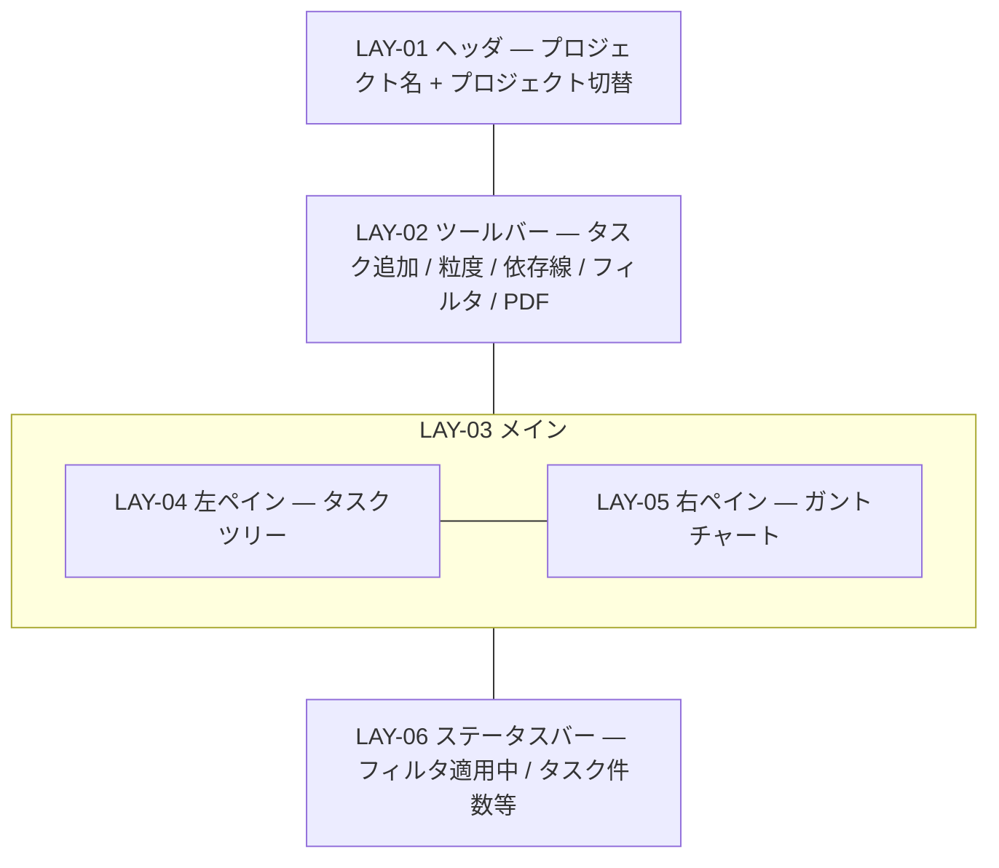
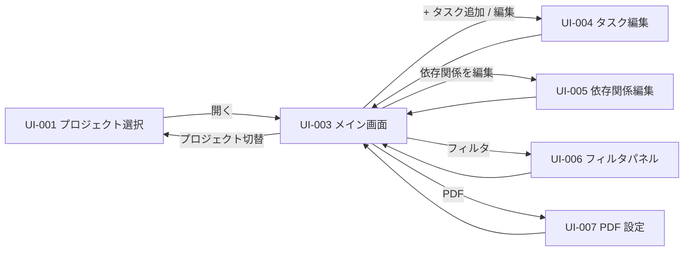

# UI-003 WBS メイン画面 — 画面詳細設計

本画面は本ツールの**中心画面**であり、JOB-001（即座の WBS 把握）と JOB-002（ガント上の直感操作）の主舞台。HCD/UX 設計で挙げられた UXI-001〜UXI-005 / UXI-008 はほぼ本画面に集中する。

- 対応 UI: [`UI-003 WBS メイン画面`](../../interface/interface-design.md#ui-003-wbs-メイン画面画面)
- 対応 UC: UC-002〜UC-009
- 対応 HCD: PER-001 / SCN-002 / SCN-003 / SCN-005 / JOB-001〜JOB-007 / FLW-001 / FLW-002 / FLW-005 / FLW-007 / FLW-008 / FLW-012
- 関連スタイルガイド: [`style-guide.md`](../style-guide.md)
- 作成日 / 最終更新日: 2026-05-19 / 2026-05-19
- 版: 0.1（ドラフト）

---

## 1. 画面概要

- **UI-NNN**: UI-003 WBS メイン画面
- **種別**: 画面（フル画面・モーダルではない）
- **対象利用者**: PER-001
- **画面の目的**: 選択中プロジェクトのタスクツリーとガントチャートを主表示とし、ツールバーから表示粒度切替・依存線表示切替・フィルタ起動・PDF エクスポート起動・プロジェクト切替を行う。タスク CRUD・依存関係 CRUD・ガント上のドラッグ&ドロップ操作の起点となる。
- **関連 UC**: UC-002〜UC-009（本ツールのほぼ全業務ユースケース）
- **関連 PER / SCN**:
  - PER-001（個人 WBS 管理者・Excel 経験者・macOS / Chrome 1280×720〜）
  - SCN-002（日次の進捗更新）— 朝会前後の確認、JOB-001 が主
  - SCN-003（期限近接タスクの再調整）— ガント上の直感操作、JOB-002 が主
  - SCN-005（タスク数が増えて見渡しが効かなくなる）— 粒度切替・依存線切替・フィルタが連携
- **関連 JOB / FLW**:
  - **JOB-001**（即座の WBS 把握）— 本画面の初期表示が主体（FLW-001 終点）
  - **JOB-002**（ガント上の直感的期間調整）— 本画面のドラッグ操作（FLW-002 / FLW-003 / FLW-004）
  - JOB-003（タスク追加・編集・WBS 保守）— 本画面が起点（UI-004 起動）
  - JOB-004（フィルタで絞り込む）— 本画面の表示状態を変える（FLW-005 / FLW-006）
  - JOB-005（粒度切替・依存線切替）— 本画面のツールバーで完結（FLW-007 / FLW-008）
  - JOB-006（依存関係管理）— 本画面が起点（UI-005 起動）
  - JOB-007（PDF 出力）— 本画面が起点（UI-007 起動）
  - JOB-008（プロジェクト切替）— ツールバーから UI-001 へ
- **本画面の主 CTA**: 単一の CTA に絞らず、**「ガント上でタスクをドラッグ」「タスク追加」「フィルタ起動」「PDF エクスポート」「プロジェクト切替」**の 5 操作がツールバーまたはガント上にすべて視界内にあることを最優先する。HCD JOB-001 の「即座の把握」を満たすため、操作要素は崩さない。
- **関連 UXI**:
  - UXI-001（ガントドラッグ 3 モード混同）→ CMP-030 GanttBar の左端・右端ハンドル視覚化、DYN-04 で具体化
  - UXI-002（親子の視覚区別）→ CMP-030 `parent` バリアント + パターン併用、A11Y-001 で具体化
  - UXI-003（期限超過の色 + アイコン併用）→ CMP-030 `overdue` バリアント、A11Y-001
  - UXI-004（大量タスク再描画の待ち時間）→ ST-09 / ST-10 で具体化
  - UXI-005（粒度月 × 依存線 ON 時の交錯）→ DYN-05 / RISK-002 で具体化
  - UXI-008（フィルタ適用状態の可視化）→ CMP-034 FilterChip 常駐表示
- **主なアクター・権限**: 単一利用者・権限なし
- **入力・出力項目**: [`interface-design.md` UI-003](../../interface/interface-design.md#ui-003-wbs-メイン画面画面) を参照（本画面で再掲しない）
- **起動 API**: API-006（タスク一覧）/ API-009（スケジュール更新 = ドラッグ&ドロップ）/ API-010（タスク削除）/ API-011（依存関係一覧）。間接起動: API-007（タスク作成）/ API-008（タスク更新、UI-004 経由）/ API-012 / API-013（UI-005 経由）/ API-001（プロジェクト切替時に UI-001 経由）。
- **画面間遷移**: 入口 = UI-001（[開く]）。出口 = UI-001（プロジェクト切替）/ UI-004（タスク編集）/ UI-005（依存関係編集）/ UI-006（フィルタ）/ UI-007（PDF）。本画面が動作中の主舞台。

---

## 2. レイアウト



| LAY-NN | 役割 | 主な CMP | 固定 / スクロール | ブレークポイント変化 |
|---|---|---|---|---|
| LAY-01 | ヘッダ。左寄せにアプリ名 + 現在開いているプロジェクト名、右寄せに [プロジェクト切替] ボタン | CMP-027 Header / CMP-001 Button (secondary) | 固定 | 変化なし |
| LAY-02 | ツールバー。左から: [+ タスク追加]（primary）/ 表示粒度切替（日・月 SegmentedControl）/ 依存線表示 Switch / [フィルタ] ボタン + FilterChip / [PDF エクスポート] ボタン | CMP-016 Toolbar / CMP-001 / CMP-010 SegmentedControl / CMP-009 Switch / CMP-034 FilterChip | 固定 | DTK-101 以上で要素間スペーシングが広がるが、要素自体は変化なし |
| LAY-03 | メイン領域。左ペイン（タスクツリー）と右ペイン（ガントチャート）の 2 カラム | − | 内部スクロール | DTK-100 で左 30% / 右 70%、DTK-101 で左 25% / 右 75%、DTK-102 で左 20% / 右 80% を目安（HO-I-001 で確定） |
| LAY-04 | 左ペイン: タスクツリー。タスク名・担当者・進捗の主要列を表示。横スクロールあり。親子はインデントで表現 | CMP-029 TreeNode × N | 縦スクロール（ペイン内）| ブレークポイントで列幅変化（HO-I-001） |
| LAY-05 | 右ペイン: ガントチャート。タイムライン軸（上）+ タスクバー（行に対応）+ 依存線。今日を示す縦線 | CMP-030〜CMP-033（ガント専用群） | 縦・横スクロール（ペイン内、左ペインと縦スクロール同期） | タイムラインの 1 日幅 / 1 月幅は DTK 値（DTK-063 等）で固定 |
| LAY-06 | ステータスバー。表示中タスク件数、フィルタ適用中の状態、表示粒度の補足表示 | CMP-022 Banner（フィルタ適用中のみ） / CMP-018 Stack | 固定 | 変化なし |

メモ:
- LAY-04 と LAY-05 は**縦スクロールを同期**する（タスク行とガント行が常に一致）。リサイザー（境界線をドラッグして幅変更）の採否は HO-I-001（本リリースは固定比率を推奨）。
- LAY-06 のフィルタ適用中表示は HCD UXI-008 を実装する場所。フィルタ非適用時は LAY-06 を表示しないかコンパクト表示（HO-I-002）。

---

## 3. コンポーネント配置

### 3.1 LAY-01 ヘッダ

| 配置順 | CMP | バリアント・サイズ | 表示条件 | 紐付く入出力 / API | 備考 |
|---|---|---|---|---|---|
| 1 | アプリ名テキスト（DTK-042） | − | 常時 | − | 左寄せ。「WBS 管理ツール」 |
| 2 | プロジェクト名表示（DTK-042） | − | 常時 | 出力: ENT-001.name | 左寄せ、区切りで「/ プロジェクト名」 |
| 3 | CMP-001 Button | secondary / md | 常時 | イベント: [プロジェクト切替] → UI-001 へ | ラベル「プロジェクト切替」。右寄せ |

### 3.2 LAY-02 ツールバー

| 配置順 | CMP | バリアント・サイズ | 表示条件 | 紐付く入出力 / API | 備考 |
|---|---|---|---|---|---|
| 1 | CMP-001 Button | primary / md | 常時 | イベント: [+ タスク追加] → UI-004 新規モード起動 | 左寄せ |
| 2 | CMP-001 Button | secondary / md | LAY-04 でタスク選択中のみ enable | イベント: [+ 子タスク追加] → UI-004 新規モード（親 = 選択タスク） | DYN-01 |
| 3 | CMP-001 Button | secondary / md | LAY-04 でタスク選択中のみ enable | イベント: [編集] → UI-004 編集モード | DYN-01 |
| 4 | CMP-001 Button | secondary / md | LAY-04 でタスク選択中のみ enable | イベント: [削除] → CMP-028 destructive 起動 | DYN-01 |
| 5 | CMP-001 Button | secondary / md | LAY-04 でタスク選択中のみ enable | イベント: [依存関係を編集] → UI-005 起動 | DYN-01 |
| 6 | CMP-020 Divider | vertical | 常時 | − | 区切り |
| 7 | ラベル「表示粒度」 + CMP-010 SegmentedControl | − | 常時 | 入力: 表示粒度（日 / 月）。状態保持はセッション内（HCD RISK-009） | DYN-05 |
| 8 | ラベル「依存線」 + CMP-009 Switch | − | 常時 | 入力: 依存線表示 ON / OFF | DYN-06 |
| 9 | CMP-020 Divider | vertical | 常時 | − | − |
| 10 | CMP-001 Button + CMP-034 FilterChip | secondary / md | 常時 | イベント: [フィルタ] → UI-006 起動 | ラベル「フィルタ」。FilterChip はフィルタ適用中のみ Button 隣に表示（HCD UXI-008） |
| 11 | CMP-001 Button | secondary / md | 常時 | イベント: [PDF エクスポート] → UI-007 起動 | ラベル「PDF」。タスク 0 件時は disable（ERR-004 抑止） |

### 3.3 LAY-04 タスクツリー（左ペイン）

| 配置順 | CMP | バリアント | 表示条件 | 紐付く出力 | 備考 |
|---|---|---|---|---|---|
| 1 | テーブルヘッダ（列名: タスク名 / 担当者 / 進捗） | − | 常時 | − | sticky（縦スクロール時も最上部に固定） |
| 2 | CMP-029 TreeNode × N | default | タスクが 1 件以上 | 出力: ENT-002.name / assignee / progress | 親子インデント、展開折りたたみ可。親タスクは進捗・期間が派生値で表示。期限超過タスクは行に視覚的手掛かり（行ハイライト + アイコン）|
| 3 | CMP-023 EmptyState | filtered-zero | フィルタ後 0 件 | − | 「条件に合致するタスクがありません」 + [フィルタをクリア] CTA |
| 4 | CMP-023 EmptyState | no-data | プロジェクト内タスク 0 件 | − | 「タスクを追加してください」 + [+ タスクを追加] CTA（UC-006 / UC-008 空状態案内）|

### 3.4 LAY-05 ガントチャート（右ペイン）

| 配置順 | CMP | バリアント | 表示条件 | 紐付く出力 | 備考 |
|---|---|---|---|---|---|
| 1 | CMP-032 GanttTimelineAxis | day / month | 常時（表示粒度に応じて切替） | − | sticky（縦スクロール時に上部固定）。月粒度では「YYYY/MM」、日粒度では「DD」+ 月の境目に「YYYY/MM」 |
| 2 | CMP-033 GanttTodayMarker | − | 常時 | システム日付 | 今日を示す縦線（DTK-035） |
| 3 | CMP-030 GanttBar | default | 子を持たない通常タスク | start_date / due_date / progress | 進捗 0〜99% のバー。左端・右端にリサイズハンドル（HCD UXI-001 / DYN-04）。バー全体ドラッグで期間シフト |
| 4 | CMP-030 GanttBar | parent | 子を持つ親タスク | 派生 start_date / due_date / progress | 操作不可（A11Y-001: 色 + パターン併用、HCD UXI-002）。ホバー時にツールチップ「親タスクは直接操作できません」 |
| 5 | CMP-030 GanttBar | overdue | システム日付 > due_date かつ progress < 100 | 同上 | 色（DTK-031）+ アイコン（警告マーク）+ ラベル（A11Y-001、HCD UXI-003）|
| 6 | CMP-030 GanttBar | completed | progress = 100 | 同上 | 色 DTK-032 + アイコン（完了マーク） |
| 7 | CMP-031 GanttDependencyLine | − | 依存線表示 ON のとき | 出力: ENT-003 + 関連タスクの座標 | 矢印で先行 → 後続 |

### 3.5 LAY-06 ステータスバー

| 配置順 | CMP | バリアント | 表示条件 | 紐付く出力 | 備考 |
|---|---|---|---|---|---|
| 1 | CMP-022 Banner | info | フィルタ適用中のみ | フィルタ条件サマリ | 「フィルタ適用中: 担当者『○○』、開始日範囲 ○○〜○○」（HCD UXI-008 / FB-011） |
| 2 | テキスト表示（`text.body.sm` / DTK-047） | − | 常時 | 表示中タスク件数 | 「表示中 N 件 / 全 M 件」 |

---

## 4. 画面状態一覧

| ST-NN | 状態名 | 発生契機 | 対応 FB | 応答時間区分 | 見え方 | ユーザーが取れる次の操作 |
|---|---|---|---|---|---|---|
| ST-01 | 画面初期表示開始 | UI-001 [開く] / プロジェクト切替 | FB-001 | 瞬時 | LAY-01 / LAY-02 を即時描画。LAY-04 / LAY-05 に CMP-026 Skeleton（ツリー行 + ガントバー形のグレー帯） | 待機 |
| ST-02 | 読込中（初回） | API-006 + API-011 並列呼出中 | FB-002 / FB-003 | 短時間（NFR-001 の 2 秒以内） | スケルトン継続。1 秒超では LAY-05 中央に CMP-024 Spinner | 待機（操作不可） |
| ST-03 | 空（タスク 0 件） | API-006 が空配列を返した | − | − | LAY-04 / LAY-05 全体に CMP-023 EmptyState `no-data`。タイトル「タスクを追加してください」+ [+ 最初のタスクを追加] CTA | [+ タスク追加] |
| ST-04 | 正常表示 | API-006 + API-011 成功 | FB-005 | − | LAY-04 / LAY-05 にデータが描画される。期限超過バーは色 + アイコンで識別可能 | 全操作可能 |
| ST-05 | タスク選択中 | LAY-04 / LAY-05 でタスクをクリック | FB-001 | 瞬時 | 選択タスクの行 / バーがハイライト（DTK-001 系の境界 / 背景）。LAY-02 の編集系ボタンが enable | 編集 / 削除 / 依存関係編集 / 子タスク追加 |
| ST-06 | ドラッグプレビュー中 | タスクバーをドラッグ開始（バー全体 / 左端 / 右端） | FB-002 | 瞬時 | バーがマウス位置に追従。プレビュー表現は半透明または破線（DTK 値は HO-I-001）。新しい開始日・期限がツールチップで表示 | ドロップ / Escape でキャンセル |
| ST-07 | ドラッグ抑止（親タスク） | 親タスクのバーをドラッグ試行 | FB-007 / FB-010 | 瞬時 | ドラッグ開始しない（カーソルが `not-allowed`）+ ツールチップ「親タスクは直接操作できません」（HCD UXI-002 / ERR-004） | 別操作 |
| ST-08 | ドロップ抑止（VR-002 違反） | 左端を右端より右にドロップ等 | FB-007 / FB-010 | 瞬時 | バーを元位置にスナップで戻す（DTK-090 motion.fast）+ ツールチップ「開始日は期限以前にしてください」 | 再ドラッグ |
| ST-09 | スケジュール更新中 | ドロップ確定 → API-009 待ち | FB-002 / FB-003 | 短時間（NFR-001 の 1 秒以内） | バーは旧位置のまま薄く表示（変化を未確定にする）+ CMP-024 Spinner をバー位置に小さく重ねる。応答後に新位置で確定描画 | 待機 |
| ST-10 | 大量タスクの再描画 | フィルタ適用後・粒度切替後で 500 タスク級の再描画 | FB-003 | 長時間（> 1s の可能性） | LAY-05 全体に半透明 + 進捗インジケータ（CMP-025）。「再描画中…」表示（HCD UXI-004） | 待機 |
| ST-11 | フィルタ適用中（正常） | UI-006 で [適用] → ST-04 に戻る | FB-005 / FB-011 | − | LAY-02 に CMP-034 FilterChip 表示、LAY-06 にフィルタ条件サマリ、LAY-04 / LAY-05 が絞り込み結果のみ表示 | 通常操作 + [フィルタクリア] |
| ST-12 | フィルタ結果 0 件 | フィルタ後にタスク 0 件 | − | − | LAY-04 / LAY-05 全体に CMP-023 EmptyState `filtered-zero`「条件に合致するタスクがありません」+ [フィルタをクリア] CTA | クリア |
| ST-13 | 表示粒度 = 月 | LAY-02 SegmentedControl 切替 | FB-003 | 短時間 | LAY-05 のタイムライン軸が月単位、バーが縮尺に応じて圧縮 | 全操作可能 |
| ST-14 | 依存線非表示 | LAY-02 Switch OFF | FB-003 | 短時間 | LAY-05 から依存線が消える | 全操作可能 |
| ST-15 | タスク削除確認中 | LAY-02 [削除] / LAY-04 コンテキストメニュー（実装で確定）| FB-008 | − | CMP-028 destructive がオーバーレイ表示。背後 scrim | [削除] 確定 / [キャンセル] / Escape |
| ST-16 | タスク削除実行中 | CMP-028 確定 → API-010 待ち | FB-002 | 短時間 | CMP-028 内の主操作 loading + disable | 待機 |
| ST-17 | タスク削除成功 | API-010 200 応答 | FB-006 | − | CMP-028 閉鎖 → CMP-021 Toast `success`「タスク『○○』を削除しました（子 N 件を最上位に昇格、依存関係 M 件を削除）」 → LAY-04 / LAY-05 再描画 | 通常操作 |
| ST-18 | エラー（一覧取得失敗） | API-006 / API-011 が 4xx / 5xx | FB-007 | − | LAY-04 / LAY-05 全体に CMP-023 EmptyState `error`「タスクを読み込めませんでした」+ [再読み込み] + 相関 ID | 再読み込み / プロジェクト切替 |
| ST-19 | エラー（ドラッグ更新失敗） | API-009 が 4xx / 5xx | FB-007 | − | バーを旧位置に戻すロールバック + CMP-021 Toast `error`（VR-010 / VR-002 違反の場合は VR ごとの分かりやすい文言） | 再ドラッグ |
| ST-20 | エラー（タスク削除失敗） | API-010 が 4xx / 5xx | FB-007 | − | CMP-028 閉鎖 → CMP-021 Toast `error` | 再試行 |

### 4.1 状態遷移図

```mermaid
stateDiagram-v2
  [*] --> ST-01: UI-001 [開く]
  ST-01 --> ST-02
  ST-02 --> ST-03: API-006 0件
  ST-02 --> ST-04: 成功
  ST-02 --> ST-18: 失敗
  ST-18 --> ST-02: 再読み込み
  ST-04 --> ST-05: タスク選択
  ST-05 --> ST-04: 選択解除
  ST-04 --> ST-06: バードラッグ開始
  ST-05 --> ST-06: 選択タスクをドラッグ
  ST-06 --> ST-07: 親タスクの場合
  ST-07 --> ST-04
  ST-06 --> ST-08: VR-002 不正位置
  ST-08 --> ST-04
  ST-06 --> ST-09: ドロップ確定
  ST-09 --> ST-04: 200
  ST-09 --> ST-19: 4xx/5xx
  ST-19 --> ST-04: 旧位置にロールバック
  ST-04 --> ST-11: フィルタ適用
  ST-11 --> ST-12: 結果 0 件
  ST-12 --> ST-04: フィルタクリア
  ST-11 --> ST-04: フィルタクリア
  ST-04 --> ST-13: 粒度切替（月）
  ST-13 --> ST-04: 粒度切替（日）
  ST-04 --> ST-14: 依存線 OFF
  ST-14 --> ST-04: 依存線 ON
  ST-04 --> ST-10: 大量再描画
  ST-10 --> ST-04
  ST-05 --> ST-15: [削除] 押下
  ST-15 --> ST-16: 確定
  ST-15 --> ST-04: キャンセル
  ST-16 --> ST-17: 200
  ST-16 --> ST-20: 4xx/5xx
  ST-17 --> ST-04
  ST-20 --> ST-04
  ST-04 --> [*]: [プロジェクト切替] → UI-001
  ST-05 --> [*]: [編集] → UI-004 / [依存関係を編集] → UI-005
  ST-04 --> [*]: [+ タスク追加] → UI-004 / [フィルタ] → UI-006 / [PDF] → UI-007
```

---

## 5. 権限別表示差分

**該当なし**。

---

## 6. フォーム動的挙動

本画面はフォーム画面ではないが、ツールバーの操作と選択状態に応じた動的挙動を持つ。

| DYN-NN | トリガ項目 | 対象項目 | 挙動 | 発火タイミング | 依存業務条件 |
|---|---|---|---|---|---|
| DYN-01 | LAY-04 / LAY-05 のタスク選択状態 | LAY-02 の [+ 子タスク追加] / [編集] / [削除] / [依存関係を編集] ボタン | タスク未選択時は disable、選択中は enable | onSelect / onDeselect | UI 仕様 |
| DYN-02 | LAY-02 の表示粒度切替 | LAY-05 ガントチャート | タイムライン軸の表示が日 ⇄ 月で切替、バーの縮尺も連動。**スナップは内部で常に日単位**を維持（UC-007 代替フロー） | onChange（即時） | UC-006 / UC-007 |
| DYN-03 | LAY-02 の依存線表示 Switch | LAY-05 依存線 | ON: CMP-031 を描画、OFF: 非描画。依存関係データ自体は保持（再 ON で復帰） | onChange | UC-006 |
| DYN-04 | LAY-05 ガントバー上のホバー位置 | CMP-030 GanttBar | バー左端から N px 以内: 左端リサイズハンドル領域 / バー右端から N px 以内: 右端リサイズハンドル領域 / それ以外: バー全体スライド領域。カーソル形状を `ew-resize`（リサイズ）/ `grab`（スライド）/ `not-allowed`（親タスク）で識別（HCD UXI-001 / A11Y-001） | onMouseMove | UC-007 |
| DYN-05 | LAY-05 ドラッグ中の位置 | CMP-030 GanttBar + ツールチップ | ドラッグ中はプレビュー描画 + 「YYYY-MM-DD 〜 YYYY-MM-DD」をツールチップで表示。1 日単位でスナップ | onDrag | UC-007 |
| DYN-06 | LAY-02 の [+ 子タスク追加] | UI-004 起動時の親タスク値 | LAY-04 で選択中のタスク ID を UI-004 の親フィールドにプリセット | onClick | UC-002 代替フロー |
| DYN-07 | LAY-04 のツリー縦スクロール | LAY-05 ガントチャートの縦スクロール | 縦スクロール位置を双方向に同期（行が常に一致） | onScroll | UI 仕様 |
| DYN-08 | LAY-02 [PDF エクスポート] ボタン | ボタン disable 判定 | 表示中タスクが 0 件のとき disable（ERR-004 抑止） | フィルタ適用 / タスク CRUD のたび | ERR-004 |

メモ:
- DYN-04 のリサイズハンドル領域幅は具体値（px）を実装で確定（HO-I-001）。スタイルガイド A11Y-004 でヒット領域最低 8px を目安としている。
- DYN-05 のスナップは表示粒度が「月」でも内部で日単位（UC-007 / インタフェース設計 API-009）。

---

## 7. レスポンシブ挙動

| ブレークポイント | LAY-03 比率 | LAY-04 / LAY-05 挙動 | ツールバー | ガント |
|---|---|---|---|---|
| DTK-100（1280px〜） | 左 30% / 右 70% | LAY-04 列幅: タスク名広め / 担当者中 / 進捗狭め。タスク名が長い場合は省略 ellipsis + ツールチップ | 全要素 1 行表示 | 1 日 24px / 1 月 80px（暫定） |
| DTK-101（1600px〜） | 左 25% / 右 75% | LAY-04 列幅の比率は同上、絶対幅が広がる | 同上、要素間スペーシングが広がる | 同上 |
| DTK-102（1920px〜） | 左 20% / 右 80% | 同上 | 同上 | 同上 |

崩してはいけないもの:
- LAY-02 ツールバーの全要素が常に視界内
- LAY-05 ガントチャートの今日マーカー（CMP-033）が常に視界内（初期表示時にスクロール位置を「今日」付近に合わせる）
- LAY-04 のタスク名列（最重要情報）

ブレークポイント間で変化なし:
- LAY-01 / LAY-02 / LAY-06 の高さ
- ガントチャートの 1 日幅・1 月幅

---

## 8. イベントと画面遷移

### 8.1 ツールバー操作

| イベント | トリガ条件 | 起動 API | API 呼出中の挙動 | 成功時 | 失敗時 | 確認モーダル |
|---|---|---|---|---|---|---|
| 画面初期表示 | UI-001 [開く] | API-006 + API-011 | ST-01 → ST-02 | ST-03 / ST-04 | ST-18 | 不要 |
| [+ タスク追加] | LAY-02 | − | − | UI-004 新規モード起動 | − | 不要 |
| [+ 子タスク追加] | LAY-02 / タスク選択中 | − | − | UI-004 新規モード（親プリセット） | − | 不要 |
| [編集] | LAY-02 / タスク選択中 | − | − | UI-004 編集モード起動 | − | 不要 |
| [削除] | LAY-02 / タスク選択中 | − | − | ST-15（CMP-028 destructive） | − | **必須** |
| CMP-028 [削除] 確定 | ST-15 | API-010 | ST-16 | ST-17 → ST-04 | ST-20 | − |
| [依存関係を編集] | LAY-02 / タスク選択中 | − | − | UI-005 起動 | − | 不要 |
| 表示粒度切替 | LAY-02 SegmentedControl | − | DYN-02 即時切替 | ST-13 / ST-04 | − | 不要 |
| 依存線切替 | LAY-02 Switch | − | DYN-03 即時切替 | ST-14 / ST-04 | − | 不要 |
| [フィルタ] | LAY-02 | − | − | UI-006 起動 | − | 不要 |
| [PDF エクスポート] | LAY-02 / タスク 0 件でない | − | − | UI-007 起動 | ERR-004（disable で抑止） | 不要 |
| [プロジェクト切替] | LAY-01 | − | − | UI-001 へ遷移 | − | 不要 |

### 8.2 ガント上のドラッグ&ドロップ

| イベント | トリガ条件 | 起動 API | API 呼出中の挙動 | 成功時 | 失敗時 | 確認モーダル |
|---|---|---|---|---|---|---|
| バー全体ドラッグ開始 | 子を持たないタスク・バー中央領域 | − | DYN-04 / DYN-05 | ST-06 プレビュー | − | 不要 |
| バー左端ドラッグ開始 | 子を持たないタスク・左端ハンドル領域 | − | 同上 | ST-06（開始日のみ変更プレビュー） | − | 不要 |
| バー右端ドラッグ開始 | 子を持たないタスク・右端ハンドル領域 | − | 同上 | ST-06（期限のみ変更プレビュー） | − | 不要 |
| 親タスクをドラッグ試行 | 子を持つタスク | − | − | ST-07（ドラッグ抑止） | − | 不要 |
| 不正位置にドロップ | 開始日 > 期限 | − | − | ST-08 → ST-04 | − | 不要 |
| 正常位置にドロップ | 子を持たないタスク、VR-002 通過 | API-009 | ST-09 | ST-04（新位置で確定） | ST-19（ロールバック + Toast） | 不要 |
| Escape キー（ドラッグ中） | ST-06 中 | − | − | ST-04（プレビュー破棄） | − | 不要 |

メモ:
- ドラッグ確定は楽観的更新を採らず、API-009 応答後に確定描画する（インタフェース設計 RISK-002 / アーキ設計 RISK-005）。プレビュー → 待機 → 確定の流れ。
- HCD RISK-004（キーボード代替）: ドラッグ操作のキーボード代替は本リリースでは UI-004 経由（タスク編集ダイアログで日付直接編集）で代替する方針。専用ショートカット（矢印キーで日数移動）は HO-I-002 で検討。

### 8.3 タスク選択

| イベント | トリガ条件 | 起動 API | 挙動 | 成功時 |
|---|---|---|---|---|
| LAY-04 のタスク行クリック | 任意のタスク行 | − | DYN-01 | ST-05（選択中） |
| LAY-05 のタスクバークリック | 任意のタスクバー | − | DYN-01 | ST-05（選択中） |
| LAY-03 の空領域クリック | 選択中の状態 | − | − | ST-04（選択解除） |
| LAY-04 のタスク行ダブルクリック | 任意のタスク行 | − | UI-004 編集モード起動と同義 | UI-004 起動 |

### 8.4 破壊的操作の確認設計（タスク削除）

CMP-028 destructive を使用。

- タイトル: 「タスク『○○』を削除しますか？」
- 説明: 「この操作は取り消せません。」+ 影響範囲: 「子タスク N 件は最上位に昇格、関連する依存関係 M 件も同時に削除されます。」（件数は LAY-04 / LAY-05 のキャッシュデータから即時派生可能）
- 主操作: 「削除する」（danger）
- 副操作: 「キャンセル」（secondary、**既定フォーカス**）
- HCD UXI-007 / FB-008 / インタフェース設計 RISK-006 を実装

### 8.5 画面遷移



---

## 9. 多言語・テキスト長変動方針

- **対応言語**: 日本語のみ。
- **長文時の挙動**:
  - タスク名（LAY-04 列・LAY-05 バーラベル）: 1 行省略 ellipsis + ホバー時ツールチップで全文。
  - 担当者: 同上、ただし列幅が小さいため積極的に省略。
  - プロジェクト名（LAY-01）: 同上。
- **テキスト方向**: LTR。
- **数値・日付の書式**: 日付は `YYYY-MM-DD`、進捗は「N%」表記（HO-I-002）。

---

## 10. 注意事項

### 10.1 リスク・懸念点

| RISK-NNN | 内容 | 影響範囲 | 顕在化条件 | 暫定対応 | 申し送り |
|---|---|---|---|---|---|
| RISK-001 | ガントドラッグの 3 モード混同（HCD UXI-001） | DYN-04 / CMP-030 / ST-06 | リサイズハンドルの視覚区別が弱い実装 | カーソル形状・ホバー時の視覚強調を必須化（HO-I-001） | HO-I-001 |
| RISK-002 | 粒度月 × 依存線 ON で依存線が交錯（HCD UXI-005） | LAY-05 / DYN-03 | 大量タスク + 依存関係多数 | 暫定として線の透過率・本数表示の最適化は HO-I-002 で詳細化。依存線が一定数超過した場合の「ホバー時のみ強調」モードを検討 | HO-I-002 |
| RISK-003 | 期限超過視覚化を色のみで判別する実装が混入しないか（HCD UXI-003 / A11Y-001） | CMP-030 overdue | アイコン併用が実装で抜ける | スタイルガイド CMP-030 仕様で必須要件として明文化済み。レビューで担保 | HO-T-NNN |
| RISK-004 | ガント上のキーボードドラッグ代替手段の未確定（HCD RISK-004 / スタイルガイド RISK-004） | A11Y-003 / DYN-04 | キーボード利用者 | 暫定として UI-004 経由でキーボードのみで完結可能と明記 | HO-I-002 |
| RISK-005 | 500 タスク × 1,000 依存関係の上限想定で初期描画が NFR-001（2 秒以内）を逸脱する可能性 | ST-02 / ST-10 / API-006 / API-011 | 上限近辺の利用 | アーキ設計 / クラス設計で描画最適化（仮想スクロール等）を検討。本書では ST-10 で進捗インジケータを提示 | アーキ / クラス設計 |
| RISK-006 | フィルタ・粒度・依存線の状態がアプリ再起動でリセットされる（HCD RISK-009 / IF 該当なし） | ST-11 / ST-13 / ST-14 | アプリ再起動後の利用者期待値 | 暫定としてセッション内保持（再起動でリセット）。プロジェクト単位の永続化は HO-I-003 で検討 | HO-I-003 |
| RISK-007 | LAY-04 / LAY-05 の縦スクロール同期実装が複雑で、性能劣化する懸念 | DYN-07 | 500 タスク級 | 仮想スクロール + 同期スクロール戦略を実装で確定 | HO-I-004 |
| RISK-008 | ドラッグ操作の楽観的更新を採用していないため、ドラッグ後の体感応答が API-009 待ちで遅く感じる可能性 | ST-09 | localhost 応答遅延時 | NFR-001 の 1 秒以内を担保する前提だが、応答が遅い場合は Spinner で待機を可視化 | NFR 監視 |
| RISK-009 | タスク削除時の影響範囲表示（子件数・依存件数）がクライアントキャッシュ依存で、キャッシュ古い場合に不正確 | ST-15 / CMP-028 | キャッシュとサーバの乖離 | サーバ側で再検証されるため最終的な整合は保たれるが、表示は事前推定として明示 | HO-I-005 |
| RISK-010 | フィルタ「親タスク配下」の解釈（直接子のみ vs 子孫すべて）が未確定 | UI-006 連携 / LAY-04 | フィルタ適用時 | インタフェース設計 HO-D-006 連動。本リリースでは「子孫すべて」を暫定方針 | UI-006 側 |
| RISK-011 | タスク 0 件のときに PDF ボタンが disable される条件と、フィルタ後 0 件のときの区別が利用者から見えにくい | LAY-02 / DYN-08 | フィルタ後 0 件 | フィルタ適用中のときは PDF ボタンに「フィルタを解除すると出力可能」のツールチップを併用 | HO-I-002 |

### 10.2 代替案と採らない理由

| ALT-NNN | 対象判断 | 代替案概要 | 採らない理由 | 再検討条件 |
|---|---|---|---|---|
| ALT-001 | レイアウトの骨格 | サイドバー（折りたたみ可能） | 要件側で「左にタスクツリー、右にガントチャート」と明示（UI-003 概要）。固定 2 ペインを採用 | 要件変更 |
| ALT-002 | ガントチャートの表示手段 | ライブラリ採用（dhtmlx-gantt 等） | アーキ設計 ALT-007 で自前 SVG 描画が確定済み。本書はこれに従う | アーキ判断変更 |
| ALT-003 | ローディング表現 | スピナーのみ | スケルトンの方が構造の予測可能性を与える（JOB-001 の体感速度向上） | − |
| ALT-004 | エラーの出し方 | モーダル | 一覧取得失敗は EmptyState `error` の方が「画面の主機能が動かない」を示せる。個別操作失敗は Toast | − |
| ALT-005 | フォームのサブミット先挙動 | 該当なし（本画面はフォーム画面ではない） | − | − |
| ALT-006 | 確認モーダルの採否 | タスク削除を軽確認のみ | 子タスクの昇格 + 依存関係連鎖削除を伴う破壊度。確認必須（HCD FB-008） | − |
| ALT-007 | ドラッグ更新の楽観的更新 | 楽観的更新（即時反映 → エラー時ロールバック） | localhost 想定で API-009 応答が NFR-001 内（1 秒以内）に収まる前提のため、楽観的更新の UX 改善余地が小さい。整合性優先（アーキ設計 RISK-005） | localhost 応答が想定より遅い場合 |
| ALT-008 | モバイル時のテーブル | カード化 | タッチデバイス対象外（NFR-003）。1280×720 以上のデスクトップのみ | − |
| ALT-009 | フィルタ適用中の表示位置 | LAY-02 のみ（FilterChip のみ） | LAY-02 だけでは見落とすリスク（HCD UXI-008）。LAY-06 でも条件サマリを表示する二段構え | − |

### 10.3 後続工程への申し送り事項

#### 実装への申し送り

| HO-I-NNN | 内容 | 想定選択肢 | 決定責任者 |
|---|---|---|---|
| HO-I-001 | LAY-03 の左右ペイン比率（リサイザーの採否含む）、ガントの 1 日幅 / 1 月幅、リサイズハンドル領域幅 | 固定比率（推奨）/ リサイザー対応 | 実装 / HCD |
| HO-I-002 | 粒度月 × 依存線 ON 時の交錯軽減策（透過率調整、ホバー時強調、線の本数制限） | 透過率 + ホバー強調 | 実装 |
| HO-I-003 | 表示状態（フィルタ・粒度・依存線）の永続化範囲 | セッション内（推奨）/ プロジェクト毎 / グローバル | 実装 / HCD |
| HO-I-004 | LAY-04 / LAY-05 の縦スクロール同期 + 仮想スクロール戦略 | 仮想スクロール + react-window 等 / 全描画 | 実装 |
| HO-I-005 | タスク削除確認時の影響範囲（子件数・依存件数）の計算元（キャッシュ vs サーバ確認） | キャッシュ（推奨、軽量）| 実装 |
| HO-I-006 | ガント上のキーボードショートカット（矢印キーで日数移動等） | 導入する / しない | 実装 / HCD |
| HO-I-007 | LAY-04 のタスク選択 UX（クリック / Ctrl+クリック / Shift+クリックでの複数選択は本リリースでは未対応） | 単一選択のみ | 実装 |
| HO-I-008 | LAY-04 のタスクツリー展開折りたたみの永続化 | セッション内 | 実装 |
| HO-I-009 | LAY-02 [子タスク追加] ボタンを LAY-04 のコンテキストメニューにも追加するか | 追加（推奨）| 実装 |
| HO-I-010 | LAY-05 ガントチャートの初期スクロール位置（今日 or 最古タスク） | 今日（推奨）| 実装 |
| HO-I-011 | 期限超過判定の基準日（システム日付固定 / 利用者設定可能） | システム日付固定（推奨、暫定）| 実装 / HCD / IF HO-D-005 |

#### QA・テスト設計への申し送り

| HO-T-NNN | 内容 | 想定 | 決定責任者 |
|---|---|---|---|
| HO-T-001 | ST-01〜ST-20 全状態のビジュアル確認 | 全状態 | QA |
| HO-T-002 | ドラッグ操作（バー全体・左端・右端・親タスク・不正位置）のインタラクションテスト | 必須 | QA |
| HO-T-003 | 500 タスク × 1,000 依存関係での性能テスト（NFR-001 / NFR-002 充足確認） | 必須 | QA |
| HO-T-004 | 粒度切替・依存線切替・フィルタの組合せテスト（特に粒度月 × 依存線 ON） | 必須 | QA |
| HO-T-005 | 期限超過視覚化が色 + アイコン併用になっていることの確認（A11Y-001） | 必須 | QA |
| HO-T-006 | キーボード操作のテスト（Tab 順序、タスク選択、編集ダイアログ起動、ConfirmDialog 操作） | 必須 | QA |
| HO-T-007 | スクリーンリーダーでのガント上タスク情報の読み上げ | 努力目標 | QA |

#### スタイルガイドへの昇格候補

| CAN-NNN | パターン概要 | 本画面での使用箇所 | 再利用可能性 | 昇格時の CMP 候補名 |
|---|---|---|---|---|
| CAN-001 | LAY-06 のステータスバーパターン（フィルタ状態 + 件数表示） | LAY-06 | 低（本画面のみ） | 昇格不要、本画面ローカル |

#### HCD / UI・UX 設計への逆流候補

| HO-U-NNN | 内容 | 逆流理由 | 相談先 |
|---|---|---|---|
| HO-U-001 | ガント上のキーボード操作（ドラッグの代替）の最小担保レベル | HCD RISK-004 / スタイルガイド HO-U-002 と連動 | HCD |
| HO-U-002 | 表示状態の永続化要件（HCD RISK-009 を要件側に逆流） | RISK-006 連動 | HCD / 要件定義 |
| HO-U-003 | タスク削除確認時の影響範囲表示（HCD FB-008 / UXI-007 の具体化） | RISK-009 / IF RISK-006 連動 | HCD |
| HO-U-004 | 期限超過判定の基準日（システム日付固定で良いか、利用者操作で変更可能にするか） | HCD で未確定（HCD RISK 未記載）。本書 RISK-011 と連動 | HCD |
