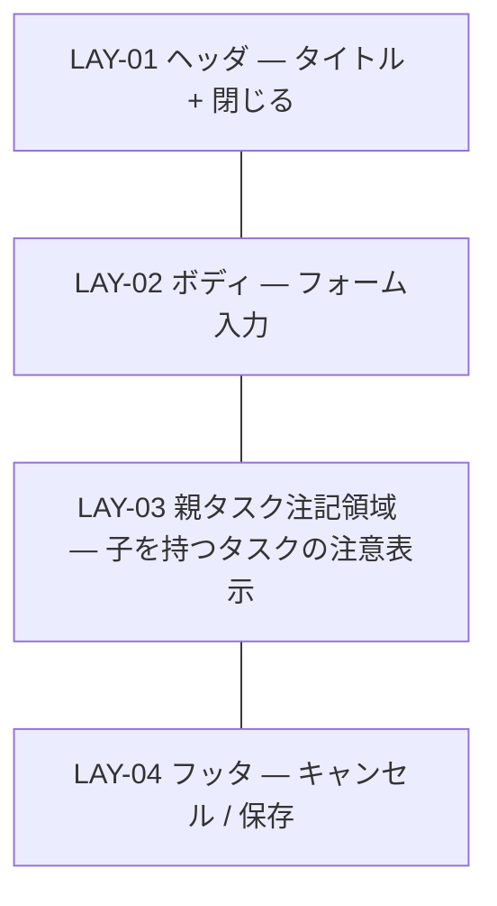

# UI-004 タスク編集ダイアログ — 画面詳細設計

- 対応 UI: [`UI-004 タスク編集ダイアログ`](../../interface/interface-design.md#ui-004-タスク編集ダイアログ画面)
- 対応 UC: UC-002（新規）、UC-003（編集）
- 対応 HCD: PER-001 / SCN-001 / SCN-002 / JOB-003 / FLW-011
- 関連スタイルガイド: [`style-guide.md`](../style-guide.md)
- 作成日 / 最終更新日: 2026-05-19 / 2026-05-19
- 版: 0.1（ドラフト）

---

## 1. 画面概要

- **UI-NNN**: UI-004 タスク編集ダイアログ
- **種別**: 画面（モーダルダイアログ）
- **対象利用者**: PER-001
- **画面の目的**: タスクの新規作成（基本フロー / 子タスク追加バリエーション）または既存タスクの編集を行う。タスク名・担当者・開始日・期限・進捗・親タスク・説明を入力する。
- **関連 UC**: UC-002（タスク登録）、UC-003（タスク編集）
- **関連 PER / SCN**: PER-001。SCN-001（プロジェクト初期セットアップ — 大量タスク作成時）、SCN-002（日次の進捗更新 — 進捗・期限の更新）。
- **関連 JOB / FLW**: JOB-003（タスク追加・編集で WBS を最新化する）— 主体。
- **本画面の主 CTA**: **[保存]**（入力内容を確定し、UI-003 を再描画）。
- **関連 UXI**: UXI-009（進捗の直接編集の効率性論点）— 本画面はダイアログ経由が要件側で確定。本書では「ダイアログ経由」を採用し、インライン編集化は HO-U-001 で逆流候補。
- **主なアクター・権限**: 単一利用者・権限なし
- **入力・出力項目の参照**: [`interface-design.md` UI-004](../../interface/interface-design.md#ui-004-タスク編集ダイアログ画面)
- **起動 API**: API-007（タスク作成）/ API-008（タスク更新）
- **画面間遷移**: 入口 = UI-003 の [+ タスク追加] / [+ 子タスク追加] / [編集]（および LAY-04 ダブルクリック）。出口 = UI-003 一覧（保存・キャンセル後）。

---

## 2. レイアウト

CMP-015 Modal `form` バリアント。1280×720 で固定幅 560px 程度（UI-002 より広め、項目数多のため）。



| LAY-NN | 役割 | 主な CMP | 固定 / スクロール | ブレークポイント変化 |
|---|---|---|---|---|
| LAY-01 | タイトル「新規タスク」/「タスクを編集」/「子タスクを追加（親: ○○）」+ 閉じる IconButton | CMP-015 / CMP-002 | 固定 | 変化なし |
| LAY-02 | フォーム入力エリア。タスク名 → 担当者 → 開始日 + 期限（横並び）→ 進捗 → 親タスク → 説明 | CMP-013 × 6, CMP-018 Stack, CMP-019 Inline（日付ペア） | スクロール可（縦が長い場合） | 変化なし |
| LAY-03 | 子を持つタスク編集時のみ表示される注意領域「このタスクは子を持つため、開始日・期限・進捗は子から自動算出されます」 | CMP-022 Banner（info） | 固定 | 変化なし |
| LAY-04 | 右寄せで [キャンセル] [保存] | CMP-019 Inline, CMP-001 × 2 | 固定 | 変化なし |

---

## 3. コンポーネント配置

| 配置順 | 領域 | CMP | バリアント・サイズ | 表示条件 | 紐付く入出力 / API | 備考 |
|---|---|---|---|---|---|---|
| 1 | LAY-01 | Modal Title | `text.h2` | 常時 | − | モード別タイトル |
| 2 | LAY-01 | CMP-002 IconButton | ghost / sm | 常時 | [閉じる] | aria-label「閉じる」 |
| 3 | LAY-02 | CMP-013 FormField + CMP-003 TextInput | md | 常時 | 入力: name / VR-001 | ラベル「タスク名 \*」 |
| 4 | LAY-02 | CMP-013 FormField + CMP-003 TextInput | md | 常時 | 入力: assignee | ラベル「担当者」 |
| 5 | LAY-02 | CMP-013 FormField + CMP-006 DateInput (横並びペア) | md | 常時。子を持つ親タスク編集時は readonly | 入力: start_date / due_date / VR-002, VR-010 | ラベル「開始日 \*」「期限 \*」。CMP-019 Inline で 2 カラム横並び |
| 6 | LAY-02 | CMP-013 FormField + CMP-005 NumberInput | md | 常時。子を持つ親タスク編集時は readonly | 入力: progress / VR-003, VR-010 | ラベル「進捗 (%)」。値域 0〜100。未入力時は 0 として送信（UC-002 代替フロー） |
| 7 | LAY-02 | CMP-013 FormField + CMP-007 Select | md | 常時 | 入力: parent_task_id / VR-004, VR-008 | ラベル「親タスク」。選択肢: 「（なし）」+ 同一プロジェクト内タスク一覧。子孫を除外（循環防止）。新規子タスク追加モード時は呼出元タスクをプリセット |
| 8 | LAY-02 | CMP-013 FormField + CMP-004 Textarea | md / 4 行 | 常時 | 入力: description | ラベル「説明」 |
| 9 | LAY-03 | CMP-022 Banner | info | 編集モードかつ対象タスクが子を持つ場合のみ | − | 「このタスクは子を持つため、開始日・期限・進捗は子から自動算出されます」（UC-003 代替フロー / VR-010） |
| 10 | LAY-04 | CMP-001 Button | secondary / md | 常時 | [キャンセル] | − |
| 11 | LAY-04 | CMP-001 Button | primary / md | 入力が VR を満たすまで disable | [保存] → API-007 / API-008 | − |

メモ:
- LAY-02 内のフォーム項目は CMP-018 Stack で `space.4`（16px）程度の間隔を保つ。
- LAY-03 Banner は LAY-02 と LAY-04 の間。利用者が編集不可項目を見つけた際の説明を、フッタの直前に置くことで自然に視界に入る。

---

## 4. 画面状態一覧

| ST-NN | 状態名 | 発生契機 | 対応 FB | 応答時間区分 | 見え方 | ユーザーが取れる次の操作 |
|---|---|---|---|---|---|---|
| ST-01 | 新規モード初期（通常） | UI-003 [+ タスク追加] | FB-001 | 瞬時 | フォーム全空、開始日・期限 = 今日プリセット、進捗 0、親タスク「（なし）」。[保存] disable | 入力 / キャンセル |
| ST-02 | 新規モード初期（子タスク追加） | UI-003 [+ 子タスク追加] | FB-001 | 瞬時 | ST-01 + 親タスクが呼出元タスクにプリセット。タイトル「子タスクを追加（親: ○○）」 | 入力 / キャンセル |
| ST-03 | 編集モード（子なしタスク） | UI-003 [編集]（UI-004 はキャッシュから初期化、API 不要） | FB-005 | − | フォームに現在値を表示。全項目編集可。[保存] は変更が VR を満たすまで disable | 編集 / キャンセル |
| ST-04 | 編集モード（子ありタスク = 親タスク） | UI-003 [編集] | FB-005 | − | フォームに現在値を表示。**開始日・期限・進捗は readonly**（VR-010）。LAY-03 Banner 表示 | name / assignee / parent / description のみ編集可 |
| ST-05 | 入力中（VR 違反） | 必須項目を空にして blur、開始日 > 期限、進捗 0〜100 範囲外 | FB-007 | − | 該当 FormField に invalid 表示 + CMP-012 HelperText (error)。[保存] disable | 修正 |
| ST-06 | 入力中（クライアント側循環参照検出） | 親タスクを自身の子孫に設定 | FB-007 | − | 親タスク FormField に invalid + 「親タスクとして自身の子孫を指定できません」 | 別の親を選ぶ |
| ST-07 | サブミット中 | [保存] 押下 → API-007 / API-008 | FB-002 | 短時間（NFR-001 1 秒以内） | [保存] loading + disable、フォーム全体 disable | 待機 |
| ST-08 | サブミット成功 | API 200/201 | FB-005 | − | モーダル閉鎖 → UI-003 で CMP-021 Toast `success`「タスク『○○』を保存しました」+ UI-003 再描画 | UI-003 操作 |
| ST-09 | サブミット失敗（ERR-001: VR） | サーバ側 VR-001/002/003/010 | FB-007 | − | モーダル維持、該当フィールドに invalid 表示（ST-05 同様）。LAY-03 ないし上部に Banner で全体メッセージ | 修正 |
| ST-10 | サブミット失敗（ERR-002: 循環 / プロジェクト跨ぎ） | VR-004 / VR-008 | FB-007 | − | モーダル維持、親タスク FormField に invalid + 「循環参照が発生します」/「別プロジェクトのタスクは指定できません」 | 修正 |
| ST-11 | サブミット失敗（ERR-003: 対象が存在しない） | 編集時に API-008 404（既に削除済み） | FB-007 | − | モーダル閉鎖 → UI-003 で Toast `error`「対象タスクが見つかりません」+ 一覧再取得 | UI-003 で再選択 |
| ST-12 | サブミット失敗（ERR-005 / ERR-006） | 500 系 | FB-007 | − | モーダル維持、上部 Banner danger「保存に失敗しました（相関 ID: xxx）」+ 入力値保持 | 再保存 / キャンセル |
| ST-13 | キャンセル確認（変更あり） | 変更後の [キャンセル] / Escape / IconButton | FB-008 | − | 軽確認 CMP-028 default「変更を破棄しますか？」 | 破棄 / 編集に戻る |

### 4.1 状態遷移図

```mermaid
stateDiagram-v2
  [*] --> ST-01: 新規（通常）
  [*] --> ST-02: 新規（子タスク追加）
  [*] --> ST-03: 編集（子なし）
  [*] --> ST-04: 編集（子あり）
  ST-01 --> ST-05: VR 違反
  ST-02 --> ST-05
  ST-03 --> ST-05
  ST-04 --> ST-05
  ST-05 --> ST-01: 修正
  ST-05 --> ST-03: 修正
  ST-03 --> ST-06: 親タスクで循環検出
  ST-04 --> ST-06
  ST-06 --> ST-03: 別の親
  ST-01 --> ST-07: [保存]
  ST-02 --> ST-07
  ST-03 --> ST-07
  ST-04 --> ST-07
  ST-07 --> ST-08: 200/201
  ST-07 --> ST-09: ERR-001
  ST-07 --> ST-10: ERR-002
  ST-07 --> ST-11: ERR-003
  ST-07 --> ST-12: ERR-005/006
  ST-09 --> ST-03: 修正
  ST-10 --> ST-03
  ST-12 --> ST-03: 再試行
  ST-08 --> [*]
  ST-11 --> [*]
  ST-03 --> ST-13: [キャンセル]（変更あり）
  ST-04 --> ST-13
  ST-13 --> ST-03: 編集に戻る
  ST-13 --> [*]: 破棄
  ST-01 --> [*]: [キャンセル]（変更なし）
```

---

## 5. 権限別表示差分

**該当なし**（認証認可なし）。

ただし、業務状態による表示差分は存在する: **「子を持つタスク」=「親タスク」の編集時は開始日・期限・進捗が readonly**（VR-010 / RULE-011）。これは権限ではなく業務ルール由来。ST-04 で表現。

---

## 6. フォーム動的挙動

| DYN-NN | トリガ項目 | 対象項目 | 挙動 | 発火タイミング | 依存業務条件 |
|---|---|---|---|---|---|
| DYN-01 | タスク名 | [保存] ボタン | 必須項目（タスク名・開始日・期限）が全て埋まり、VR を満たすまで disable | onChange / onBlur | VR-001 / VR-002 / VR-003 |
| DYN-02 | タスク名 | タスク名 FormField | 入力中は invalid 表示しない。blur 時に空なら ST-05 のエラー表示 | onBlur（判定）/ onChange（解除） | VR-001 |
| DYN-03 | 開始日 / 期限 | 期限 FormField / 開始日 FormField | 開始日 > 期限 になる組合せが入力された時点で invalid 表示 + エラー HelperText「開始日は期限以前にしてください」 | onChange（両方の値が揃ったら判定） | VR-002 |
| DYN-04 | 進捗 | 進捗 FormField | 0〜100 範囲外 / 数値以外を入力で invalid 表示 | onBlur | VR-003 |
| DYN-05 | 親タスク | 親タスク FormField | 自身の子孫を選択しようとした場合に invalid 表示 + エラー「自身の子孫を親に指定できません」 | onChange | VR-004 |
| DYN-06 | 親タスク Select の選択肢 | Select | 編集モード時、選択肢から「自身」と「自身の子孫」を除外（クライアント側で事前抑止） | Select 開く時 | VR-004 |
| DYN-07 | 編集モードで対象が子を持つかどうか | 開始日 / 期限 / 進捗 FormField | readonly + LAY-03 Banner 表示 | モーダル初期化時 | VR-010 / RULE-011 |
| DYN-08 | [保存] ボタン | フォーム全体 | サブミット中は loading + disable、入力 disable | onSubmit | スタイルガイド方針 |
| DYN-09 | 進捗を 100 に変更 | （表示のみ）期限超過識別 | 親の UI-003 で当該タスクは期限超過視覚化対象から外れる（UC-003 代替フロー） | 保存後 | UC-006 / UC-003 |
| DYN-10 | Escape キー | モーダル全体 | 変更あり: ST-13 / 変更なし: 即閉鎖 | onKeyDown | HCD A11Y-003 |

メモ:
- DYN-06 のクライアント側事前抑止は親タスク変更時の循環参照（VR-004）を未然防止するもの。サーバ側で最終再検証（API-008、ST-10）。
- 進捗未入力時の 0 自動補完（UC-002 代替フロー）は、CMP-005 NumberInput の挙動として「空欄で submit すると 0 として送信」を採用（HO-I-001）。または FormField レベルで明示的にプレースホルダ「0」を表示。

---

## 7. レスポンシブ挙動

| ブレークポイント | LAY 挙動 |
|---|---|
| DTK-100（1280px〜） | モーダル幅 560px 固定、中央。LAY-02 内の開始日 + 期限は横並び（CMP-019）|
| DTK-101 / DTK-102 | 同上 |

崩してはいけないもの:
- LAY-04 のフッタが常に視界内
- LAY-03 Banner（子を持つタスク編集時）は LAY-02 の readonly 項目より下に常時表示

---

## 8. イベントと画面遷移

| イベント | トリガ | 起動 API | API 呼出中の挙動 | 成功時 | 失敗時 | 確認モーダル |
|---|---|---|---|---|---|---|
| モーダル起動（新規） | UI-003 [+ タスク追加] | − | − | ST-01 | − | 不要 |
| モーダル起動（子タスク追加） | UI-003 [+ 子タスク追加] | − | − | ST-02 | − | 不要 |
| モーダル起動（編集） | UI-003 [編集] / ダブルクリック | − | − | ST-03（子なし）/ ST-04（子あり） | − | 不要 |
| 各 FormField 入力 | LAY-02 | − | DYN-01〜DYN-06 | ST 維持 | ST-05 / ST-06 | 不要 |
| [保存] 押下 | LAY-04 / ST-01〜ST-04 で VR 通過 | API-007（新規 / 子タスク）/ API-008（編集） | ST-07 | ST-08 | ST-09 / ST-10 / ST-11 / ST-12 | 不要 |
| [キャンセル] / Escape / IconButton | LAY-01 / LAY-04 | − | − | 変更なし: 即閉鎖 / 変更あり: ST-13 | − | 軽確認（変更あり時）|
| ST-13 [破棄] | 軽確認モーダル | − | − | モーダル閉鎖 → UI-003 | − | − |
| ST-13 [編集に戻る] | 同上 | − | − | ST-03 / ST-04 | − | − |

破壊的操作: 本画面にはない（タスク削除は UI-003 で実行）。

---

## 9. 多言語・テキスト長変動方針

- **対応言語**: 日本語のみ。
- **長文時の挙動**:
  - タスク名: 上限文字数の方針は HO-I-001（暫定 100 文字目安）。
  - 担当者: 上限 50 文字程度を目安（HO-I-001）。
  - 説明: Textarea で改行可、上限 2000 文字程度（HO-I-001）。
- **数値・日付の書式**: 開始日・期限はネイティブ DateInput（`YYYY-MM-DD`）。進捗は数値入力 + 「%」表示。

---

## 10. 注意事項

### 10.1 リスク・懸念点

| RISK-NNN | 内容 | 影響範囲 | 顕在化条件 | 暫定対応 | 申し送り |
|---|---|---|---|---|---|
| RISK-001 | 親タスク Select の選択肢が多数（500 タスク級）で UX 劣化 | LAY-02 / CMP-007 | 大規模 WBS | 検索可能 Select に切り替え（HO-I-002） | HO-I-002 |
| RISK-002 | 子を持つタスク編集時の readonly が利用者から見て「壊れて見える」（無効化されているだけに見える） | LAY-02 ST-04 / LAY-03 | 初見利用者 | LAY-03 Banner で明示説明（HCD A11Y-005 / UC-003 代替フロー） | − |
| RISK-003 | 親タスク変更で循環参照（VR-004）を事前抑止しきれず、サーバ側 422 で初めて検出される | ST-10 | DYN-06 の事前抑止が不完全な実装の場合 | クライアント側 DFS で事前判定（インタフェース設計 RULE-004 / クラス設計に委ねる） | HO-I-002 |
| RISK-004 | 進捗 100% にした瞬間に UI-003 側の期限超過視覚化が外れる挙動が即時反映されないと、利用者が混乱（DYN-09） | UI-003 / ST-08 後 | 保存後の再描画タイミング | API-008 の `recalculated_ancestors` 応答を使い UI-003 を即時再描画 | − |
| RISK-005 | DateInput のネイティブピッカーが Chrome / macOS で十分か | CMP-006 / ST-01〜04 | キーボード操作 | Chrome 限定のためネイティブで十分。代替検討は HO-I-003 / スタイルガイド HO-I-007 | − |
| RISK-006 | 進捗未入力時の 0 自動補完が利用者の意図と乖離（「未入力」と「0%」を区別したい場合） | LAY-02 / DYN-04 | データ仕様の解釈 | UC-002 代替フローで「未入力時は 0」と確定済みのため、画面側もこれに従う | − |
| RISK-007 | 開始日・期限の日付ピッカーが Chrome 独自のため、テスト時の動作確認が他環境で困難 | CMP-006 | 要件 NFR-003 で Chrome 限定のため許容 | − | − |
| RISK-008 | 「親タスクを変更したことで連鎖する派生再算出」がサーバ側で正しく行われない場合のクライアント側表示の整合性 | API-008 / UI-003 | `recalculated_ancestors` 欠落 | サーバ側実装で必ず返す（クラス設計 / IF API-008 仕様）。クライアント側はその応答を信頼 | アーキ・クラス設計 |

### 10.2 代替案と採らない理由

| ALT-NNN | 対象判断 | 代替案概要 | 採らない理由 | 再検討条件 |
|---|---|---|---|---|
| ALT-001 | レイアウトの骨格 | 全項目を縦並び（開始日・期限も縦） | 開始日 / 期限の関係を視覚的に並列で見せる方が UC-007 / VR-002 の理解に寄与 | 画面幅が極端に狭い場合（要件外） |
| ALT-002 | 親タスク選択の手段 | 階層ツリー型 Picker | プロジェクト内タスク数が 500 級ではフラット Select で十分。階層ツリーは実装コスト過剰 | 500 タスクで Select が使いづらいと判明した場合 |
| ALT-003 | 進捗の編集手段 | スライダー | 数値直接入力の方が桁単位で正確。スライダーは目安には良いが入力には不向き | 利用者調査でスライダー優位と判明した場合 |
| ALT-004 | 確認モーダル | 全キャンセルで破棄確認 | 何も入力していない状態での確認は煩雑 | − |
| ALT-005 | フォームのサブミット先挙動 | 連続作成（保存後にフォームをクリアして同モーダル維持） | タスク追加は単発操作が多い前提。連続作成は要件外 | 大量タスク一括入力要件追加時 |
| ALT-006 | 子を持つタスクの readonly 表現 | 編集可能だがサーバ側で拒否 | 利用者が「編集できる」と誤認するリスク。スタイルガイド CMP-003 の readonly 状態で明示 | − |
| ALT-007 | UXI-009: 進捗のインライン編集 | UI-003 のタスクツリーで進捗を直接編集 | 要件側 UC-003 がダイアログ前提で記述、本リリースは要件通り。要件側に逆流候補（HO-U-001） | 要件側で UC-003 改訂 |

### 10.3 後続工程への申し送り事項

#### 実装への申し送り

| HO-I-NNN | 内容 | 想定選択肢 | 決定責任者 |
|---|---|---|---|
| HO-I-001 | 各項目の上限文字数（タスク名 / 担当者 / 説明） | タスク名 100 / 担当者 50 / 説明 2000 | 実装 / データ設計 |
| HO-I-002 | 親タスク Select の検索可能化の実装方式 | 検索可能 Combobox / プレーン Select | 実装 |
| HO-I-003 | DateInput の代替実装（ネイティブで十分か） | ネイティブ / カスタムピッカー | 実装 |
| HO-I-004 | 進捗の入力 UX（NumberInput のみ / スピナー / スライダー併用） | NumberInput のみ | 実装 |
| HO-I-005 | 既定フォーカス位置 | タスク名入力 | 実装 |
| HO-I-006 | プレースホルダ文言の最終表現（特に進捗の「0」既定値表現） | − | 実装 |
| HO-I-007 | キャンセル時の変更検出ロジック（任意項目変更も含めるか） | 含める（推奨） | 実装 |
| HO-I-008 | 親タスク変更時のクライアント側循環参照検出ロジック | DFS（クラス設計と整合） | 実装 |

#### QA・テスト設計への申し送り

| HO-T-NNN | 内容 | 想定 | 決定責任者 |
|---|---|---|---|
| HO-T-001 | 全状態（ST-01〜ST-13）のビジュアル確認 | 必須 | QA |
| HO-T-002 | VR-001〜VR-004 / VR-008 / VR-010 の各違反シナリオテスト | 必須 | QA |
| HO-T-003 | 子を持つタスク編集時の readonly 確認（A11Y-005 / VR-010） | 必須 | QA |
| HO-T-004 | キーボード操作（Tab 順序、Enter 保存、Escape キャンセル） | 必須 | QA |
| HO-T-005 | 500 タスク規模の親タスク Select 操作性 | 必須 | QA |

#### スタイルガイドへの昇格候補

該当なし。

#### HCD / UI・UX 設計への逆流候補

| HO-U-NNN | 内容 | 逆流理由 | 相談先 |
|---|---|---|---|
| HO-U-001 | UXI-009（進捗のインライン編集）の採用可否を要件側に確認 | 日次更新の所要時間短縮に直結。HCD HO-R-002 連動 | HCD / 要件定義 |
| HO-U-002 | 中断再開（入力途中での閉鎖）の HCD / 要件側での確定 | UI-002 と共通の論点。HCD HO-R-003 連動 | HCD / 要件定義 |
