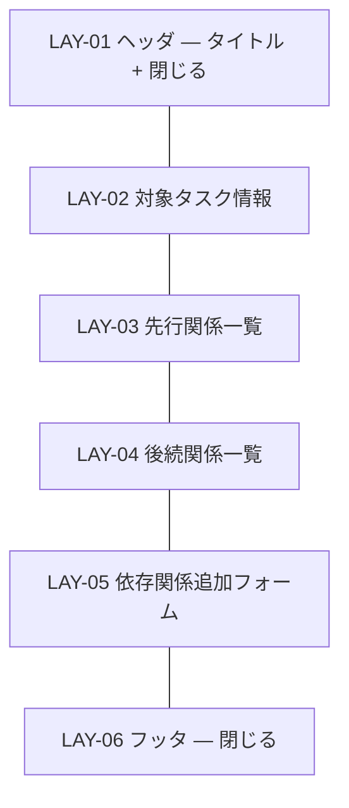

# UI-005 依存関係編集ダイアログ — 画面詳細設計

- 対応 UI: [`UI-005 依存関係編集ダイアログ`](../../interface/interface-design.md#ui-005-依存関係編集ダイアログ画面)
- 対応 UC: UC-005
- 対応 HCD: PER-001 / SCN-001 / JOB-006
- 関連スタイルガイド: [`style-guide.md`](../style-guide.md)
- 作成日 / 最終更新日: 2026-05-19 / 2026-05-19
- 版: 0.1（ドラフト）

---

## 1. 画面概要

- **UI-NNN**: UI-005 依存関係編集ダイアログ
- **種別**: 画面（モーダルダイアログ）
- **対象利用者**: PER-001
- **画面の目的**: 対象タスクを基準に、先行関係（対象タスクが先行となる関係）と後続関係（対象タスクが後続となる関係）の一覧を表示し、追加・削除を行う。
- **関連 UC**: UC-005
- **関連 PER / SCN**: PER-001。SCN-001（プロジェクト初期セットアップ — 依存関係を一気に組む）。
- **関連 JOB / FLW**: JOB-006（依存関係管理）— 主体。
- **本画面の主 CTA**: **[追加]**（先行 / 後続タスクを選んで依存関係を 1 件追加 — 操作頻度最多）と **[閉じる]**（モーダル終了 — UI-005 は一括コミットではなく追加・削除を都度反映するため、「保存」概念がない）。
- **関連 UXI**: 該当 UXI なし（HCD 側で本画面に特化した UX 課題は未抽出）
- **主なアクター・権限**: 単一利用者
- **入力・出力項目の参照**: [`interface-design.md` UI-005](../../interface/interface-design.md#ui-005-依存関係編集ダイアログ画面)
- **起動 API**: API-012（依存関係追加）/ API-013（依存関係削除）
- **画面間遷移**: 入口 = UI-003 で対象タスク選択 → [依存関係を編集]。出口 = UI-003（[閉じる] / Escape）。

---

## 2. レイアウト

CMP-015 Modal `form` バリアント。1280×720 で固定幅 640px 程度（一覧表示のためやや広め）。



| LAY-NN | 役割 | 主な CMP | 固定 / スクロール | ブレークポイント変化 |
|---|---|---|---|---|
| LAY-01 | タイトル「依存関係を編集 — タスク『○○』」+ 閉じる IconButton | CMP-015 / CMP-002 | 固定 | 変化なし |
| LAY-02 | 対象タスクの情報表示（タスク名・期間 — 文脈確認のため） | CMP-022 Banner (info)（軽量）or 静的テキスト | 固定 | 変化なし |
| LAY-03 | 「先行関係一覧」セクション。対象タスクが「後続」となる関係（つまり、対象の先行にあたるタスクの一覧）。各行に削除ボタン | CMP-018 Stack, CMP-014 Card or リスト行, CMP-001 Button (danger 小) | 内部スクロール | 変化なし |
| LAY-04 | 「後続関係一覧」セクション。対象タスクが「先行」となる関係（対象の後続にあたるタスクの一覧）。各行に削除ボタン | 同上 | 内部スクロール | 変化なし |
| LAY-05 | 新規依存関係を追加するフォーム。先行タスク Select + 後続タスク Select + [追加] ボタン | CMP-019 Inline, CMP-013 FormField + CMP-007 Select × 2, CMP-001 Button (primary) | 固定 | 変化なし |
| LAY-06 | 右寄せで [閉じる] | CMP-001 Button (secondary) | 固定 | 変化なし |

メモ:
- 「先行関係一覧」と「後続関係一覧」を 2 セクションに分けて表示することで、依存方向を視覚的に区別する。
- LAY-05 のフォームは対象タスクが「先行」または「後続」のいずれにも追加できるよう、両 Select を提示。対象タスク自身がどちらかにプリセットされる UX は HO-I-001 で検討（暫定: 「先行 = 対象タスク」プリセット、「後続」を選ぶ運用）。

---

## 3. コンポーネント配置

| 配置順 | 領域 | CMP | バリアント・サイズ | 表示条件 | 紐付く入出力 / API | 備考 |
|---|---|---|---|---|---|---|
| 1 | LAY-01 | Modal Title | `text.h2` | 常時 | − | 「依存関係を編集 — タスク『{対象タスク名}』」 |
| 2 | LAY-01 | CMP-002 IconButton | ghost / sm | 常時 | [閉じる] | aria-label「閉じる」 |
| 3 | LAY-02 | テキスト表示 | `text.body.md` | 常時 | 出力: 対象タスク名・期間 | 「対象タスク: ○○（YYYY-MM-DD 〜 YYYY-MM-DD）」 |
| 4 | LAY-03 | セクション見出し | `text.h3` | 常時 | − | 「先行タスク（このタスクの前に行うタスク）」 |
| 5 | LAY-03 | リスト行（カード or リスト） | − | 対象タスクが後続として関与する依存が 1 件以上 | 出力: 先行タスク名 + dependency_id | 各行: 「← {先行タスク名}」+ [削除] アイコンボタン |
| 5.1 | LAY-03 / 各行 | CMP-002 IconButton | ghost / sm | 常時 | [削除] → CMP-028 destructive 起動 | aria-label「この依存関係を削除」+ アイコン |
| 6 | LAY-03 | 空状態テキスト or EmptyState 小 | − | 関係 0 件のみ | − | 「先行関係なし」 |
| 7 | LAY-04 | セクション見出し | `text.h3` | 常時 | − | 「後続タスク（このタスクの後に行うタスク）」 |
| 8 | LAY-04 | リスト行 | − | 対象タスクが先行として関与する依存が 1 件以上 | 出力: 後続タスク名 + dependency_id | 各行: 「→ {後続タスク名}」+ [削除] アイコンボタン |
| 8.1 | LAY-04 / 各行 | CMP-002 IconButton | ghost / sm | 常時 | [削除] → CMP-028 destructive 起動 | 同上 |
| 9 | LAY-04 | 空状態テキスト | − | 関係 0 件のみ | − | 「後続関係なし」 |
| 10 | LAY-05 | CMP-020 Divider | − | 常時 | − | LAY-03/04 と LAY-05 の区切り |
| 11 | LAY-05 | セクション見出し | `text.h3` | 常時 | − | 「依存関係を追加」 |
| 12 | LAY-05 | CMP-013 FormField + CMP-007 Select | md | 常時 | 入力: predecessor_task_id / VR-005, VR-008 | ラベル「先行タスク」。同一プロジェクト内タスク選択肢。対象タスクをプリセット可能 |
| 13 | LAY-05 | CMP-013 FormField + CMP-007 Select | md | 常時 | 入力: successor_task_id / VR-005, VR-008 | ラベル「後続タスク」 |
| 14 | LAY-05 | CMP-001 Button | primary / md | 両 Select が選択され、VR-005 / VR-006 / VR-007 / VR-008 を満たすまで disable | [追加] → API-012 | ラベル「追加」 |
| 15 | LAY-06 | CMP-001 Button | secondary / md | 常時 | [閉じる] | ラベル「閉じる」 |

メモ:
- LAY-03 / LAY-04 のリスト行は CMP-014 Card を使うほどではなく、シンプルなリスト行（Inline Stack + 区切り）で十分（HO-I-002）。
- 削除は各行のアイコンボタン押下 → CMP-028 destructive の確認ダイアログ。一括削除（複数選択）は本リリース未対応。

---

## 4. 画面状態一覧

| ST-NN | 状態名 | 発生契機 | 対応 FB | 応答時間区分 | 見え方 | ユーザーが取れる次の操作 |
|---|---|---|---|---|---|---|
| ST-01 | 初期表示 | UI-003 [依存関係を編集] 押下 | FB-005 | − | UI-003 のキャッシュデータから先行 / 後続一覧を即時表示（API 呼出なし）。LAY-05 フォームは空 | 追加 / 削除 / 閉じる |
| ST-02 | 追加フォーム入力中（VR 通過） | LAY-05 で先行・後続を選択 | FB-001 | 瞬時 | [追加] enable | 追加 |
| ST-03 | 追加フォーム入力中（VR 違反） | 先行 = 後続（VR-005）/ 既に存在する組合せ（VR-006 事前検出） | FB-007 | − | LAY-05 に invalid 表示 + HelperText「先行と後続を異なるタスクにしてください」/「この依存関係は既に存在します」 | 別の選択 |
| ST-04 | 追加フォーム入力中（循環依存事前検出） | VR-007 をクライアント側 DFS で事前検出 | FB-007 | − | LAY-05 に invalid 表示「この組合せは循環依存になるため追加できません」+ ホバー時に循環経路の概要（HO-I-003） | 別の選択 |
| ST-05 | 追加中 | [追加] 押下 → API-012 待ち | FB-002 | 短時間 | [追加] loading + disable、LAY-05 入力 disable | 待機 |
| ST-06 | 追加成功 | API-012 201 | FB-005 | − | 追加された依存関係が LAY-03 または LAY-04 に新規行として現れる + CMP-021 Toast `success`「依存関係を追加しました」 + LAY-05 フォームをリセット | 別操作 |
| ST-07 | 追加失敗（VR / 重複） | API-012 4xx | FB-007 | − | LAY-05 維持、該当箇所に invalid 表示。HTTP 409（VR-006）/ 422（VR-007） | 修正 |
| ST-08 | 削除確認中 | LAY-03 / LAY-04 行の [削除] 押下 | FB-008 | − | CMP-028 destructive 表示。「依存関係を削除しますか？」+ 削除対象の依存関係を明示（先行 → 後続の関係）。主操作 danger | [削除] / [キャンセル] |
| ST-09 | 削除中 | CMP-028 確定 → API-013 待ち | FB-002 | 短時間 | CMP-028 内の主操作 loading + disable | 待機 |
| ST-10 | 削除成功 | API-013 200 | FB-006 | − | 該当行が LAY-03 / LAY-04 から消える + CMP-021 Toast `success`「依存関係を削除しました」 | 別操作 |
| ST-11 | 削除失敗 | API-013 4xx / 5xx | FB-007 | − | CMP-028 閉鎖 → Toast `error`「削除に失敗しました（相関 ID: xxx）」。一覧はそのまま | 再試行 |
| ST-12 | 閉じる | LAY-06 [閉じる] / Escape / IconButton | − | − | モーダル閉鎖 → UI-003 を再描画（追加・削除の合計反映） | UI-003 操作 |

メモ:
- UI-005 は「保存」概念を持たない。各 [追加] [削除] が即時 API に反映される。インタフェース設計 RISK-012 / 6.2 ALT-009 で確定済み。
- [閉じる] 時に確認は出さない（変更は既にすべてサーバに反映されているため）。

### 4.1 状態遷移図

```mermaid
stateDiagram-v2
  [*] --> ST-01: UI-003 [依存関係を編集]
  ST-01 --> ST-02: フォーム入力（正常）
  ST-01 --> ST-03: VR-005/006 違反
  ST-01 --> ST-04: VR-007 違反
  ST-03 --> ST-02: 修正
  ST-04 --> ST-02: 修正
  ST-02 --> ST-05: [追加] 押下
  ST-05 --> ST-06: 201
  ST-05 --> ST-07: 4xx
  ST-06 --> ST-01: フォームリセット
  ST-07 --> ST-02: 修正
  ST-01 --> ST-08: 行の [削除] 押下
  ST-08 --> ST-09: 確定
  ST-08 --> ST-01: キャンセル
  ST-09 --> ST-10: 200
  ST-09 --> ST-11: 4xx/5xx
  ST-10 --> ST-01
  ST-11 --> ST-01
  ST-01 --> ST-12: [閉じる] / Escape
  ST-12 --> [*]
```

---

## 5. 権限別表示差分

**該当なし**。

---

## 6. フォーム動的挙動

| DYN-NN | トリガ項目 | 対象項目 | 挙動 | 発火タイミング | 依存業務条件 |
|---|---|---|---|---|---|
| DYN-01 | 先行 Select | 後続 Select の選択肢 | 「先行 = 後続」を防ぐため、先行 Select で選択中のタスクを後続 Select の選択肢から除外（VR-005 事前抑止） | onChange | VR-005 |
| DYN-02 | 後続 Select | 先行 Select の選択肢 | 同上、逆方向 | onChange | VR-005 |
| DYN-03 | 先行・後続 両方選択 | [追加] ボタン | 既存依存関係と重複（VR-006）でないか事前判定し、重複なら disable + HelperText「この依存関係は既に存在します」 | 両方が選択された時点 | VR-006 |
| DYN-04 | 先行・後続 両方選択 | [追加] ボタン | 循環依存（VR-007）を事前 DFS 判定し、循環なら disable + HelperText「この組合せは循環依存になります」 | 両方が選択された時点 | VR-007 |
| DYN-05 | 同一プロジェクト判定 | 先行 / 後続 Select の選択肢 | 同一プロジェクト内タスクのみ選択肢として表示（VR-008 事前抑止） | Select 開く時 | VR-008 |
| DYN-06 | [追加] ボタン | フォーム全体 | API-012 呼出中は loading + disable | onSubmit | スタイルガイド方針 |

メモ:
- DYN-04 の事前 DFS 判定は、UI-003 のキャッシュデータ（タスク一覧 + 依存関係一覧）を用いる。実装ロジックはクラス設計と整合（インタフェース設計 RULE-007）。
- サーバ側で最終再検証されるため、クライアント側の事前抑止は UX 向上目的（HCD UXI-001 観点では「ミスが起きない設計」）。

---

## 7. レスポンシブ挙動

| ブレークポイント | LAY 挙動 |
|---|---|
| DTK-100（1280px〜） | モーダル幅 640px 固定、中央。LAY-05 の Select × 2 + [追加] は横並び |
| DTK-101 / DTK-102 | 同上 |

崩してはいけないもの:
- LAY-05 追加フォームと LAY-06 [閉じる] が常に視界内
- LAY-03 / LAY-04 の見出しが内部スクロール時も視認可能

---

## 8. イベントと画面遷移

| イベント | トリガ | 起動 API | API 呼出中の挙動 | 成功時 | 失敗時 | 確認モーダル |
|---|---|---|---|---|---|---|
| モーダル起動 | UI-003 [依存関係を編集] | − | − | ST-01 | − | 不要 |
| 先行 / 後続 Select 選択 | LAY-05 | − | DYN-01〜05 | ST-02 | ST-03 / ST-04 | 不要 |
| [追加] 押下 | LAY-05 / VR 通過 | API-012 | ST-05 | ST-06 | ST-07 | 不要 |
| 行の [削除] 押下 | LAY-03 / LAY-04 | − | − | ST-08 | − | **必須**（destructive） |
| CMP-028 [削除] 確定 | ST-08 | API-013 | ST-09 | ST-10 | ST-11 | − |
| CMP-028 [キャンセル] / Escape | ST-08 | − | − | ST-01 | − | − |
| [閉じる] / Escape / IconButton | LAY-06 / LAY-01 | − | − | UI-003 へ戻る（差分は既に反映済み） | − | 不要 |

破壊的操作: 依存関係削除（影響は単一の依存関係のみ、連鎖削除はない）。CMP-028 destructive を使うが、影響範囲は単純なため確認の強度は標準。

---

## 9. 多言語・テキスト長変動方針

- **対応言語**: 日本語のみ。
- **長文時の挙動**:
  - 対象タスク名（LAY-02）: 1 行省略 ellipsis + ホバー時ツールチップ。
  - リスト行のタスク名（LAY-03 / LAY-04）: 同上。
- **数値・日付**: タスク期間（LAY-02）は `YYYY-MM-DD` 表示。

---

## 10. 注意事項

### 10.1 リスク・懸念点

| RISK-NNN | 内容 | 影響範囲 | 顕在化条件 | 暫定対応 | 申し送り |
|---|---|---|---|---|---|
| RISK-001 | 先行 / 後続 Select の選択肢が多数（500 タスク級）で UX 劣化 | LAY-05 / CMP-007 | 大規模 WBS | 検索可能 Combobox に切替（UI-004 RISK-001 と共通） | HO-I-001 |
| RISK-002 | 循環依存事前検出（DYN-04）のクライアント側計算負荷が依存関係多数（1,000 件）で重い | DYN-04 / ST-04 | 1,000 件近辺 | 単純 DFS で問題ない見込み（NFR-001 1 秒以内）。ベンチマークで確認 | HO-T-001 |
| RISK-003 | [追加] と [削除] が即時 API 反映されるため、ダイアログを途中で閉じる利用者の「未保存」期待値とのズレ | ST-12 | 利用者が「保存ボタンがない」ことに戸惑う | LAY-06 [閉じる] のラベルを「閉じる」（「キャンセル」とせず）にして、差分が保存済みであることを示唆。インタフェース設計 RISK-012 / ALT-009 連動 | HO-I-002 |
| RISK-004 | 先行・後続の方向（矢印の意味）が利用者から見て直感的でない可能性 | LAY-03 / LAY-04 / CMP-031 | 初見利用者 | 矢印（← / →）+ セクション見出しに補足説明「このタスクの前に行うタスク」を併記 | − |
| RISK-005 | UI-003 のキャッシュから初期表示するため、キャッシュが古い場合の一覧不整合 | ST-01 | UI-003 が長時間表示されているケース | UI-003 の表示は API-011 で初期化されており、その後 UI-005 内で追加・削除されるたびに更新されるため、本ダイアログ内では問題なし | − |
| RISK-006 | 依存関係を多数追加する場面で、Toast が連続表示されて煩雑になる可能性 | ST-06 / CMP-021 | 連続追加 | Toast の同時表示上限 3 件（スタイルガイド CMP-021 仕様）で対応 | − |
| RISK-007 | 重複依存関係（VR-006）追加時、サーバが 409 を返した場合のクライアント側挙動 | ST-07 | DYN-03 の事前検出が漏れた場合 | サーバ側 409 を受けて HelperText で告知。事前検出は HO-I-002 で改善 | − |

### 10.2 代替案と採らない理由

| ALT-NNN | 対象判断 | 代替案概要 | 採らない理由 | 再検討条件 |
|---|---|---|---|---|
| ALT-001 | レイアウトの骨格 | 先行 / 後続を 1 つの一覧で表示（方向列を持つテーブル） | 2 セクション分割の方が方向の認知が明確 | UI 過密と判明した場合 |
| ALT-002 | 一括 / 個別の依存関係 API 粒度 | 一括置換（PUT /tasks/{taskId}/dependencies） | インタフェース設計 ALT-009 で却下済み。個別 CRUD で UI 設計と素直に対応 | − |
| ALT-003 | 削除の確認モーダル | 軽確認のみ | 依存関係削除は影響範囲が小さいが、誤削除を防ぐため CMP-028 destructive で統一（HCD 体験の一貫性） | − |
| ALT-004 | サブミット先挙動 | [追加] 後にフォームを残す（連続追加可能） | 既に採用済み（ST-06 でフォームリセット）。連続追加 UX を担保 | − |
| ALT-005 | 確認モーダルの採否 | 削除を確認なしの即時実行 | 利用者の誤クリックで依存関係が消えるリスクが高い | − |

### 10.3 後続工程への申し送り事項

#### 実装への申し送り

| HO-I-NNN | 内容 | 想定選択肢 | 決定責任者 |
|---|---|---|---|
| HO-I-001 | 先行 / 後続 Select の検索可能化 | 検索可能 Combobox | 実装 |
| HO-I-002 | [閉じる] ボタンのラベル（「閉じる」「完了」など） | 「閉じる」（推奨） | 実装 |
| HO-I-003 | 循環依存事前検出時のエラーメッセージ詳細度（循環経路の表示有無） | 経路概要表示（推奨） | 実装 |
| HO-I-004 | 対象タスクを LAY-05 の先行 / 後続にプリセットするか | 先行にプリセット（推奨） | 実装 / HCD |
| HO-I-005 | 削除時の影響説明（連鎖削除はないため最小限）の文言 | 「依存関係『○○ → ○○』を削除しますか？」 | 実装 |

#### QA・テスト設計への申し送り

| HO-T-NNN | 内容 | 想定 | 決定責任者 |
|---|---|---|---|
| HO-T-001 | 循環依存検出（DYN-04）の計算性能（1,000 件規模） | 1,000 件で NFR-001 達成確認 | QA |
| HO-T-002 | 全状態（ST-01〜ST-12）のビジュアル確認 | 必須 | QA |
| HO-T-003 | VR-005 / VR-006 / VR-007 / VR-008 各違反シナリオ | 必須 | QA |
| HO-T-004 | キーボード操作（Tab 順序、Enter で追加、Escape で閉じる） | 必須 | QA |

#### スタイルガイドへの昇格候補

該当なし。

#### HCD / UI・UX 設計への逆流候補

| HO-U-NNN | 内容 | 逆流理由 | 相談先 |
|---|---|---|---|
| HO-U-001 | 「保存」概念のない UI のフィードバック設計 | HCD FB-005 で「破壊的でない操作はサイレント」とあるが、追加・削除のたびに Toast を出すかどうかの方針 | HCD |
