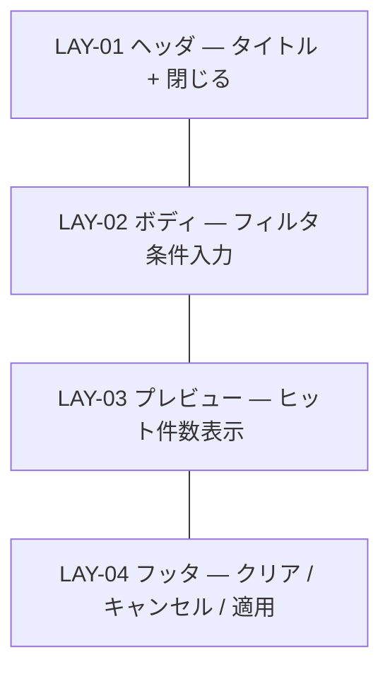

# UI-006 フィルタパネル — 画面詳細設計

- 対応 UI: [`UI-006 フィルタパネル`](../../interface/interface-design.md#ui-006-フィルタパネル画面)
- 対応 UC: UC-008
- 対応 HCD: PER-001 / SCN-004 / SCN-005 / JOB-004 / FLW-005 / FLW-006
- 関連スタイルガイド: [`style-guide.md`](../style-guide.md)
- 作成日 / 最終更新日: 2026-05-19 / 2026-05-19
- 版: 0.1（ドラフト）

---

## 1. 画面概要

- **UI-NNN**: UI-006 フィルタパネル
- **種別**: 画面（モーダルダイアログ）
- **対象利用者**: PER-001
- **画面の目的**: 担当者・開始日範囲・期限範囲・親タスク（配下のみ表示）の条件で、UI-003 のタスクツリーとガントチャートを絞り込む。サーバ API は呼ばずクライアント側でフィルタを行う。
- **関連 UC**: UC-008
- **関連 PER / SCN**: PER-001。SCN-004（レビュー向け PDF 出力 — 絞り込んでから PDF）、SCN-005（タスク数が増えて見渡しが効かなくなる）。
- **関連 JOB / FLW**: JOB-004（フィルタで絞り込む）— 主体。FLW-005 / FLW-006。
- **本画面の主 CTA**: **[適用]**（条件を確定し UI-003 を絞り込み表示）。次点で **[クリア]**（条件をリセット）。
- **関連 UXI**: UXI-008（フィルタ適用状態の可視化 — 本パネルでの設定が UI-003 LAY-06 / FilterChip と連携）
- **主なアクター・権限**: 単一利用者
- **入力・出力項目の参照**: [`interface-design.md` UI-006](../../interface/interface-design.md#ui-006-フィルタパネル画面)
- **起動 API**: なし（クライアント側フィルタ。アーキ設計 COMP-002 / インタフェース設計 ALT-008）
- **画面間遷移**: 入口 = UI-003 [フィルタ]。出口 = UI-003（[適用] / [クリア] / [キャンセル] / Escape）。

---

## 2. レイアウト

CMP-015 Modal `form` バリアント。1280×720 で固定幅 480px 程度。



| LAY-NN | 役割 | 主な CMP | 固定 / スクロール | ブレークポイント変化 |
|---|---|---|---|---|
| LAY-01 | タイトル「タスクをフィルタ」+ 閉じる IconButton | CMP-015 / CMP-002 | 固定 | 変化なし |
| LAY-02 | フィルタ条件入力。担当者 → 開始日範囲（from/to） → 期限範囲（from/to） → 親タスク配下指定 | CMP-013 × 4, CMP-018 Stack, CMP-019 Inline（範囲ペア） | 固定 | 変化なし |
| LAY-03 | ヒット件数のプレビュー表示「適用すると N 件のタスクが表示されます」 | CMP-022 Banner（info）or テキスト | 固定 | 変化なし |
| LAY-04 | 左寄せ [クリア] / 右寄せ [キャンセル] [適用] | CMP-019 Inline, CMP-001 × 3 | 固定 | 変化なし |

メモ:
- LAY-03 のプレビュー件数表示はインタフェース設計 UI-006 出力項目「ヒット件数（プレビュー）」に従う。条件入力ごとに即時更新（DYN-01）。

---

## 3. コンポーネント配置

| 配置順 | 領域 | CMP | バリアント・サイズ | 表示条件 | 紐付く入出力 / API | 備考 |
|---|---|---|---|---|---|---|
| 1 | LAY-01 | Modal Title | `text.h2` | 常時 | − | 「タスクをフィルタ」 |
| 2 | LAY-01 | CMP-002 IconButton | ghost / sm | 常時 | [閉じる] | aria-label「閉じる」 |
| 3 | LAY-02 | CMP-013 FormField + CMP-003 TextInput | md | 常時 | 入力: assignee（部分一致） | ラベル「担当者」。プレースホルダ「担当者名で部分一致検索」 |
| 4 | LAY-02 | CMP-013 FormField + CMP-006 DateInput × 2（CMP-019 Inline） | md | 常時 | 入力: start_date_from / start_date_to / VR-011 | ラベル「開始日範囲」+ 「〜」区切り |
| 5 | LAY-02 | CMP-013 FormField + CMP-006 DateInput × 2 | md | 常時 | 入力: due_date_from / due_date_to / VR-011 | ラベル「期限範囲」+ 「〜」区切り |
| 6 | LAY-02 | CMP-013 FormField + CMP-007 Select | md | 常時 | 入力: parent_task_id（祖先関係） | ラベル「親タスク配下のみ」。選択肢: 「（指定なし）」+ 同一プロジェクト内タスク一覧 |
| 7 | LAY-03 | CMP-022 Banner | info | 常時 | 出力: ヒット件数（クライアント側計算） | 「適用すると N 件のタスクが表示されます」（DYN-01 で即時更新）。0 件のときは警告色（warning） |
| 8 | LAY-04 | CMP-001 Button | secondary / md | 常時（条件が初期値の時は disable） | [クリア] → 条件初期化 + 即時 UI-003 再描画（全件表示） | 左寄せ。ラベル「クリア」 |
| 9 | LAY-04 | CMP-001 Button | secondary / md | 常時 | [キャンセル] → モーダル閉鎖、条件は保存しない | 右寄せ。ラベル「キャンセル」 |
| 10 | LAY-04 | CMP-001 Button | primary / md | VR-011 を満たすまで disable | [適用] → UI-003 を絞り込み表示 | 右寄せ。ラベル「適用」 |

メモ:
- 親タスク Select の選択肢は UI-004 / UI-005 と同様、500 タスク規模で UX 課題があるため検索可能化を検討（HO-I-001）。
- フィルタ「親タスク配下のみ」の解釈は「子孫すべて」を暫定方針（UI-003 RISK-010 / インタフェース設計 HO-D-006）。明示テキスト「（子孫を含む）」を Label に併記する方針を HO-I-002 で検討。

---

## 4. 画面状態一覧

| ST-NN | 状態名 | 発生契機 | 対応 FB | 応答時間区分 | 見え方 | ユーザーが取れる次の操作 |
|---|---|---|---|---|---|---|
| ST-01 | 初期表示（未適用） | UI-003 [フィルタ] 初回押下 | FB-005 | − | LAY-02 の全項目空。LAY-03「適用すると {全件数} 件のタスクが表示されます」。[クリア] disable / [適用] disable | 条件入力 / キャンセル |
| ST-02 | 初期表示（既存フィルタあり） | UI-003 [フィルタ] 再押下（既にフィルタ適用済み） | FB-005 | − | LAY-02 に現在の条件を初期表示。LAY-03 にヒット件数。[クリア] enable / [適用] は変更時に enable | 修正 / クリア / キャンセル |
| ST-03 | 入力中（VR 通過） | LAY-02 の任意項目を入力、VR-011 を満たす | FB-001 | 瞬時 | LAY-03 のヒット件数が DYN-01 で即時更新（クライアント側計算）。[適用] enable | 続けて入力 / 適用 |
| ST-04 | 入力中（VR 違反） | 開始日範囲の from > to / 期限範囲の from > to | FB-007 | − | 該当 FormField に invalid 表示 + HelperText「開始は終了以前にしてください」。[適用] disable。LAY-03 は更新されない（前回の件数のまま） | 修正 |
| ST-05 | ヒット 0 件プレビュー | フィルタ条件で 0 件になる組合せ | FB-007（警告） | − | LAY-03 が warning 色で「適用すると 0 件のタスクが表示されます」。[適用] は enable（適用自体は可能、UI-003 で EmptyState 表示） | 適用 or 修正 |
| ST-06 | 適用済み | [適用] 押下 | FB-005 | − | モーダル閉鎖 → UI-003 のタスクツリー・ガントが絞り込まれた状態に再描画（UI-003 ST-11）+ FilterChip 表示 | UI-003 操作 |
| ST-07 | クリア済み | [クリア] 押下 | FB-005 | − | 条件初期化 + モーダル閉鎖 → UI-003 全件表示に戻る（UI-003 ST-04） | UI-003 操作 |
| ST-08 | キャンセル | [キャンセル] / Escape / IconButton | − | − | モーダル閉鎖、フィルタ状態は変更しない（既存フィルタは維持） | UI-003 操作 |

メモ:
- 本画面はサーバ API を呼ばないため、サブミット中状態（loading）は存在しない。条件入力から適用までクライアント完結。
- 「ヒット 0 件で適用」は許容する（インタフェース設計 / UC-008 例外フロー: 0 件は UI-003 の EmptyState で「条件に合致するタスクがありません」を表示）。本パネルでは [適用] を disable にせず、警告のみで進めさせる。

### 4.1 状態遷移図

```mermaid
stateDiagram-v2
  [*] --> ST-01: 初回起動
  [*] --> ST-02: 既存フィルタあり
  ST-01 --> ST-03: 入力（VR 通過）
  ST-02 --> ST-03: 修正
  ST-03 --> ST-04: 範囲逆転
  ST-04 --> ST-03: 修正
  ST-03 --> ST-05: 0 件になる組合せ
  ST-05 --> ST-03: 修正
  ST-03 --> ST-06: [適用]
  ST-05 --> ST-06: [適用]（0 件でも進める）
  ST-02 --> ST-07: [クリア]
  ST-03 --> ST-07
  ST-05 --> ST-07
  ST-01 --> ST-08: [キャンセル]
  ST-02 --> ST-08
  ST-03 --> ST-08
  ST-04 --> ST-08
  ST-05 --> ST-08
  ST-06 --> [*]
  ST-07 --> [*]
  ST-08 --> [*]
```

---

## 5. 権限別表示差分

**該当なし**。

---

## 6. フォーム動的挙動

| DYN-NN | トリガ項目 | 対象項目 | 挙動 | 発火タイミング | 依存業務条件 |
|---|---|---|---|---|---|
| DYN-01 | LAY-02 全項目 | LAY-03 ヒット件数 | 条件が変わるたびにクライアント側でフィルタを実行し、ヒット件数を更新（debounced 200〜300ms 推奨。短時間連続入力での再計算負荷を抑制） | onChange（debounced） | UC-008 |
| DYN-02 | 開始日範囲 from / to | 各 DateInput | from > to の組合せで invalid 表示。to 側の最小値を from の値で制約（CMP-006 のネイティブ min 属性） | onChange | VR-011 |
| DYN-03 | 期限範囲 from / to | 各 DateInput | 同上 | onChange | VR-011 |
| DYN-04 | 全項目 | [適用] ボタン | VR-011 通過 + 条件が初期値と異なる時のみ enable | onChange | UI 仕様 |
| DYN-05 | 全項目 | [クリア] ボタン | 条件が 1 つでも入力されているとき enable、すべて初期値なら disable | onChange | UI 仕様 |
| DYN-06 | 担当者入力 | フィルタ判定 | 部分一致（インタフェース設計 RISK-004 / HO-D-006 で暫定確定）。大文字小文字を区別しない方針 | DYN-01 内 | RISK-004 |
| DYN-07 | 親タスク Select | フィルタ判定 | 指定された親タスクの「子孫すべて」を表示対象とする（暫定方針、HO-I-002） | DYN-01 内 | HO-D-006 |
| DYN-08 | Escape | モーダル全体 | [キャンセル] と同義（変更ありでも軽確認なし。本画面は条件入力中の破棄は許容） | onKeyDown | A11Y-003 |

メモ:
- DYN-01 のヒット件数即時更新は HCD JOB-004（5 秒以内）の体感速度に寄与する。サーバ API なしでクライアント側計算のみのため、リアルタイム性は問題なし。
- DYN-08 で軽確認を出さない理由: UI-006 はフィルタ条件のみで業務データは扱わない（破棄してもデータ損失はない）。

---

## 7. レスポンシブ挙動

| ブレークポイント | LAY 挙動 |
|---|---|
| DTK-100（1280px〜） | モーダル幅 480px 固定、中央 |
| DTK-101 / DTK-102 | 同上 |

崩してはいけないもの:
- LAY-03 ヒット件数プレビュー（フィルタ効果の即時確認のため）
- LAY-04 [適用] ボタン

---

## 8. イベントと画面遷移

| イベント | トリガ | 起動 API | API 呼出中の挙動 | 成功時 | 失敗時 | 確認モーダル |
|---|---|---|---|---|---|---|
| モーダル起動 | UI-003 [フィルタ] | − | − | ST-01 / ST-02 | − | 不要 |
| 各 FormField 入力 | LAY-02 | − | DYN-01〜DYN-06 | ST-03 | ST-04 | 不要 |
| [適用] 押下 | LAY-04 / VR 通過 | − | − | ST-06 → モーダル閉鎖 → UI-003 ST-11（フィルタ適用） | − | 不要 |
| [クリア] 押下 | LAY-04 | − | − | ST-07 → モーダル閉鎖 → UI-003 ST-04（全件） | − | 不要 |
| [キャンセル] / Escape / IconButton | LAY-04 / LAY-01 | − | − | ST-08 → モーダル閉鎖（フィルタ状態維持） | − | 不要 |

破壊的操作なし（フィルタ条件のみで業務データ変更なし）。

---

## 9. 多言語・テキスト長変動方針

- **対応言語**: 日本語のみ。
- **長文時の挙動**:
  - 親タスク Select 内のタスク名: 1 行省略 ellipsis + ホバー時ツールチップ。
  - ヒット件数表示（LAY-03）: 短文のため特別な配慮不要。
- **数値・日付の書式**: 日付はネイティブ DateInput（`YYYY-MM-DD`）。

---

## 10. 注意事項

### 10.1 リスク・懸念点

| RISK-NNN | 内容 | 影響範囲 | 顕在化条件 | 暫定対応 | 申し送り |
|---|---|---|---|---|---|
| RISK-001 | 親タスク Select の選択肢が多数で UX 劣化（UI-004 / UI-005 と共通） | LAY-02 / CMP-007 | 500 タスク級 | 検索可能 Combobox | HO-I-001 |
| RISK-002 | 担当者の一致方式（部分 / 前方 / 完全）の最終確定 | DYN-06 | リリース後の利用者要望 | 暫定: 部分一致（インタフェース設計 HO-D-006） | HO-I-003 |
| RISK-003 | 親タスク配下フィルタの「子孫すべて」「直接の子のみ」の解釈 | DYN-07 | 利用者の期待値 | 暫定: 子孫すべて。Label に補足表示 | HO-I-002 |
| RISK-004 | ヒット件数即時計算（DYN-01）の負荷が大規模 WBS で問題化 | DYN-01 | 500 タスク × 多条件 | debounced 200〜300ms + クライアント側計算（500 タスク程度なら十分） | HO-T-001 |
| RISK-005 | フィルタ条件の永続化（プロジェクト毎に保存 / セッション内のみ）が未確定 | UI 全体 | UI-003 RISK-006 と共通 | 暫定: セッション内（再起動でリセット） | UI-003 HO-I-003 |
| RISK-006 | 担当者フィルタが空文字列の場合の挙動（全件マッチ / マッチなし） | DYN-06 | 空文字列入力時 | 空文字列 = 「担当者条件なし」（全件マッチ） | − |
| RISK-007 | フィルタ「0 件適用」を許容する設計が、利用者からは「適用したのに何も表示されない」と誤認されうる | ST-05 / ST-06 → UI-003 ST-12 | 0 件適用時 | UI-003 ST-12 で EmptyState `filtered-zero` + [フィルタをクリア] を提示。本画面でも LAY-03 で warning 表示 | − |

### 10.2 代替案と採らない理由

| ALT-NNN | 対象判断 | 代替案概要 | 採らない理由 | 再検討条件 |
|---|---|---|---|---|
| ALT-001 | レイアウトの骨格 | サイドパネル（モーダルではなく UI-003 内に常駐） | モーダルの方が「現在は条件設定中」の認知が明確。サイドパネルだと画面の主役（ガント）が圧迫される | 利用者要望 |
| ALT-002 | フィルタの実施位置 | サーバ側 | インタフェース設計 ALT-008 で却下済み。NFR-002 規模ではクライアント側で十分 | NFR-002 上限拡大 |
| ALT-003 | 適用のトリガ | リアルタイム適用（条件入力ごとに UI-003 即時絞り込み） | UI-003 の再描画コストが高く、入力中のチカチカが UX を損なう。明示的な [適用] ボタンで意図を確定 | NFR-001 達成かつ大規模でも体感良好と判明した場合 |
| ALT-004 | エラーの出し方 | Toast | フォーム内の VR 違反はインライン（フィールド直下）の方が修正導線として自然 | − |
| ALT-005 | サブミット先挙動 | 適用後もモーダル維持 | フィルタは「設定して結果を確認する」操作のため、適用後はモーダルを閉じる UX が自然 | − |
| ALT-006 | 担当者の一致方式 | 完全一致 | フリーテキストでの担当者名入力（誤字・表記揺れ）を考慮し、部分一致が実用的 | データ品質が高い場合 |

### 10.3 後続工程への申し送り事項

#### 実装への申し送り

| HO-I-NNN | 内容 | 想定選択肢 | 決定責任者 |
|---|---|---|---|
| HO-I-001 | 親タスク Select の検索可能化 | 検索可能 Combobox | 実装 |
| HO-I-002 | 親タスク配下フィルタの解釈（直接の子 / 子孫すべて）と Label 補足 | 子孫すべて（推奨）+ Label に「（子孫を含む）」併記 | 実装 / HCD |
| HO-I-003 | 担当者の一致方式（部分 / 前方 / 完全）と入力正規化（前後空白除去・大文字小文字） | 部分一致（推奨）+ 前後空白除去 | 実装 / IF HO-D-006 |
| HO-I-004 | DYN-01 の debounced 時間（200ms / 300ms / 500ms） | 200〜300ms | 実装 |
| HO-I-005 | フィルタ条件の永続化（プロジェクト毎 / セッション内） | セッション内（推奨、UI-003 と整合） | 実装 |
| HO-I-006 | [クリア] 操作で UI-003 を即時更新するか、モーダルを閉じるタイミングで反映するか | モーダル閉鎖と同時に反映（推奨） | 実装 |
| HO-I-007 | 親タスク Select に対象プロジェクト内のタスクをすべて出すか、葉タスクを除外するか | すべて出す | 実装 |

#### QA・テスト設計への申し送り

| HO-T-NNN | 内容 | 想定 | 決定責任者 |
|---|---|---|---|
| HO-T-001 | 500 タスク × フィルタ即時計算（DYN-01）の体感応答性 | 必須 | QA |
| HO-T-002 | VR-011（範囲逆転）の全パターン（開始日範囲 / 期限範囲）テスト | 必須 | QA |
| HO-T-003 | フィルタ条件の組合せテスト（担当者 only / 日付範囲 only / 親タスク only / 複合） | 必須 | QA |
| HO-T-004 | 0 件適用時の UI-003 ST-12 への遷移確認 | 必須 | QA |
| HO-T-005 | キーボード操作（Tab 順序、Enter で [適用]、Escape でキャンセル） | 必須 | QA |

#### スタイルガイドへの昇格候補

該当なし。

#### HCD / UI・UX 設計への逆流候補

| HO-U-NNN | 内容 | 逆流理由 | 相談先 |
|---|---|---|---|
| HO-U-001 | フィルタ条件永続化の利用者期待値（UI-003 HO-U-002 と共通） | RISK-005 連動 | HCD / 要件 |
