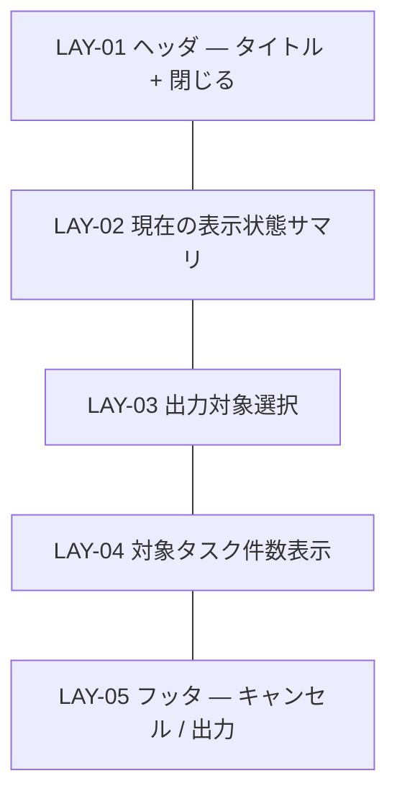

# UI-007 PDF エクスポート設定 — 画面詳細設計

- 対応 UI: [`UI-007 PDF エクスポート設定`](../../interface/interface-design.md#ui-007-pdf-エクスポート設定画面)
- 対応 UC: UC-009
- 対応 HCD: PER-001 / SCN-004 / JOB-007 / FLW-009 / FLW-010
- 関連スタイルガイド: [`style-guide.md`](../style-guide.md)
- 作成日 / 最終更新日: 2026-05-19 / 2026-05-19
- 版: 0.1（ドラフト）

---

## 1. 画面概要

- **UI-NNN**: UI-007 PDF エクスポート設定
- **種別**: 画面（モーダルダイアログ）
- **対象利用者**: PER-001
- **画面の目的**: PDF 出力対象（タスク一覧 / ガントチャート / 両方）を選択し、出力を実行する。現在の表示状態（フィルタ・粒度・依存線表示）が PDF に反映されることを利用者に明示する。
- **関連 UC**: UC-009
- **関連 PER / SCN**: PER-001。SCN-004（レビュー向け PDF 出力 — 打ち合わせ前の資料準備）。
- **関連 JOB / FLW**: JOB-007（PDF 出力）— 主体。FLW-009 / FLW-010。
- **本画面の主 CTA**: **[出力]**（PDF 生成 + ブラウザのダウンロード機構で保存）。
- **関連 UXI**: UXI-004（待ち時間の不安 — 大量タスク時の PDF 生成に長時間処理表示）
- **主なアクター・権限**: 単一利用者
- **入力・出力項目の参照**: [`interface-design.md` UI-007](../../interface/interface-design.md#ui-007-pdf-エクスポート設定画面)
- **起動 API**: なし（クライアント側 PDF 生成。アーキ設計 COMP-003 / LNK-003 / LNK-004）
- **画面間遷移**: 入口 = UI-003 [PDF エクスポート]。出口 = UI-003（[出力] 後 / [キャンセル] / Escape）。

---

## 2. レイアウト

CMP-015 Modal `form` バリアント。1280×720 で固定幅 480px 程度。



| LAY-NN | 役割                                                                                                           | 主な CMP                               | 固定 / スクロール | ブレークポイント変化 |
| ------ | -------------------------------------------------------------------------------------------------------------- | -------------------------------------- | ----------------- | -------------------- |
| LAY-01 | タイトル「PDF エクスポート」+ 閉じる IconButton                                                                | CMP-015 / CMP-002                      | 固定              | 変化なし             |
| LAY-02 | 現在の UI-003 表示状態（フィルタ・粒度・依存線）を「この状態で出力されます」として表示。利用者が事前確認できる | CMP-022 Banner（info）                 | 固定              | 変化なし             |
| LAY-03 | 出力対象選択。タスク一覧 / ガントチャート / 両方 のラジオ選択                                                  | CMP-013 FormField + CMP-008 RadioGroup | 固定              | 変化なし             |
| LAY-04 | 「対象タスク件数: N 件」の表示。0 件の場合は警告色で [出力] disable の理由を示す                               | テキスト or CMP-022 Banner（warning）  | 固定              | 変化なし             |
| LAY-05 | 右寄せで [キャンセル] [出力]                                                                                   | CMP-019 Inline, CMP-001 × 2            | 固定              | 変化なし             |

メモ:

- LAY-02 の表示状態サマリは UI-007 出力項目「現在の表示状態の確認サマリ」を実装する場所。HCD SCN-004 の「画面で見えている状態がそのまま PDF に出る」期待値を満たすため、明示する。

---

## 3. コンポーネント配置

| 配置順 | 領域   | CMP                                      | バリアント・サイズ | 表示条件                         | 紐付く入出力 / API                                   | 備考                                                                                                                             |
| ------ | ------ | ---------------------------------------- | ------------------ | -------------------------------- | ---------------------------------------------------- | -------------------------------------------------------------------------------------------------------------------------------- |
| 1      | LAY-01 | Modal Title                              | `text.h2`          | 常時                             | −                                                    | 「PDF エクスポート」                                                                                                             |
| 2      | LAY-01 | CMP-002 IconButton                       | ghost / sm         | 常時                             | [閉じる]                                             | aria-label「閉じる」                                                                                                             |
| 3      | LAY-02 | CMP-022 Banner                           | info               | 常時                             | 出力: 現在の表示状態サマリ                           | 内容例: 「現在の表示状態で出力されます: フィルタ適用中 / 表示粒度: 日 / 依存線表示: ON」                                         |
| 4      | LAY-03 | CMP-013 FormField + CMP-008 RadioGroup   | md                 | 常時                             | 入力: 出力対象（タスク一覧 / ガントチャート / 両方） | ラベル「出力対象」。既定値「両方」。3 つのラジオを縦並び                                                                         |
| 5      | LAY-04 | テキスト表示 or CMP-022 Banner (warning) | −                  | 常時                             | 出力: 対象タスク件数（フィルタ後）                   | 通常時「対象タスク件数: N 件」/ 0 件時 warning「対象タスクがありません。フィルタを解除するか UI-003 でタスクを追加してください」 |
| 6      | LAY-05 | CMP-001 Button                           | secondary / md     | 常時                             | [キャンセル] → モーダル閉鎖                          | ラベル「キャンセル」                                                                                                             |
| 7      | LAY-05 | CMP-001 Button                           | primary / md       | 対象タスク 1 件以上時のみ enable | [出力] → クライアント側 PDF 生成 → ダウンロード      | ラベル「出力」。0 件時は disable + ツールチップで理由提示                                                                        |

メモ:

- LAY-02 のサマリは UI-003 のキャッシュデータから派生表示（API 呼出なし）。
- LAY-04 の 0 件抑止は ERR-004 を実装。UI-003 側で [PDF エクスポート] ボタン自体も disable しているが、UI-007 でも二重で抑止する（万一のため）。

---

## 4. 画面状態一覧

| ST-NN | 状態名                | 発生契機                                                        | 対応 FB         | 応答時間区分   | 見え方                                                                                                                            | ユーザーが取れる次の操作                 |
| ----- | --------------------- | --------------------------------------------------------------- | --------------- | -------------- | --------------------------------------------------------------------------------------------------------------------------------- | ---------------------------------------- |
| ST-01 | 初期表示              | UI-003 [PDF エクスポート] 押下                                  | FB-005          | −              | LAY-02 サマリ + LAY-03 RadioGroup 既定「両方」+ LAY-04 件数表示 + [出力] enable（対象 1 件以上）                                  | 対象選択 / 出力 / キャンセル             |
| ST-02 | 初期表示（対象 0 件） | UI-003 のフィルタで 0 件                                        | FB-007          | −              | LAY-04 warning 表示「対象タスクがありません」+ [出力] disable                                                                     | キャンセル / UI-003 戻ってフィルタクリア |
| ST-03 | 出力対象選択中        | LAY-03 でラジオ変更                                             | FB-001          | 瞬時           | 選択ラジオがハイライト。LAY-04 件数は同じ                                                                                         | 別選択 / 出力                            |
| ST-04 | PDF 生成中（短時間）  | [出力] 押下 → COMP-003 で生成中（1 秒以内に完了する規模）       | FB-002          | 短時間         | [出力] loading + disable、[キャンセル] と LAY-01 IconButton も disable、LAY-03 RadioGroup も disable                              | 待機                                     |
| ST-05 | PDF 生成中（長時間）  | 500 タスク級などで生成が 1 秒超過                               | FB-003 / FB-004 | 長時間（> 1s） | LAY-02〜LAY-04 全体にオーバーレイ + CMP-025 ProgressIndicator (indeterminate) + 「PDF を生成しています…」表示。HCD UXI-004 を実装 | 待機                                     |
| ST-06 | PDF 生成完了          | COMP-003 生成完了 → ブラウザのダウンロード API（LNK-004）に渡す | FB-006          | −              | モーダル閉鎖 → UI-003 で CMP-021 Toast `success`「PDF を出力しました（{ファイル名}）」 + ブラウザのダウンロードバー表示           | UI-003 操作                              |
| ST-07 | PDF 生成失敗          | COMP-003 で例外（ERR-006）                                      | FB-007          | −              | モーダル維持 + LAY-02 上に CMP-022 Banner (danger)「PDF 生成に失敗しました（相関 ID: xxx）」                                      | 再試行 / キャンセル                      |
| ST-08 | キャンセル            | [キャンセル] / Escape / IconButton                              | −               | −              | モーダル閉鎖                                                                                                                      | UI-003 操作                              |

メモ:

- PDF 生成中の操作抑止は HCD RISK-007 / インタフェース設計 6.1 RISK-007 を実装。本画面では LAY-01〜LAY-05 全体を disable + オーバーレイで他操作を防ぐ（モーダル維持）。
- ST-05 の長時間処理はインタフェース設計 3.1.2 / 3.3 の方針「ローディング表示を出して利用者をブロックしない UX」と整合する。本画面では「モーダル内で進捗表示 + 他操作抑止」を採用（モーダル外の UI-003 は触れさせない方針）。

### 4.1 状態遷移図

```mermaid
stateDiagram-v2
  [*] --> ST-01: UI-003 [PDF エクスポート]
  [*] --> ST-02: 対象 0 件
  ST-01 --> ST-03: ラジオ変更
  ST-03 --> ST-01
  ST-01 --> ST-04: [出力]
  ST-03 --> ST-04
  ST-04 --> ST-05: 1 秒超過
  ST-04 --> ST-06: 短時間完了
  ST-05 --> ST-06: 完了
  ST-04 --> ST-07: 失敗
  ST-05 --> ST-07
  ST-07 --> ST-04: 再試行
  ST-06 --> [*]
  ST-01 --> ST-08: [キャンセル]
  ST-02 --> ST-08
  ST-03 --> ST-08
  ST-08 --> [*]
```

---

## 5. 権限別表示差分

**該当なし**。

---

## 6. フォーム動的挙動

| DYN-NN | トリガ項目                      | 対象項目      | 挙動                                                                       | 発火タイミング                       | 依存業務条件        |
| ------ | ------------------------------- | ------------- | -------------------------------------------------------------------------- | ------------------------------------ | ------------------- |
| DYN-01 | LAY-03 出力対象選択             | RadioGroup    | 既定「両方」選択。他選択肢は「タスク一覧」「ガントチャート」               | onChange                             | UC-009              |
| DYN-02 | 対象タスク件数                  | [出力] ボタン | 0 件なら disable、1 件以上で enable                                        | モーダル起動時 / UI-003 で件数変化時 | ERR-004             |
| DYN-03 | [出力] ボタン                   | フォーム全体  | クリック時に loading + 全体 disable（ST-04）                               | onClick                              | UI 仕様             |
| DYN-04 | PDF 生成時間                    | 表示状態      | 1 秒経過時点で ST-04 → ST-05（長時間モードに切替）+ ProgressIndicator 表示 | タイマー                             | HCD FB-003 / FB-004 |
| DYN-05 | Escape キー（生成中以外）       | モーダル      | [キャンセル] と同義                                                        | onKeyDown                            | A11Y-003            |
| DYN-06 | Escape キー（ST-04 / ST-05 中） | モーダル      | 抑止（生成中は閉じない）                                                   | onKeyDown                            | RISK-007            |

メモ:

- PDF 生成のキャンセル可否（生成中に中止するか）は HO-I-001 で確定。本リリースでは「キャンセル不可」を暫定とし、Escape も無効化。

---

## 7. レスポンシブ挙動

| ブレークポイント    | LAY 挙動                    |
| ------------------- | --------------------------- |
| DTK-100（1280px〜） | モーダル幅 480px 固定、中央 |
| DTK-101 / DTK-102   | 同上                        |

崩してはいけないもの:

- LAY-02 表示状態サマリ（PDF と画面のズレを防ぐため常に表示）
- LAY-04 対象件数（0 件抑止の根拠を明示）
- LAY-05 [出力] ボタン

---

## 8. イベントと画面遷移

| イベント                                         | トリガ                    | 起動 API                     | API 呼出中の挙動 | 成功時                                | 失敗時 | 確認モーダル |
| ------------------------------------------------ | ------------------------- | ---------------------------- | ---------------- | ------------------------------------- | ------ | ------------ |
| モーダル起動                                     | UI-003 [PDF エクスポート] | −                            | −                | ST-01（対象 1 件以上）/ ST-02（0 件） | −      | 不要         |
| RadioGroup 選択                                  | LAY-03                    | −                            | DYN-01           | ST-03                                 | −      | 不要         |
| [出力] 押下                                      | LAY-05 / 対象 1 件以上    | −（クライアント側 PDF 生成） | ST-04 → ST-05    | ST-06 → モーダル閉鎖 + Toast          | ST-07  | 不要         |
| [キャンセル] / Escape / IconButton（生成中以外） | LAY-05 / LAY-01           | −                            | −                | モーダル閉鎖（ST-08）                 | −      | 不要         |
| Escape（生成中）                                 | LAY-01〜05                | −                            | DYN-06 で抑止    | −                                     | −      | −            |

破壊的操作なし（PDF 生成はデータ変更なし）。

---

## 9. 多言語・テキスト長変動方針

- **対応言語**: 日本語のみ。
- **長文時の挙動**:
  - PDF ファイル名（Toast 内）: 1 行省略 + ホバー時ツールチップで全文。
  - LAY-02 サマリ: フィルタ条件が長い場合は折返しまたは省略（HO-I-002）。
- **数値・日付**: 件数は数字 + 「件」表記。日付は使用しない（出力日時はファイル名内のみ）。

---

## 10. 注意事項

### 10.1 リスク・懸念点

| RISK-NNN | 内容                                                                                             | 影響範囲               | 顕在化条件                                      | 暫定対応                                                                                                           | 申し送り               |
| -------- | ------------------------------------------------------------------------------------------------ | ---------------------- | ----------------------------------------------- | ------------------------------------------------------------------------------------------------------------------ | ---------------------- |
| RISK-001 | 大量タスク（500 件級）の PDF 生成時間が NFR-001 の「1 秒以内」を逸脱する可能性                   | ST-05                  | 上限近辺                                        | ST-05 で進捗インジケータ表示。利用者は待つ前提（HCD JOB-007 の 10 秒以内目標は実用速度で達成可能と想定）           | HO-T-001               |
| RISK-002 | PDF 生成中のキャンセル可否（生成途中で止められるか）                                             | DYN-06 / ST-04 / ST-05 | 生成時間が想定以上に長い場合                    | 暫定: キャンセル不可。COMP-003 のキャンセル実装可否を確認                                                          | HO-I-001               |
| RISK-003 | フィルタ・粒度・依存線が UI-007 表示中に変わると、表示サマリと実出力にズレが生じる               | LAY-02 / ST-06         | UI-007 表示中に UI-003 を操作（モーダル外操作） | UI-007 表示中は UI-003 を実質操作できない（モーダルの focus trap）+ サーバを呼ばないので UI-003 のキャッシュは固定 | 確認のみ               |
| RISK-004 | ファイル名の衝突（インタフェース設計 RISK-008）                                                  | ST-06                  | 同じ秒に複数回出力                              | ブラウザのダウンロード API がファイル名自動付番（インタフェース設計 RISK-008）                                     | HO-I-001 / IF HO-D-005 |
| RISK-005 | PDF 内のフォント埋め込み・コントラスト確保が画面とズレる可能性                                   | ST-06 出力結果         | 印刷時                                          | フォント埋め込み方針は HO-I-002 / IF HO-D-005 で確定                                                               | HO-I-002               |
| RISK-006 | 表示粒度「月」での長期間出力時にガント PDF が複数ページに分割される場合のページ送り              | UI-009 PDF 仕様        | 期間が長く横方向に大きいデータ                  | IF HO-D-005 で確定（横方向ページ送り）                                                                             | IF HO-D-005            |
| RISK-007 | PDF 生成中の進捗インジケータが「進捗 %」表示できない（クライアント側生成のためタイムベース推定） | ST-05 / CMP-025        | 利用者が「あとどれくらいか」を知りたい場合      | indeterminate（無限ループ）+ メッセージで対応                                                                      | −                      |

### 10.2 代替案と採らない理由

| ALT-NNN | 対象判断           | 代替案概要                                                            | 採らない理由                                                                                    | 再検討条件 |
| ------- | ------------------ | --------------------------------------------------------------------- | ----------------------------------------------------------------------------------------------- | ---------- |
| ALT-001 | レイアウトの骨格   | UI-007 を持たず、UI-003 [PDF エクスポート] 押下で直接出力（既定値で） | 利用者が出力対象（一覧 / ガント / 両方）を選ぶ機会が必要。要件 UC-009 で UI-007 が定義済み      | 要件変更   |
| ALT-002 | PDF 生成位置       | サーバ側                                                              | アーキ設計 ALT-006 / インタフェース設計 ALT-006 で却下済み                                      | −          |
| ALT-003 | 出力対象選択の UI  | チェックボックス（複数選択）                                          | ラジオ + 「両方」選択肢の方が UI シンプル。要件側で「タスク一覧 / ガントチャート / 両方」と明示 | −          |
| ALT-004 | エラーの出し方     | Toast                                                                 | モーダル内で発生したエラーはインライン（Banner）の方が現在の操作との関連が明確                  | −          |
| ALT-005 | 確認モーダルの採否 | 出力前に確認                                                          | PDF 出力は破壊的でないため確認不要                                                              | −          |
| ALT-006 | サブミット先挙動   | 出力後もモーダル維持（連続出力可能）                                  | PDF 出力は通常単発操作のため、出力後モーダル閉鎖が UX 自然                                      | −          |
| ALT-007 | 生成中の他操作許可 | UI-003 を操作可能のまま生成                                           | データ変動で出力内容に齟齬が生じるリスク（HCD RISK-007）                                        | −          |

### 10.3 後続工程への申し送り事項

#### 実装への申し送り

| HO-I-NNN | 内容                                                                     | 想定選択肢                                      | 決定責任者 |
| -------- | ------------------------------------------------------------------------ | ----------------------------------------------- | ---------- |
| HO-I-001 | PDF 生成のキャンセル可否（DYN-06）と Escape 挙動                         | キャンセル不可（推奨）                          | 実装       |
| HO-I-002 | PDF 内のフォント埋め込み・色変換・ページ分割の具体（IF HO-D-005 と連携） | jsPDF / pdfmake / 自前 SVG → PDF                | 実装 / IF  |
| HO-I-003 | LAY-02 サマリのフォーマット（フィルタ条件の表示形式）                    | 「フィルタ: 担当者『○○』、開始日: ○○〜○○、…」   | 実装       |
| HO-I-004 | LAY-04 件数表示 0 件時のメッセージ詳細                                   | フィルタによる 0 件 / 元々 0 件 を区別          | 実装       |
| HO-I-005 | PDF ファイル名フォーマット（IF HO-D-005 と連携）                         | `{プロジェクト名}_{種別}_{YYYYMMDD-HHMMSS}.pdf` | 実装 / IF  |
| HO-I-006 | 「両方」出力時のページ順序                                               | タスク一覧 → ガントチャート（IF 3.1.2）         | 実装 / IF  |
| HO-I-007 | ST-04 → ST-05 への切替閾値（1 秒 / 2 秒 / 即時 indeterminate）           | 1 秒（推奨）                                    | 実装       |

#### QA・テスト設計への申し送り

| HO-T-NNN | 内容                                                                                     | 想定 | 決定責任者 |
| -------- | ---------------------------------------------------------------------------------------- | ---- | ---------- |
| HO-T-001 | 500 タスク × 1,000 依存関係での PDF 生成時間計測（10 秒以内目標）                        | 必須 | QA         |
| HO-T-002 | 各出力対象（タスク一覧 / ガントチャート / 両方）の正常生成確認                           | 必須 | QA         |
| HO-T-003 | 0 件状態での [出力] disable 確認（ERR-004）                                              | 必須 | QA         |
| HO-T-004 | フィルタ・粒度・依存線の組合せで PDF と画面の表示が一致するか                            | 必須 | QA         |
| HO-T-005 | PDF 生成失敗時の Banner 表示 + 相関 ID 確認                                              | 必須 | QA         |
| HO-T-006 | キーボード操作（Tab 順序、Enter で [出力]、Escape でキャンセル、生成中は Escape 無効化） | 必須 | QA         |

#### スタイルガイドへの昇格候補

該当なし。

#### HCD / UI・UX 設計への逆流候補

| HO-U-NNN | 内容                                                                                             | 逆流理由                | 相談先 |
| -------- | ------------------------------------------------------------------------------------------------ | ----------------------- | ------ |
| HO-U-001 | PDF 生成中のキャンセル可否（HCD UXI-004 の長時間処理対応として明示するか）                       | RISK-002 連動           | HCD    |
| HO-U-002 | PDF 出力時の「現在の表示状態を反映」する仕様の利用者期待値（HCD SCN-004 のナラティブと整合確認） | LAY-02 サマリ設計の根拠 | HCD    |
