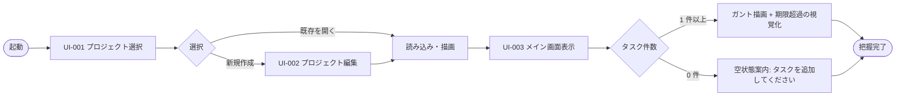
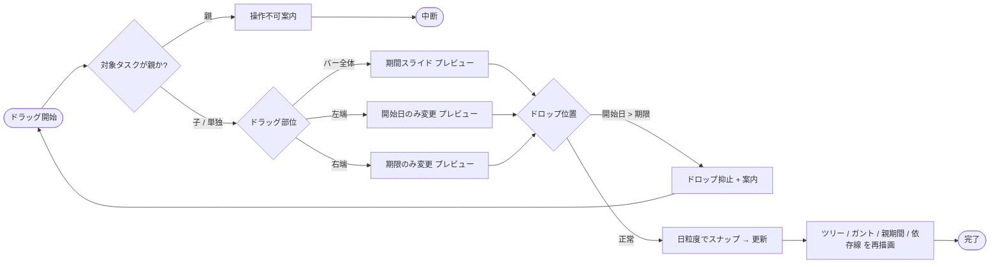
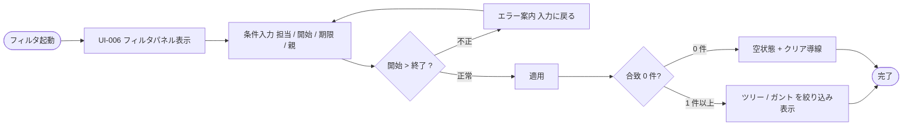
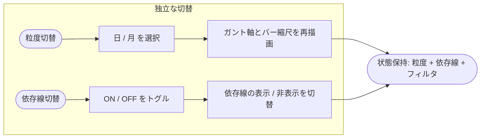
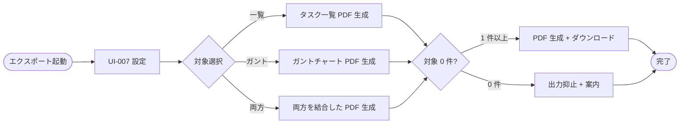

# HCD / UI・UX 設計書

本ドキュメントは WBS 管理ツールの体験設計（論理 UX 契約）を整理する。インタフェース設計（画面項目・API 契約）の上流として、「誰が・どんな状況で・何を・どう操作し・どこで困り・どう解決するか」を確定させる。

- 対象システム名: WBS 管理ツール（ローカル Web アプリ）
- 対応する要件定義書: [`docs/requirements/functional.md`](../../requirements/functional.md) / `docs/requirements/usecase/` / [`docs/requirements/non-functional.md`](../../requirements/non-functional.md)
- 対応するインタフェース設計書（下流）: [`docs/design/interface/interface-design.md`](../interface/interface-design.md)
- 作成日 / 最終更新日: 2026-05-19 / 2026-05-19
- 版: 0.1（ドラフト）

> 本ドキュメントは [`design-plan.md`](../../requirements/design-plan.md) の判定「HCD / UI・UX 設計 = 簡略実施（利用シナリオと主要タスクフローのみ）」に従う。単一ペルソナ・小規模利用前提のため、ペルソナ・シナリオは最小限とし、ガントチャート上のドラッグ&ドロップ・表示粒度切替・依存線表示切替・期限超過の視覚化・フィルタ操作など、成果物の使いやすさを大きく左右する論点に重みを置いて記述する。

---

## 1. UX 設計方針

本 UX 設計全体を貫く方針を以下に示す。体験設計レベルの判断のみを扱い、具体の UI コンポーネント・配色・文言・フレームワークには踏み込まない。

- **対象ユーザーの幅**: 「初見ユーザー優先 → 習熟者には反復短縮を後付け」の階層化。本ツールはローカル PC で個人〜小チームが日常的に開く想定（NFR-003, NFR-004）。日次利用となる主要タスク（タスク追加・編集・ガント上の期間変更）は熟練時のショートカット余地を残しつつ、初見でも要点が一画面で把握できることを最優先とする。紐付く NFR: 学習容易性・操作効率は要件側で明示されていないが、本書で前提化する（→ 9.3 HO-R-001）。
- **操作効率の基準**: 主要タスクは「メイン画面（UI-003）から 1〜2 操作で完了」を目安とする。具体的には次の通り（根拠は要件側の UC およびシナリオ）。
  - タスク追加・編集・削除（UC-002 / UC-003 / UC-004）: メイン画面 → ダイアログ → 保存の 3 ステップ以内。
  - ガント上での期間変更（UC-007）: ドラッグ操作 1 回で完結。ダイアログ起動を必要としない。
  - フィルタ適用（UC-008）: パネル開閉 + 条件入力 + 適用の 3 操作以内。クリア 1 操作で解除できる。
  - 表示粒度切替・依存線表示切替（UC-006）: ツールバー上 1 操作（トグル / セレクタ）。再描画は NFR-001 の 1 秒以内に従う。
- **エラー耐性の方針**: タスク・依存関係はいずれも局所的に取り消せる操作のため、原則「ミスしても被害が小さい設計」（保存後の編集容易性・取消可能性）に倒す。例外として **タスク削除（UC-004）** は子タスクの親参照解除と依存関係削除を伴うため、確認ダイアログを必須とする。プロジェクト削除（UC-001）は配下の全タスク・依存関係を一括削除するため確認の強度を一段上げる（明示的な確認）。
- **フィードバック原則**: NFR-001 の応答時間目標（初期描画 2 秒、操作後 1 秒）に従い、原則は「短時間（< 1 秒）の暗黙的処理中表示 + 完了時の即時反映」とする。大量タスク（500 タスク・1,000 依存関係上限想定）で 1 秒を超える可能性のある操作（PDF エクスポート・ガント再描画）は明示的な進捗表示を行う。ドラッグ操作中は**ドラッグ位置のプレビュー**を必ず提示する（UC-007 基本フロー）。
- **アクセシビリティ水準**: WCAG 2.1 AA 相当を**論理的に**担保する方向で設計する。ただし要件側（NFR-003）はデスクトップ PC / Chrome / 1280×720 以上に対象を限定しており、タッチ操作・モバイル・スクリーンリーダー専用利用は保証対象外である。色のみで意味を伝えない方針（期限超過・進捗状態）はプライマリ対象として担保する。具体値（コントラスト比・フォーカスリング）は詳細設計に申し送る（→ 9.3 HO-D-004）。要件側アクセシビリティ未記載のため逆流候補とする（→ 9.3 HO-R-001）。
- **マルチチャネルの扱い**: 提供チャネルは**画面のみ**を主とし、補助として **PDF 帳票**（UC-009 / UI-008, UI-009）を持つ。CLI・音声・チャット・通知は要件スコープ外（functional.md の「スコープ含まない」）。同一タスクを複数チャネルで提供する設計判断は不要。
- **体験の一貫性**: タスク・依存関係・プロジェクトの 3 種の編集対象に対し、以下の原則を貫く。
  - 編集は常に「対象を選ぶ → ダイアログを開く → 入力 → 保存」の流れに統一する（UC-001〜005）。
  - 破壊的操作（削除）は確認ダイアログを必須とする。
  - ガントチャート上の直接操作（ドラッグ）は **読み取り専用領域（親タスク）を視覚的に区別** し、操作不可をその場で案内する（UC-007 例外フロー）。
  - 表示状態（粒度・依存線表示・フィルタ）は PDF エクスポート（UC-009）にも同じく反映される。
- **認知負荷の上限**: メイン画面（UI-003）は「左ペイン: タスクツリー / 右ペイン: ガントチャート / 上部: ツールバー」の **3 領域構造で固定** する。1 画面に同時提示するモード切替は **粒度切替・依存線表示切替・フィルタ起動・エクスポート起動の 4 種に限定** する。これを超える切替（カスタムビュー・スウィムレーン・カラム選択等）は本リリース範囲では持ち込まない（要件スコープ外）。1 ダイアログ内の入力項目は **7 項目以下** を目安とする（UI-004 タスク編集は 7 項目: 名・担当・開始・期限・進捗・親・説明 で上限ぎりぎり）。

---

## 2. ペルソナ定義

### 2.1 ペルソナ一覧

| PER-NNN | 呼称 | 役割・属性 | 目的 | 業務・生活の文脈 | 利用頻度 | 前提知識・習熟度 | 利用環境 | 身体的・認知的特性 | 心理的特性・動機 | 主な関連 UC | 主な関連 NFR | 区分 |
|---|---|---|---|---|---|---|---|---|---|---|---|---|
| PER-001 | 個人 WBS 管理者 | 小規模プロジェクト（個人〜数名）のリーダー兼作業者。Excel での WBS 管理経験あり | プロジェクトの進捗を自分自身および口頭共有相手に対して可視化し、期限超過と依存関係を見落とさずに管理する | 自席の PC で 1 日に複数回 WBS を開く。タスク追加・進捗更新・締切確認が中心 | 日次 | ガントチャート・依存関係の概念は理解済み。本ツールは初見 | macOS / Chrome 最新版 / デスクトップ PC / 1280×720 以上 / 安定したローカル動作（オフライン）| 視覚・聴覚・運動に大きな制約なし。色覚特性のある利用者を一定割合含むと想定 | 「Excel より速く・見やすく管理したい」「タスク数が増えても破綻させたくない」「依存と期限の見落としを避けたい」 | UC-001〜UC-009 全て | NFR-001, NFR-002, NFR-003, NFR-004 | プライマリ（唯一） |

メモ:
- 要件側のアクターは「利用者」1 種のみ。本ドキュメントでもプライマリ 1 名に絞る。
- セカンダリ・ネガティブペルソナは設けない。要件側で「マルチユーザーによる同時編集」「ユーザー管理（認証・認可・権限）」を明示的にスコープ外としているため、これらに該当する層は要件側で既に対象外として扱われている。
- 架空の細部（氏名・趣味）は記載しない。設計判断に影響する特性のみを残す。

### 2.2 ペルソナ採用の根拠

- **PER-001 個人 WBS 管理者**: 要件側アクター「利用者」（functional.md `アクター`）に対応。要件側の「Excel ベースの WBS 管理ではタスク間の依存関係表現やガントチャート操作が手間」という背景記述から、Excel 経験者であることを仮説として付与する。色覚特性を持つ利用者の存在は専門家による経験的推測（人口比 5% 前後の常識的前提）として組み入れる。実ユーザーインタビュー・観察は未実施のため仮説ベース（→ 9.1 RISK-001）。

---

## 3. 利用シナリオ

### 3.1 シナリオ一覧

| SCN-NNN | 名称 | 関連 PER | トリガ | 前後の業務・生活 | 環境制約 | 感情状態 | 関連 UC | 頻度 | 重要度 |
|---|---|---|---|---|---|---|---|---|---|
| SCN-001 | プロジェクト初期セットアップ | PER-001 | 新規案件の開始 | 案件キックオフ後、自席でタスクを洗い出している | 自席・落ち着いた集中環境 | 集中・前向き | UC-001, UC-002, UC-005 | 単発（案件開始時） | 高 |
| SCN-002 | 日次の進捗更新 | PER-001 | 朝会前後・終業前の確認 | メールやチャットで状況確認した直後 | 自席・短時間 | 落ち着き・短時間で済ませたい | UC-003, UC-006 | 日次 | 高 |
| SCN-003 | 期限近接タスクの再調整 | PER-001 | ガント表示で期限超過・接近に気付く | 他タスクの遅延を確認したばかり | 自席・やや焦り | 焦り・優先順位の判断中 | UC-003, UC-006, UC-007 | 週次 | 高 |
| SCN-004 | レビュー向け PDF 出力 | PER-001 | 上長・顧客との打ち合わせ前 | 説明資料を準備中 | 自席・締切ある作業 | 軽い焦り・完成度を気にする | UC-006, UC-008, UC-009 | 週次〜月次 | 中 |
| SCN-005 | タスク数が増えて見渡しが効かなくなる | PER-001 | プロジェクト中盤、タスク 100 件超 | 直近の追加で全体像が把握しにくくなった | 自席・情報過多 | 軽いストレス・整理欲求 | UC-006, UC-008 | 案件中盤 | 中 |

メモ:
- ハッピーパス（SCN-001, SCN-002）に加え、SCN-003（焦り）・SCN-005（情報過多）の「辛い状況」を含めている。
- 全シナリオが PER-001 と 1 つ以上の UC に紐付く。

### 3.2 シナリオナラティブ（代表 3 件）

**SCN-003 期限近接タスクの再調整**
> PER-001 はガントチャートを開いた瞬間、期限を過ぎて未完了のタスクが赤く目に入る。前後の依存タスクが押し出される可能性に気付き、対象タスクの期限をガント上で右にドラッグして 3 日後ろ倒しに調整する。続けて依存先タスクが連動して動くか目視確認し、必要なら同様にドラッグで調整する。1 回 1 回ダイアログを開いて日付を入力する余裕はなく、**「見えている画面の上で直接動かせる」**ことが重要。ただし誤ドラッグでうっかり期限を変えると、変更前の値に戻すのに時間がかかる。

**SCN-004 レビュー向け PDF 出力**
> PER-001 は上長へのレビュー前に、現状のガントチャートと残タスク一覧を PDF で出したい。タスクが多すぎて全部見せると論点がぼやけるため、フィルタで担当者または親タスク配下に絞ってから PDF エクスポートする。**画面で見えている状態がそのまま PDF に出る** ことが期待されており、エクスポート時に追加で表示設定をいじる必要はないと考えている。

**SCN-005 タスク数が増えて見渡しが効かなくなる**
> プロジェクト中盤に入り、タスクが 100 件を超えた。ガントを「日」粒度で見ると横スクロールが長くなり全体像が掴めない。粒度を「月」に切り替えると圧縮表示になり、依存線が画面いっぱいに描かれて読み取れない。**粒度切替と依存線表示切替は独立に効く** ことを直感的に期待しており、両方を ON/OFF しながら見やすい組合せを探す。

---

## 4. 主タスク（Jobs-to-be-Done）

| JOB-NNN | タスク名 | 関連 PER | 関連 SCN | 関連 UC | 目的（達成したいこと） | 成功条件 | 失敗の顕在化 | 頻度 | 優先度 | 時間制約 |
|---|---|---|---|---|---|---|---|---|---|---|
| JOB-001 | プロジェクトを開いて WBS を即座に把握する | PER-001 | SCN-002, SCN-003 | UC-001, UC-006 | 開いた瞬間に「いま何が遅れていて、何を次にやるか」を視覚で把握する | 起動から 5 秒以内にメイン画面が見渡せる状態になる（NFR-001 の初期描画 2 秒以内 + 視認 3 秒） | 状況把握に時間がかかり、判断が遅れる | 日次 | 最高 | 5 秒以内 |
| JOB-002 | タスクをガント上で直感的に期間調整する | PER-001 | SCN-003 | UC-007 | ダイアログを開かず、見えている画面のままで期間を動かす | ドラッグ操作 1 回でタスクの開始日・期限が変更され、親タスクと依存タスクへの影響が即時に視覚反映される | ダイアログを開いて手入力する手間 / 誤操作で意図しない期限になる | 週次 | 最高 | 1 操作 |
| JOB-003 | タスクを追加・編集して WBS を保守する | PER-001 | SCN-001, SCN-002 | UC-002, UC-003 | 担当・期間・親子・依存関係を含めて WBS を最新化する | 入力した内容がツリー・ガントの両方に即時反映される | 古い WBS のまま判断する / 入力ミスで再編集が必要になる | 日次 | 高 | 1 タスクあたり 30 秒 |
| JOB-004 | フィルタで見たい範囲だけに絞る | PER-001 | SCN-004, SCN-005 | UC-008, UC-006 | 担当者別・親タスク配下・期間レンジで表示を絞る | フィルタ適用後、ツリーとガントの両方が同じ条件で絞り込まれる | 全件表示で目的タスクを探すのに時間がかかる | 週次 | 高 | 5 秒以内 |
| JOB-005 | 表示粒度と依存線表示を切り替えて見方を変える | PER-001 | SCN-005 | UC-006 | 日次の進捗確認は「日」粒度、長期見通しは「月」粒度。依存関係の整理は依存線 ON、進捗確認時は OFF | 切替 1 操作で表示が変わり、すぐに目的の見方になる | 切替コストが高く、見方を変えるのを諦める | 週次 | 中 | 1 操作 |
| JOB-006 | 依存関係を管理して順序を可視化する | PER-001 | SCN-001 | UC-005 | 先行/後続関係を定義し、ガント上で依存線として確認する | 依存関係が保存され、依存線が描画される。循環依存は自動的に拒否される | 順序の取り違え / 循環依存に気付かず後工程が破綻 | 案件初期に集中、その後散発的 | 中 | 30 秒以内 |
| JOB-007 | 現状の WBS を PDF で他者に共有する | PER-001 | SCN-004 | UC-009 | 画面で見えている状態をそのまま PDF として出力する | フィルタ・粒度・依存線表示の設定が反映された PDF が生成される | PDF が画面と異なる状態で出力され、説明し直す手間 | 週次〜月次 | 中 | 10 秒以内 |
| JOB-008 | プロジェクトを切り替える / 削除する | PER-001 | SCN-001 | UC-001 | 別案件のプロジェクトを開く、不要プロジェクトを削除する | 切替後、別プロジェクトのメイン画面が表示される。削除時は配下のタスク・依存も一括削除される | 誤って削除してしまう | 不定期 | 5 秒以内 |

メモ:
- 最高優先度は JOB-001（即座の把握）と JOB-002（ガント上の直感操作）。本ドキュメントの後続章はこの 2 つを縦串として磨き込む。
- 全 JOB が PER-001 / SCN / UC に紐付く。全 UC（UC-001〜009）はいずれかの JOB でカバーされている。

---

## 5. タスクフロー

簡略版のため、最高優先度 JOB-001 / JOB-002 と、UX が成果物の使いやすさを大きく左右する JOB-004 / JOB-005 / JOB-007 のフローを中心に整理する。JOB-003 / JOB-006 / JOB-008 は UC 側の基本フロー記述が十分明確なため、本書では一覧表のみで主フローを示す。

### 5.1 フロー一覧

| FLW-NNN | 名称 | 対応 JOB | 関連 UC | 起点 | 終点 | 中断再開 | 想定操作回数 | 想定所要時間 | 区分 |
|---|---|---|---|---|---|---|---|---|---|
| FLW-001 | 起動 → メイン画面で WBS を把握する | JOB-001 | UC-001, UC-006 | アプリ起動 / プロジェクト切替 | メイン画面でガントが見える状態 | − | 2 操作（プロジェクト選択 + 開く） | 5 秒以内 | 主 |
| FLW-002 | ガント上でタスクをドラッグして期間調整する | JOB-002 | UC-007 | メイン画面表示中 | 期間が更新されガントに反映 | − | 1 操作（ドラッグ） | 数秒 | 主 |
| FLW-003 | ガント上でタスクをドラッグ — 親タスク（操作不可）に触れた場合 | JOB-002 | UC-007 例外 | 親タスクをドラッグ試行 | 操作不可案内 → 別操作へ | − | 0〜1 操作 | 数秒 | 例外 |
| FLW-004 | ガント上でタスクをドラッグ — 開始日 > 期限の位置にドロップ | JOB-002 | UC-007 例外 | 不正位置でドロップ | 変更を反映せず元位置に戻す | − | 1 操作 + 案内 | 数秒 | 例外 |
| FLW-005 | フィルタで絞り込む | JOB-004 | UC-008 | ツールバー → フィルタ起動 | ツリー・ガント両方が条件適用された状態 | − | 3 操作（パネル開く + 条件入力 + 適用） | 5 秒以内 | 主 |
| FLW-006 | フィルタ結果が 0 件（空状態） | JOB-004 | UC-008 例外 | フィルタ適用 | 空状態の案内 + クリア導線 | − | 適用後 0〜1 操作 | − | 例外 |
| FLW-007 | 表示粒度を切り替える | JOB-005 | UC-006 | ツールバーの粒度切替 | ガントが新しい粒度で再描画 | − | 1 操作 | 1 秒以内（NFR-001） | 主 |
| FLW-008 | 依存線表示を切り替える | JOB-005 | UC-006 | ツールバーの依存線トグル | ガントに依存線が表示 / 非表示 | − | 1 操作 | 1 秒以内（NFR-001） | 主 |
| FLW-009 | 現状を PDF で出力する | JOB-007 | UC-009 | ツールバー → PDF エクスポート | PDF がダウンロードされる | − | 3 操作（パネル開く + 対象選択 + 出力） | 10 秒以内 | 主 |
| FLW-010 | PDF 出力 — 対象タスク 0 件 | JOB-007 | UC-009 例外 | 0 件状態で出力試行 | 出力抑止 + 案内 | − | 0 操作 | − | 例外 |
| FLW-011 | プロジェクト初期セットアップ（空状態） | JOB-003 | UC-002 | 新規プロジェクト開いた直後 | 1 件目のタスクが登録された状態 | − | 4 操作（追加 + 入力 + 保存 + 反映確認） | 1 分以内 | 例外（空状態） |
| FLW-012 | 期限超過タスクの視覚化 | JOB-001 | UC-006 基本フロー | メイン画面表示時 | 期限超過バーが色で識別できる | − | 0 操作（描画時に自動） | − | 主（受動的フロー） |

メモ:
- 1 章の操作効率基準（主要タスク 1〜2 操作、粒度切替・依存線切替 1 操作）と整合する。
- 中断再開: 本ツールはローカル PC 上で常時データ永続化するため、ダイアログを閉じる以外の「途中保存」は要件側にない。ダイアログを閉じた場合は破棄が前提（UC-002 / UC-003 が「保存」明示）。→ 9.1 RISK-002 に「中断再開の保全方針が要件側で曖昧」として記録。
- 失敗からの回復は SQLite 書込み失敗（UC-004 例外）等が中心。基盤レベル例外として一般的な再試行 / エラー表示で扱う（FB-007）。

### 5.2 主要フロー詳細

#### FLW-001 起動 → メイン画面で WBS を把握する（JOB-001）

**起点**: アプリ起動 / プロジェクト切替操作
**終点**: メイン画面が表示され、ガントチャートが見渡せる状態
**中断再開**: 不要（短時間操作）
**想定操作回数**: 2 / **想定所要時間**: 5 秒以内（NFR-001 の初期描画 2 秒以内を含む）

| # | ユーザーの意図 | システムが提供する情報・選択肢 | ユーザーの入力・選択 | システムの応答・フィードバック |
|---|---|---|---|---|
| 1 | 開きたいプロジェクトを選ぶ | プロジェクト選択画面（UI-001）: 既存プロジェクト一覧 + 新規作成導線 | 一覧からプロジェクトを選び「開く」 | 選択中プロジェクトの読み込みを開始（短時間処理表示） |
| 2 | 現状を把握する | メイン画面（UI-003）: 左ペインにタスクツリー / 右ペインにガント / 上部ツールバー | （視認のみ） | ガントが現在の表示設定（粒度・依存線・フィルタ）で描画され、期限超過タスクは色で識別される |

**フロー図**

#### FLW-002 ガント上でタスクをドラッグして期間調整する（JOB-002）

**起点**: メイン画面表示中。対象タスクは子タスクを持たない（親タスクは操作不可）
**終点**: 期間が更新され、ガント・ツリー・依存線・親タスクに反映
**中断再開**: ドラッグ中の離脱はキャンセル扱い
**想定操作回数**: 1 / **想定所要時間**: 数秒（NFR-001 の操作後再描画 1 秒以内）

| # | ユーザーの意図 | システムが提供する情報・選択肢 | ユーザーの入力・選択 | システムの応答・フィードバック |
|---|---|---|---|---|
| 1 | 期間を調整したい | タスクバー（ドラッグ可能領域: 全体・左端・右端） | バーをドラッグ開始 | ドラッグ中はバーがマウス位置に追従し、変更後の開始日・期限のプレビューを表示 |
| 2 | 確定したい | ドロップ位置 | マウスを離す | ドロップ位置の日付（日粒度でスナップ）で開始日・期限が更新。親タスクの期間自動再算出、依存線の再描画 |

**フロー図**

#### FLW-005 フィルタで絞り込む（JOB-004）

**起点**: メイン画面のツールバー
**終点**: タスクツリー・ガントが同じフィルタ条件で絞り込まれた状態
**中断再開**: パネル閉じれば破棄。適用済みフィルタはセッション内で保持
**想定操作回数**: 3 / **想定所要時間**: 5 秒以内（適用後再描画は NFR-001 の 1 秒以内）

| # | ユーザーの意図 | システムが提供する情報・選択肢 | ユーザーの入力・選択 | システムの応答・フィードバック |
|---|---|---|---|---|
| 1 | 絞り込みを始めたい | ツールバーの「フィルタ」起動 | クリック | フィルタパネル（UI-006）を表示 |
| 2 | 条件を指定したい | 担当者（テキスト）・開始日範囲・期限範囲・親タスク選択 | 必要条件を入力 | 入力中は即時バリデーション（範囲の前後逆転を案内） |
| 3 | 適用したい | 「適用」「クリア」 | 「適用」を選ぶ | ツリー・ガント両方を条件適用後の状態に再描画。条件は表示中であることを示すバッジ / ラベルで可視化 |

**フロー図**

#### FLW-007 / FLW-008 表示粒度・依存線表示を切り替える（JOB-005）

簡略版のため一覧で扱う。両者ともツールバー上の単一切替操作で完結し、状態は独立に保持される。

| # | 操作 | 反映先 | 想定 | 重要点 |
|---|---|---|---|---|
| 1 | 粒度を「日」⇄「月」に切替（FLW-007 / UC-006 代替フロー） | ガントのタイムライン軸とバーの縮尺 | 1 秒以内に再描画 | 粒度が「月」でも内部の開始日・期限・ドラッグ時のスナップは日単位を維持する（UC-007 代替フロー） |
| 2 | 依存線表示を「ON」⇄「OFF」に切替（FLW-008 / UC-006 代替フロー） | ガント上の依存線の表示 / 非表示 | 1 秒以内に再描画 | OFF 状態でも依存関係データ自体は保持される（UC-005 代替フロー） |

**フロー図**

#### FLW-009 現状を PDF で出力する（JOB-007）

**起点**: メイン画面のツールバー
**終点**: PDF ファイルがブラウザのダウンロード機構を通じて保存される
**中断再開**: ダイアログを閉じれば破棄
**想定操作回数**: 3 / **想定所要時間**: 10 秒以内（500 タスク・1,000 依存関係の上限想定でも実用速度を担保。長時間時は進捗表示）

| # | ユーザーの意図 | システムが提供する情報・選択肢 | ユーザーの入力・選択 | システムの応答・フィードバック |
|---|---|---|---|---|
| 1 | PDF を出したい | ツールバーの「PDF エクスポート」 | クリック | UI-007 を表示 |
| 2 | 出力範囲を選ぶ | タスク一覧 / ガントチャート / 両方 | いずれかを選択 | 選択内容を反映 |
| 3 | 出力する | 「出力」 | クリック | 生成中の処理中表示。完了でダウンロード開始 |

**フロー図**

---

## 6. UX 課題と改善方針

簡略版のため、ガントチャート操作・表示切替・期限超過視覚化・フィルタ操作・PDF 出力など、本ツールの**使いやすさを大きく左右する論点**に絞って整理する。

| UXI-NNN | カテゴリ | 内容（現状どう困るか） | 関連 FLW | 関連 JOB | 関連 PER | 影響範囲 | 発生頻度 | 重要度 | 検出根拠 | 改善方針（方向） | 期待効果 | インタフェース設計への申し送り |
|---|---|---|---|---|---|---|---|---|---|---|---|---|
| UXI-001 | 操作ミス | ガント上のタスクバーをドラッグするとき、「バー全体（スライド）」「左端（開始日変更）」「右端（期限変更）」の 3 つのモードがあり、意図と違うモードで掴んでしまうと意図しない期限変更になる（UC-007） | FLW-002 | JOB-002 | PER-001 | ガント上の期間変更全般 | 週次 | 高 | 仮説（競合ガントツール観察） | ドラッグ部位を視覚的に明示する方向（左端・右端のリサイズハンドルを認知可能にする）。誤ドラッグからの即時取消を確保する方向 | 期限の取り違えを抑制 | HO-I-001 |
| UXI-002 | 操作ミス | 親タスクは直接ドラッグできない仕様だが、見た目で親と子の区別がつきにくいと操作不可と気付くまでドラッグを試みてしまう（UC-007 例外） | FLW-003 | JOB-002 | PER-001 | 親子構造を持つ WBS 全般 | 週次 | 中 | 仮説（UC-007 例外フロー前提） | 親タスクと子タスクをガント上で視覚的に区別する方向（操作可否を見た目で示す）。ドラッグ試行時の早期の案内 | 無駄な試行操作を抑制 | HO-I-002 |
| UXI-003 | アクセシビリティの欠落 | 期限超過の視覚化が「色（バーの色を変える）」のみの場合、色覚特性のある利用者には判別困難（UC-006 基本フロー）。本書 1 章の「色のみで意味を伝えない」方針と要 突合 | FLW-012 | JOB-001 | PER-001（色覚特性層） | 期限超過判別全般 | 継続的 | 高 | 専門家による経験的推測 | 色以外の手掛かり（アイコン・パターン・ラベル等）を併用する方向 | 色覚特性に依存しない判別 | HO-I-003 |
| UXI-004 | 待ち時間の不安 | 500 タスク・1,000 依存関係上限想定で、ガント再描画が NFR-001 の 1 秒以内に収まらない場面が発生しうる。何も表示が変わらないと「壊れたか」と誤認する | FLW-001, FLW-007, FLW-008, FLW-005 | JOB-001, JOB-005, JOB-004 | PER-001 | 大規模 WBS 操作時 | 週次〜月次 | 中 | 仮説（NFR-002 上限近辺の挙動） | 1 秒を超えそうな再描画には軽い処理中インジケータを表示する方向 | 「壊れた」誤認の抑制 | HO-I-004 |
| UXI-005 | 認知負荷 | 粒度「月」表示で依存線 ON にすると、画面全体に依存線が交錯して読み取り困難になる（SCN-005 観察） | FLW-007, FLW-008 | JOB-005 | PER-001 | 大規模 WBS で長期見通しを取るとき | 案件中盤以降 | 中 | 仮説（SCN-005） | 粒度と依存線表示の組合せが破綻しないよう、どの組合せでも独立に切れる方向。線の交錯を軽減するレイアウト方針 | 切替時の見やすさ確保 | HO-I-005 |
| UXI-006 | 初見ユーザーの迷い | 新規プロジェクトの空状態（タスク 0 件）で何をすればよいか分からない（UC-006 例外フロー） | FLW-011 | JOB-003 | PER-001（初見時） | 案件開始時 | 単発 | 中 | 仮説（UC-006 例外フロー前提） | 空状態で「タスクを追加してください」の案内に加え、追加導線を直接提示する方向 | 初回着手までの時間短縮 | HO-I-006 |
| UXI-007 | 操作ミス | プロジェクト削除（UC-001 代替フロー）は配下の全タスク・依存関係を一括削除する破壊的操作だが、確認ダイアログのみだと誤って実行されうる | UC-001 関連 | JOB-008 | PER-001 | プロジェクト削除全般 | 不定期 | 高 | 仮説（破壊度の評価） | 確認の強度を一段引き上げる方向（明示確認 + 影響範囲の事前提示） | 誤削除を抑制 | HO-I-007 |
| UXI-008 | 遷移の分かりにくさ | フィルタを適用した状態でメイン画面に戻ったとき、現在フィルタが効いていることが認知されにくい | FLW-005 | JOB-004 | PER-001 | フィルタ適用中 | 週次 | 中 | 仮説（SCN-004 / SCN-005） | フィルタが適用中であることを画面上で持続的に示す方向（バッジ等。1 章の「体験の一貫性」に従う） | 「絞り込まれた状態」の見落とし防止 | HO-I-008 |
| UXI-009 | 反復操作の非効率 | タスク 1 件ごとにダイアログを開いて編集する流れは、日次の進捗更新で繰り返しコストが高い（SCN-002） | UC-003 関連 | JOB-003 | PER-001 | 日次の進捗更新 | 日次 | 低 | 仮説（SCN-002） | 進捗（0〜100%）のような頻繁更新項目は、ダイアログを開かず直接編集できる導線を持つ方向。ただし要件側ではダイアログ前提が明示されており、本リリースで採用するかは要検討 | 日次更新の所要時間短縮 | HO-I-009（要件側との整合確認 → HO-R-002） |

メモ:
- カテゴリ別の重要度評価: 高（UXI-001 / UXI-003 / UXI-007） / 中（UXI-002 / UXI-004 / UXI-005 / UXI-006 / UXI-008） / 低（UXI-009）。高は 9.1 リスクに連動。
- すべての検出根拠が仮説 / 専門家推測ベースであり、実ユーザー観察・ユーザビリティテストは未実施。9.1 で「検証必要」扱い（RISK-005）。
- 改善方針は方向のみを示し、具体の色・アイコン・配置はインタフェース設計・詳細設計に申し送る。

---

## 7. フィードバック設計

| FB-NNN | 対象状況 | 応答時間区分 | モダリティ | 粒度 | タイミング | 関連 FLW | 関連 UXI | 方針 |
|---|---|---|---|---|---|---|---|---|
| FB-001 | ボタン・ツールバー押下、トグル切替 | 瞬時（< 0.1s） | 視覚 | 軽微 | 即時 | 全 FLW | − | 押下が反応していることを最小の視覚反応で伝える。省略すると「壊れている」と誤認される |
| FB-002 | ガント上のドラッグ中プレビュー | 瞬時 | 視覚 | 軽微〜明示 | ドラッグ中継続 | FLW-002 | UXI-001 | 変更後の開始日・期限の位置をリアルタイムにプレビュー表示する。確定前であることが分かる視覚（破線・半透明等の方向、具体は詳細設計） |
| FB-003 | タスク追加・編集・削除後の反映、フィルタ・粒度・依存線切替後の再描画 | 短時間（< 1s。NFR-001 範囲内） | 視覚 | 軽微 | 処理後 | FLW-002, FLW-005, FLW-007, FLW-008 | UXI-004 | 1 秒以内に完了する操作はサイレントで結果を反映。明示的な成功通知は出さない |
| FB-004 | 大量タスク時のガント再描画 / PDF 生成など 1 秒を超え得る処理 | 長時間（> 1s） | 視覚 | 明示（処理中表示） | 処理中 | FLW-001, FLW-007, FLW-008, FLW-009 | UXI-004 | 処理中であることを明示。PDF 生成は完了時の通知（ダウンロード開始）を併用 |
| FB-005 | 通常操作の成功（タスク追加・編集・保存・フィルタ適用） | − | 視覚 | 軽微（サイレント） | 処理後 | FLW-002, FLW-005, FLW-007, FLW-008, FLW-009 | − | 破壊的でない操作は静かに反映する（1 章「体験の一貫性」） |
| FB-006 | 削除操作の成功（タスク削除・プロジェクト削除） | − | 視覚 | 明示 | 処理後 | UC-004, UC-001 削除 | UXI-007 | 削除実行後は対象が消えたことを明示的に分かる形にする（リストからの除去 + 完了表示の方向） |
| FB-007 | 失敗（保存バリデーション失敗・SQLite 書込み失敗・循環依存・PDF 0 件等） | − | 視覚 | 明示（ブロッキング） | 処理後 | FLW-004, FLW-006, FLW-010, 全保存系 | − | 何が起きたか・次に何をすべきかを含む。ユーザーに責任を帰さない書き方の方針（具体文言は詳細設計 HO-D-002）。基盤レベル例外は再試行可否も含める |
| FB-008 | 破壊的操作前の確認（タスク削除・プロジェクト削除） | − | 視覚 | ブロッキング | 操作直前 | UC-004, UC-001 | UXI-007 | 必ず確認ダイアログを挟む。プロジェクト削除はタスク削除より影響範囲が大きいため、確認の強度を一段引き上げる方向（明示的な影響範囲提示。具体方法は詳細設計） |
| FB-009 | 期限超過タスクの常時表示（受動的フィードバック） | − | 視覚（複数手掛かり） | 軽微 | 描画時に常時 | FLW-012 | UXI-003 | 期限超過は描画ごとに識別できる状態を維持する。色のみではなく追加の手掛かり（アイコン・パターン・ラベル等の方向）を併用する |
| FB-010 | ドラッグの抑止（親タスクをドラッグ試行 / 開始日 > 期限の不正ドロップ） | 瞬時〜短時間 | 視覚 | 軽微〜明示 | 試行時 | FLW-003, FLW-004 | UXI-001, UXI-002 | 操作不可・不正であることをその場で案内する。元位置に戻すアニメーション等で確定していないことを伝える方向 |
| FB-011 | フィルタ適用中の持続表示 | − | 視覚 | 軽微（常時） | 適用中ずっと | FLW-005 | UXI-008 | フィルタが効いている間、画面上に「絞り込み中」の手掛かりを持続的に提示する方向 |

メモ:
- 応答時間区分は瞬時・短時間・長時間を網羅。**非同期 / 超長時間は本ツールでは対象外**（ローカル PC 上の単独利用で SLA 要件なし、500 タスク上限想定で数時間級の処理は想定しない）。
- 1 章「体験の一貫性」に従い、同種状況に同種フィードバックを与える。具体の UI コンポーネント・文言・アニメーションは詳細設計に申し送る。

---

## 8. アクセシビリティ方針

要件側（NFR-003）は対応環境を「デスクトップ PC / Chrome 最新 / macOS / 1280×720 以上」に限定しており、タッチ・モバイル・低解像度・スクリーンリーダー専用利用は保証対象外である。本書は **WCAG 2.1 AA 相当を論理的に担保する方向** とし、特に「色のみで意味を伝えない」「キーボードのみで主要操作が完結」を最低限の担保ラインとする。

| A11Y-NNN | 対象 | 担保したい操作・理解 | 方針 | 関連 FLW | 関連 UXI | 関連 NFR | 関連 WCAG 原則 |
|---|---|---|---|---|---|---|---|
| A11Y-001 | 視覚（色覚特性） | 期限超過・進捗状態・親子区別を色だけに依存せず判別できる | 色 + アイコン / パターン / ラベル等の複数手掛かりを併用する方向。具体値は詳細設計（HO-D-004） | FLW-012, FLW-003 | UXI-002, UXI-003 | − | 知覚可能 |
| A11Y-002 | 視覚（コントラスト） | テキスト・主要 UI 要素が十分に判別できる | コントラスト比は WCAG AA 相当を目標とする方向。具体数値は詳細設計 | 全 FLW | − | − | 知覚可能 |
| A11Y-003 | 運動 | キーボードのみで主要操作が完結する（タスクの追加・編集・削除、依存関係編集、フィルタ、粒度切替、依存線切替、PDF 出力） | フォーカス順序とフォーカス可視化の方針を持つ。ガントチャート上のドラッグ操作はキーボード代替手段の提供は **本リリースでは検討課題**（ライブラリ依存）→ 9.1 RISK-004 / 9.3 HO-I-010 | FLW-002, FLW-005, FLW-007, FLW-008, FLW-009 | UXI-001 | − | 操作可能 |
| A11Y-004 | 運動（ポインタ精度） | リサイズハンドル等の細かい操作領域でも誤操作しにくい | ガント上のドラッグ部位のヒット領域を視覚以上に広く取る方向。具体値は詳細設計（HO-D-004） | FLW-002 | UXI-001 | − | 操作可能 |
| A11Y-005 | 認知 | 用語の平易さと一貫性（タスク・依存・粒度・期限超過 等） | 専門用語（依存関係・ガントチャート）は要件側で既出語のため利用するが、補足・ツールチップで意味を補う方向 | 全 FLW | UXI-006 | − | 理解可能 |
| A11Y-006 | 認知（取消・やり直し） | 誤操作の即時取消が可能 | タスク編集・期間変更・依存追加削除は、再編集により実質取消可能。削除は確認ダイアログで予防（FB-008）。**Undo / Redo は本リリースの要件スコープ外** | 全 FLW | UXI-001, UXI-007 | − | 操作可能 |
| A11Y-007 | 状況的制約 | 1280×720 の最低解像度で主機能（ツリー + ガント + ツールバー）が表示できる | レイアウトは最低解像度で破綻しない方向。具体ブレークポイントは詳細設計（HO-D-001）。タッチ・モバイルは要件側で対象外（NFR-003）のため非対応 | 全 FLW | − | NFR-003 | 操作可能 |

メモ:
- 聴覚観点は本ツールが音声情報を扱わないため対象外（通知音にも依存しない設計）。
- 要件側の非機能要件にアクセシビリティ条項が無いため、本書方針を要件側に逆流させる候補とする（→ 9.3 HO-R-001）。
- WCAG の原則（知覚可能 / 操作可能 / 理解可能 / 堅牢）を参考にするが、本ドキュメントは論理設計のため具体数値は詳細設計に申し送る。

---

## 9. 注意事項

### 9.1 リスク・懸念点

| RISK-NNN | 内容 | 影響範囲 | 顕在化条件 | 暫定対応 | インタフェース設計・詳細設計への申し送り |
|---|---|---|---|---|---|
| RISK-001 | PER-001 が単一仮説ベース。実ユーザー観察・インタビューは未実施 | 全 PER / 全 JOB / 全 FLW | リリース後に想定と異なる利用パターン（複数人での共有閲覧等）が中心となる | 初回リリース後の利用ログ・フィードバックで観察。スコープ拡張時は要件側に戻す | テスト計画策定（HO-D-006） |
| RISK-002 | 中断再開の保全方針が要件側で曖昧。ダイアログを閉じれば破棄が前提だが、利用者の期待と乖離する可能性 | UC-002, UC-003, UC-005, UC-009 | 長時間の入力途中で誤って閉じてしまう場面 | 暫定として「保存しないと破棄」と明示する方針 | HO-I-011 / 要件逆流候補 HO-R-003 |
| RISK-003 | UXI-001（ガントドラッグの 3 モード混同）が NFR-001 の操作効率と矛盾する可能性。誤ドラッグからの修正は実質「再ドラッグ」が必要で、操作回数が増加 | JOB-002 / FLW-002 | リサイズハンドルの視覚区別が弱い場合 | ドラッグ部位の視覚区別を必須要件としてインタフェース設計に申し送る | HO-I-001 |
| RISK-004 | キーボードのみでのガント上ドラッグ操作の代替手段が、採用するガントライブラリ（HO-A-NNN）により提供可能かどうか不明 | A11Y-003 / JOB-002 | キーボード利用者がガント期間変更を要求 | 暫定として「ダイアログ経由（UC-003）でキーボードのみで完結可能」とする | HO-I-010 / アーキテクチャ判断（design-plan.md 申し送り 3） |
| RISK-005 | UXI-001〜009 のすべてが仮説ベース・専門家推測で、実ユーザー観察未実施 | 全 UXI | リリース後に効果が出ない / 想定外の課題が発生 | ユーザビリティテスト計画策定 | HO-D-006 |
| RISK-006 | UXI-003（色覚特性）が要件側非機能で明示されていない | 全 PER の色覚特性層 | リリース後に対応要請 | 本書 A11Y-001 で前提化 | HO-I-003 / 要件逆流候補 HO-R-001 |
| RISK-007 | UXI-009（進捗の直接編集）は操作効率上望ましいが、要件側 UC-003 ではダイアログ前提で記述されており、採用するなら要件側との整合が必要 | JOB-003 / UC-003 | 採用する場合 | 本リリースは UC 記述に従い不採用、要件逆流候補として記録 | HO-R-002 |
| RISK-008 | 要件側 NFR に学習容易性・操作効率・エラー耐性・アクセシビリティ・満足度 の使用性系 NFR が記載されていない | 全方針 / 全 FLW | 要件確定段階で本書の前提が揺れる | 本書 1 章で暗黙前提化 | HO-R-001 |
| RISK-009 | フィルタ・粒度・依存線表示の状態をどこに永続化するか（プロジェクト毎の保存か、セッションのみか）が要件側で未定義 | UC-006, UC-008, UC-009 | 切替後にアプリ再起動すると毎回リセットされ、利用者が混乱 | 暫定としてセッション内保持（再起動でリセット） | HO-I-012 |
| RISK-010 | プロジェクト削除（UC-001 代替フロー）が確認ダイアログのみで実行可能で、誤操作リスクが高い | JOB-008 | プロジェクト一覧で誤って削除を押下 | 本書 FB-008 で確認強度を引き上げる方向 | HO-I-007 |

リスク典型カテゴリの照合: ペルソナ仮説（RISK-001） / 操作回数と NFR 乖離（RISK-003） / 中断再開検討漏れ（RISK-002） / 仮説のみの UX 課題（RISK-005） / 要件側使用性 NFR 不在（RISK-008） / アクセシビリティ前提の弱さ（RISK-006）。

### 9.2 代替案と採らない理由

| ALT-NNN | 対象判断 | 代替案概要 | 採らない理由 | 再検討条件 |
|---|---|---|---|---|
| ALT-001 | 対象ユーザーの幅 | 完全な習熟ユーザー優先（キーボードショートカット・密度の高い情報表示中心） | プライマリ PER-001 は本ツール初見で Excel 経験者のため、初見でも理解できる構造を優先する。習熟用のショートカットは本リリース範囲外として後付け可能 | 利用者が高度習熟者のみに収束した場合 |
| ALT-002 | フロー分岐戦略（ガント期間変更） | ダイアログ経由（UC-003）に統一し、ガント上のドラッグ&ドロップは持たない | 要件側 UC-007 でドラッグ&ドロップが明示要求されている。SCN-003 の「焦って即時に動かしたい」場面で 1 操作完結のドラッグが体験価値の核 | UC-007 が要件側で外された場合 |
| ALT-003 | 中断再開の扱い | ダイアログの入力途中状態を下書きとして自動保全 | 要件側に保全要求がなく、ローカル PC 上の個人利用で中断時間が長期化する想定は薄い。保全範囲（特に個人情報含む説明欄）の論点が増える | 要件側で中断再開要件が追加された場合 |
| ALT-004 | 破壊的操作の確認強度 | 全削除を軽確認のみで統一 | プロジェクト削除は配下の全タスク・依存関係を一括削除するため、軽確認では誤操作リスクが大きい。タスク削除（UC-004）は確認 + 子の昇格挙動で局所影響に留まる。段階的に分ける | プロジェクト削除がスコープ外となった場合 |
| ALT-005 | フィードバック様式 | 全操作で明示的な成功表示（トースト等） | 日次反復操作（タスク編集・進捗更新）で頻繁な成功通知は煩雑で「お祝い疲れ」を招く。破壊的操作のみ明示にする | 操作頻度が大幅に低下した場合 |
| ALT-006 | アクセシビリティ水準 | WCAG AAA 相当全機能担保 | 要件側に明示要求がなく、対応環境がデスクトップ PC / Chrome に限定されている。AA 相当でプライマリ PER-001 の満足を担保 | 法令要件・公的調達要件が AAA 必須となった場合 |
| ALT-007 | マルチチャネル | 画面 + CLI（コマンドラインでのタスク追加） | 要件スコープ外。プライマリ PER-001 にコマンド操作の動機がない | 自動化ワークフローへの組込みが要件化された場合 |
| ALT-008 | 主タスクの粒度 | JOB をより細かく分解（フィールド入力単位、画面操作単位） | 9 ユースケースに対し JOB 粒度を細かく刻むと、フロー検討が UI 操作レベルに堕する。1 セッションで達成するまとまりで切る現方針を維持 | フロー検証で粗粒度では UX 課題を捉えきれないと判明した場合 |
| ALT-009 | フィルタ・粒度・依存線の状態の保存先 | プロジェクト毎の永続化（DB に保存） | 要件側で明示されておらず、データモデルの肥大化を招く。本リリースはセッション内保持で簡素化 | 利用者から「次回起動時も前回状態を再現したい」要望が顕在化した場合 |

メモ:
- インタフェース設計寄りの判断（具体項目・バリデーション条件・エラーコード）は本章では取り上げない。
- 詳細設計寄りの判断（配色・文言・コンポーネント）も本章では取り上げない。

### 9.3 後続工程への申し送り事項

#### インタフェース設計（`UI-NNN` / `VR-NNN` / `ERR-NNN` / `API-NNN` 単位）への申し送り

| HO-I-NNN | 内容 | 想定選択肢 | 決定責任者 / 相談先 |
|---|---|---|---|
| HO-I-001 | UXI-001: ガント上のドラッグ部位（バー全体・左端・右端）を視覚的に識別可能にする画面設計 | リサイズハンドル明示 / カーソル形状変化 / ホバー時のヒント | インタフェース設計担当 |
| HO-I-002 | UXI-002: 親タスクと子タスクをガント上で視覚的に区別する画面設計 | バー形状の変化 / 別レーン / 操作不可表現 | インタフェース設計担当 |
| HO-I-003 | UXI-003 / A11Y-001: 期限超過の視覚化を色以外の手掛かり（アイコン / パターン / ラベル）併用で実装する画面設計 | アイコン併用 / パターン塗り / ラベル付与 | インタフェース設計担当 / 詳細設計担当 |
| HO-I-004 | UXI-004 / FB-004: 長時間処理（大量タスクのガント再描画・PDF 生成）のインジケータ設計 | スピナー / 進捗バー / 推定残時間 | インタフェース設計担当 |
| HO-I-005 | UXI-005: 粒度「月」 × 依存線 ON 時の依存線交錯軽減 | 線の本数制限 / 透過率調整 / ホバー時のみ強調 | インタフェース設計担当 |
| HO-I-006 | UXI-006: 新規プロジェクト空状態での次アクション誘導 | 案内 + ボタン直接配置 / 簡易チュートリアル | インタフェース設計担当 |
| HO-I-007 | UXI-007 / FB-008: プロジェクト削除の確認強度引き上げ | 影響範囲の事前提示 / プロジェクト名再入力 / 削除ボタンの位置と表現 | インタフェース設計担当 |
| HO-I-008 | UXI-008 / FB-011: フィルタ適用中の持続的な視覚提示 | バッジ / ラベル / ツールバー強調 | インタフェース設計担当 |
| HO-I-009 | UXI-009: 進捗の直接編集（インライン編集）採用可否 | 採用（要件側調整含む） / 不採用（ダイアログ経由維持） | インタフェース設計担当（要件側と要相談 → HO-R-002） |
| HO-I-010 | A11Y-003 / RISK-004: ガント上ドラッグ操作のキーボード代替手段 | キーボードによる選択 + キーで日数移動 / ダイアログ経由で完結 / 採用ライブラリの仕様確認 | インタフェース設計担当 / アーキテクチャ設計担当 |
| HO-I-011 | RISK-002: 中断再開（ダイアログ閉じ時の挙動）の VR-NNN / ERR-NNN 設計。明示的に「保存しないと破棄」 | 閉じる前の確認 / 自動下書き保全 / 即時破棄 | インタフェース設計担当 |
| HO-I-012 | RISK-009: 表示状態（フィルタ・粒度・依存線）の保持範囲（セッション内 / プロジェクト毎永続化） | セッション内 / プロジェクト毎 / グローバル設定 | インタフェース設計担当 / データ設計担当 |
| HO-I-013 | フィルタ条件「親タスク」指定時の解釈（直接の子のみ / 子孫すべて） | UC-008 / VR-NNN で具体化 | インタフェース設計担当 |
| HO-I-014 | PDF（UI-008 / UI-009）のレイアウト方針（タスク一覧の表構造、ガントのページ分割粒度） | A4 縦 / A4 横 / 連続出力 | インタフェース設計担当 / 詳細設計担当 |

#### 詳細設計（画面単位）への申し送り

| HO-D-NNN | 内容 | 想定選択肢 | 決定責任者 / 相談先 |
|---|---|---|---|
| HO-D-001 | UI レイアウト（左ペイン / 右ペイン / ツールバーの分割比率・最低解像度 1280×720 でのブレークポイント） | 固定比率 / 可変 / 折りたたみ | 詳細設計担当 |
| HO-D-002 | マイクロコピー（ボタンラベル・プレースホルダ・エラーメッセージ・ツールチップ）の最終表現 | − | 詳細設計担当 |
| HO-D-003 | アニメーション・トランジション（ドラッグ確定時 / 削除時 / 切替時）の曲線・秒数 | − | 詳細設計担当 |
| HO-D-004 | アクセシビリティ具体値（コントラスト比 WCAG AA 達成、フォーカス表示、フォントサイズ最小値、ガントのドラッグハンドルのヒット領域最小サイズ） | − | 詳細設計担当 |
| HO-D-005 | UI コンポーネントライブラリ選定（ガント描画ライブラリ採用可否も含む → design-plan.md 申し送り 3 と連動） | − | アーキテクチャ設計担当 / 詳細設計担当 |
| HO-D-006 | ユーザビリティテストの計画と検証対象 UXI（UXI-001〜009 の優先度上位から） | − | 詳細設計担当 / プロジェクトマネージャ |
| HO-D-007 | 期限超過の色 + アイコン / パターンの具体表現（A11Y-001 / UXI-003 の具体化） | − | 詳細設計担当 |

#### 要件定義への逆流候補

| HO-R-NNN | 内容 | 逆流理由 | 相談先 |
|---|---|---|---|
| HO-R-001 | 使用性系 NFR の追加: 学習容易性 / 操作効率 / エラー耐性 / アクセシビリティ（WCAG AA 相当）/ 満足度 | 本 UX 設計で暗黙前提化しているが要件側に記載なし。RISK-008 / RISK-006 と連動 | 要件定義担当 |
| HO-R-002 | UC-003（タスク編集）に「進捗の直接編集（インライン）」を代替フローとして追加するか議論 | UXI-009 / RISK-007 と連動。日次更新の所要時間短縮に直結 | 要件定義担当 |
| HO-R-003 | UC-002 / UC-003 / UC-005 の入力途中での中断挙動を明示 | RISK-002 と連動。「保存しないと破棄」を要件側で確定するか、自動保全を追加するか | 要件定義担当 |
| HO-R-004 | 表示状態（フィルタ・粒度・依存線表示）の保持範囲を UC-006 / UC-008 に明示 | RISK-009 と連動 | 要件定義担当 |

---

## 10. 参照ドキュメント

- 要件定義書（機能要件）: [`docs/requirements/functional.md`](../../requirements/functional.md)
- 要件定義書（非機能要件）: [`docs/requirements/non-functional.md`](../../requirements/non-functional.md)
- 後続設計プラン: [`docs/requirements/design-plan.md`](../../requirements/design-plan.md)
- ユースケース詳細: `docs/requirements/usecase/UC-001` 〜 `UC-009`
- インタフェース設計書（下流）: [`docs/design/interface/interface-design.md`](../interface/interface-design.md)
- アーキテクチャ設計書（並行参照）: [`docs/design/architecture/architecture.md`](../architecture/architecture.md)
- データ設計書（並行参照）: [`docs/design/data/data-design.md`](../data/data-design.md)
