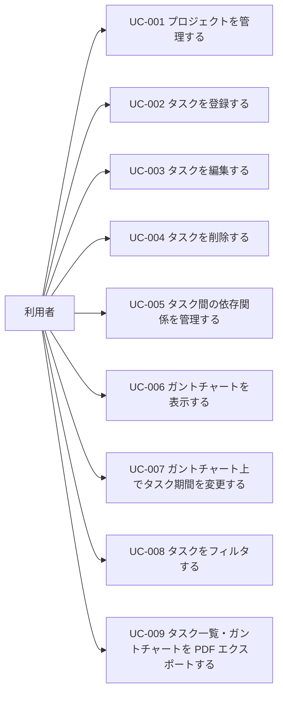
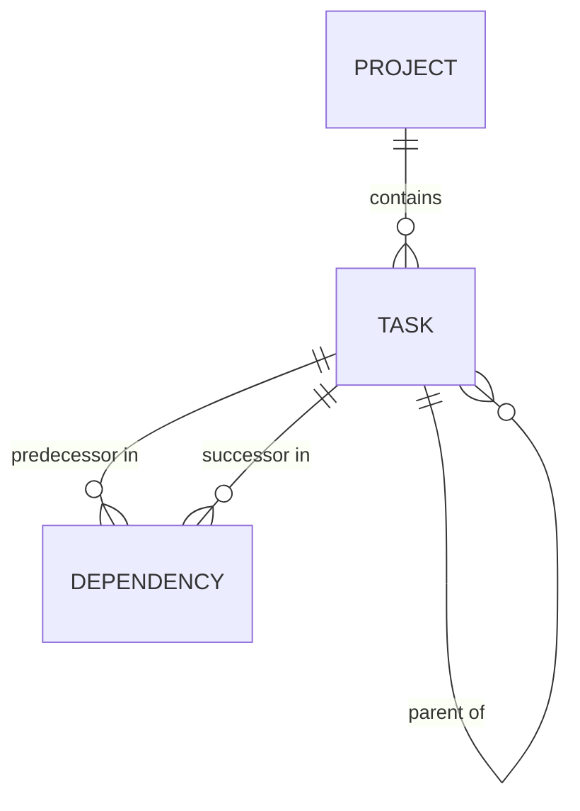

# 機能要件

## プロジェクト概要

### 背景・目的
Excel ベースの WBS 管理ではタスク間の依存関係表現やガントチャート操作が手間であり、軽量な専用ツールにより個人〜小チームでの WBS 管理を効率化する。本アプリは利用者のローカル PC 上で動作する Web アプリとして提供する。

### スコープ
**含む**
- プロジェクトの作成・編集・削除・切替（1 度に 1 プロジェクト表示）
- タスクの作成・編集・削除（担当者・開始日・期限・進捗・親子関係・説明）
- タスク間の依存関係管理（依存線として可視化）
- ガントチャート表示（GUI、ドラッグ&ドロップ操作、日/月の粒度切替、依存線表示切替、期限超過の視覚化）
- タスクフィルタ（担当者・開始日・期限・親タスク）
- タスク一覧・ガントチャートの PDF エクスポート

**含まない**
- ユーザー管理（認証・認可・権限）
- マルチユーザーによる同時編集
- ネットワーク越しの利用、外部システム連携
- 既存システムからのデータ移行

## アクター

| アクター | 種別 | 説明 |
|---|---|---|
| 利用者 | 人 | プロジェクトおよびタスクを管理する単独の利用者。ローカル PC 上で本アプリを起動して使用する。 |

## ユースケース一覧

| UC-NNN | 名称 | 主アクター | 概要 | 詳細 |
|---|---|---|---|---|
| UC-001 | プロジェクトを管理する | 利用者 | プロジェクトの作成・編集・削除・切替を行う | [usecase/UC-001/usecase.md](./usecase/UC-001/usecase.md) |
| UC-002 | タスクを登録する | 利用者 | 選択中プロジェクトに新規タスクを登録する | [usecase/UC-002/usecase.md](./usecase/UC-002/usecase.md) |
| UC-003 | タスクを編集する | 利用者 | 既存タスクの属性（担当者・期間・進捗・親子・説明）を変更する | [usecase/UC-003/usecase.md](./usecase/UC-003/usecase.md) |
| UC-004 | タスクを削除する | 利用者 | 既存タスクを削除する（子タスクは親を外して残す） | [usecase/UC-004/usecase.md](./usecase/UC-004/usecase.md) |
| UC-005 | タスク間の依存関係を管理する | 利用者 | タスク間の先行/後続関係を追加・削除する | [usecase/UC-005/usecase.md](./usecase/UC-005/usecase.md) |
| UC-006 | ガントチャートを表示する | 利用者 | 表示粒度切替・依存線表示切替・期限超過の視覚化を含むガントチャート表示 | [usecase/UC-006/usecase.md](./usecase/UC-006/usecase.md) |
| UC-007 | ガントチャート上でタスク期間を変更する | 利用者 | ドラッグ&ドロップでタスクの開始日・期限を変更する | [usecase/UC-007/usecase.md](./usecase/UC-007/usecase.md) |
| UC-008 | タスクをフィルタする | 利用者 | 担当者・開始日・期限・親タスクの条件でタスクを絞り込む | [usecase/UC-008/usecase.md](./usecase/UC-008/usecase.md) |
| UC-009 | タスク一覧・ガントチャートを PDF エクスポートする | 利用者 | 現在の表示状態に基づいて PDF を出力する | [usecase/UC-009/usecase.md](./usecase/UC-009/usecase.md) |

## データ定義

| ENT-NNN | 名称 | 概要 | 主な保有情報 | 関連UC |
|---|---|---|---|---|
| ENT-001 | プロジェクト | WBS の括り。同時に開けるのは 1 つ | プロジェクト名、説明、作成日 | UC-001 |
| ENT-002 | タスク | プロジェクト配下の作業項目。親子構造を持つ | タスク名、担当者（フリーテキスト）、開始日、期限、進捗(0〜100%)、親タスク参照、説明・備考 | UC-002, UC-003, UC-004, UC-006, UC-007, UC-008, UC-009 |
| ENT-003 | 依存関係 | タスク間の先行/後続関係（依存線の元データ） | 先行タスク、後続タスク | UC-004, UC-005, UC-006 |

## インタフェース要件

### ユーザインタフェース（UI-NNN）

| UI-NNN | 画面・帳票名 | 種別 | 対象利用者 | 概要 | 関連UC |
|---|---|---|---|---|---|
| UI-001 | プロジェクト選択画面 | 画面 | 利用者 | プロジェクト一覧から 1 つを選んで開く。起動時およびプロジェクト切替時に表示 | UC-001 |
| UI-002 | プロジェクト編集ダイアログ | 画面 | 利用者 | プロジェクトの新規作成・編集 | UC-001 |
| UI-003 | WBS メイン画面 | 画面 | 利用者 | 左にタスクツリー、右にガントチャート、上部にツールバー（表示粒度切替・依存線表示切替・フィルタ起動・エクスポート起動） | UC-002〜UC-009 |
| UI-004 | タスク編集ダイアログ | 画面 | 利用者 | タスクの新規作成・編集（タスク名・担当者・開始日・期限・進捗・親タスク・説明） | UC-002, UC-003 |
| UI-005 | 依存関係編集ダイアログ | 画面 | 利用者 | タスク間の依存関係を追加・削除 | UC-005 |
| UI-006 | フィルタパネル | 画面 | 利用者 | 担当者・開始日・期限・親タスクでタスクを絞り込む | UC-008 |
| UI-007 | PDF エクスポート設定 | 画面 | 利用者 | エクスポート対象（タスク一覧 / ガントチャート / 両方）の選択 | UC-009 |
| UI-008 | タスク一覧 PDF | 帳票 | 利用者 | タスク一覧を表形式で出力した PDF | UC-009 |
| UI-009 | ガントチャート PDF | 帳票 | 利用者 | ガントチャートを画像/ベクター形式で出力した PDF | UC-009 |

#### 共通 UI 要件
- 対応デバイス: デスクトップ PC
- 対応ブラウザ: Google Chrome 最新版
- 想定 OS: macOS
- 想定解像度: 1280×720 以上
- 言語: 日本語
